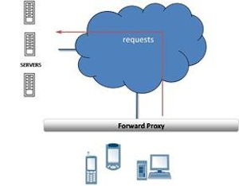
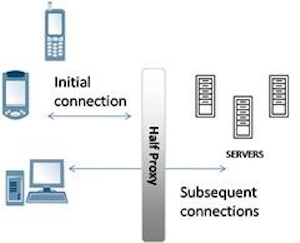
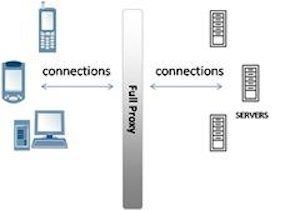

= 应用交付网络
:toc: manual

== 应用交付网络

传统计算机网络主要关注的是网络的互连互通，而应用则关注的是业务逻辑功能，如何将两者合在一起，让网络更好的支持应用，同时应用最优化的利用网络，这就是应用交付网络(Application Delivery Networking，ADN)。

应用交付网络围绕着应用和网络主要为企业解决一下几个问题：

1. *安全* - 目前业界已经达成共识，网络安全对于网络应用的保障是至关重要的环 节。而在应用交付网络中强调的是应用的安全，无论身居何处，应用交付网络可以预先提供 全面的防护措施，以避免那些不正当的恶意访问和攻击，确保应用数据/信息准确，未被篡改。在一个完善的应用交付网络设计中，会有网络传输包检测，甚至对 SSL 协议中传输的内容进行安全检查、隔离。
2. *应用加速及优化* - 应用交付网络可以优化用户的网络应用，使网络达到更快的速度并 能减少资源消耗。无论是在全球的某个角落或者公司总部使用笔记本进行连接，应用交付网 络都可以确保应用程序的高速运行。一个完善的应用交付网络设计中，应当关注的一个重点就是如何提高广域网用 户的访问速度，实现就近访问、更小的带宽占用和应用访问速度的提升。
3. *高可用* - 应用交付网络所提供的解决方案保证网络应用的持久性与可靠 性，在基于安全、正常运行、高可靠基础上允许用户强有力并灵活地来设定各种应用的优先 权，从而保证了各种网络应用的高可用性。一个完善的应用交付网络设计中，应该充分考虑到应用的高可用性需求，通过 自动、完善的切换手段，保证业务的不间断性和持续性。

== 代理(Proxy)

在软件设计和应用交付领域，代理(Proxy)的架构范式一直存在，如下图，代理作为请求发起方和服务提供方之间的一个中介，请求方通过代理向服务器发送请求，服务器通过代理将结果返回给请求发起者。

软件设计里的 link:https://en.wikipedia.org/wiki/Proxy_pattern[Proxy Pattern] 核心思想是在调运某一个方法之前，先将请求发送到代理，代理可以执行一些业务逻辑后再调运这个方法（link:http://ksoong.org/java-proxies[Java 代理的例子]）；Spring 目前依然是应用开发领域最受开发者欢迎的模型，Spring 早期面向切面的架构里面是经典的代理范式，就是在服务调运的链路上添加一层一层逻辑处理层；JEE 标准也有大量关于代理范式的应用，Servlet 的 Filter, EJB 的 Interceptor 都是经典的代理设计。

应用交付领域代理更充当着对应用安全保护，应用高可用等，同事能让应用的消费者和业务领域专家有更好的体验。本部分重点在应用交付领域探讨代理相关的技术，首先给代理进行一个定义。

=== 什么是代理(Proxy)

代理是位于客户端和服务器之间的硬件或软件解决方案，可充当客户端和服务器直接的中介，也可以主动发起一些请求或对某些请求作出响应。

代理有一个特点是可以使应用相对匿名，客户端访问者对应用不可知，应用在一定程度上匿名。代理有多种类型，有半代理、全代理、转发代理、反向代理等，接下来依次对这些不同类型的代理做一解释

=== 代理的类型

[cols="5a,5a"]
|===
|类型 |描述

|
|
* 转发代通常位于客户端私有网络内，负责将客户端请求转发到外部网络或互联网
* 可以提供一些认证、授权、Web 服务和内容过滤等

|image:img/proxy-reverse.png[反向代理（Reverse Proxies）]
|
* 与转发代理相反，反向代理通常位于服务器端，负责接收从外部网络或互联网上来访问服务器的请求
* 主要提供对服务器的保护，确保服务器上提供的服务安全、高效、可可用

|
image:img/proxy-half-1.png[半代理（Half Proxies）- 服务器直接返回]

|半代理分两种类型：

1. 服务器直接返回，客户端请求首先发送到代理，代理将其转发给服务器，而服务器的返回直接返回给客户端
2. 初次连接代理，客户端初次请求服务器需要经过代理，后续的通信则是在客户端和服务器之间直接进行

半代理有自己的使用场景，服务器直接返回方式通常用于一些流式协议，初次连接代理用在一些安全控制场景

|
|
* 一个请求有两个连接，客户端和代理之间一个连接，代理和服务器端一个连接
* 可以做一协议的解析，或对协议做一些定制化
|===
