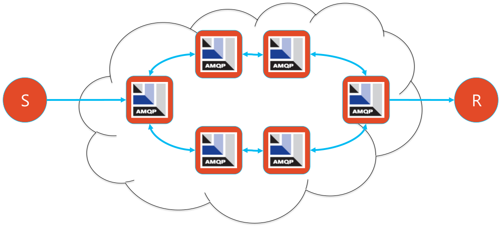

= AMQ 7
:toc: manual

== AMQ 7 新变化

https://access.redhat.com/products/red-hat-amq[RH AMQ 7] 是红帽针对新架构下发布的企业级消息平台，主要亮点有以下三个方面:

* 轻量级 - 基于 ActiveMQ Artemis 构建 AMQ Broker，非常轻量级，整个安装包 50 MB
* 分布式能力 - AMQ Interconnect 是位于 AMQ Broker 和客户端之间，可提供分布式消息路由处理机制，构建高扩展消息网络。
* 客户端扩展 - 支持多种客户端，包括 Java Script, C++ 等

== AMQ 7 基本操作

=== 安装

下载 AMQ 7 安装包 - https://access.redhat.com/downloads[https://access.redhat.com/downloads]。

[source, bash]
.*解压完成安装*
----
$ unzip amq-broker-7.2.0-bin.zip
----

=== 创建一个 Broker 实例

[source, bash]
.*执行 artemis 命令创建 Broker 实例*
----
$ cd amq-broker-7.2.0/

$ ./bin/artemis create ./instances/mybroker
Creating ActiveMQ Artemis instance at: /home/kylin/work/amq/amq-broker-7.2.0/instances/mybroker

--user: is a mandatory property!
Please provide the default username:
admin

--password: is mandatory with this configuration:
Please provide the default password:

--allow-anonymous | --require-login: is a mandatory property!
Allow anonymous access?, valid values are Y,N,True,False
Y

Auto tuning journal ...
done! Your system can make 31.25 writes per millisecond, your journal-buffer-timeout will be 32000

You can now start the broker by executing:  

   "/home/kylin/work/amq/amq-broker-7.2.0/instances/mybroker/bin/artemis" run

Or you can run the broker in the background using:

   "/home/kylin/work/amq/amq-broker-7.2.0/instances/mybroker/bin/artemis-service" start
---- 

* 使用用户名 `admin`，密码 `admin`
* 允许匿名登录

[source, bash]
.*Broker instance 目录结构*
----
instances/mybroker/
├── bin
│   ├── artemis
│   └── artemis-service
├── data
├── etc
│   ├── artemis.profile
│   ├── artemis-roles.properties
│   ├── artemis-users.properties
│   ├── bootstrap.xml
│   ├── broker.xml
│   ├── jolokia-access.xml
│   ├── logging.properties
│   ├── login.config
│   └── management.xml
├── lib
├── log
└── tmp
----

=== 运行 Broker

[source, bash]
.*在 Broker 实例目录下运行 Broker 实例*
----
$ cd instances/mybroker/
$ ./bin/artemis run
----

==== 命令行测试

[source, bash]
.*1 - 打开新的命令行终端，运行消费者*
----
$ ./bin/artemis consumer
Consumer:: filter = null
Consumer ActiveMQQueue[TEST], thread=0 wait until 1000 messages are consumed
Received 1000
Consumer ActiveMQQueue[TEST], thread=0 Consumed: 1000 messages
Consumer ActiveMQQueue[TEST], thread=0 Consumer thread finished
----

[source, bash]
.*2 - 打开新的命令行终端，运行生产者*
----
$ ./bin/artemis producer
Producer ActiveMQQueue[TEST], thread=0 Started to calculate elapsed time ...

Producer ActiveMQQueue[TEST], thread=0 Produced: 1000 messages
Producer ActiveMQQueue[TEST], thread=0 Elapsed time in second : 4 s
Producer ActiveMQQueue[TEST], thread=0 Elapsed time in milli second : 4260 milli seconds
----

NOTE: 如上示例，生产者发送 1000 个消息到消费者，消费者消费 1000 个消息。

==== 管理控制台

浏览器访问 http://localhost:8161/console/ 登录管理控制台。

==== 以服务的方式运行

[source, bash]
.*如果要使 AMQ Broker 以服务的方式在后台运行，执行*
----
$ ./bin/artemis start
----

=== Queue 配置

[source, xml]
.*1 - 编辑 etc/broker.xml 创建 Queue*
----
<address name="testQueue">
    <anycast>
        <queue name="testQueue"/>
    </anycast>
</address>
----

[source, bash]
.*2 - 启动/重新启动 Broker*
----
$ ./bin/artemis run
----  

[source, bash]
.*3 - 启动消费者，指向新创建的 Queue*
----
$ ./bin/artemis consumer --destination queue://testQueue --message-count 5
Consumer:: filter = null
Consumer ActiveMQQueue[testQueue], thread=0 wait until 5 messages are consumed
Consumer ActiveMQQueue[testQueue], thread=0 Consumed: 5 messages
Consumer ActiveMQQueue[testQueue], thread=0 Consumer thread finished
----

[source, bash]
.*4 - 启动生产者，指向新创建的 Queue*
----
$ ./bin/artemis producer --destination queue://testQueue --message-count 5
Producer ActiveMQQueue[testQueue], thread=0 Started to calculate elapsed time ...

Producer ActiveMQQueue[testQueue], thread=0 Produced: 5 messages
Producer ActiveMQQueue[testQueue], thread=0 Elapsed time in second : 0 s
Producer ActiveMQQueue[testQueue], thread=0 Elapsed time in milli second : 46 milli seconds
----

=== Topic 配置

[source, bash]
.*1 - 编辑 etc/broker.xml 创建 Topic*
----
<address name="testTopic">
    <multicast>
        <queue name="testTopic"/>
    </multicast>
</address>
----

[source, bash]
.*2 - 启动/重新启动 Broker*
----
$ ./bin/artemis run
----

[source, bash]
.*3 - 启动消费者，指向新创建的 Topic*
----
$ ./bin/artemis consumer --destination topic://testTopic --message-count 10
Consumer:: filter = null
Consumer ActiveMQTopic[testTopic], thread=0 wait until 10 messages are consumed
Consumer ActiveMQTopic[testTopic], thread=0 Consumed: 10 messages
Consumer ActiveMQTopic[testTopic], thread=0 Consumer thread finished
----

[source, bash]
.*4 - 启动生产者，指向新创建的 Topic*
----
$ ./bin/artemis producer --destination topic://testTopic --message-count 10
Producer ActiveMQTopic[testTopic], thread=0 Started to calculate elapsed time ...

Producer ActiveMQTopic[testTopic], thread=0 Produced: 10 messages
Producer ActiveMQTopic[testTopic], thread=0 Elapsed time in second : 0 s
Producer ActiveMQTopic[testTopic], thread=0 Elapsed time in milli second : 65 milli seconds
----

=== Queue 安全

[source, bash]
.*1 - 创建一个新用户 myuser，密码为 mypassword，关联角色 mygroup：*
----
$ ./bin/artemis user add --user myuser --password mypassword --role mygroup
----

[source, bash]
.*2 - 编辑 etc/broker.xml，使 mygroup 具有发送消息的功能*
----
<security-settings>
    <security-setting match="#">
        <permission type="createNonDurableQueue" roles="amq"/>
        <permission type="deleteNonDurableQueue" roles="amq"/>
        <permission type="createDurableQueue" roles="amq"/>
        <permission type="deleteDurableQueue" roles="amq"/>
        <permission type="createAddress" roles="amq"/>
        <permission type="deleteAddress" roles="amq"/>
        <permission type="consume" roles="amq"/>
        <permission type="browse" roles="amq"/>
        <permission type="send" roles="amq,mygroup"/>
        <!-- we need this otherwise ./artemis data imp wouldn't work -->
        <permission type="manage" roles="amq"/>
    </security-setting>
</security-settings>
----

[source, bash]
.*3 - 启动/重新启动 Broker*
----
$ ./bin/artemis run
----

[source, bash]
.*4 - 使用 myuser 发送消息到 testQueue*
----
$ ./bin/artemis producer --destination topic://testQueue --message-count 10 --user myuser --password mypassword
Producer ActiveMQTopic[testQueue], thread=0 Started to calculate elapsed time ...

Producer ActiveMQTopic[testQueue], thread=0 Produced: 10 messages
Producer ActiveMQTopic[testQueue], thread=0 Elapsed time in second : 0 s
Producer ActiveMQTopic[testQueue], thread=0 Elapsed time in milli second : 32 milli seconds
----

[source, bash]
.*5 - 使用 myuser 用户从 testQueue 接收消息*
----
$ ./bin/artemis consumer --destination topic://testQueue --message-count 10 --user myuser --password mypassword
Consumer:: filter = null
Consumer ActiveMQTopic[testQueue], thread=0 wait until 10 messages are consumed
javax.jms.JMSSecurityException: AMQ119213: User: myuser does not have permission='CREATE_NON_DURABLE_QUEUE' for queue f29afc6b-beb6-4de0-b11e-2e92be2b76cd on address testQueue
	at org.apache.activemq.artemis.core.protocol.core.impl.ChannelImpl.sendBlocking(ChannelImpl.java:423)
	at org.apache.activemq.artemis.core.protocol.core.impl.ChannelImpl.sendBlocking(ChannelImpl.java:319)
	at org.apache.activemq.artemis.core.protocol.core.impl.ActiveMQSessionContext.createQueue(ActiveMQSessionContext.java:671)
	at org.apache.activemq.artemis.core.client.impl.ClientSessionImpl.internalCreateQueue(ClientSessionImpl.java:1925)
	at org.apache.activemq.artemis.core.client.impl.ClientSessionImpl.createTemporaryQueue(ClientSessionImpl.java:472)
	at org.apache.activemq.artemis.jms.client.ActiveMQSession.createTemporaryQueue(ActiveMQSession.java:1175)
	at org.apache.activemq.artemis.jms.client.ActiveMQSession.createConsumer(ActiveMQSession.java:751)
	at org.apache.activemq.artemis.jms.client.ActiveMQSession.createConsumer(ActiveMQSession.java:374)
	at org.apache.activemq.artemis.jms.client.ActiveMQSession.createConsumer(ActiveMQSession.java:346)
	at org.apache.activemq.artemis.cli.commands.messages.ConsumerThread.consume(ConsumerThread.java:177)
	at org.apache.activemq.artemis.cli.commands.messages.ConsumerThread.run(ConsumerThread.java:67)
Caused by: ActiveMQSecurityException[errorType=SECURITY_EXCEPTION message=AMQ119213: User: myuser does not have permission='CREATE_NON_DURABLE_QUEUE' for queue f29afc6b-beb6-4de0-b11e-2e92be2b76cd on address testQueue]
	... 11 more
Consumer ActiveMQTopic[testQueue], thread=0 Consumer thread finished
----

[source, bash]
.*6 - 使用 admin 用户从 testQueue 接收消息*
----
$ ./bin/artemis consumer --destination topic://testQueue --message-count 10 --user admin --password admin
Consumer:: filter = null
Consumer ActiveMQTopic[testQueue], thread=0 wait until 10 messages are consumed
Consumer ActiveMQTopic[testQueue], thread=0 Consumed: 10 messages
Consumer ActiveMQTopic[testQueue], thread=0 Consumer thread finished
----

=== Broker 高可用

[source, bash]
.*1 - 创建两个 Broker 实例*
----
$ ./bin/artemis create --user admin --password password --role admin --allow-anonymous y --clustered --host 127.0.0.1 --cluster-user clusterUser --cluster-password clusterPassword --max-hops 1 ./instances/broker1
$ ./bin/artemis create --user admin --password password --role admin --allow-anonymous y --clustered --host 127.0.0.1 --cluster-user clusterUser --cluster-password clusterPassword --max-hops 1 --port-offset 100 ./instances/broker2
----

[source, bash]
.*2 - 启动 broker1*
----
$ cd instances/broker1/
$ ./bin/artemis run
----

[source, bash]
.*3 - 启动 broker2*
----
$ cd instances/broker2/
$ ./bin/artemis run
----

[source, bash]
.*4 - 查看日志输出，Bridge 创建输出如下*
----
2018-08-13 16:00:07,598 INFO  [org.apache.activemq.artemis.core.server] AMQ221027: Bridge ClusterConnectionBridge@157c611c [name=$.artemis.internal.sf.my-cluster.e421018b-9ece-11e8-86b6-a0afbd08b916, queue=QueueImpl[name=$.artemis.internal.sf.my-cluster.e421018b-9ece-11e8-86b6-a0afbd08b916, postOffice=PostOfficeImpl [server=ActiveMQServerImpl::serverUUID=bdda1e9b-9ece-11e8-94bd-a0afbd08b916], temp=false]@226001f8 targetConnector=ServerLocatorImpl (identity=(Cluster-connection-bridge::ClusterConnectionBridge@157c611c [name=$.artemis.internal.sf.my-cluster.e421018b-9ece-11e8-86b6-a0afbd08b916, queue=QueueImpl[name=$.artemis.internal.sf.my-cluster.e421018b-9ece-11e8-86b6-a0afbd08b916, postOffice=PostOfficeImpl [server=ActiveMQServerImpl::serverUUID=bdda1e9b-9ece-11e8-94bd-a0afbd08b916], temp=false]@226001f8 targetConnector=ServerLocatorImpl [initialConnectors=[TransportConfiguration(name=artemis, factory=org-apache-activemq-artemis-core-remoting-impl-netty-NettyConnectorFactory) ?port=61716&host=127-0-0-1], discoveryGroupConfiguration=null]]::ClusterConnectionImpl@300983713[nodeUUID=bdda1e9b-9ece-11e8-94bd-a0afbd08b916, connector=TransportConfiguration(name=artemis, factory=org-apache-activemq-artemis-core-remoting-impl-netty-NettyConnectorFactory) ?port=61616&host=127-0-0-1, address=, server=ActiveMQServerImpl::serverUUID=bdda1e9b-9ece-11e8-94bd-a0afbd08b916])) [initialConnectors=[TransportConfiguration(name=artemis, factory=org-apache-activemq-artemis-core-remoting-impl-netty-NettyConnectorFactory) ?port=61716&host=127-0-0-1], discoveryGroupConfiguration=null]] is connected
----

=== Queue 高可用

[source, bash]
.*1 - 在 broker1 和 broker2 总添加 clusteredQueue 配置*
----
<address name="clusteredQueue">
    <anycast>
        <queue name="clusteredQueue" />
    </anycast>
</address>
----

[source, bash]
.*2 - 启动/重新启动 broker1 和 broker2*
----
$ ./bin/artemis run
----

==== 测试一：消费者连接不同的 broker

[source, bash]
.*1 - broker1 连接消费者*
----
$ ./bin/artemis consumer --message-count 5 --destination queue://clusteredQueue
----

[source, bash]
.*2 - broker2 连接消费者*
----
$ ./bin/artemis consumer --message-count 5 --url tcp://localhost:61716 --destination queue://clusteredQueue
----

[source, bash]
.*3 - 发送 10 条消息到 broker1*
----
$ ./bin/artemis producer --message-count 10 --destination queue://clusteredQueue
----

==== 测试二：负载均衡测试

[source, bash]
.*1 - 发送 10 条消息到 broker1*
----
$ ./bin/artemis producer --message-count 10 --destination queue://clusteredQueue
----

[source, bash]
.*2 - broker2 连接消费者*
----
$ ./bin/artemis consumer --message-count 10 --url tcp://localhost:61716 --destination queue://clusteredQueue
----

[source, bash]
.*3 - broker1 连接消费者*
----
$ ./bin/artemis consumer --message-count 10 --destination queue://clusteredQueue
----

==== 测试三：STRICT 策率测试

[source, bash]
.*修改 etc/broker.xml，配置 message-load-balancing 为 STRICT，再次进行如上测试*
----
<cluster-connections>
    <cluster-connection name="my-cluster">
        <connector-ref>artemis</connector-ref>
        <message-load-balancing>STRICT</message-load-balancing>
        <max-hops>1</max-hops>
        <discovery-group-ref discovery-group-name="dg-group1"/>
    </cluster-connection>
</cluster-connections>
----

=== Broker 集群主备共享存储

[source, bash]
.*1 - 创建 live broker*
----
$ ./bin/artemis create --shared-store --failover-on-shutdown --data ./instances/liveBroker/data --user admin --password password --role admin --allow-anonymous y --clustered --host 127.0.0.1 --cluster-user clusterUser --cluster-password clusterPassword --max-hops 1 ./instances/liveBroker
Creating ActiveMQ Artemis instance at: /home/kylin/work/amq/amq-broker-7.2.0/instances/liveBroker

Auto tuning journal ...
done! Your system can make 31.25 writes per millisecond, your journal-buffer-timeout will be 32000

You can now start the broker by executing:  

   "/home/kylin/work/amq/amq-broker-7.2.0/instances/liveBroker/bin/artemis" run

Or you can run the broker in the background using:

   "/home/kylin/work/amq/amq-broker-7.2.0/instances/liveBroker/bin/artemis-service" start
----

[source, bash]
.*2 - 创建 backup broker*
----
$ ./bin/artemis create --shared-store --failover-on-shutdown --slave --data ./instances/liveBroker/data --user admin --password password --role admin --allow-anonymous y --clustered --host 127.0.0.1 --cluster-user clusterUser --cluster-password clusterPassword --max-hops 1 --port-offset 100 ./instances/backupBroker
Creating ActiveMQ Artemis instance at: /home/kylin/work/amq/amq-broker-7.2.0/instances/backupBroker

Auto tuning journal ...
done! Your system can make 31.25 writes per millisecond, your journal-buffer-timeout will be 32000

You can now start the broker by executing:  

   "/home/kylin/work/amq/amq-broker-7.2.0/instances/backupBroker/bin/artemis" run

Or you can run the broker in the background using:

   "/home/kylin/work/amq/amq-broker-7.2.0/instances/backupBroker/bin/artemis-service" start
----

[source, bash]
.*3 - 在 liveBroker 和 backupBroker 上添加 clusteredQueue 配置*
----
<address name="clusteredQueue">
    <anycast>
        <queue name="clusteredQueue" />
    </anycast>
</address>
----

[source, bash]
.*4 - 启动 live broker*
----
$ cd instances/liveBroker/ && ./bin/artemis run
----

[source, bash]
.*5 - 启动 backup broker*
----
$ cd instances/backupBroker/ && ./bin/artemis run
----

[source, bash]
.*6 - 查看 backup broker 日志*
----
2018-08-13 16:41:17,411 INFO  [org.apache.activemq.artemis.core.server] AMQ221032: Waiting to become backup node
2018-08-13 16:41:17,411 INFO  [org.apache.activemq.artemis.core.server] AMQ221033: ** got backup lock
...
2018-08-13 16:41:22,721 INFO  [org.apache.activemq.artemis.core.server] AMQ221031: backup announced
----

[source, bash]
.*7 - 强制停止 live broker，确认 backup broker 是否 live 上线*
----
2018-08-13 16:44:22,763 INFO  [org.apache.activemq.artemis.core.server] AMQ221010: Backup Server is now live
----

=== Broker 集群主备状态复制

[source, bash]
.*1 - 创建 live broker*
----
$ ./bin/artemis create --replicated --failover-on-shutdown  --user admin --password password --role admin --allow-anonymous y --clustered --host 127.0.0.1 --cluster-user clusterUser --cluster-password clusterPassword  --max-hops 1 ./instances/repLiveBroker
----

[source, bash]
.*2 - 创建 backup broker*
----
$ ./bin/artemis create --replicated --failover-on-shutdown --slave --user admin --password password --role admin --allow-anonymous y --clustered --host 127.0.0.1 --cluster-user clusterUser --cluster-password clusterPassword  --max-hops 1 --port-offset 100 ./instances/repBackupBroker
----

[source, bash]
.*3 - 在 repLiveBroker 和 repBackupBroker 上添加 haQueue 配置*
----
<address name="haQueue">
    <anycast>
        <queue name="haQueue" />
    </anycast>
</address>
----

[source, bash]
.*4 - 启动 live broker*
----
$ cd instances/repLiveBroker
$ ./bin/artemis run
----

[source, bash]
.*5 - 启动 backup broker*
----
$ cd instances/repBackupBroker/
$ ./bin/artemis run
----

[source, bash]
.*6 - 查看 Backup broker 日志*
----
2018-08-13 17:12:45,448 INFO  [org.apache.activemq.artemis.core.server] AMQ221024: Backup server ActiveMQServerImpl::serverUUID=f151bb01-9ed8-11e8-8632-a0afbd08b916 is synchronized with live-server.
2018-08-13 17:12:49,651 INFO  [org.apache.activemq.artemis.core.server] AMQ221031: backup announced
----

[source, bash]
.*7 - 查看 Live broker 日志*
----
2018-08-13 17:12:45,022 INFO  [org.apache.activemq.artemis.core.server] AMQ221025: Replication: sending AIOSequentialFile:/home/kylin/work/amq/amq-broker-7.2.0/instances/repLiveBroker/data/journal/activemq-data-2.amq (size=10,485,760) to replica.
2018-08-13 17:12:45,271 INFO  [org.apache.activemq.artemis.core.server] AMQ221025: Replication: sending NIOSequentialFile /home/kylin/work/amq/amq-broker-7.2.0/instances/repLiveBroker/data/bindings/activemq-bindings-4.bindings (size=1,048,576) to replica.
2018-08-13 17:12:45,282 INFO  [org.apache.activemq.artemis.core.server] AMQ221025: Replication: sending NIOSequentialFile /home/kylin/work/amq/amq-broker-7.2.0/instances/repLiveBroker/data/bindings/activemq-bindings-2.bindings (size=1,048,576) to replica.
----

[source, bash]
.*8 - 强制关闭 Live broker，查看 Backup broker 日志*
----
2018-08-13 17:16:02,380 INFO  [org.apache.activemq.artemis.core.server] AMQ221007: Server is now live
----

[source, xml]
.*9 - 修改 Live broker etc/broker.xml，配置 Master replication*
----
<ha-policy>
    <replication>
        <master>
            <check-for-live-server>true</check-for-live-server>
        </master>
    </replication>
</ha-policy>
----

[source, bash]
.*10 - 重起 live broker*
----
$ ./bin/artemis run
...
2018-08-13 17:22:27,404 INFO  [org.apache.activemq.artemis.core.server] AMQ221031: backup announced
----

[source, xml]
.*11 - 配置 Backup Broker replication*
----
<ha-policy>
    <replication>
        <slave>
            <allow-failback>true</allow-failback>
        </slave>
    </replication>
</ha-policy>
----

[source, bash]
.*12 - 重起 Backup Broker*
----
$ ./bin/artemis run
...
2018-08-13 17:25:37,113 INFO  [org.apache.activemq.artemis.core.server] AMQ221031: backup announced
----

== AMQP 集成

AMQP 主要用于跨系统集成，允许业务模块跨多种平台，并降低力业务应用开发的复杂性。常见的 AMQP 使用拓扑图如下：

* AMQP 网络提供分布式、大消息量的处理能力
* 消息发送方可以是 Java、Python、.NET、PHP、JavaScript 等
* 消息接收方也可以是 Java、Python、.NET、PHP、JavaScript 等

本部分为了便利性，AMQP 网络只有一个 Broker，消息发送方使用 Nodejs，消息接收方使用 Java。

=== Broker 配置

[source, bash]
.*1 - 创建新 Broker*
----
$ ./bin/artemis create  --user admin --password admin --role admin --allow-anonymous y ./instances/broker1
---- 

[source, bash]
.*2 - 编辑 etc/broker.xml, 添加 Queue*
----

----
