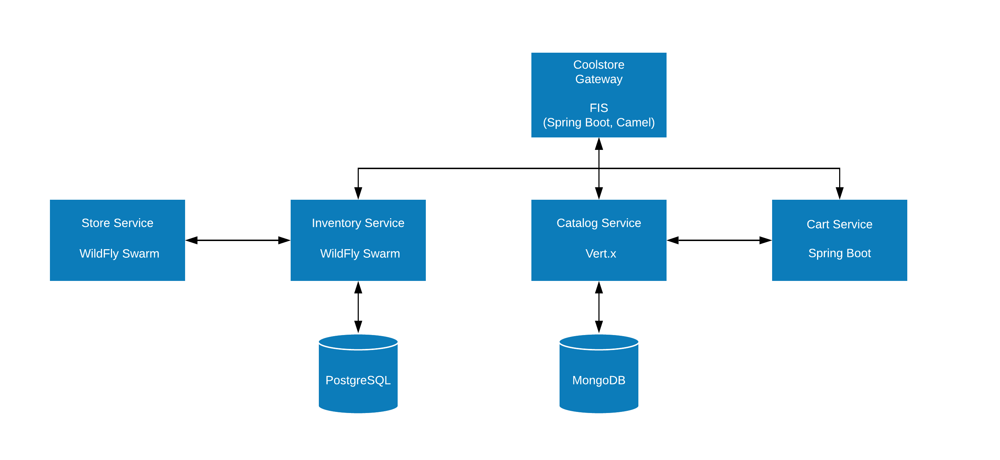

= CoolStore
:toc: manual

== 什么是 CoolStore

CoolStore 是在线电子商务平台，它由如下微服务构成。

不同服务代码地址如下:

[source, bash]
----
$ git clone https://github.com/gpte-appmod-microservices-advanced/inventory-service.git

$ git clone https://github.com/gpte-appmod-microservices-advanced/catalog-service.git

$ git clone https://github.com/gpte-appmod-microservices-advanced/cart-service.git

$ git clone https://github.com/gpte-appmod-microservices-advanced/store-service.git

$ git clone https://github.com/gpte-appmod-microservices-advanced/gateway-service.git

$ git clone https://github.com/gpte-appmod-microservices-advanced/ocp.git

$ git clone https://github.com/gpte-appmod-microservices-advanced/soap-ui.git
----

== 部署微服务到 OpenShift

登录到 OpenShift 创建如下工程:

[source, bash]
----
$ oc new-project coolstore && oc new-project coolstore-infra
----

=== Catalog Service

[source, text]
.*1. NFS 服务器上创建 NFS Exporter*
----
# mkdir -p /srv/nfs/appdev/mongodb-data
# echo "/srv/nfs/appdev/mongodb-data *(rw,root_squash)" >> /etc/exports.d/openshift-appdev.exports
# chown -R nfsnobody.nfsnobody  /srv/nfs/appdev/mongodb-data
# chmod -R 777 /srv/nfs

# systemctl restart nfs-server
----

[source, text]
.*2. 创建 PV*
----
# echo '{
  "apiVersion": "v1",
  "kind": "PersistentVolume",
  "metadata": {
    "name": "mongodb-data-pv"
  },
  "spec": {
    "capacity": {
        "storage": "1Gi"
    },
    "accessModes": [ "ReadWriteOnce" ],
    "nfs": {
        "path": "/srv/nfs/appdev/mongodb-data",
        "server": "nfs.example.com"
    },
    "persistentVolumeReclaimPolicy": "Recycle"
  }
}' | oc create -f - -n coolstore
----

[source, text]
.*3. 部署 MongoDB*
----
$ oc process -f ocp/catalog-service/coolstore-catalog-mongodb-persistent.yaml -p CATALOG_DB_USERNAME=mongo -p CATALOG_DB_PASSWORD=mongo | oc create -f - -n coolstore
----

[source, text]
.*4. 部署微服务*
----
$ mvn clean fabric8:deploy -Popenshift -Dmaven.test.skip=true -Dfabric8.namespace=coolstore
----

[source, text]
.*5. 微服务访问测试*
----
# curl http://catalog-service-coolstore.apps.example.com/product/444435
{
  "itemId" : "444435",
  "name" : "Oculus Rift",
  "desc" : "The world of gaming has also undergone some very unique and compelling tech advances in recent years. Virtual reality, the concept of complete immersion into a digital universe through a special headset, has been the white whale of gaming and digital technology ever since Nintendo marketed its Virtual Boy gaming system in 1995.",
  "price" : 106.0
}
----

=== Store Service

[source, text]
.*1. 部署*
----
$ cd store-service/
$ mvn clean fabric8:deploy -Popenshift -Dmaven.test.skip=true -Dfabric8.namespace=coolstore
----

[source, text]
.*2. 查看运行的容器*
----
# oc get pods | grep Running
catalog-mongodb-2-2fjnj       1/1       Running     0          1h
catalog-service-1-tmwg4       1/1       Running     0          26m
store-service-1-fdr5p         1/1       Running     0          1m
----

=== Inventory Service

[source, text]
.*1. NFS 服务器上创建 NFS Exporter*
----
# mkdir -p /srv/nfs/appdev/inventory-postgresql
# echo "/srv/nfs/appdev/inventory-postgresql *(rw,root_squash)" >> /etc/exports.d/openshift-appdev.exports
# chown -R nfsnobody.nfsnobody  /srv/nfs/appdev/inventory-postgresql
# chmod -R 777 /srv/nfs

# systemctl restart nfs-server
----

[source, text]
.*2. 创建 PV*
----
# echo '{
  "apiVersion": "v1",
  "kind": "PersistentVolume",
  "metadata": {
    "name": "inventory-postgresql-pv"
  },
  "spec": {
    "capacity": {
        "storage": "1Gi"
    },
    "accessModes": [ "ReadWriteOnce" ],
    "nfs": {
        "path": "/srv/nfs/appdev/inventory-postgresql",
        "server": "nfs.example.com"
    },
    "persistentVolumeReclaimPolicy": "Recycle"
  }
}' | oc create -f - -n coolstore
----

[source, text]
.*3. 创建 PostgreSQL*
----
$ oc process -f ocp/inventory-service/inventory-service-postgresql-persistent.yaml -p INVENTORY_DB_USERNAME=jboss -p INVENTORY_DB_PASSWORD=jboss -p INVENTORY_DB_NAME=inventorydb | oc create -f - -n coolstore
----

[source, text]
.*3. 创建 configmap*
----
$ oc create configmap inventory-service --from-file=etc/project-defaults.yml -n coolstore
----

[source, text]
.*4. 查看 configmap 内容*
----
# oc get configmap inventory-service -o yaml
apiVersion: v1
data:
  project-defaults.yml: |
    swarm:
      datasources:
        data-sources:
          InventoryDS:
            driver-name: postgresql
            connection-url: jdbc:postgresql://inventory-postgresql:5432/inventorydb
            user-name: jboss
            password: jboss
    store:
      service:
        url: http://store-service-coolstore.apps.example.com
----

[source, text]
.*5. 部署微服务*
----
$ oc create configmap inventory-service --from-file=etc/project-defaults.yml -n coolstore
----

[source, text]
.*6. 服务访问测试*
----
# curl -X GET "http://inventory-service-coolstore.apps.example.com/inventory/165613?storeStatus=true"
{"itemId":"165613","location":"Raleigh [CLOSED]","quantity":256,"link":"http://maps.google.com/?q=Raleigh"}
----

=== Cart Service

[source, text]
.*1. 进入到代码目录*
----
$ cd cart-service/
----

[source, text]
.*2. 创建 ConfigMap*
----
$ oc create configmap cart-service --from-literal=catalog.service.url="http://catalog-service-coolstore.apps.example.com" -n coolstore
----

[source, text]
.*3. 部署微服务*
----
$ oc create configmap inventory-service --from-file=etc/project-defaults.yml -n coolstore
----

[source, text]
.*4. 查看运行容器*
----
# oc get pods | grep Running
cart-service-1-deploy           1/1       Running     0          1m
catalog-mongodb-2-2fjnj         1/1       Running     0          2h
catalog-service-1-tmwg4         1/1       Running     0          1h
inventory-postgresql-1-nncrb    1/1       Running     0          37m
inventory-service-1-w697d       1/1       Running     0          29m
store-service-1-fdr5p           1/1       Running     0          54m
----

[source, text]
.*5. 微服务访问测试*
----

----

