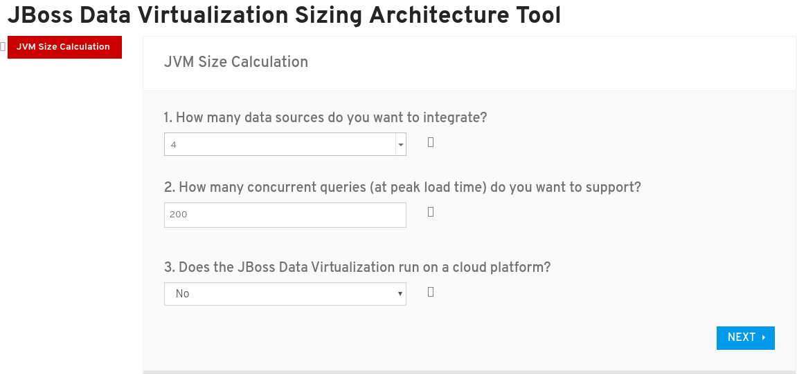
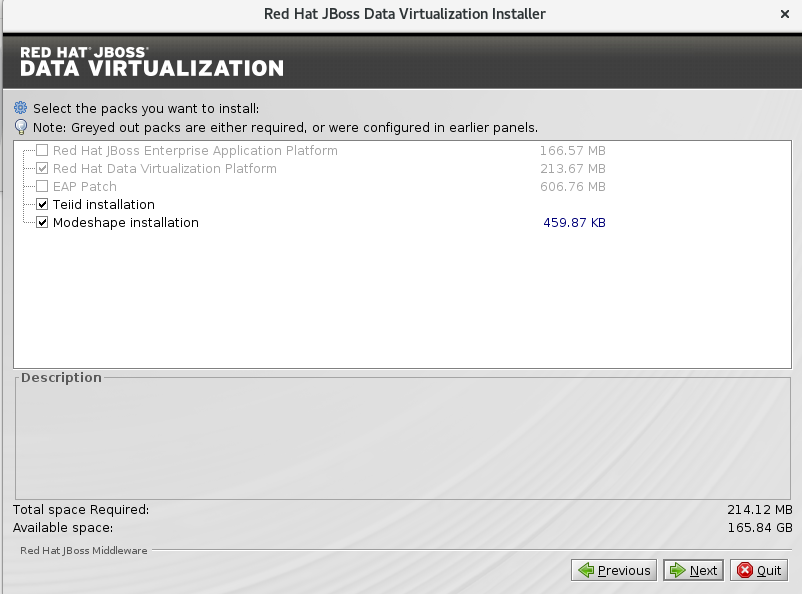
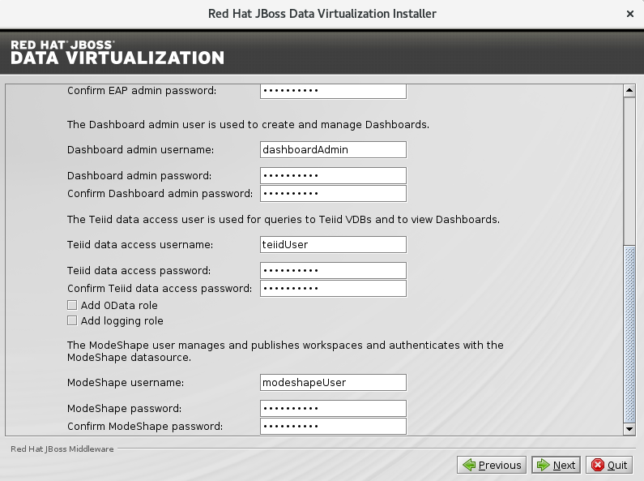
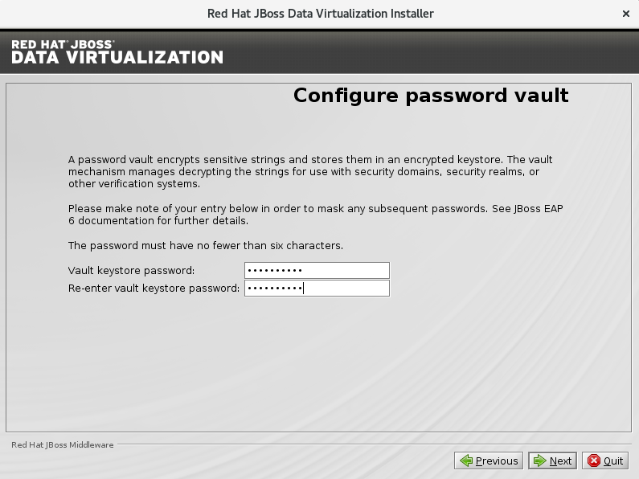
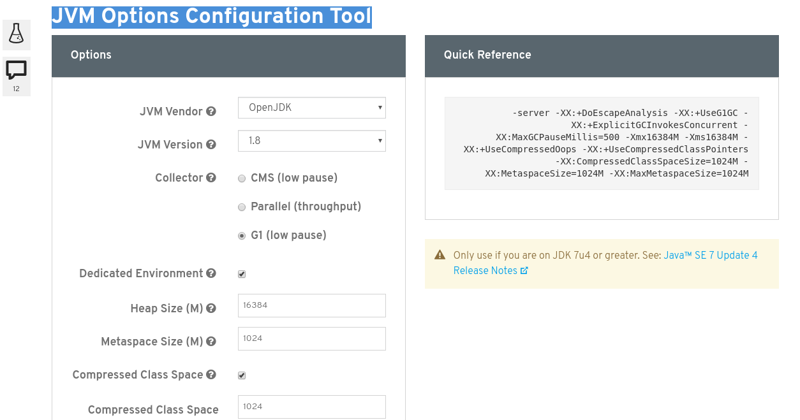

= 安装
:toc: manual
:toc-placement: preamble

本部分包括 JDV 6.3 简易安装手册。

== 服务器要求说明

=== 最小配置说明

|===
|类型 |大小 |说明

|CPU
|多物理 CPU，多处理器
|N/A

|内存
|16 GB
|N/A

|磁盘
|80 GB
|DV 运行（包括链接器等扩展组件）需要 20+ GB，DV 安装需要 1+ GB，一些日志及部署文件需要 5+ GB，DV 默认缓存持久化磁盘为 50 GB  

|===

=== Sizing Tools

JBoss Data Virtualization Sizing Architecture Tool (https://access.redhat.com/labs/jbossdvsat/) 是红帽提供的一个 Web 在线小工具，通过回答几个问题，来给出 CPU、内存、磁盘等大小信息。

*Sizing 工具运行界面*

 

*Sizing 工具运行结果*

image:img/jdv-install-size-2.png[jdv-install-size-2]

== 安装 JDV

=== 安装 JBoss Enterprise Application Platform

NOTE: 本部分不是必须的，JDV 安装包中包括了 EAP。

[source, java]
----
$ unzip jboss-eap-6.4.0.zip
----

记录 EAP Home 路径，随后 JDV 的安装需要指定此路径.

=== 图形化安装

* 运行 `java -jar <installer>` 开始安装， 

[source, java]
----
$ java -jar jboss-dv-6.3.0-1-installer.jar
----

* 选择 `I accept the terms of this license agreement`，点击 `Next`

image:img/jdv-install-1.png[jdv-install-1] 

* 选择 JBoss EAP 安装路径，点击 `Next`

image:img/jdv-install-2.png[jdv-install-2.png]

* 使用默认安装选项，点击 `Next`

* 在用户创建页面设定所有密码都为 `password1!`，点击 `Next`

* 使用默认安装选项，点击 `Next`

image:img/jdv-install-5.png[jdv-install-5.png]

* 在 vault 密码页面设定密码为`password1!`，点击 `Next`

* 点击 `Next` 确认安装项后再次点击 `Next` 完成安装.

=== 命令行安装

运行 `java -jar <installer> -console` 开始安装，

[source, java]
----
$ java -jar jboss-dv-6.3.0-1-installer.jar -console
----

安装过程使用默认配置，所有密码配置为 `password1!`, console 口输出如下：

----
...
press 1 to continue, 2 to quit, 3 to redisplay.
1

Specify a new location or the JBOSS_HOME of an existing EAP installation: [/home/jdv/EAP-6.4.0] 
/home/jdv/jdv63/jboss-eap-6.4
press 1 to continue, 2 to quit, 3 to redisplay.
1

Select the packs you want to install:
1    [x] [Required]      [Red Hat JBoss Enterprise Application Platform] (166.57 MB)
2    [x] [Required]      [Red Hat Data Virtualization Platform] (213.67 MB)
3    [x] [Required]      [EAP Patch] (606.76 MB)
4    [x]                 [Teiid installation] (0 B )
5    [x]                 [Modeshape installation] (459.87 KB)
Total Size Required: 987.45 MB
Press 0 to confirm your selections
Please select which packs you want to install
0
Pack Selection Done
press 1 to continue, 2 to quit, 3 to redisplay.
1

The use of the Modeshape JCR APIs have been deprecated. Continue? (y/n) [y]:
Create users
Define users for the EAP admininstrator, Dashboard administrator, the Teiid data access user and the ModeShape user. The password for the EAP administrator can be shared for all users as well as the default password vault.

The passwords must be at least eight characters long, with one alphabetic character, one digit, and one non-alphanumeric character, and must not match the associated username. Banned characters are &.
  [ ] Check to use one password for all default passwords.
Input 1 to select, 0 to deselect:
1

The EAP admin user will be added to the host container's ManagementRealm. It can be used to access the management console and the management CLI, as well as other applications secured with the ManagementRealm.

EAP admin username: [admin] 
password1!
Validation error.: The EAP admin username must be alphanumeric with the exception of the following accepted symbols (",", ".", "/", "=", "@", "\")
EAP admin username: [admin] 

EAP admin password: [] 
**********
Confirm EAP admin password: [**********] 
**********

The Dashboard admin user is used to create and manage Dashboards.

Dashboard admin username: [dashboardAdmin] 

The Teiid data access user is used for queries to Teiid VDBs and to view Dashboards.

Teiid data access username: [teiidUser] 

  [ ] Add OData role
Input 1 to select, 0 to deselect:
0
  [ ] Add logging role
Input 1 to select, 0 to deselect:
0

The ModeShape user manages and publishes workspaces and authenticates with the ModeShape datasource.

ModeShape username:  [modeshapeUser] 

press 1 to continue, 2 to quit, 3 to redisplay.
1

Configure runtime environment
There are several additional options for configuring Red Hat JBoss Enterprise Application Platform now that the server has been installed. Each option can be individually chosen, and will be configured in the order displayed upon pressing next. Would you like to do this now?
0  [x] Perform default configuration
1  [ ] Perform advanced configuration
Input Selection: 
0

press 1 to continue, 2 to quit, 3 to redisplay.
1

[ Starting to unpack ]

...
[ Console installation done ]
----

=== JVM OPTS 调整

NOTE: 本部分只是基于本测试环境，生产或其它环境需要另外按需调整。

JVM Options Configuration Tool (https://access.redhat.com/labs/jvmconfig/) 是红帽提供的一个 Web 在线小工具，通过回答几个问题可以给出 JVM 配置，如下为本测试应用 JVM Options 小工具的截图。

具体编辑 `./bin/standalone.conf`，添加如下 JVM OPTS

[source, java]
----
-server -XX:+DoEscapeAnalysis -XX:+UseG1GC -XX:+ExplicitGCInvokesConcurrent -XX:MaxGCPauseMillis=500 -Xmx16384M -Xms16384M -XX:+UseCompressedOops -XX:+UseCompressedClassPointers -XX:CompressedClassSpaceSize=1024M -XX:MetaspaceSize=1024M -XX:MaxMetaspaceSize=1024M
----

NOTE: 本测试使用最小配置 16 GB JVM heap

=== 测试安装

启动 JDV

[source, java]
----
$ cd jboss-eap-6.4/
$ ./bin/standalone.sh
----

启动过程没有错误日志抛出，且启动完成后有如下日志输出:

[source, java]
----
JBoss Red Hat JBoss Data Virtualization 6.3.0 (AS 7.5.9.Final-redhat-2) started in 13591ms - Started 847 of 889 services (100 services are lazy, passive or on-demand)
----

== 连接器数据源安装

本部分包括本测试所需数据源的安装。

=== 安装数据库驱动

拷贝如下驱动 jar 包到 JDV Home 目录：

[source, bash]
----
cd /home/jdv/jdv63/jboss-eap-6.4
cp mysql-connector-java-5.1.35.jar ./
cp ojdbc6.jar ./
----

拷贝 CLI 脚本文件到 JDV Home 目录：

[source, bash]
----
cd /home/jdv/jdv63/jboss-eap-6.4
cp add-drivers.cli ./
----

在 JDV Home 目录 下执行：

[source, bash]
----
./bin/jboss-cli.sh --connect --file=add-drivers.cli
----

=== 器数据源安装配置

下载如上文件到 DV Home 目录，执行相关的 CLI 脚本可以完成数据源安装配置。

[source, bash]
.*a1epdm 数据库及 Epbank 安装配置示例*
----
./bin/jboss-cli.sh --connect --file=add-datasources-oracle.cli
----

=== 数据源安装测试

[source, bash]
.*安装完成 Concole 端会出现如下日志*
----
17:10:26,160 INFO  [org.jboss.as.connector.subsystems.datasources] (MSC service thread 1-7) JBAS010400: Bound data source [java:/OracleDS]
17:10:26,251 INFO  [org.jboss.as.connector.subsystems.datasources] (MSC service thread 1-2) JBAS010400: Bound data source [java:/OracleGeol]
17:10:26,306 INFO  [org.jboss.as.connector.subsystems.datasources] (MSC service thread 1-8) JBAS010400: Bound data source [java:/huabei]
17:10:26,343 INFO  [org.jboss.as.connector.subsystems.datasources] (MSC service thread 1-2) JBAS010400: Bound data source [java:/OracleQh]
17:10:26,375 INFO  [org.jboss.as.connector.subsystems.datasources] (MSC service thread 1-8) JBAS010400: Bound data source [java:/A1_DG_EPDM]
17:10:26,420 INFO  [org.jboss.as.connector.subsystems.datasources] (MSC service thread 1-8) JBAS010400: Bound data source [java:/A1_JD_EPDM]
17:10:26,472 INFO  [org.jboss.as.connector.subsystems.datasources] (MSC service thread 1-6) JBAS010400: Bound data source [java:/Epbank]
----

[source, bash]
.*或者命令行这些连接测试命令*
----
$ ./bin/jboss-cli.sh --connect
[standalone@localhost:9999 /] /subsystem=datasources/data-source=OracleDS:test-connection-in-pool()
{
    "outcome" => "success",
    "result" => [true]
}
[standalone@localhost:9999 /] /subsystem=datasources/data-source=OracleGeol:test-connection-in-pool()
{
    "outcome" => "success",
    "result" => [true]
}
[standalone@localhost:9999 /] /subsystem=datasources/data-source=huabei:test-connection-in-pool()
{
    "outcome" => "success",
    "result" => [true]
}
[standalone@localhost:9999 /] /subsystem=datasources/data-source=OracleQh:test-connection-in-pool()
{
    "outcome" => "success",
    "result" => [true]
}

[standalone@localhost:9999 /] /subsystem=datasources/data-source=A1_DG_EPDM:test-connection-in-pool()
{
    "outcome" => "success",
    "result" => [true]
}
[standalone@localhost:9999 /] /subsystem=datasources/data-source=A1_JD_EPDM:test-connection-in-pool()
{
    "outcome" => "success",
    "result" => [true]
}
[standalone@localhost:9999 /] /subsystem=datasources/data-source=Epbank:test-connection-in-pool()
{
    "outcome" => "success",
    "result" => [true]
}
----

