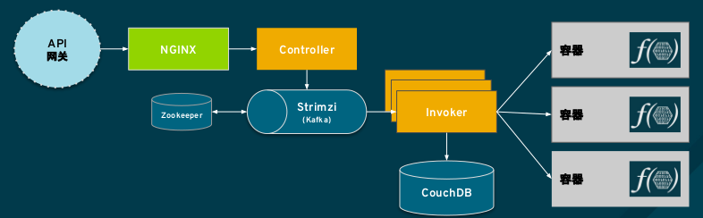

= 开源 Serverless
:toc: manual

== 云原生应用开发

回顾过去二十年，应用开发有以下几个显著的特点：

* 以应用服务器为中心，典型应用服务器包括 tomcat，JBoss，WebLogic，WebSphere，应用服务器提供了丰富的技术堆栈和系统构建范式，对应用开发人员友好
* JavaEE/Spring，JavaEE/Spring 是应用开发的基本技能，这项技能有广泛的开发者基础，过去二十年中 JavaEE/Spring 的技术发展/版本的更新和应用服务器相辅相成，呈现出螺旋发展的趋势
* .NET, 在 JavaEE/Spring 早期 .NET 有一段时间迅速发展，特别是 .ASP，C# 等模拟 Java 的语言或技术的出现
 
我们将以上这种特点的应用开发称为传统生应用开发。

但随着经济共享、技术共享、开源软件等成为主流，以及互联网巨头引领 IT 技术的发展，传统生应用开发的模型得到了巨大挑战，主要体现在传统的模式不能够在应用的交付、升级、开发、运维等层面做到灵活、快速、高效、自动化。为解决这些挑战，以及云计算、容器等出现，*云原生应用开发* 的概念得到了越来越多的认可，且包括一些传统厂商包括红帽都认为*应用开发市场正在发生大的转移，从传统应用开发，转向云原生应用开发*：

image:img/app-dev-serverless.png[]

云原生应用开发有以下几点特点：

* 应用服务器轻量化/嵌入式化 - 轻量级异步处理能力应用服务器 Undertow, jetty，JavaEE 转型为微服务定制 Microprofile，微服务框架内嵌入应用服务器，大数据领域一些分布式场合大量使用嵌入式应用服务器
* 响应式框架 - 响应式框架主要可解决的问题是传统应用服务器资源利用率等上面的不足，相比异步处理更进一步，在开发者的角度去实践异步、基于事件，典型的代表有 Vert.X，ReactiveX 等模型
* Serverless - Serverless主要可解决的是传统应用服务器对无状态、短生命周期应用处理能力不足的问题，本文随后的重点是去说明 Serverless 在云原生应用开发或现代应用开发领域的发展现状与实践模式
* JavaScript - JavaScript 无处不在，它也是对传统应用开发技术栈的补充或替代，例如 AngularJS 的前端 MVC、声明式的数据邦定等比传统 JSP/ASP 更有效，NodeJS 是 JavaScript 作用域扩展到服务器端
* 云原生Java - 互联网领域需要优先处理一些应用快速迭代，多向限事物处理，应用分布式能力等，这些技术被称作云原生Java，代表就是互联网公司推出的一些开源模型

毋庸置疑，云原生应用开发以成为主流，被越来越多的开发者认同，那么Serverless 在云原生应用开发中的角色，它的现状以及在开源领域的实践状况是什么样，本文随后尝试去说明。 

== Serverless

从 Serverless 的历史回顾说起，Serverless仅有很短的历史（3到4年），最早是有公有云厂商提出，它们的切入点非常简单，即传统应用开发绕不开应用部署到什么样的应用服务器，集群分布式怎么实现，需要采购多少台应用服务器，这些应用服务器的运维成本等等，公有云厂商的方案是，去除应用服务器，将应用运行在公有云上这样会给传统应用开发企业带来大量的好处，例如降低运营成本、扩展能力、更简单的管理等等，笔者曾参加过某公有云厂商的一个『0 服务器数据中心』的市场宣讲，当时影响深刻。

Serverless 在当前市场上主要有开源和闭源两类实践，如下表：

image:img/app-dev-serverless-table.png[]

* 闭源的方案以 AWS Lambda 为代表，它以服务的方式呈现，在开发者一端，开发者参与到服务的构建，通常实现某特定方法，而在服务器端则需要依赖广泛的 AWS 上服务，如 API 网关、存储、数据库等
* 开源的方案以 Apache OpenWhisk 为代表，这种实现主要是围绕容器对应用开发标准化、规范化、自动化的特性去打造 Serverless，目前它的社区活跃，传统应用开发厂商积极参与，发展势头迅猛

*什么是 Serverless？ 借助互联网上的资料给出一个定义：*

.*Wikipedia 的定义（https://en.wikipedia.org/wiki/Serverless_computing）*
----
Serverless 是一种云计算执行模型,云计算提供商动态管理所有机器资源的分配。定价基于应用程序消耗的实际资源量,而不是预先购买的资源容量。这是一种更高效的计算形式。
----

这种定义更偏向公有云厂商的理解，彻底去除传统应用服务器，一切应用部署到公有云。

.*MartinFowler 的定义（https://martinfowler.com/articles/serverless.html）*
----
应用大部分或完全依赖第三方云中运行的应用程序或服务来处理服务器端的状态或逻辑,这些第三方的应用程序或服务构成了一个庞大的生态系统,主要包括可通过云接入的数据库, 服务等(后端即服务, Backend as a Service , BaaS )。

一部分服务器端逻辑仍由应用程序开发人员编写, 但与传统体系架构不同的是, 这些应用程序是在无状态计算容器中运行,基于事件触 发,短生命周期的(可能 仅仅被调用一次),并由第三方完全管理(方法即服, Function as a Service , FaaS )。
----

MartinFowler 知名中间层方案架构师，它提出的敏捷理念对企业应用开发、应用集成有直接的影响。他的观点两个层面，即 BaaS 和 FaaS：

* BaaS - 企业通过私有云、混合云、多云平台构建自己的后台服务，让这些服务尽可能多处理一些有共性的业务，保证可靠性，从而保证了贴近应用开发的前端简单化，轻量化。这点在互联网公司已有一些实践，如某互联网公司中台战略。
* FaaS - 更贴近公有云厂商的理解，但 MartinFowler 的阐述更强调的是对传统应用架构的补充，即传统应用架构如何提高在应对人工智能、物联网等方面的不足，丰富处理单一活动、无状态、短生命周期业务的能力。

== 开源 Serverless 实践 OpenWhisk

Apache OpenWhisk 提供了完整的 Serverless 方案，最早是在 Apache 软件组织下孵化项目，基于 Apache 2.0 许可证的开源软件，IBM 最早发起, 红帽和 Adobe 是最主要的贡献者，支持 Kubernetes，可灵活部署在可以部署在共有云或私有云平台之上。

如上图，Apache OpenWhisk 架构分三个层面，这也反映了现代应用架构的变迁：

* 以 API 网关为中心的服务治理 - 云原生应用包括 Serverless 将一切服务化、与传统架构相比，对服务治理的需求更高，现代应用开发需要着重考量服务分类、流量控制、多级安全、记费、API 文档等
* 以 Kafka 为中心的分布式消息处理层 - Kafka 在现代应用架构中的作用与日俱增，不管是分布式系统，流数据处理，业务集成、数据整合，企业数据湖构建等领域
* 以文件数据库 + 内存计算为中心的数据持层 - CouchDB 是一个文件数据库，基于 NO-SQL key/value 的实现方式，但在内存计算层有比较好的实践
* 以容器为中心的计算层 - 容器在计算层的优势在于可细粒度利用计算资源，可标准化计算单元，这些优势降低应用架构的复杂度，增强了应用架构的敏捷性

Serverless 的工作过程就是事件触发一个活动/方法的执行，最终产生一个结果,

image:img/apache-openwhisk-work-process.png[]

上图是 Apache OpenWhisk 的工作过程，基于此图，Apache OpenWhisk 的一些主要概念如下：

* *触发器(Trigger)* - 可能触发一个活动的事件，例如，当一个新的人加入到聊天室 (newPersonJoin)
* *活动(Action)* - 事件的处理器,一段短生命周期的代 码处理一个事件，例如，一个 Javascript 输出 "hello! welcome $event"
* *规则(Rule)* - 触发器和活动关联在一起，例如，当 "newPersonJoin " 这个事件发生,执行 "hello.js"
* *顺序(Sequence)* - 一组方法的编排，例如，方法 A 调运方法 B 并将结果发送给方法 C
* *原料(Feed)* - 一组事件流可以通 过点击或web代理触发一个触发器，例如，一个数据网格 连续查询可触发多个方法，web 应用的一个点击流
* *包(Package)* - 将一组活动,触发器,原料打包，例如 Slack, GitHub

== OpenShift 集成 OpenWhisk 实践

OpenShift 是基于容器调度平台 Kubernetes，为企业客户打造的容器云平台，Apache OpenWhisk 部署到 OpenShift 可提供 Serverless 服务，本部分主要从这个角度去做阐述。

=== 环境准备

[source, bash]
.*创建 faas 工程*
----
oc new-project faas --display-name="FaaS- Apache OpenWhisk"
----

[source, bash]
.*使 OpenShift 用户对 faas 工程有管理员权限*
----
oc adm policy add-role-to-user admin developer -n faas
----

[source, bash]
.*部署 OpenWhisk 到 OpenShift*
----
oc process -f https://git.io/vpnUR | oc create -f -
----

[source, bash]
.*验证 OpenWhisk 部署成功*
----
while $(oc get pods -n faas controller-0 | grep 0/1 > /dev/null); do sleep 1; done
while [ -z "`oc logs controller-0 -n faas 2>&1 | grep "invoker status changed"`" ]; do sleep 1; done
----

[source, bash]
.*配置 OpenWhisk Ngnix Route 为 TLS*
----
oc patch route openwhisk --namespace faas -p '{"spec":{"tls": {"insecureEdgeTerminationPolicy": "Allow"}}}'
----

[source, bash]
.*安装配置 wsk*
----
$ wget https://github.com/projectodd/openwhisk-openshift/releases/download/latest/OpenWhisk_CLI-latest-linux-386.tgz
$ wsk --help
$ AUTH_SECRET=$(oc get secret whisk.auth -o yaml | grep "system:" | awk '{print $2}' | base64 --decode)

$ oc get route/openwhisk
openwhisk-faas.192.168.42.102.nip.io

$ wsk property set --auth $AUTH_SECRET --apihost openwhisk-faas.192.168.42.102.nip.io
ok: whisk auth set. Run 'wsk property get --auth' to see the new value.
ok: whisk API host set to openwhisk-faas.192.168.42.102.nip.io

$ wsk -i property get
client cert		
Client key		
whisk auth		789c46b1-71f6-4ed5-8c54-816aa4f8c502:fBw77lKEtyfKtlNSojUaNvaY71cQcBiD6mJSAW2tTPmNDIDpQEaatkS0y6OXRNBl
whisk API host		openwhisk-faas.192.168.42.102.nip.io
whisk API version	v1
whisk namespace		_
whisk CLI version	2018-04-18T17:58:43.480+0000
whisk API build		2018-01-01T00:00:00Z
whisk API build number	latest
----

[source, bash]
.*验证环境准备正确*
----
$ wsk -i action list
actions
/whisk.system/alarmsWeb/alarmWebAction                                 private nodejs:6
/whisk.system/alarms/interval                                          private nodejs:6
/whisk.system/alarms/once                                              private nodejs:6
/whisk.system/alarms/alarm                                             private nodejs:6
/whisk.system/invokerHealthTestAction0                                 private 
----

=== 部署 JavaScript Function

[source, javascript]
.*创建 greeter.js，内容如下*
---- 
function main(params) {
    var name = params.name || 'Guest';
    return {payload: 'Welcome to OpenShift Cloud Functions, ' + name};
}
----

[source, bash]
.*部署 JavaScript Function*
----
$ wsk -i action create greeter greeter.js
ok: created action greeter

$ wsk -i action list | grep greeter
/whisk.system/greeter                      private nodejs:6
----

[source, bash]
.*调运 JavaScript Function*
----
$ wsk -i action invoke --result greeter
{
    "payload": "Welcome to OpenShift Cloud Functions, Guest"
}

$ wsk -i action invoke --result greeter --param name "调运 JavaScript Function 测试"
{
    "payload": "Welcome to OpenShift Cloud Functions, 调运 JavaScript Function 测试"
}
----

[source, bash]
.*查看调运日志*
----
$ wsk -i activation list
activations
213a9a04171143a0ba9a04171113a0e9 greeter             

$ wsk -i activation get 213a9a04171143a0ba9a04171113a0e9
ok: got activation 213a9a04171143a0ba9a04171113a0e9
{
    "namespace": "whisk.system",
    "name": "greeter",
    "version": "0.0.1",
    "subject": "whisk.system",
    "activationId": "213a9a04171143a0ba9a04171113a0e9",
    "start": 1528120601992,
    "end": 1528120601996,
    "duration": 4,
    "response": {
        "status": "success",
        "statusCode": 0,
        "success": true,
        "result": {
            "payload": "Welcome to OpenShift Cloud Functions, 调运 JavaScript Function 测试"
        }
    },
    "logs": [],
    "annotations": [
        {
            "key": "limits",
            "value": {
                "logs": 10,
                "memory": 256,
                "timeout": 60000
            }
        },
        {
            "key": "path",
            "value": "whisk.system/greeter"
        },
        {
            "key": "kind",
            "value": "nodejs:6"
        },
        {
            "key": "waitTime",
            "value": 126
        }
    ],
    "publish": false
}

----

=== 部署 Java Function

[source, bash]
.*创建一个 Maven 工程*
----
mvn archetype:generate -DgroupId=com.sample -DartifactId=sample -DarchetypeArtifactId=maven-archetype-quickstart -DinteractiveMode=false
----

[source, bash]
.*工程添加依赖*
----
<dependency>
  <groupId>com.google.code.gson</groupId>
  <artifactId>gson</artifactId>
  <version>2.8.2</version>
</dependency>
----

[source, java]
.*编辑 src/main/java/com/sample/App.java，添加如下方法* 
----
package com.sample;

import com.google.gson.JsonObject;

public class App  {

    public static JsonObject main(JsonObject args) {
        String name = "stranger";
        if (args.has("name")) {
            name = args.getAsJsonPrimitive("name").getAsString();
        }
        JsonObject response = new JsonObject();
        response.addProperty("greeting", "Hello " + name + "!");
        return response;
    }

}
----

[source, bash]
.*编译部署 Java Function* 
----
$ mvn -q package

$ wsk -i action create --web=true sample target/sample-1.0-SNAPSHOT.jar --main com.sample.App
ok: created action sample
----

[source, bash]
.*查看部署的 Java Function* 
----
$ wsk -i action list | grep sample
/whisk.system/sample                                                   private java
----

[source, bash]
.*访问测试*
----
$ wsk -i action invoke --result sample --param {"name": "test"}
{
    "greeting": "Hello stranger!"
}

$ wsk -i action invoke --result sample --param name "OpenWhisk on OpenShift"
{
    "greeting": "Hello OpenWhisk on OpenShift!"
}
----

[source, bash]
.*HTTP 访问测试方法* 
----
$ WEB_URL=`wsk -i action get sample --url | awk 'FNR==2{print $1}'`
$ AUTH=`oc get secret whisk.auth -o yaml | grep "system:" | awk '{print $2}'`
$ echo $WEB_URL
https://openwhisk-faas.192.168.42.102.nip.io/api/v1/web/whisk.system/default/sample
$ echo $AUTH
Nzg5YzQ2YjEtNzFmNi00ZWQ1LThjNTQtODE2YWE0ZjhjNTAyOmZCdzc3bEtFdHlmS3RsTlNvalVhTnZhWTcxY1FjQmlENm1KU0FXMnRUUG1ORElEcFFFYWF0a1MweTZPWFJOQmw=

$ curl -k https://openwhisk-faas.192.168.42.102.nip.io/api/v1/web/whisk.system/default/sample.json
{
  "greeting": "Hello stranger!"
}

$ curl -k https://openwhisk-faas.192.168.42.102.nip.io/api/v1/web/whisk.system/default/sample.json?name=OpenShift
{
  "greeting": "Hello OpenShift!"
}
----

=== 基于 Sequence 创建 Action 链

image:img/faas-action-chain.png[]

如上图所示，Action 链共有三个 action:

* *splitter*  - java 方法，接收字符串，根据匹配规则拆分字符串
* *sorter*    - python 方法，接收 Json Array, 将 Array 中的字符串排序
* *uppercase* - javaScript 方法，接收 Json Array, 将 Array 中的字符串转化为大写字母

例如：给 Action 链传入字符串 `openshift,openstack,ceph,jboss,linux`，处理结果为 `["CEPH", "JBOSS", "LINUX", "OPENSHIFT", "OPENSTACK"]`。 

[source, bash]
.*01 - 创建一个 package*
----
$ wsk -i package create sequence
----

[source, bash]
.*02 - 创建一个 Maven 工程*
----
mvn archetype:generate -DgroupId=com.sample -DartifactId=sample2 -DarchetypeArtifactId=maven-archetype-quickstart -DinteractiveMode=false
----

[source, xml]
.*03 - 工程添加依赖*
----
<dependency>
  <groupId>com.google.code.gson</groupId>
  <artifactId>gson</artifactId>
  <version>2.8.2</version>
</dependency>
----

[source, java]
.*04 - 编辑 src/main/java/com/sample/App.java，添加如下方法*
----
package com.sample;

import com.google.gson.JsonArray;
import com.google.gson.JsonObject;

public class App  {

    public static JsonObject main(JsonObject args) {
        JsonObject response = new JsonObject();
        String text = null;
        if (args.has("text")) {
            text = args.getAsJsonPrimitive("text").getAsString();
        }
        String[] results = new String[] { text };
        if (text != null && text.indexOf(",") != -1) {
            results = text.split(",");
        }
        JsonArray splitStrings = new JsonArray();
        for (String var : results) {
            splitStrings.add(var);
        }
        response.add("result", splitStrings);
        return response;
  }
}
----

[source, bash]
.*05 - 部署 action splitter*
----
$ wsk -i action create --web=true sequence/splitter target/sample2-1.0-SNAPSHOT.jar --main com.sample.App
ok: created action sequence/splitter
----

[source, bash]
.*06 - 测试 splitter action*
----
$ wsk -i action invoke sequence/splitter --result --param text "zebra,cat,antelope"
{
    "result": [
        "zebra",
        "cat",
        "antelope"
    ]
}

$ curl -k $WEB_URL.json?text="zebra,cat,antelope"
{
  "result": ["zebra", "cat", "antelope"]
}
----

[source, python]
.*07 - 创建 sorter.py 将 Array 内容排序，内容如下*
----
def main(args):
    return {"result": sorted(args["result"]) }
----

[source, bash]
.*08 - 部署 action sorter*
----
$ wsk -i action create --web=true sequence/sorter sorter.py 
ok: created action sequence/sorter

$ wsk -i action list | grep sequence
/whisk.system/sequence/sorter                              private python:2
/whisk.system/sequence/splitter                            private java
----

[source, bash]
.*09 - 测试 sorter action*
----
$ wsk -i action invoke sequence/sorter --result --param-file ./split.json
{
    "result": [
        "antelope",
        "cat",
        "zebra"
    ]
}
----

[source, javascript]
.*10 - 创建 uppercase.js 将所有 Array 中的字符转变成大写字母，内容如下*
----
function main(args) {
    return {"result": args["result"].map(s => s.toUpperCase()) }
 }
----

[source, bash]
.*11 - 部署 action uppercase*
----
$ wsk -i action create sequence/uppercase uppercase.js
ok: created action sequence/uppercase

$ wsk -i action list | grep sequence
/whisk.system/sequence/uppercase                           private nodejs:6
/whisk.system/sequence/sorter                              private python:2
/whisk.system/sequence/splitter                            private java
----

[source, bash]
.*12 - 测试 uppercase action 部署*
----
$ wsk -i action invoke sequence/uppercase --result --param-file ./sorted.json 
{
    "result": [
        "ANTELOPE",
        "CAT",
        "ZEBRA"
    ]
}
----

[source, bash]
.*13 - 创建 action 链*
----
$ wsk -i action create --web=true strings --sequence sequence/splitter,sequence/sorter,sequence/uppercase 
ok: created action strings

$  wsk -i action list | grep strings
/whisk.system/strings                                      private sequence
----

[source, bash]
.*14 - 测试 action 链*
----
$wsk -i action invoke strings --result --param text "openshift,openstack,ceph,jboss,linux"
{
    "result": [
        "CEPH",
        "JBOSS",
        "LINUX",
        "OPENSHIFT",
        "OPENSTACK"
    ]
}

$ WEB_URL=`wsk -i action get strings --url | awk 'FNR==2{print $1}'`
$ curl -k $WEB_URL.json?text="openshift,openstack,ceph,jboss,linux"
{
  "result": ["CEPH", "JBOSS", "LINUX", "OPENSHIFT", "OPENSTACK"]
}
----

=== 使用规则和触发器

[source, javascript]
.*01 - 创建 timestamp.js，添加如下内容*
----
function main(params) {
  var date = new Date();
  console.log("Invoked at: " + date.toLocaleString());
  return { message: "Invoked at: " + date.toLocaleString() };
}
----

[source, bash]
.*02 - 部署 avtion timestamp*
----
$ wsk -i action create --web=true timestamp timestamp.js
ok: created action timestamp

$ wsk -i action list | grep timestamp
/whisk.system/timestamp                                   private nodejs:6
----

[source, bash]
.*03 - 使用 activation poll 拉取日志*
----
$ wsk -i activation poll
----

NOTE: activation poll 处于监控状态，Ctrl-c 可退出。

[source, bash]
.*04 - 测试 timestamp action*
----
$ wsk -i action invoke timestamp --result
{
    "message": "Invoked at: 6/5/2018, 12:51:37 PM"
}
----

NOTE: 返回查看 03 步，会有 `2018-06-05T12:51:37.906110000Z stdout: Invoked at: 6/5/2018, 12:51:37 PM` 信息输出。

[source, bash]
.*05 - 创建 trigger every-5-seconds*
----
$ wsk -i trigger create every-5-seconds --feed  /whisk.system/alarms/alarm --param cron '*/2 * * * * *' --param maxTriggers 100
ok: invoked /whisk.system/alarms/alarm with id d3e88126c14d4f18a88126c14def1880
{
    "activationId": "d3e88126c14d4f18a88126c14def1880",
    "annotations": [
        {
            "key": "path",
            "value": "whisk.system/alarms/alarm"
        },
        {
            "key": "waitTime",
            "value": 26
        },
        {
            "key": "kind",
            "value": "nodejs:6"
        },
        {
            "key": "limits",
            "value": {
                "logs": 10,
                "memory": 256,
                "timeout": 60000
            }
        },
        {
            "key": "initTime",
            "value": 380
        }
    ],
    "duration": 2093,
    "end": 1528203414270,
    "logs": [],
    "name": "alarm",
    "namespace": "whisk.system",
    "publish": false,
    "response": {
        "result": {
            "status": "success"
        },
        "status": "success",
        "success": true
    },
    "start": 1528203412177,
    "subject": "whisk.system",
    "version": "0.0.5"
}
ok: created trigger every-5-seconds
----

[source, bash]
.*06 - 创建规则 invoke-periodically*
----
$ wsk -i rule create invoke-periodically every-5-seconds timestamp
ok: created rule invoke-periodically
----

NOTE: 查看 03 步 Console 口会有相应的信息输出。

[source, bash]
.*07 - 删除规则和触发器*
----
$ wsk -i rule delete invoke-periodically
ok: deleted rule invoke-periodically

$ wsk -i trigger delete every-5-seconds
ok: invoked /whisk.system/alarms/alarm with id 762be098ba4244f0abe098ba42d4f009
----

=== 使用 package 编排 action 

[source, bash]
.*01 - 查看所有 packshe*
----
$ wsk -i package list
packages
/whisk.system/alarmsWeb                                    private
/whisk.system/alarms                                       shared
/whisk.system/sequence                                     private
----

[source, bash]
.*02 - 查看某一个 package 的明细*
----
$ wsk -i package get --summary alarms
package /whisk.system/alarms: Alarms and periodic utility
   (parameters: *apihost, *trigger_payload)
 feed   /whisk.system/alarms/interval: Fire trigger at specified interval
   (parameters: minutes, startDate, stopDate)
 feed   /whisk.system/alarms/once: Fire trigger once when alarm occurs
   (parameters: date, deleteAfterFire)
 feed   /whisk.system/alarms/alarm: Fire trigger when alarm occurs
   (parameters: cron, startDate, stopDate)
----

[source, bash]
.*03 - 创建一个 package*
----
$ wsk -i package create conversions
ok: created package conversions

$ wsk -i package list | grep conversions
/whisk.system/conversions                                  private
----

[source, javascript]
.*04 - 创建 temperature.js，内容如下*
----
function main(args) {
    temperature = args.temperature
    scale = args.scale
    target = args.target

    switch (target) {
        case "C":
            converted = normalize(temperature, scale)
            break;
        case "F":
            converted = normalize(temperature, scale) * 1.8 + 32
            break;
        case "K":
            converted = normalize(temperature, scale) + 273.15
            break;
        default:
            converted = null
            break;
    }

    return { "result": temperature + scale + " is " + converted + target }
}
----

[source, bash]
.*05 - 创建 action temperature*
----
$ wsk -i action update conversions/temperature temperature.js
ok: updated action conversions/temperature
----

[source, bash]
.*06 - 测试 temperature action*
----
$ wsk -i action invoke --blocking --result conversions/temperature --param temperature 38 --param scale C --param target K
{
    "result": "38C is 311.15K"
}

$ wsk -i action invoke --blocking --result conversions/temperature --param temperature 38 --param scale C --param target F
{
    "result": "38C is 100.4F"
}
----

[source, bash]
.*07 - 定义默认的参数为 C，并测试*
----
$ wsk -i action update conversions/temperature --param target C
ok: updated action conversions/temperature

$ wsk -i action invoke --blocking --result conversions/temperature --param temperature 100.4 --param scale F
{
    "result": "100.4F is 38C"
}
----

[source, bash]
.*08 - 定义默认参数的顺序，并测试*
----
$ wsk -i action update conversions/temperature --param target C --param scale F
ok: updated action conversions/temperature

$ wsk -i action invoke --blocking --result conversions/temperature --param temperature 100.4 
{
    "result": "100.4F is 38C"
}

$ wsk -i action invoke --blocking --result conversions/temperature --param temperature 38 --param scale C --param target K
{
    "result": "38C is 311.15K"
}
----

[source, bash]
.*09 - 在 package 上定义参数的顺序，并测试*
----
$ wsk -i action delete conversions/temperature
ok: deleted action conversions/temperature
$ wsk -i action update conversions/temperature temperature.js
ok: updated action conversions/temperature
$ wsk -i package update conversions --param target C --param scale F
ok: updated package conversions

$ wsk -i action invoke --blocking --result conversions/temperature --param temperature 100.4 
{
    "result": "100.4F is 38C"
}

----

[source, json]
.*10 - 创建 parameters.json，内容如下*
----
{
    "temperature": 104,
    "scale": "F",
     "target": "C"   
}
----

[source, bash]
.*11 - 调运 action 传递 json 文件*
----
$ wsk -i action invoke --blocking --result conversions/temperature --param-file parameters.json
{
    "result": "104F is 40C"
}
----

[source, bash]
.*12 - 创建 Package Binding 邦定参数，并测试*
----
$ wsk -i package bind /whisk.system/conversions kelvin --param scale K
ok: created binding kelvin

$ wsk -i package get --summary kelvin
package /whisk.system/kelvin: Returns a result based on parameters scale and target
   (parameters: *scale, *target)
 action /whisk.system/kelvin/temperature
   (parameters: none defined)

$ wsk -i action invoke --blocking --result kelvin/temperature --param temperature 311.15
{
    "result": "311.15K is 38C"
}
----

[source, bash]
.*13 - 发布 package*
----
$ wsk -i package get conversions publish
ok: got package conversions, displaying field publish
false

$ wsk -i package update conversions --shared yes
ok: updated package conversions

$ wsk -i package get conversions publish
ok: got package conversions, displaying field publish
true
----

[source, bash]
.*14 - 查看所有 package*
----
$ wsk -i package list
packages
/whisk.system/conversions                                  shared
/whisk.system/kelvin                                       private
/whisk.system/alarmsWeb                                    private
/whisk.system/alarms                                       shared
/whisk.system/sequence                                     private
----

