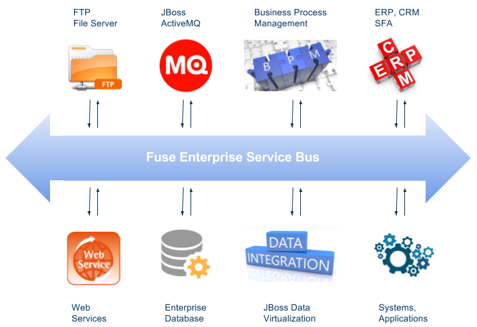

= Fuse All In One Demo
:toc: manual
:toc-placement: preamble

The JBoss Fuse All In One Demo will demonstrate the integration with FTP Server, REST Web Service, Mysql Database, JBoss A-MQ, JBoss BPM Suite, JBoss Data Virtualization, SAP ERP Systems, etc.

== Demo Intro

In this demo, we look at some common scenarios that may arise at a FSI based customer although it's generic enough that it could be demo'd for a broad audience too. The domain is loosely based around an event that generates a new Fund that then needs to be broadcasted to a set of interested consumers where each can handle the event separately.

There are several modules, as below figure:

image:files/fuse-demo-modules.png[All In One Demo Process]

* `JBoss Fuse` provide the fundamental Enterprise Service Bus and Agile Integration posibility
* `FTP Server` provide the transformation and persistence capability, which is a entry point of a new transaction
* `File Listener` listening on `FTP Server` for any income transaction, once a new transaction come in, it will be forward to AMQ Topic
* `Rest Service` provide REST API for transaction transformation, which is another entry point of a new transaction 
* `Rest Listener` listening on `Rest Service` for any income transaction, once a new transaction come in, it will be forward to AMQ Topic
* `Fund Persister` consumers from a topic that represents a new fund being generated. this service is responsible for storing the Fund to a database
* `Fund Processor` consumes from a topic that represents a new fund being generated. this service transforms the data and stores to a different file location.
* `Rules Processor` continues to process the transaction base Business rules and stores to FTP Server
* `OData Service` provides the data service for integrated data from FTP Server and Database.

== Steps

=== 0.1 - JBoss Fuse

[source, java]
.*JBoss Fuse 6.3 Install*
----
$ unzip jboss-fuse-karaf-6.3.0.redhat-187.zip && cd jboss-fuse-6.3.0.redhat-187
----

[source, java]
.*Edit etc/users.properties, comment out*
----
admin=admin,admin,manager,viewer,Monitor, Operator, Maintainer, Deployer, Auditor, Administrator, SuperUser
----

[source, java]
.*Start JBoss Fuse*
----
./bin/start
----

=== 0.2 - FTP Server

[source, bash]
.*Install vsftpd on RHEL 7*
----
yum install -y vsftpd ftp
----

[source, bash]
.*Start vsftpd*
----
systemctl start vsftpd
----

[source, bash]
.*Validate vsftpd*
----
# netstat -antulop | grep vsftpd
tcp6       0      0 :::21                   :::*                    LISTEN      30569/vsftpd         off (0.00/0/0)
----

[source, bash]
.*Example of put files to FTP server*
----
$ ftp localhost
Trying ::1...
Connected to localhost (::1).
220 (vsFTPd 3.0.2)
Name (localhost:kylin): 
331 Please specify the password.
Password:
230 Login successful.

put /home/kylin/tmp/sample.xml /home/kylin/ftp
----

=== 0.3 - File Listener

* Edit the file-listener service, make sure the ftp server directory `~/ftp` be configured as target folder, which this can be done use JBDS with Fuse Integration Plugin.

[source, java]
.*Package the file listener service*
----
$ cd jboss-fuse-fsi-demo/file-listener && mvn clean install
----

[source, java]
.*Deploy the file listener service to JBoss Fuse*
----
cp target/file-listener-1.0-SNAPSHOT.jar ~/jboss-fuse-6.3.0.redhat-187/deploy/
----

=== 0.4 - Rest Service

The Rest Service provide the same function as FTP Server, it can used to start a new fund transaction.

[source, java]
.*Start Rest Service*
----
$ cd jboss-fuse-fsi-demo/rest-service && mvn clean install
$ java -jar target/rest-service-0.1.0.jar
----

The REST Service contains the following API:

* http://localhost:8080/transaction/add?fundNumber=100&transactionType=WITHDRAWL&fundName=Global
* http://localhost:8080/transaction/ping

=== 0.5 - Rest Listener

The REST Listener use the CBR pattern, which provide a http proxy to REST Service.

[source, java]
.*Package the rest listener service*
----
$ cd jboss-fuse-fsi-demo/rest-listener && mvn clean install
----

[source, java]
.*Install camel-jetty on JBoss Fuse*
----
$ ./bin/client
JBossFuse:admin@root> features:install camel-jetty
----

[source, java]
.*Deploy the rest listener service to JBoss Fuse*
----
cp target/rest-listener-1.0-SNAPSHOT.jar ~/jboss-fuse-6.3.0.redhat-187/deploy/
----

Note that, the above rest service provide the following API:

* http://localhost:8180/transaction/add?fundNumber=100&transactionType=WITHDRAWL&fundName=Global
* http://localhost:8180/transaction/ping

=== 0.6 - Mariadb

[source, bash]
.*Install & Start*
----
yum groupinstall mariadb mariadb-client -y
systemctl start mariadb
----

[source, sql]
.*Prepare Database*
----
# mysql -u test_user -p
Enter password: 

MariaDB [(none)]> use test;
MariaDB [test]> source ~/fund-persister/src/main/resources/sql/tables-mariadb.sql
----

=== 0.7 - Fund Persister

[source, java]
.*Package the fund persister service*
----
$ cd jboss-fuse-fsi-demo/fund-persister && mvn clean install
----

[source, java]
.*Install camel-mybatis on JBoss Fuse*
----
$ ./bin/client
JBossFuse:admin@root> features:install camel-mybatis
----

[source, java]
.*Deploy the mysql connector to JBoss Fuse*
----
cp ~/mysql-connector-java-5.1.35.jar ~/jboss-fuse-6.3.0.redhat-187/deploy/
----

[source, java]
.*Deploy the fund persister service to JBoss Fuse*
----
cp target/fund-persister-1.0-SNAPSHOT.jar ~/jboss-fuse-6.3.0.redhat-187/deploy/
----

=== 0.8 - Fund Processor 

[source, java]
.*Package the fund processor service*
----
$ cd jboss-fuse-fsi-demo/fund-processor && mvn clean install
----

[source, java]
.*Deploy the fund processor service to JBoss Fuse*
----
cp target/fund-processor-1.0-SNAPSHOT.jar ~/jboss-fuse-6.3.0.redhat-187/deploy/
----

=== 0.9 - Fuse Drools Integration

[source, java]
.*Install Fuse Drools Integration*
----
unzip fuse-integration-karaf-distro-1.5.0.redhat-630018.zip -d jboss-fuse-6.3.0.redhat-187/
----

[source, java]
.*Add features URL*
----
features:addurl mvn:org.drools/drools-karaf-features/6.5.0.Final-redhat-2/xml/features-fuse-6_3
features:addurl mvn:org.jboss.integration.fuse.quickstarts/karaf-features/1.7.0.redhat-630013/xml/features
----

[source, java]
.*Add Features*
----
features:install fuse-bxms-quickstart-camel-spring-drools-decision-table
----

=== 1.0 - Rules Processor

[source, bash]
.*Package the rules processor service*
----
$ cd jboss-fuse-fsi-demo/rules-processor && mvn clean install
----

[source, bash]
.*Deploy the rules processor to JBoss Fuse*
----
cp target/rules-processor.war ~/jboss-fuse-6.3.0.redhat-187/deploy/
----

=== 1.1 - JBoss Data Virtualization

[source, bash]
.*Start JBoss Data Virtualization*
----
$ ./bin/standalone.sh -Djboss.socket.binding.port-offset=200
----

[source, bash]
.*Set up datasource*
----
$ ./bin/jboss-cli.sh --controller=127.0.0.1:10199 --connect
/subsystem=datasources/data-source=MysqlDS:add(driver-name=mysql, jndi-name=java:/MysqlDS, connection-url=jdbc:mysql://localhost:3306/test, user-name=test_user, password=redhat, enabled=true, use-java-context=true, min-pool-size=5, max-pool-size=30)
/subsystem=datasources/data-source=MysqlDS:enable()
/subsystem=datasources/data-source=MysqlDS:test-connection-in-pool()

/subsystem=resource-adapters/resource-adapter=fileQS:add(module=org.jboss.teiid.resource-adapter.file)
/subsystem=resource-adapters/resource-adapter=fileQS/connection-definitions=fileDS:add(jndi-name=java:/fileDS, class-name=org.teiid.resource.adapter.file.FileManagedConnectionFactory, enabled=true, use-java-context=true)
/subsystem=resource-adapters/resource-adapter=fileQS/connection-definitions=fileDS/config-properties=ParentDirectory:add(value=/home/kylin/tmp/output/)
/subsystem=resource-adapters/resource-adapter=fileQS/connection-definitions=fileDS/config-properties=AllowParentPaths:add(value=true)
/subsystem=resource-adapters/resource-adapter=fileQS:activate
----

[source, bash]
.*Deploy link:files/sample-vdb.xml[sample-vdb.xml]*
----
$ cp files/sample-vdb.xml ~/jdv-6.4/standalone/deployments/
----

The following api is the select * from from Tables/Views:

* http://localhost:8280/odata4/SampleVDB/MysqlSource/$metadata
* http://localhost:8280/odata4/SampleVDB/MysqlSource/funds?$format=json

* http://localhost:8280/odata4/SampleVDB/ViewModel/$metadata
* http://localhost:8280/odata4/SampleVDB/ViewModel/SampleView?$format=json
* http://localhost:8280/odata4/SampleVDB/ViewModel/ComparisonView?$format=json
* http://localhost:8280/odata4/SampleVDB/ViewModel/ComparisonView

=== 1.2 - OData Service

[source, bash]
.*Package the odata service*
----
$ cd jboss-fuse-fsi-demo/jdv-service && mvn clean install
----

[source, bash]
.*Deploy the rules processor to JBoss Fuse*
----
cp target/jdv-service-1.0-SNAPSHOT.jar ~/jboss-fuse-6.3.0.redhat-187/deploy/
----

Using the following api to test the data:

* http://localhost:8190/odata4/SampleVDB/MysqlSource/$metadata
* http://localhost:8190/odata4/SampleVDB/MysqlSource/funds?$format=json

* http://localhost:8190/odata4/SampleVDB/ViewModel/$metadata
* http://localhost:8190/odata4/SampleVDB/ViewModel/SampleView?$format=json
* http://localhost:8190/odata4/SampleVDB/ViewModel/ComparisonView?$format=json
* http://localhost:8190/odata4/SampleVDB/ViewModel/ComparisonView

