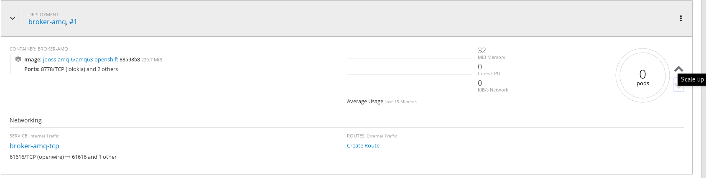
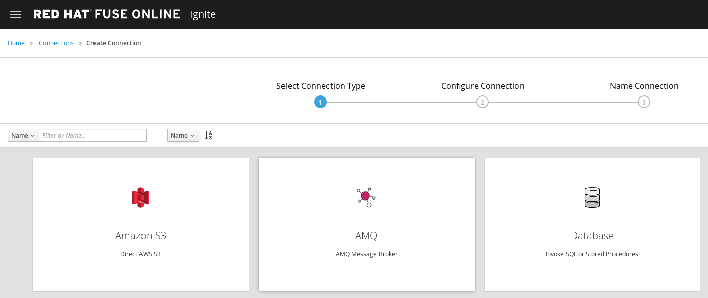
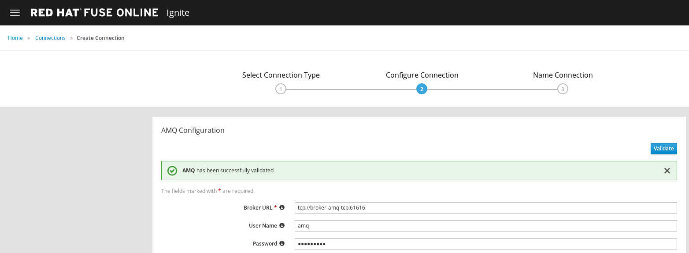
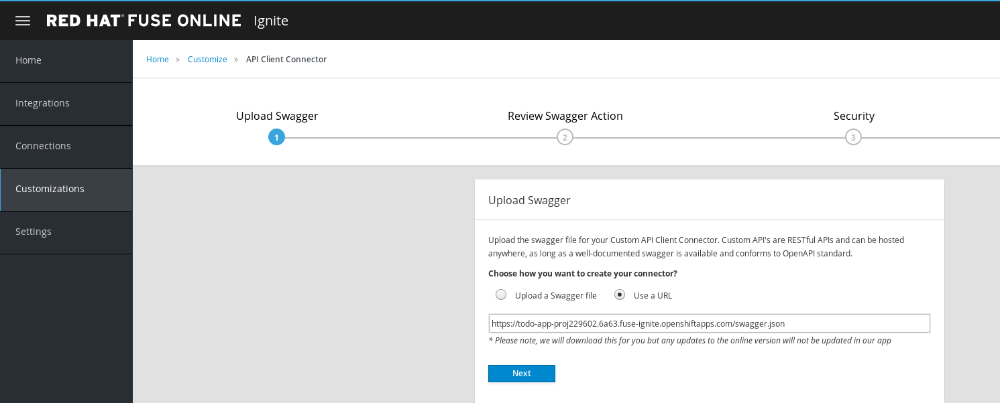
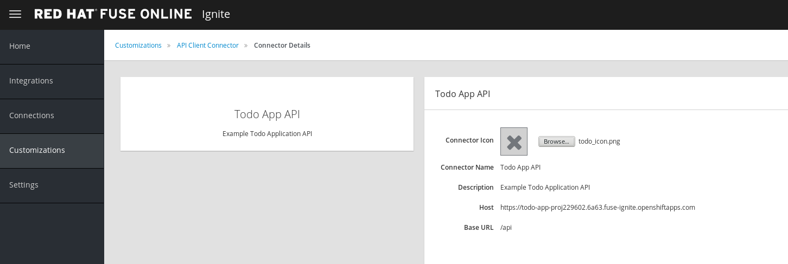
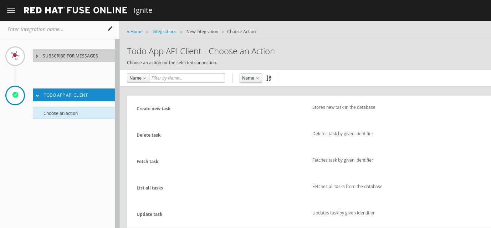
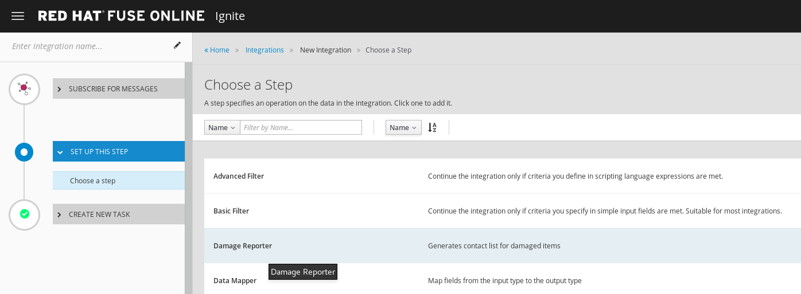
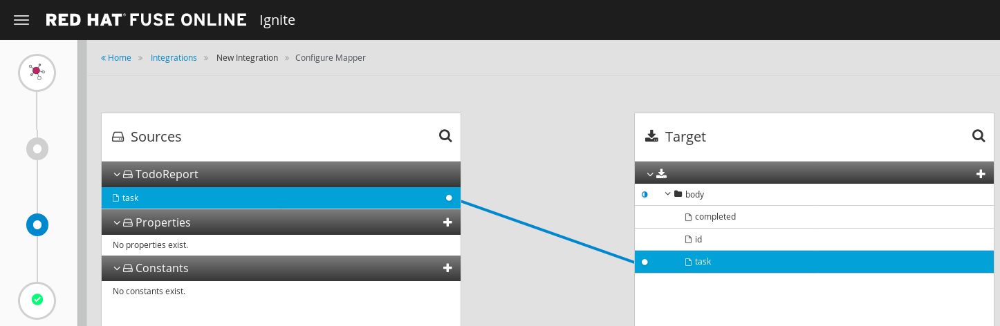

= Fuse Online
:toc: manual

== AMQ broker setup

Login to background https://console.fuse-ignite.openshift.com/console/, go into the `Fuse Online` project, scale up the AMQ broker:

Login to Fuse Online https://app-proj229602.6a63.fuse-ignite.openshiftapps.com, go into `Connections`, click `Create Connection`, select `AMQ`

Entry the following entry to configure the AMQ connection:

* *Broker URL* - tcp://broker-amq-tcp:61616
* *Username* - amq
* *Password* - topSecret

Click `Validate` make sure the connection works fine, click `Next`, entry *AMQ Broker 1* as `Connection Name`, click `Create` to finish the AMQ connection creation.

== Damage Reporter setup

[source, bash]
.*Download damage-reporter-1.2.9.jar*
----
$ wget https://github.com/syndesisio/fuse-online-tp3-sample-extension/releases/download/1.2.9/damage-reporter-1.2.9.jar
---- 

In Fuse Online click `Customizations`, navigate to `Extensions` panel, click `Import Extension` to start import extension, after select the extension jar, a `Import Extension` panel generated, click `Import Extension` to finish importing.

image:files/fuse-online-customization-extension.png[Fuse Online Customization Extension]

== TO DO APP setup

In the `Customizations` -> `API Client Connectors`, click `Create API Connector`, select `Use a URL` paste the  https://todo-app-proj229602.6a63.fuse-ignite.openshiftapps.com/swagger.json as URL, 

click *Next* to go into `Review Swagger Actions`, continue click *Next* to go into `Security` that accept *HTTP Basic Authorization*, continue click *Next*, in the `General Connector Info` panel, pase https://todo-app-proj229602.6a63.fuse-ignite.openshiftapps.com as `Host`, click *Create Connector* to finish connector creating.

image:files/fuse-online-todo-app-generate.png[ General Connector Info]

[source, bash]
.*Download a todo icon*
----
$ wget https://todo-app-proj229602.6a63.fuse-ignite.openshiftapps.com/images/todo_icon.png
----

Entry the `Todo App API`, click *Browse*, Navigate to `todo_icon.png` which download above.

In Fuse Online, go into `Connections`, click `Create Connection`, select `Todo App API`, in `Configure Connection` panel, enter `fuse` as username, `redhat` as password.

image:files/fuse-online-connection-rest.png[TO DO Connection]

Enter *Todo App API Client* as `Connection Name` in `Name Connection` panel. Click *Create* to finish creating. 

== AMQ TO REST INTEGRATION

In Fuse Online, `Integrations` -> `Create Integration` -> `Choose a Start Connection`, click *AMQ Broker 1*. On the *Choose an Action* page, click the *Subscribe for Messages* action to receive messages from the queue you specify:

* *Destination Name* - inventoryReceived
* *Destination Type* - Queue

image:files/fuse-online-integration-1.png[start connection]

On the `Choose a Finish Connection` page click `Todo App API Client`, then click *Create new task* in `Choose an Action` page

On the centre of `Add to Integration`, click `Add a Step`, On the `Choose a Step` page, click `Damage Reporter`

On the centre of `Add to Integration`, click `Add a Step` again, On the `Choose a Step` page, click `Data Mapper`, In the `Sources` panel, click the task field, In the `Target` panel, expand the body field and click *task*, Click *DONE* to finish setting.

Click *Publish* enter `AMQ to REST API Integration` to `Integration Name` field and click `Publish`, the integration will go into `In Progress` spinning circle, once finished generation the integration will go into `Active` status as below:

image:files/fuse-online-integration-5.png[Integration DONE]

== Test

In a new browser window, access https://todo-app-proj229602.6a63.fuse-ignite.openshiftapps.com/, Click `Show JMS Form`, Edit the XML contents and click `Send JMS Message`.
