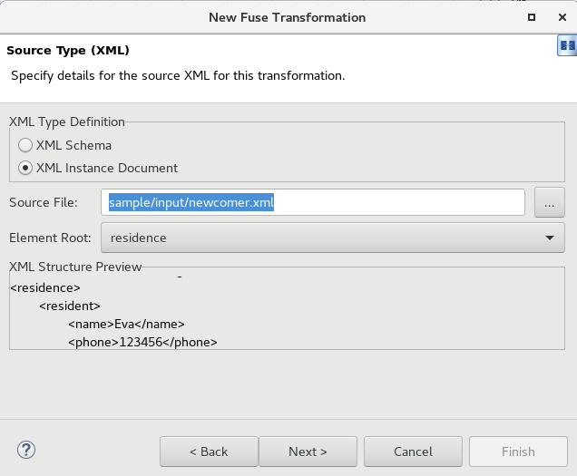
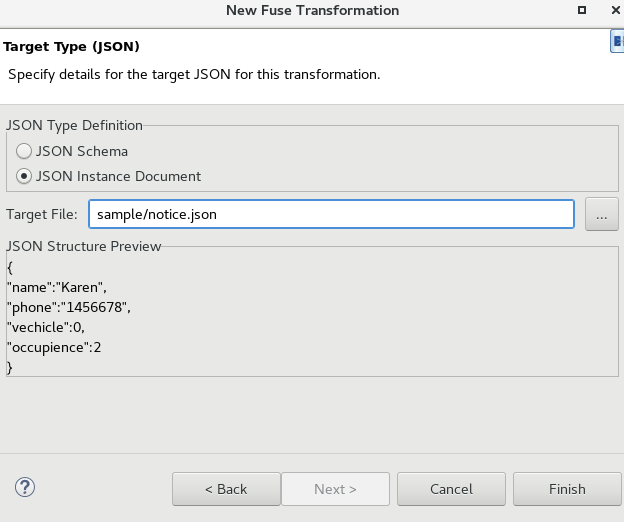

= Data Transformation
:toc: manual
:toc-placement: preamble

As below figure

image:files/fis-eips.png[FIS EIPs]

* The large xml file be split to small xml
* The splited small xml be transformed to json file
* The transformed json file be filtered and push to file system

== Data Transformation

Open the FIS Development Tools, navigate to Design Panel, add a `Data Transformation` Endpoint, in the poped up `New Transformation` wizard enter:

* `Transformation ID` -  *newcomernotice*
* `Source Type`       -  *XML*
* `Target Type`       -  *JSON*

The results looks:

image:files/fis-eips-transform-new.png[FIS EIPs new Transform]

Click `Next` button, going to *Source Type* wizard, set:

* `XML Type Definition` -  *XML Instance Document*
* `Source File`         -  *sample/input/newcomer.xml*

The results looks:

Click `Next` button, going to *Target Type* wizard, set:

* `JSON Type Definition` -  *JSON Instance Document*
* `Source File`          -  *sample/notice.json*

The results looks:

Click `Finish` button to start transformation mapping, map between two data formats:

* Resident phone     ->  Notice phone
* Resident name      ->  Notice name
* Resident vehicles  ->  Notice vehicles
* Resident household ->  Notice occupience

The transforming panel looks

image:files/fis-eips-transforming.png[transforming]

Once the above step finished, there will generate lots of code/configuration,

* The jackson annotated model classes under `notice`
* The jaxb annotated model classes under `generated_1517327809075`
* The `transformation.xml` file under classpath
* The `endpoint` and `dataFormats` configuration in camel-context.xml

== Run with Spring Boot

[source, java]
----
$ cd fuse-get-started/eips
$ mvn clean package
$ java -jar target/fis-eips-1.0.0-SNAPSHOT.jar
----

Once the spring boot started, create the path `eips/data/input`

[source, bash]
----
mkdir -p data/input 
----

Copy sample xml to input folder

[source, bash]
----
$ cp sample/input/newcomer.xml data/input/
----

This will trigger a split, transform, filter process.
