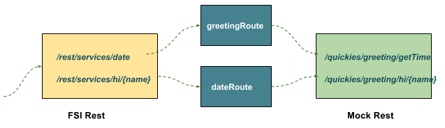

= Format/Bridge/Expose Rest
:toc: manual
:toc-placement: preamble

This example demomstrate use Camel Rest to bridge, format and expose on a Rest Web Service as below,

The FSI Rest use the route to format and call the backgroud rest service.

== Run with Spring Boot

[source, java]
----
$ cd fuse-get-started/fis-rest
$ mvn clean package
$ java -jar target/fis-rest-1.0.0-SNAPSHOT.jar
----

Use the fowlling formated URL to test:

* http://localhost:8080/rest/services/date
* http://localhost:8080/rest/services/hi/kylin

== Run with OpenShift

[source, java]
----
oc new-project test --display-name="Test Project" --description="Test Project"
mvn -Dkubernetes.master=https://192.168.42.107:8443 -Dkubernetes.namespace=test -Dkubernetes.auth.basic.username=developer -Dkubernetes.auth.basic.password=developer -Dfabric8.mode=openshift -Dkubernetes.trust.certificates=true -Dfabric8.build.strategy=s2i -Dkubernetes.auth.tryServiceAccount=false -Dfabric8.generator.from=registry.access.redhat.com/jboss-fuse-6/fis-java-openshift -Dfabric8.generator.fromMode=docker -Dkubernetes.auth.tryKubeConfig=false clean fabric8:deploy
oc expose svc/fis-rest
----

Use the fowlling formated URL to test:

* http://fis-rest-test.192.168.42.107.nip.io/rest/services/date
* http://fis-rest-test.192.168.42.107.nip.io/rest/services/hi/Kylin
* http://fis-rest-test.192.168.42.107.nip.io/rest/api-docs
