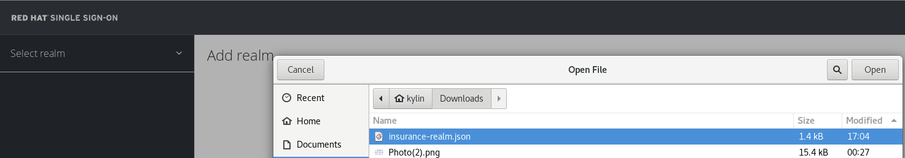
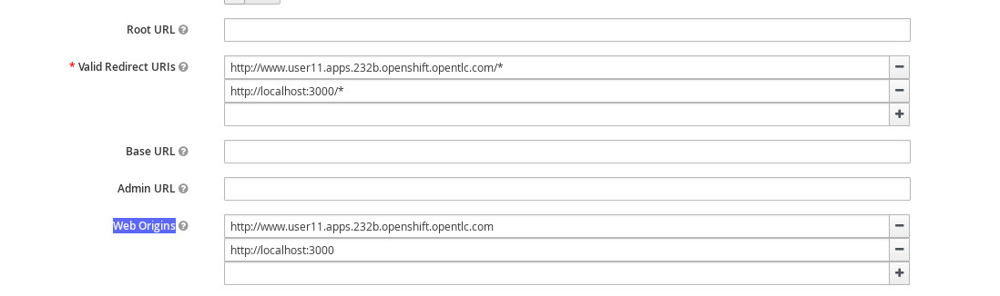
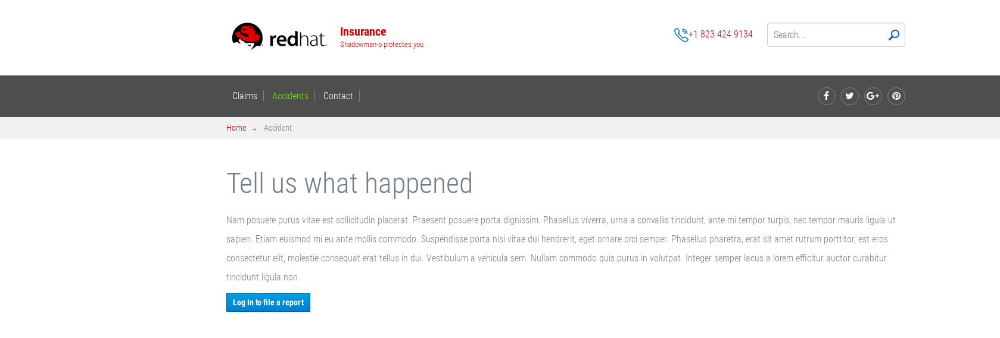

= SSO, 3Scale on OCP
:toc: manual
:toc-placement: preamble

This docs is for instruct how to run Red Hat SSO and 3Scale on OpenShift Container Platform.

== Steps for setting SSO

[source, bash]
.*Execute the following commands to create a project and install security certs*
----
oc new-project sso --display-name="Single Sign On" --description="Single Sign On"
oc create -n sso -f sso-app-secret.json
----

NOTE: `sso-app-secret.json` can be download from https://raw.githubusercontent.com/jboss-openshift/application-templates/ose-v1.4.5/secrets/sso-app-secret.json.

Navigate to OCP Console, copy https://raw.githubusercontent.com/jboss-openshift/application-templates/ose-v1.4.5/sso/sso71-mysql-persistent.json while create project, set the following environment patameters:

* Server Keystore Password  - mykeystorepass (note, the 'mykeystorepass' is defined in sso-app-secret.json)
* SSO Admin Username        - admin
* SSO Admin Password        - admin

Click the `Continute toOverview` go to the Overview page, Select the `sso` go to the Deployements page, Action -> Edit, change the Image Stream Tag version from 1.1 to 1.2, Save the edit.

== Steps for setting 3Scale

[source, bash]
.*Execute below command to create a new project*
----
oc new-project amp --display-name="API Management Platform" --description="API Management Platform"
----

* Click Add to Project, copy the content of 'amp.yml' which can be find from https://raw.githubusercontent.com/3scale/3scale-amp-openshift-templates/2.1.0-GA/amp/amp.yml.

* Click continue to process, add parameter WILDCARD_DOMAIN with value '3scale-admin.3scale-admin.apps.232b.openshift.opentlc.com'

* Find the login user/password via: Overview -> 'system-app' -> Environment, the USER_LOGIN is the login username, and the USER_PASSWORD is the login password, eg, admin/qo8hu0ks.

* Login to 3Scale via 'https://3scale-admin.3scale-admin.apps.232b.openshift.opentlc.com', the above user/password should be used.

== Steps for setting OpenID Connect integration with SSO

[source, bash]
.*Find the SSO URL and login*
----
$ oc project sso
$ oc get routes
NAME         HOST/PORT                                        PATH      SERVICES     PORT      TERMINATION   WILDCARD
secure-sso   secure-sso-sso.apps.232b.openshift.opentlc.com             secure-sso   <all>     passthrough   None
sso          sso-sso.apps.232b.openshift.opentlc.com                    sso          <all>                   None
----

The `secure-sso-sso.apps.232b.openshift.opentlc.com` is the url can used to login, click https://secure-sso-sso.apps.232b.openshift.opentlc.com/ to login, once login success, you will get the following page:

image:files/sso-setup-login.png[SSO login]

Select and click `Add realm`, click `Select file`, point to `insurance-realm.json` as below:

NOTE: the `insurance-realm.json` can be found from https://raw.githubusercontent.com/weimeilin79/techsparkpoc/master/templates/insurance-realm.json

== Deploy a web project

[source, bash] 
.*Deploy the templete*
----
 oc create -f accidentalert-ui-template.json -n techspark-user11
----

NOTE: the `accidentalert-ui-template.json` and `accidentalert-ui` can be fround from https://github.com/weimeilin79/techsparkpoc/tree/master/projects/accidentalert-ui.

* Create the web project base on templete create above, note that in the Process page, enter 3 parameters: APPLICATION_HOSTNAME, SSO_URL and BACKEND_URL, it looks as below page:

image:files/sso-create-webproject.png[Create Web Project]

NOTE: BACKEND_URL point to a project which created in previous lab.

* Create the route, once the route expose done, the below commands can used to check:

[source, bash]
----
$ oc get routes
NAME                          HOST/PORT                                                            PATH      SERVICES                PORT      TERMINATION   WILDCARD
accidentalert-ui-http-route   www.user11.apps.232b.openshift.opentlc.com                                     accidentalert-ui-http   <all>                   None
----

Setting up the authentication url path in SSO, naviagate to SSO page, `Configure` -> `Client`, in `accidentalert-ui` section, select `Edit` button, make sure the `Valid Redirect URIs` and `Web Origins` point tot the Web project route which configured in above steps, a correct setting should be looks:

Click `Save` to finish the setting.

Test the SSO via web project URL: http://www.user11.apps.232b.openshift.opentlc.com/. On the welcome page, click the `Accidents` in the top menu you will get the following page:

Click the blue `Login to file a report` will redirect to SSO login page, login with the username/password, which defined in `insurance-realm.json`, eg, statepolice/password.

