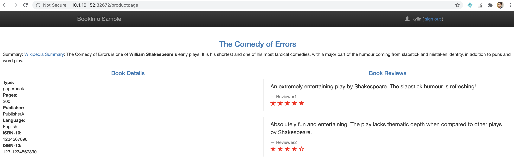
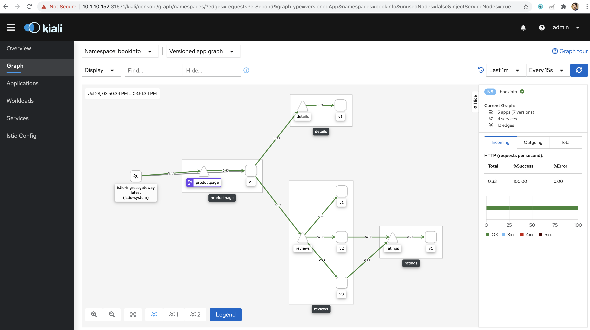
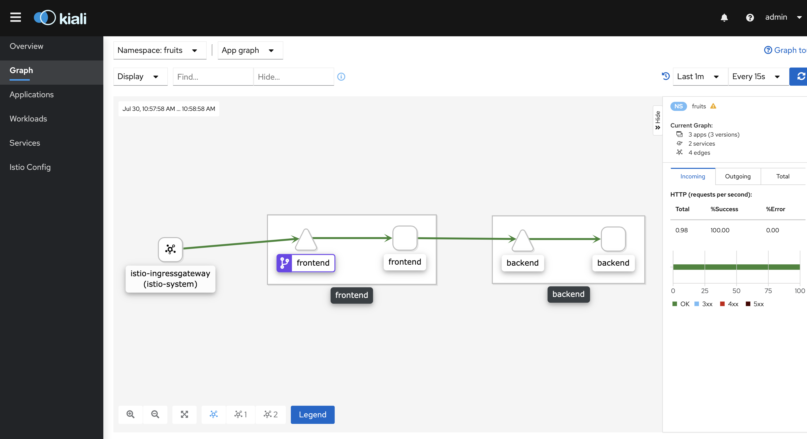

= 快速开始
:toc: manual

== k8s 安装 istio

[source, bash]
----
cd istio-1.6.5
export PATH="$PATH:/root/istio-1.6.5/bin"
istioctl install --set profile=demo
----

== 应用部署与访问

=== k8s 上部署 bookinfo

NOTE: 详细关于 bookinfo 架构参照 https://istio.io/latest/docs/examples/bookinfo/。

[source, bash]
.*1. namespace 上添加自动注入 Envoy sidecar 的标签*
----
kubectl create ns bookinfo
kubectl label ns bookinfo istio-injection=enabled
----

[source, bash]
.*2. 部署 bookinfo*
----
kubectl apply -f samples/bookinfo/platform/kube/bookinfo.yaml -n bookinfo
----

[source, bash]
.*3. 创建 istio gateway 和 virtualservice*
----
kubectl apply -f samples/bookinfo/networking/bookinfo-gateway.yaml -n bookinfo
----

[source, bash]
.*4. 验证部署的应用配置无错误*
----
istioctl analyze -n bookinfo
----

[source, bash]
.*5. 服务访问*
----
$ export INGRESS_PORT=$(kubectl -n istio-system get service istio-ingressgateway -o jsonpath='{.spec.ports[?(@.name=="http2")].nodePort}')
$ export SECURE_INGRESS_PORT=$(kubectl -n istio-system get service istio-ingressgateway -o jsonpath='{.spec.ports[?(@.name=="https")].nodePort}')
$ export INGRESS_HOST=$(kubectl get po -l istio=ingressgateway -n istio-system -o jsonpath='{.items[0].status.hostIP}')
$ export GATEWAY_URL=$INGRESS_HOST:$INGRESS_PORT

$ echo http://$GATEWAY_URL/productpage
http://10.1.10.152:32672/productpage
----

拷贝 echo 输出的地址到浏览器，访问输出结果如下：

[source, bash]
.*6. 访问 kiali*
----
kubectl expose deploy kiali --type='NodePort' -n istio-system --port=20001 --name=kiali-nodeport
----

使用 `admin`/`admin` 登录后访问

=== k8s 上部署 fruits

NOTE: 详细关于 fruits 介绍及代码参考 https://github.com/kylinsoong/client-server-demo.

[source, bash]
.*1. namespace 上添加自动注入 Envoy sidecar 的标签*
----
kubectl create ns fruits
kubectl label ns fruits istio-injection=enabled
----

[source, bash]
.*2. 部署 fruits*
----
kubectl apply -f fruits-istio.yaml
----

[source, bash]
.*3. 创建 istio gateway 和 virtualservice*
----
kubectl apply -f fruits-istio-gateway.yaml
----

[source, bash]
.*4. 验证部署的应用配置无错误*
----
istioctl analyze -n fruits
----

[source, bash]
.*5. 服务访问*
----
$ export INGRESS_PORT=$(kubectl -n istio-system get service istio-ingressgateway -o jsonpath='{.spec.ports[?(@.name=="http2")].nodePort}')
$ export SECURE_INGRESS_PORT=$(kubectl -n istio-system get service istio-ingressgateway -o jsonpath='{.spec.ports[?(@.name=="https")].nodePort}')
$ export INGRESS_HOST=$(kubectl get po -l istio=ingressgateway -n istio-system -o jsonpath='{.items[0].status.hostIP}')
$ export GATEWAY_URL=$INGRESS_HOST:$INGRESS_PORT

$ curl http://$GATEWAY_URL/ui
{id=1, name=Cherry}
{id=2, name=Apple}
{id=3, name=Banana}
----

[source, bash]
.*6. 访问 kiali*
----
kubectl expose deploy kiali --type='NodePort' -n istio-system --port=20001 --name=kiali-nodeport
----

使用 `admin`/`admin` 登录后访问

