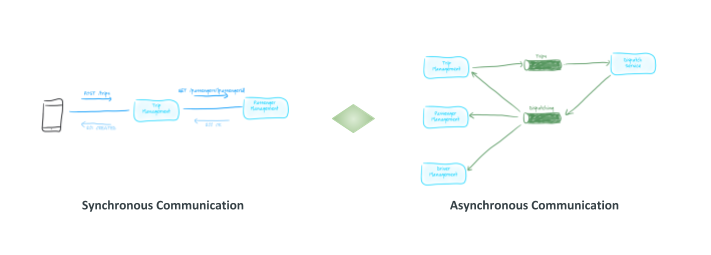
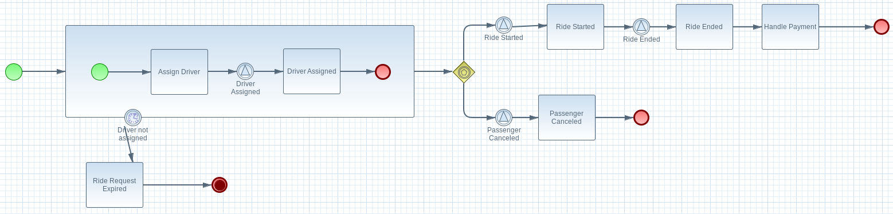
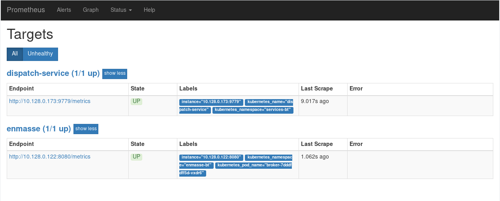

= 微服务及红帽多产品集成实践
:toc: manual

== 背景说明

https://redhat.slides.com/ksoong/06_operational_intelligence 有关于此实践案例的详细说明。

总的来说，本部分通过示例(Step by Step) 的方式演示红帽的产品如何应用在微服务架构下。三个纬度去说明红帽微服务多产品集成背景。

*单体(Monolith) -> 微服务(Microservices)*

image:img/monolith-to-micrisvc.png[]

这种架构的变迁有一定的必然性，例如微服务架构带来了架构的灵活性、系统的健壮性等，同时微服务架构需要处理不同的问题，例如复杂内部服务调运模式，分布式设计等。

*同步通信(Synchronous Communication) & 异步通信(Asynchronous Communication)*

同步通信和异步通信是IT系统架构设计中最常使用的模式，两种模式各有优缺点，微服务架构更需要合理的异步通信模式。

*本方案目的说明新架构下红帽产品的使用，具体产品包括：*

* https://www.openshift.com/products/container-platform[Red Hat OpenShift Container Platform(OCP)]
* https://www.redhat.com/en/technologies/jboss-middleware/amq[Red Hat AMQ(AMQ)]
* https://www.redhat.com/en/technologies/jboss-middleware/process-automation-manager[Red Hat Process Automation Manager(PAM)]
* https://www.redhat.com/en/technologies/cloud-computing/openshift/application-runtimes[Red Hat OpenShift Application Runtimes(RHOAR)]
* https://www.redhat.com/en/technologies/jboss-middleware/fuse[Red Hat Fuse(Fuse)]
* https://access.redhat.com/products/red-hat-single-sign-on[Red Hat Single Sign-On(SSO)]
* https://www.openssl.org[OpenSSL]

=== AMQ 在异步通信方面的能力

AMQ 7 是一个轻量级的消息平台，支持分布式、容器化运行、多种客户端、消息 Stream 等，支持多种协议，能够有效的提供系统异步通信能力，架构示例如下：

image:img/amqp-mqtt.png[]

* AMQP 协议主要主要用于跨平台消息通信，例如，C 语言的系统和 Java 语言的系统可以通过 AMQP 进行通信。这种通信同时是在大规模、高扩展性的场景下使用。
* MQTT 协议是目前物联网 (IoT) 通信的标准。MQTT（消息队列遥测传输） 是基于 TCP/IP 协议栈而构建，是一种轻量级的、灵活的网络协议，致力于为 IoT 提供最优方案，这个轻量级体现在可在严重受限的设备硬件和高延迟/带宽有限的网络上实现，而这个灵活性使得为 IoT 设备和服务的多样化应用场景提供支持成为可能。

=== 案例架构

Acme 公司要启动一个 taxi-hailing 项目，采用了微服务架构，使用了同步和异步的通信模式，一期启动主要有三个服务：

image:img/runtime_topology.png[]

* Passenger service - 流程驱动的微服务
* Driver service - 异步式微服务
* Dispatch service - 基于 Spring Boot 微服务

另外，使用 DevOps 进行微服务开发/运行自动化，Prometheus Grafana、Jaeger 等 Istio 组建用来微服务的追踪与监控。

== OpenShift 环境准备

[source, bash]
.*确保 OpenShift 运行，至少 20 GB/8 CPU 资源，oc/kubectl 在本地安装*
----
$ oc version
oc v3.9.40
kubernetes v1.9.1+a0ce1bc657
features: Basic-Auth GSSAPI Kerberos SPNEGO

Server https://master.c3de.rhte.opentlc.com:443
openshift v3.9.40
kubernetes v1.9.1+a0ce1bc657

$ kubectl version
Client Version: version.Info{Major:"1", Minor:"9", GitVersion:"v1.9.1+a0ce1bc657", GitCommit:"a0ce1bc", GitTreeState:"clean", BuildDate:"2018-07-30T20:12:47Z", GoVersion:"go1.9.4", Compiler:"gc", Platform:"linux/amd64"}
Server Version: version.Info{Major:"1", Minor:"9", GitVersion:"v1.9.1+a0ce1bc657", GitCommit:"a0ce1bc", GitTreeState:"clean", BuildDate:"2018-07-30T20:12:47Z", GoVersion:"go1.9.4", Compiler:"gc", Platform:"linux/amd64"}
----

NOTE: OpenShift 安装包括 oc 和 kubectl，如上命令输出可以确认 OpenShift 是运行的，且版本是 v3.9.40，同时与之对应的 Kubernetes 版本是 v1.9.1。

== 代码 Walkthrough

本案例所有代码位置：https://github.com/gpte-rhte2018-msa-orchestration

[source, bash]
.*克隆代码到本地*
----
$ git clone https://github.com/gpte-rhte2018-msa-orchestration/installation.git
$ git clone https://github.com/gpte-rhte2018-msa-orchestration/dispatch-service.git
$ git clone https://github.com/gpte-rhte2018-msa-orchestration/driver-service.git
$ git clone https://github.com/gpte-rhte2018-msa-orchestration/passenger-service.git
----

=== Dispatch service

Dispatch service 主要是流程驱动的微服务，流程如下：

BPMN 流程使用了如下 Task:

* Signal Event
* Common Task
* Timer Event
* Sub-Process
* Custom WorkItemHandler

BPM 运行需要持久化、事物处理，模型等。

[source, bash]
.*BPM 运行持久化使用 postgresql 数据库* 
----
spring.datasource.username=jboss
spring.datasource.password=jboss
spring.datasource.url=jdbc:postgresql://${postgresql.host}:5432/rhpam

spring.datasource.dbcp2.default-auto-commit=false
spring.datasource.dbcp2.max-total=5
spring.datasource.dbcp2.max-idle=5
----

[source, bash]
.*事物处理使用 narayana*
----
narayana.transaction-manager-id=1
narayana.default-timeout=120
narayana.dbcp.enabled=true
narayana.dbcp.defaultAutoCommit=false
narayana.dbcp.max-total=20
----

[source, java]
.*流程中使用数据模型*
----
@Entity
@SequenceGenerator(name="RideSeq", sequenceName="RIDE_SEQ")
@Table(name = "Ride")
public class Ride {

    @Id
    @GeneratedValue(strategy = GenerationType.AUTO, generator="RideSeq")
    private long id;

    private String rideId;

    private String pickup;

    private String destination;

    private int status;

    private BigDecimal price;

    private String passengerId;

    private String driverId;

    //getter and setters
    [...]
----

[source, java]
.*Dispatch service 通过 RHOAR(Spring Boot) 加载嵌入式运行 BPMN*
----
    public RuntimeEnvironment runtimeEnvironment(EntityManagerFactory entityManagerFactory,
                                                 JtaTransactionManager transactionManager, TransactionalCommandService transactionalCommandService) throws Exception {
        RuntimeEnvironmentFactoryBean runtimeEnvironmentFactoryBean = new RuntimeEnvironmentFactoryBean();
        runtimeEnvironmentFactoryBean.setType(RuntimeEnvironmentFactoryBean.TYPE_DEFAULT_KJAR_CL);
        runtimeEnvironmentFactoryBean.setKbaseName(dispatchProcessKbase);
        runtimeEnvironmentFactoryBean.setKsessionName(dispatchProcessKsession);
        runtimeEnvironmentFactoryBean.setEntityManagerFactory(entityManagerFactory);
        runtimeEnvironmentFactoryBean.setTransactionManager(transactionManager);
        runtimeEnvironmentFactoryBean.setRegisterableItemsFactory(registerableItemsFactory());
        Map<String, Object> environmentEntries = new HashMap<>();
        environmentEntries.put("ExecutorService", executorService(entityManagerFactory, transactionalCommandService));
        runtimeEnvironmentFactoryBean.setEnvironmentEntries(environmentEntries);
        return (RuntimeEnvironment) runtimeEnvironmentFactoryBean.getObject();
    }

    @Bean(name = "runtimeManager")
    @DependsOn("springContext")
    public RuntimeManager runtimeManager(EntityManagerFactory entityManagerFactory, JtaTransactionManager transactionManager,
                                         TransactionalCommandService transactionalCommandService) throws Exception {
        RuntimeManagerFactoryBean runtimeManagerFactoryBean = new RuntimeManagerFactoryBean();
        runtimeManagerFactoryBean.setIdentifier("spring-rm");
        runtimeManagerFactoryBean.setRuntimeEnvironment(runtimeEnvironment(entityManagerFactory,
                transactionManager, transactionalCommandService));
        runtimeManagerFactoryBean.setType("PER_PROCESS_INSTANCE");
        return (RuntimeManager) runtimeManagerFactoryBean.getObject();
    }
----

=== Passenger service

Passenger service 基于 Spring Boot 实现，基于 AMQ 实现异步通信。AMQP 协议用来和 AMQ 进行通信，AMQP Spring Boot 相关配置如下：

[source, text]
----
amqphub.amqp10jms.remote-url=amqps://${amqp.host}:${amqp.port}?${amqp.query}
amqphub.amqp10jms.username=user
amqphub.amqp10jms.password=password
amqphub.amqp10jms.pool.enabled=true
amqphub.amqp10jms.pool.explicit-producer-cache-size=10
amqphub.amqp10jms.pool.use-anonymous-producers=false

spring.jms.pub-sub-domain=True
spring.jms.transacted=True
spring.jms.subscription-shared=True
spring.jms.subscription-durable=True

spring.jms.listener.concurrency=20
spring.jms.listener.max-concurrency=20
----

Passenger service 消费消息代码如下：

[source, text]
----
    @JmsListener(destination = "${listener.destination.driver-assigned}", subscription= "${listener.subscription.driver-assigned}")
    public void processMessage(String messageAsJson) {

        [...]
    }
----

=== Driver service 

Driver service 基于 Vert.x 实现，基于 AMQ 实现异步通信。AMQP 协议用来和 AMQ 进行通信，AMQP bridge 的实现是在 ConsumerVerticle 的 start() 方法上实现的，具体如下

[source, java]
----
@Override
    public void start(Future<Void> startFuture) throws Exception {
        AmqpBridgeOptions bridgeOptions = new AmqpBridgeOptions();
        //Handle SSL
        bridgeOptions.setSsl(config().getBoolean("amqp.ssl"));
        bridgeOptions.setTrustAll(config().getBoolean("amqp.ssl.trustall"));
        bridgeOptions.setHostnameVerificationAlgorithm(!config().getBoolean("amqp.ssl.verifyhost") ? "" : "HTTPS");
        bridgeOptions.setReplyHandlingSupport(config().getBoolean("amqp.replyhandling"));
        // Java Truststore
        if (!bridgeOptions.isTrustAll()) {
            JksOptions jksOptions = new JksOptions()
                    .setPath(config().getString("amqp.truststore.path"))
                    .setPassword(config().getString("amqp.truststore.password"));
            bridgeOptions.setTrustStoreOptions(jksOptions);
        }
        // Create the bridge
        bridge = AmqpBridge.create(vertx, bridgeOptions);
        String host = config().getString("amqp.host");
        int port = config().getInteger("amqp.port");
        String username = config().getString("amqp.user", "anonymous");
        String password = config().getString("amqp.password", "anonymous");
        //Start the bridge
        bridge.start(host, port, username, password, ar -> {
            if (ar.failed()) {
                log.warn("Bridge startup failed");
                startFuture.fail(ar.cause());
            } else {
                log.info("AMQP bridge to " + host + ":" + port + " started");
                bridgeStarted();
                startFuture.complete();
            }
        });
    }
----

== 部署到 OpenShift

本部分需要部署案例相关的所有模块，包括消息中间件、数据库、DevOps 工具、微服务等。

=== Messaging

消息通信还需要考量 SSO、传输加密等，Red Hat SSO，OpenSSL 等组建也使用在本处。

[source, bash]
.*使用 Ansible 部署消息*
----
$ ENMASSE_PRJ=enmasse-82
$ cd files/ansible/
$ ansible-playbook playbooks/enmasse.yml -e project_enmasse=$ENMASSE_PRJ
----

[source, bash]
.*部署成功验证 1/4 - 4 个运行的 Pods*
----
$ oc get pods
NAME                                       READY     STATUS    RESTARTS   AGE
address-space-controller-bb475c559-g658m   1/1       Running   0          3m
agent-794fdb6f95-hmnsz                     1/1       Running   0          2m
broker-fd4c858dc-cv8jq                     1/1       Running   0          2m
none-authservice-76c94b8575-xb6mx          1/1       Running   0          3m
----

[source, bash]
.*部署成功验证 2/4 - 2 条路由信息*
----
$ oc get routes
NAME        HOST/PORT                                         PATH      SERVICES    PORT      TERMINATION   WILDCARD
console     console-enmasse-82.apps.c3de.rhte.opentlc.com               console     https     passthrough   None
messaging   messaging-enmasse-82.apps.c3de.rhte.opentlc.com             messaging   amqps     passthrough   None
----

[source, bash]
.*部署成功验证 3/4 - 4 个运行的服务*
----
$ oc get svc
NAME               TYPE        CLUSTER-IP       EXTERNAL-IP   PORT(S)             AGE
broker             ClusterIP   172.30.14.114    <none>        55671/TCP           4m
console            ClusterIP   172.30.227.178   <none>        8081/TCP            4m
messaging          ClusterIP   172.30.86.101    <none>        5672/TCP,5671/TCP   4m
none-authservice   ClusterIP   172.30.235.189   <none>        5671/TCP            4m
----

[source, bash]
.*部署成功验证 4/4 - 10 GB 大小的消息持久化存储*
----
$ oc get pvc
NAME          STATUS    VOLUME    CAPACITY   ACCESS MODES   STORAGECLASS   AGE
broker-data   Bound     vol371    10Gi       RWO                           4m
----

NOTE：如上验证步骤也可以在图形化 UI 中进行。

=== Gogs

Gogs 属于 DevOps 工具链中的重要一环，用来存储代码。

[source, bash]
.*使用 Ansible 部署 Gogs*
----
$ TOOLS_PRJ=tools-82
$ cd files/ansible/
$ ansible-playbook playbooks/gogs.yml -e project_tools=$TOOLS_PRJ
----

[source, bash]
.*部署成功验证 1/3 - 2 个运行的 Pods*
----
$ oc get pods
NAME                      READY     STATUS    RESTARTS   AGE
gogs-1-cwhnw              1/1       Running   0          1m
gogs-postgresql-1-9szxc   1/1       Running   0          2m
----

[source, bash]
.*部署成功验证 2/3 - 2 个运行的服务*
----
$ oc get svc
NAME              TYPE        CLUSTER-IP      EXTERNAL-IP   PORT(S)    AGE
gogs              ClusterIP   172.30.178.96   <none>        3000/TCP   3m
gogs-postgresql   ClusterIP   172.30.147.34   <none>        5432/TCP   3m
----

[source, bash]
.*部署成功验证 3/3 - 2 个持久化存储分别关联 Gogs 及其对应的数据库*
----
$ oc get pvc
NAME                 STATUS    VOLUME    CAPACITY   ACCESS MODES   STORAGECLASS   AGE
gogs-data            Bound     vol235    10Gi       RWO                           3m
gogs-postgres-data   Bound     vol5      10Gi       RWO                           3m
----

NOTE：如上验证步骤也可以在图形化 UI 中进行。

=== pgAdmin4

pgAdmin4 用来管理 PostgreSQL 数据库。

[source, bash]
.*使用 Ansible 部署 pgAdmin4*
----
$ cd files/ansible/
$ ansible-playbook playbooks/pgadmin4.yml -e project_tools=$TOOLS_PRJ
----

[source, bash]
.*部署成功通过如下命令获取 pgAdmin4 登录 URL*
----
$ echo "http://$(oc get route pgadmin4 -o jsonpath='{.spec.host}' -n $TOOLS_PRJ)"
http://pgadmin4-tools-82.apps.c3de.rhte.opentlc.com
----

使用 URL 登录 pgAdmin4（用户名：`admin@example.com`，密码：`admin123`）

image:img/pgadmin4.png[]

=== Jenkins

Jenkins 用来 CI/CD 等操作。

[source, bash]
.*使用 Ansible 部署 Jenkins*
----
$ cd files/ansible/
$ ansible-playbook playbooks/jenkins.yml -e project_tools=$TOOLS_PRJ
----

[source, bash]
.*部署成功通过如下命令获取 Jenkins 登录 URL*
----
$ echo "https://$(oc get route jenkins -o jsonpath='{.spec.host}' -n $TOOLS_PRJ)"
https://jenkins-tools-82.apps.c3de.rhte.opentlc.com
----

使用如上 URL 登录

image:img/jenkins-loading-pages.png[]

点击 *Log in with Openshift* 会定位到 OpenShift 登录页面，SSO 登录。

=== 微服务部署

本部分部署三个微服务：dispatch service、driver service、passenger service。

[source, bash]
.*使用 Ansible 部署微服务*
----
$ ENMASSE_PRJ=services-82
$ cd files/ansible/
$ ansible-playbook playbooks/driver_service.yml -e project_enmasse=$ENMASSE_PRJ -e project_tools=$TOOLS_PRJ -e project_services=$SERVICES_PRJ
$ ansible-playbook playbooks/passenger_service.yml -e project_enmasse=$ENMASSE_PRJ -e project_tools=$TOOLS_PRJ -e project_services=$SERVICES_PRJ
$ ansible-playbook playbooks/dispatch_service.yml -e project_enmasse=$ENMASSE_PRJ -e project_tools=$TOOLS_PRJ -e project_services=$SERVICES_PRJ
----

[source, bash]
.*如下命令触发 pipeline 开始自动化部署*
----
$ oc start-build driver-service-pipeline -n $TOOLS_PRJ
$ oc start-build passenger-service-pipeline -n $TOOLS_PRJ
$ oc start-build dispatch-service-pipeline -n $TOOLS_PRJ
----

OpenShift Console 中 DevOps Pipeline 如下所示

image:img/devops-pipeline.png[]

如上 pipeline 显示微服务部署成功，部署过程包括从 Git(Gogs) 拉取代码，S2I，测试、上线等。

== 案例运行

案例运行三个服务之间通信如下图所示:

image:img/runing-application.png[]

[source, bash]
.*测试运行 - 通过 passenger-service 发送消息*
----
$ PASSENGER_SERVICE_URL=$(echo "http://$(oc get route passenger-service -o jsonpath='{.spec.host}' -n $SERVICES_PRJ)")
$ curl -X POST -H "Content-type: application/json" -d '{"messages": 1, "type": 1}' $PASSENGER_SERVICE_URL/simulate
Sent 1 message(s) with type 1
----

.*pgAdmin4 查看数据库压力*
image:img/db-traffic.png[]

.*查看 EnMasse console*
image:img/enMasse-console.png[]

NOTE: 案例运行测试，还可以通过其它方式进行，例如批量添加等。

== 微服务 Tracing

=== 安装 Jaeger 到 OpenShift

[source, bash]
.*执行如下命令安装 Jaeger*
----
$ cd files/
$ oc process -f openshift/jaeger/jaeger-all-in-one.yaml | oc create -f - -n $TOOLS_PRJ
----

[source, bash]
.*获取 jaeger-query URL*
----
$ echo "https://$(oc get route jaeger-query -o jsonpath='{.spec.host}' -n $TOOLS_PRJ)"
https://jaeger-query-tools-82.apps.c3de.rhte.opentlc.com
----

访问 https://jaeger-query-tools-82.apps.c3de.rhte.opentlc.com 可以进入到 Jaeger UI 。

=== 编辑 Pipleline 指向 Tracing 对应的 Branch

编辑 Pipleline，修改 Git 代码的 Branch 从 `master` 到 `tracing`.

[source, yaml]
----
...
node ('maven-with-pvc') {
  stage ('Compile') {
    echo "Starting build"
    git url: "${git_url}/${git_repo_app}", branch: "tracing"
    def pom = readMavenPom file: 'pom.xml'
    version = pom.version
    groupId = pom.groupId
    artifactId = pom.artifactId
    echo "Building version ${version}"
    sh "mvn clean compile -Dcom.redhat.xpaas.repo.redhatga=true"
  }
...
---- 

编辑完成后重新执行 Build.

=== 重新运行测试

`jaegertracing/jaeger-agent` 镜像可以批量产生压力，本部分，部署此镜像，进行带压力测试。

=== 查看 Jaeger UI

重现登录查看 Jaeger UI，可以看到相关的统计数据，如下：

image:img/jeager-tracing.png[]

== 微服务监控

=== Prometheus 架构

Prometheus 架构如下图所示:

image:img/prometheus-arch.png[]

=== 部署 Prometheus 到 OpenShift

[source, bash]
.*执行如下命令部署 Prometheus 到 OpenShift*
----
$ oc create sa prometheus -n $TOOLS_PRJ
$ oc adm policy add-role-to-user view system:serviceaccount:$TOOLS_PRJ:prometheus -n $TOOLS_PRJ
$ oc adm policy add-role-to-user view system:serviceaccount:$TOOLS_PRJ:prometheus -n $ENMASSE_PRJ
$ oc adm policy add-role-to-user view system:serviceaccount:$TOOLS_PRJ:prometheus -n $SERVICES_PRJ
$ oc create configmap prometheus --from-file=openshift/prometheus/prometheus.yaml -n $TOOLS_PRJ
$ oc apply -f openshift/prometheus/prometheus-template.yaml -n $TOOLS_PRJ
----

[source, bash]
.*执行如下命令获取 Prometheus URL*
----
$ echo "http://$(oc get route prometheus -o jsonpath='{.spec.host}' -n $TOOLS_PRJ)"
----

=== 监控 EnMasse broker

查看 artemis_consumer_count metric，点击 ` Execute` 执行

image:img/artemis_consumer_count_metric.png[]

=== 监控微服务

查看微服务 Metric 如下图所示:

=== 监控 SQL

查看 SQL metrics 如下：

image:img/sql-metrics.png[]

=== Grafana

The Prometheus UI capabilities to visualize metrics data are quite limited, that’s why Prometheus is often used in combination with Grafana to create dashboards.

[source, bash]
.*部署 Grafana*
----
$ oc create sa grafana -n $TOOLS_PRJ
$ oc create configmap grafana-config --from-file=openshift/grafana/defaults.ini -n $TOOLS_PRJ
$ oc process -f openshift/grafana/grafana.yaml | oc create -f - -n $TOOLS_PRJ
----

[source, bash]
.*查看 Grafana 访问 URL*
----
$ echo "http://$(oc get route grafana -o jsonpath='{.spec.host}' -n $TOOLS_PRJ)"
----

访问查看一些统计数据

image:img/grafana-metricx.png[]

