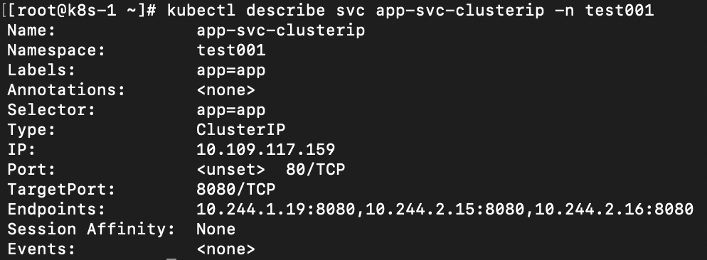
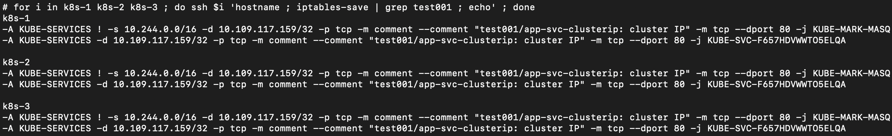
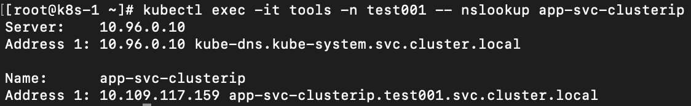
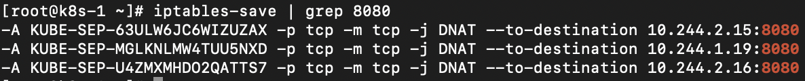
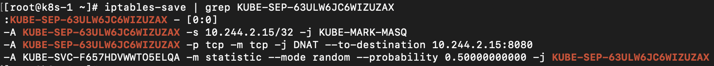
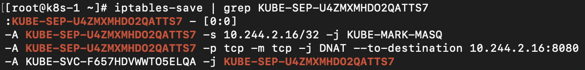
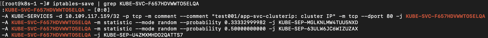
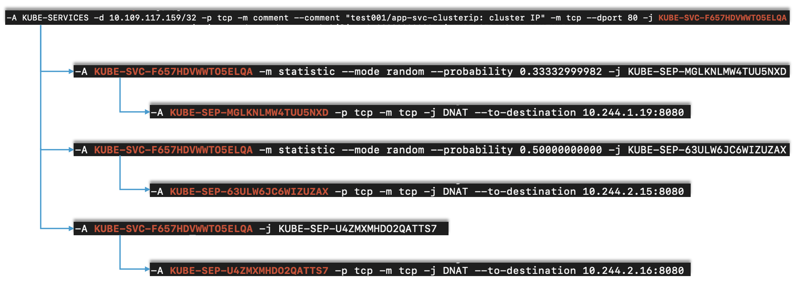
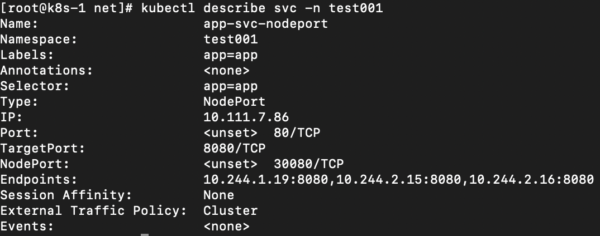
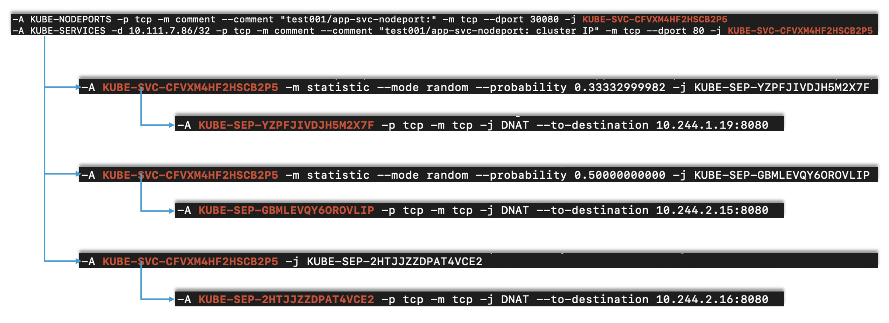

= 网络
:toc: manual

== Pod and Node Networking

[source, bash]
----
// 1. deploy pod
kubectl run nginx --image=nginx --port=80 --generator=run-pod/v1

// 2. view pod ip
# kubectl get pod nginx -o wide --no-headers | awk '{print $1, $6, $7}'
nginx 192.168.208.240 machine03.example.com

// 3. login into machine03
ssh machine03

// 4. calic interface
# ip addr show calic440f455693 
14: calic440f455693@if4: <BROADCAST,MULTICAST,UP,LOWER_UP> mtu 1440 qdisc noqueue state UP group default 
    link/ether ee:ee:ee:ee:ee:ee brd ff:ff:ff:ff:ff:ff link-netnsid 0
    inet6 fe80::ecee:eeff:feee:eeee/64 scope link 
       valid_lft forever preferred_lft forever

// 5. check container id
# docker ps | grep nginx
6548b19ca8eb        nginx                  "nginx -g 'daemon of…"   13 minutes ago      Up 13 minutes                           k8s_nginx_nginx_default_5ee00c88-d1b8-45cf-b347-2ef7172be356_0

// 6. Get the process ID 
# docker inspect 6548b19ca8eb | grep Pid
            "Pid": 121154,

// 7. check namespace ip addr
# nsenter -t 121154 -n ip a
1: lo: <LOOPBACK,UP,LOWER_UP> mtu 65536 qdisc noqueue state UNKNOWN group default qlen 1000
    link/loopback 00:00:00:00:00:00 brd 00:00:00:00:00:00
    inet 127.0.0.1/8 scope host lo
       valid_lft forever preferred_lft forever
2: tunl0@NONE: <NOARP> mtu 1480 qdisc noop state DOWN group default qlen 1000
    link/ipip 0.0.0.0 brd 0.0.0.0
4: eth0@if14: <BROADCAST,MULTICAST,UP,LOWER_UP> mtu 1440 qdisc noqueue state UP group default 
    link/ether 72:b0:fb:70:63:30 brd ff:ff:ff:ff:ff:ff link-netnsid 0
    inet 192.168.208.240/32 scope global eth0
       valid_lft forever preferred_lft forever
----

== Container Network Interface (CNI)

CNI 是不同物理节点之间通信的接口。

== 服务发现和负载均衡调试

K8S 的 Service 对象主要的工作是服务发现和负载均衡，常见的 Service 类型包括 ClusterIP 和 Nodeport，与 Service 工作相关的 K8S 组件包括 `kubelet`, `kube-apiserver`, `kube-proxy`，本部分说明这些组件及不同 Service 类型的工作过程。

=== 不同类型 Service 示例

[source, bash]
.*ClusterIP*
----
// 1. create pod
kubectl run front-end --image=nginx --port=80 --generator=run-pod/v1

// 2. create svc
kubectl expose pod front-end --type='ClusterIP' --port=80 --target-port=80 --name=front-end-service

// 3. test
kubectl exec -it pod/front-end sh
# cd /usr/share/nginx/html/
# echo "HELLO" > hello
# exit

kubectl run curl --image=radial/busyboxplus:curl --generator=run-pod/v1 --command -- sh -c "sleep 3600"

# kubectl exec curl curl http://front-end-service/hello
HELLO
----

[source, bash]
.*NodePort*
----
// 1. create pod
kubectl run front-end --image=nginx --port=80 --generator=run-pod/v1

// 2. create svc
kubectl expose pod front-end --type='NodePort' --port=80 --target-port=80 --name=front-end-service

# kubectl get svc front-end-service --no-headers | awk '{print $5}'
80:30520/TCP

// 3. test
kubectl exec -it pod/front-end sh
# cd /usr/share/nginx/html/
# echo "HELLO" > hello
# exit

$ curl http://192.168.100.101:30520/hello
HELLO
----

=== YAML 下载

|===
|ID | FILE

|1
|link:files/deploy.yaml[deploy.yaml]

|2
|link:files/clusterip.yaml[clusterip.yaml]

|3
|link:files/nodeport.yaml[nodeport.yaml]

|4
|link:files/nslookup.yaml[nslookup.yaml]

|5
|link:files/curl.yaml[curl.yaml]

|===

=== 服务注册

创建一个服务时会进行服务注册，服务注册过程，首先 kubelet 调运 API 将服务注册于 API Server, 对应 DNS 组件会添加一条记录，kube-proxy 会写对应的 iptables 规则。

[source, yaml]
.*1. 创建 Service*
----
kubectl create -f deploy.yaml
kubectl create -f clusterip.yaml
----

[source, yaml]
.*2. 查看 Service*
----
kubectl describe svc app-svc-clusterip -n test001
----

[source, text]
.*3. 查看所有节点上 iptables 规则*
----
# for i in k8s-1 k8s-2 k8s-3 ; do ssh $i 'hostname ; iptables-save | grep test001 ; echo' ; done
k8s-1
-A KUBE-SERVICES ! -s 10.244.0.0/16 -d 10.109.117.159/32 -p tcp -m comment --comment "test001/app-svc-clusterip: cluster IP" -m tcp --dport 80 -j KUBE-MARK-MASQ
-A KUBE-SERVICES -d 10.109.117.159/32 -p tcp -m comment --comment "test001/app-svc-clusterip: cluster IP" -m tcp --dport 80 -j KUBE-SVC-F657HDVWWTO5ELQA

k8s-2
-A KUBE-SERVICES ! -s 10.244.0.0/16 -d 10.109.117.159/32 -p tcp -m comment --comment "test001/app-svc-clusterip: cluster IP" -m tcp --dport 80 -j KUBE-MARK-MASQ
-A KUBE-SERVICES -d 10.109.117.159/32 -p tcp -m comment --comment "test001/app-svc-clusterip: cluster IP" -m tcp --dport 80 -j KUBE-SVC-F657HDVWWTO5ELQA

k8s-3
-A KUBE-SERVICES ! -s 10.244.0.0/16 -d 10.109.117.159/32 -p tcp -m comment --comment "test001/app-svc-clusterip: cluster IP" -m tcp --dport 80 -j KUBE-MARK-MASQ
-A KUBE-SERVICES -d 10.109.117.159/32 -p tcp -m comment --comment "test001/app-svc-clusterip: cluster IP" -m tcp --dport 80 -j KUBE-SVC-F657HDVWWTO5ELQA
----

[source, text]
.*4. 查看 DNS 记录*
----
# kubectl create -f nslookup.yaml
# kubectl exec -it tools -n test001 -- nslookup app-svc-clusterip
Server:    10.96.0.10
Address 1: 10.96.0.10 kube-dns.kube-system.svc.cluster.local

Name:      app-svc-clusterip
Address 1: 10.109.117.159 app-svc-clusterip.test001.svc.cluster.local
----

=== ClusterIP 类型服务 iptables 规则转发链

当 API Server 接收到服务注册时，kube-proxy 会写对应的 iptables 规则，规则如下：

[source, bash]
.*1. 查看目的地为 8080 的规则*
----
iptables-save | grep 8080
-A KUBE-SEP-63ULW6JC6WIZUZAX -p tcp -m tcp -j DNAT --to-destination 10.244.2.15:8080
-A KUBE-SEP-MGLKNLMW4TUU5NXD -p tcp -m tcp -j DNAT --to-destination 10.244.1.19:8080
-A KUBE-SEP-U4ZMXMHDO2QATTS7 -p tcp -m tcp -j DNAT --to-destination 10.244.2.16:8080
----

如上规则通过 8080 端口过滤，公有三条，且目的地址分别为: `10.244.2.15:8080`, `10.244.1.19:8080`, `10.244.2.16:8080`，这与 app-svc-clusterip 服务关联的 POD 总数一致，例如查看 POD 有如下输出：

[source, bash]
----
kubectl get pods -o wide -n test001 --no-headers
app-58866f5c7-2lj7z   1/1   Running   0     106m   10.244.2.15   k8s-3   <none>   <none>
app-58866f5c7-2nxgh   1/1   Running   0     106m   10.244.2.16   k8s-3   <none>   <none>
app-58866f5c7-5mhrm   1/1   Running   0     106m   10.244.1.19   k8s-2   <none>   <none>
----

[source, bash]
.*2. 查看上一跳规则*
----
iptables-save | grep KUBE-SEP-63ULW6JC6WIZUZAX
:KUBE-SEP-63ULW6JC6WIZUZAX - [0:0]
-A KUBE-SEP-63ULW6JC6WIZUZAX -s 10.244.2.15/32 -j KUBE-MARK-MASQ
-A KUBE-SEP-63ULW6JC6WIZUZAX -p tcp -m tcp -j DNAT --to-destination 10.244.2.15:8080
-A KUBE-SVC-F657HDVWWTO5ELQA -m statistic --mode random --probability 0.50000000000 -j KUBE-SEP-63ULW6JC6WIZUZAX

iptables-save | grep KUBE-SEP-MGLKNLMW4TUU5NXD
:KUBE-SEP-MGLKNLMW4TUU5NXD - [0:0]
-A KUBE-SEP-MGLKNLMW4TUU5NXD -s 10.244.1.19/32 -j KUBE-MARK-MASQ
-A KUBE-SEP-MGLKNLMW4TUU5NXD -p tcp -m tcp -j DNAT --to-destination 10.244.1.19:8080
-A KUBE-SVC-F657HDVWWTO5ELQA -m statistic --mode random --probability 0.33332999982 -j KUBE-SEP-MGLKNLMW4TUU5NXD

iptables-save | grep KUBE-SEP-U4ZMXMHDO2QATTS7
:KUBE-SEP-U4ZMXMHDO2QATTS7 - [0:0]
-A KUBE-SEP-U4ZMXMHDO2QATTS7 -s 10.244.2.16/32 -j KUBE-MARK-MASQ
-A KUBE-SEP-U4ZMXMHDO2QATTS7 -p tcp -m tcp -j DNAT --to-destination 10.244.2.16:8080
-A KUBE-SVC-F657HDVWWTO5ELQA -j KUBE-SEP-U4ZMXMHDO2QATTS7
----

[source, bash]
.*3. 查看上一跳规则*
----
iptables-save | grep KUBE-SVC-F657HDVWWTO5ELQA
:KUBE-SVC-F657HDVWWTO5ELQA - [0:0]
-A KUBE-SERVICES -d 10.109.117.159/32 -p tcp -m comment --comment "test001/app-svc-clusterip: cluster IP" -m tcp --dport 80 -j KUBE-SVC-F657HDVWWTO5ELQA
-A KUBE-SVC-F657HDVWWTO5ELQA -m statistic --mode random --probability 0.33332999982 -j KUBE-SEP-MGLKNLMW4TUU5NXD
-A KUBE-SVC-F657HDVWWTO5ELQA -m statistic --mode random --probability 0.50000000000 -j KUBE-SEP-63ULW6JC6WIZUZAX
-A KUBE-SVC-F657HDVWWTO5ELQA -j KUBE-SEP-U4ZMXMHDO2QATTS7
----

`-A KUBE-SERVICES -d 10.109.117.159/32 -p tcp -m comment --comment "test001/app-svc-clusterip: cluster IP" -m tcp --dport 80 -j KUBE-SVC-F657HDVWWTO5ELQA` 是一条目的地匹配的规则，下一条的规则为 KUBE-SVC-F657HDVWWTO5ELQA，有三个 KUBE-SVC-F657HDVWWTO5ELQA 规则，并且通过随机的方式跳转。

NOTE: Service 负载均衡实现是通过 iptables 实现的。一个 ClusterIP 类型的服务会产生 15 条 iptables 规则。

[source, bash]
.*4. 一个 ClusterIP 类型服务对应的规则*
----
:KUBE-SEP-63ULW6JC6WIZUZAX - [0:0]
:KUBE-SEP-MGLKNLMW4TUU5NXD - [0:0]
:KUBE-SEP-U4ZMXMHDO2QATTS7 - [0:0]
:KUBE-SVC-F657HDVWWTO5ELQA - [0:0]
-A KUBE-SEP-63ULW6JC6WIZUZAX -s 10.244.2.15/32 -j KUBE-MARK-MASQ
-A KUBE-SEP-63ULW6JC6WIZUZAX -p tcp -m tcp -j DNAT --to-destination 10.244.2.15:8080
-A KUBE-SEP-MGLKNLMW4TUU5NXD -s 10.244.1.19/32 -j KUBE-MARK-MASQ
-A KUBE-SEP-MGLKNLMW4TUU5NXD -p tcp -m tcp -j DNAT --to-destination 10.244.1.19:8080
-A KUBE-SEP-U4ZMXMHDO2QATTS7 -s 10.244.2.16/32 -j KUBE-MARK-MASQ
-A KUBE-SEP-U4ZMXMHDO2QATTS7 -p tcp -m tcp -j DNAT --to-destination 10.244.2.16:8080
-A KUBE-SERVICES ! -s 10.244.0.0/16 -d 10.109.117.159/32 -p tcp -m comment --comment "test001/app-svc-clusterip: cluster IP" -m tcp --dport 80 -j KUBE-MARK-MASQ
-A KUBE-SERVICES -d 10.109.117.159/32 -p tcp -m comment --comment "test001/app-svc-clusterip: cluster IP" -m tcp --dport 80 -j KUBE-SVC-F657HDVWWTO5ELQA
-A KUBE-SVC-F657HDVWWTO5ELQA -m statistic --mode random --probability 0.33332999982 -j KUBE-SEP-MGLKNLMW4TUU5NXD
-A KUBE-SVC-F657HDVWWTO5ELQA -m statistic --mode random --probability 0.50000000000 -j KUBE-SEP-63ULW6JC6WIZUZAX
-A KUBE-SVC-F657HDVWWTO5ELQA -j KUBE-SEP-U4ZMXMHDO2QATTS7
----

ClusterIP 类型服务 iptables 规则转发链如下：

=== NodePort 类型服务 iptables 规则转发链

[source, bash]
.*1. 创建 NodePort 类型服务*
----
kubectl create -f nodeport.yaml 
kubectl create -f nodeport.yaml
----

[source, text]
.*2. 查看 8080 端口规则*
----
iptables-save | grep 8080
-A KUBE-SEP-2HTJJZZDPAT4VCE2 -p tcp -m tcp -j DNAT --to-destination 10.244.2.16:8080
-A KUBE-SEP-GBMLEVQY6OROVLIP -p tcp -m tcp -j DNAT --to-destination 10.244.2.15:8080
-A KUBE-SEP-YZPFJIVDJH5M2X7F -p tcp -m tcp -j DNAT --to-destination 10.244.1.19:8080
----

[source, text]
.*3. 查看上一跳规则*
----
iptables-save | grep KUBE-SEP-2HTJJZZDPAT4VCE2
:KUBE-SEP-2HTJJZZDPAT4VCE2 - [0:0]
-A KUBE-SEP-2HTJJZZDPAT4VCE2 -s 10.244.2.16/32 -j KUBE-MARK-MASQ
-A KUBE-SEP-2HTJJZZDPAT4VCE2 -p tcp -m tcp -j DNAT --to-destination 10.244.2.16:8080
-A KUBE-SVC-CFVXM4HF2HSCB2P5 -j KUBE-SEP-2HTJJZZDPAT4VCE2

iptables-save | grep KUBE-SEP-GBMLEVQY6OROVLIP
:KUBE-SEP-GBMLEVQY6OROVLIP - [0:0]
-A KUBE-SEP-GBMLEVQY6OROVLIP -s 10.244.2.15/32 -j KUBE-MARK-MASQ
-A KUBE-SEP-GBMLEVQY6OROVLIP -p tcp -m tcp -j DNAT --to-destination 10.244.2.15:8080
-A KUBE-SVC-CFVXM4HF2HSCB2P5 -m statistic --mode random --probability 0.50000000000 -j KUBE-SEP-GBMLEVQY6OROVLIP

iptables-save | grep KUBE-SEP-YZPFJIVDJH5M2X7F
:KUBE-SEP-YZPFJIVDJH5M2X7F - [0:0]
-A KUBE-SEP-YZPFJIVDJH5M2X7F -s 10.244.1.19/32 -j KUBE-MARK-MASQ
-A KUBE-SEP-YZPFJIVDJH5M2X7F -p tcp -m tcp -j DNAT --to-destination 10.244.1.19:8080
-A KUBE-SVC-CFVXM4HF2HSCB2P5 -m statistic --mode random --probability 0.33332999982 -j KUBE-SEP-YZPFJIVDJH5M2X7F
----

[source, text]
.*4. 查看上一条规则*
----
iptables-save | grep KUBE-SVC-CFVXM4HF2HSCB2P5
:KUBE-SVC-CFVXM4HF2HSCB2P5 - [0:0]
-A KUBE-NODEPORTS -p tcp -m comment --comment "test001/app-svc-nodeport:" -m tcp --dport 30080 -j KUBE-SVC-CFVXM4HF2HSCB2P5
-A KUBE-SERVICES -d 10.111.7.86/32 -p tcp -m comment --comment "test001/app-svc-nodeport: cluster IP" -m tcp --dport 80 -j KUBE-SVC-CFVXM4HF2HSCB2P5
-A KUBE-SVC-CFVXM4HF2HSCB2P5 -m statistic --mode random --probability 0.33332999982 -j KUBE-SEP-YZPFJIVDJH5M2X7F
-A KUBE-SVC-CFVXM4HF2HSCB2P5 -m statistic --mode random --probability 0.50000000000 -j KUBE-SEP-GBMLEVQY6OROVLIP
-A KUBE-SVC-CFVXM4HF2HSCB2P5 -j KUBE-SEP-2HTJJZZDPAT4VCE2
----

`-A KUBE-NODEPORTS -p tcp -m comment --comment "test001/app-svc-nodeport:" -m tcp --dport 30080 -j KUBE-SVC-CFVXM4HF2HSCB2P5` 和 `-A KUBE-SERVICES -d 10.111.7.86/32 -p tcp -m comment --comment "test001/app-svc-nodeport: cluster IP" -m tcp --dport 80 -j KUBE-SVC-CFVXM4HF2HSCB2P5` 的下一跳都是 *KUBE-SVC-CFVXM4HF2HSCB2P5*，而 *KUBE-SVC-CFVXM4HF2HSCB2P5* 的下一条有三条规则，分别指向三个 POD。

[source, bash]
.*5. 一个 NodePort 类型服务对应的规则*
----
:KUBE-SEP-2HTJJZZDPAT4VCE2 - [0:0]
:KUBE-SEP-GBMLEVQY6OROVLIP - [0:0]
:KUBE-SEP-YZPFJIVDJH5M2X7F - [0:0]
:KUBE-SVC-CFVXM4HF2HSCB2P5 - [0:0]
-A KUBE-NODEPORTS -p tcp -m comment --comment "test001/app-svc-nodeport:" -m tcp --dport 30080 -j KUBE-MARK-MASQ
-A KUBE-NODEPORTS -p tcp -m comment --comment "test001/app-svc-nodeport:" -m tcp --dport 30080 -j KUBE-SVC-CFVXM4HF2HSCB2P5
-A KUBE-SEP-2HTJJZZDPAT4VCE2 -s 10.244.2.16/32 -j KUBE-MARK-MASQ
-A KUBE-SEP-2HTJJZZDPAT4VCE2 -p tcp -m tcp -j DNAT --to-destination 10.244.2.16:8080
-A KUBE-SEP-GBMLEVQY6OROVLIP -s 10.244.2.15/32 -j KUBE-MARK-MASQ
-A KUBE-SEP-GBMLEVQY6OROVLIP -p tcp -m tcp -j DNAT --to-destination 10.244.2.15:8080
-A KUBE-SEP-YZPFJIVDJH5M2X7F -s 10.244.1.19/32 -j KUBE-MARK-MASQ
-A KUBE-SEP-YZPFJIVDJH5M2X7F -p tcp -m tcp -j DNAT --to-destination 10.244.1.19:8080
-A KUBE-SERVICES ! -s 10.244.0.0/16 -d 10.96.0.1/32 -p tcp -m comment --comment "default/kubernetes:https cluster IP" -m tcp --dport 443 -j KUBE-MARK-MASQ
-A KUBE-SERVICES -d 10.96.0.1/32 -p tcp -m comment --comment "default/kubernetes:https cluster IP" -m tcp --dport 443 -j KUBE-SVC-NPX46M4PTMTKRN6Y
-A KUBE-SERVICES ! -s 10.244.0.0/16 -d 10.111.7.86/32 -p tcp -m comment --comment "test001/app-svc-nodeport: cluster IP" -m tcp --dport 80 -j KUBE-MARK-MASQ
-A KUBE-SERVICES -d 10.111.7.86/32 -p tcp -m comment --comment "test001/app-svc-nodeport: cluster IP" -m tcp --dport 80 -j KUBE-SVC-CFVXM4HF2HSCB2P5
-A KUBE-SVC-CFVXM4HF2HSCB2P5 -m statistic --mode random --probability 0.33332999982 -j KUBE-SEP-YZPFJIVDJH5M2X7F
-A KUBE-SVC-CFVXM4HF2HSCB2P5 -m statistic --mode random --probability 0.50000000000 -j KUBE-SEP-GBMLEVQY6OROVLIP
-A KUBE-SVC-CFVXM4HF2HSCB2P5 -j KUBE-SEP-2HTJJZZDPAT4VCE2
----

NodePort 类型服务 iptables 规则转发链:

从转发链可以得出如下结论

* NodePort 类型服务也支持 ClusterIP 类型，创建了一条 ClusterIP 规则供内部调用使用
* NodePort 外部入口是 TCP 端口号

== Network Policies

在同一个 namespace 下，kubernetes 默认是扁平的网络，所有 POD 之间可以互通，但通常生产中需要更细粒度的定义 POD 之间的网络，NetworkPolicy 结合 labels 定义 POD 之间网络通信方式。

== DNS

=== Service/Pod DNS

[source, bash]
.*Deploy 2 services in 2 namespaces, and DNS query with busybox*
----
// 1. deploy pod
kubectl create deployment nginx --image=nginx

kubectl create ns test01
kubectl create deployment nginx --image=nginx -n test01

// 2. expose service
kubectl expose deployment nginx --port=80 --name=nginx
kubectl expose deployment nginx --port=80 --name=nginx -n test01

// 3. deploy busybox
kubectl run busybox --image=busybox:1.28 --generator=run-pod/v1 --command -- sh -c "sleep 3600"

// 4. SVC DNS loopup
kubectl exec busybox -- nslookup nginx
Server:    10.96.0.10
Address 1: 10.96.0.10 kube-dns.kube-system.svc.cluster.local

Name:      nginx
Address 1: 10.100.4.22 nginx.default.svc.cluster.local

kubectl exec busybox -- nslookup nginx.test01
Server:    10.96.0.10
Address 1: 10.96.0.10 kube-dns.kube-system.svc.cluster.local

Name:      nginx.test01
Address 1: 10.111.85.96 nginx.test01.svc.cluster.local

// 5. Pod DNS loopup
kubectl exec busybox -- nslookup 10-244-2-102.nginx
Server:    10.96.0.10
Address 1: 10.96.0.10 kube-dns.kube-system.svc.cluster.local

Name:      10-244-2-102.nginx
Address 1: 10.244.2.102 10-244-2-102.nginx.default.svc.cluster.local

kubectl exec busybox -- nslookup 10-244-1-106.nginx.test01
Server:    10.96.0.10
Address 1: 10.96.0.10 kube-dns.kube-system.svc.cluster.local

Name:      10-244-1-106.nginx.test01
Address 1: 10.244.1.106 10-244-1-106.nginx.test01.svc.cluster.local
----

== TD

[source, bash]
.**
----

----

[source, bash]
.**
----

----

[source, bash]
.**
----

----

[source, bash]
.**
----

----

[source, bash]
.**
----

----

[source, bash]
.**
----

----

[source, bash]
.**
----

----

[source, bash]
.**
----

----

[source, bash]
.**
----

----

[source, bash]
.**
----

----

[source, bash]
.**
----

----

[source, bash]
.**
----

----

[source, bash]
.**
----

----

