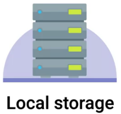
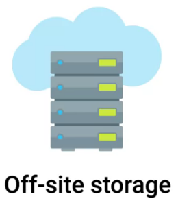

= IT Infrastructure
:toc: manual

== 术语表

.*术语表*
|===
|术语 |全称 |中文 |说明

|MBR
|Master Boot Record
|主引导记录
|最大支持 4 个主分区；在 Linux 上可以通过扩展和逻辑分区达到最大 15 个分区；一个分区的最大容量是 2T。

|GPT
|GUID Partition Table
|GUID 磁盘分割表
|GPT 补充 MBR 分区的不足，基于 UEFI 标准；默认支持 128 个分区；能满足现有所有企业需求。

|UEFI
|Unified Extensible Firmware Interface
|统一可扩展固件接口
|一种电脑系统规格标准，用来定义操作系统和系统固件之间的接口。

|NFS
|Network File System
|网络文件系统
|一种网络文件系统

|SMB
|Server Message Block
|消息区块服务器
|向 Microsoft Windows 共享文件的一个标准，有称做 <<CIFS, CIFS>>，例如 Linux 服务器中 Samba 实现了 SMB 标准用来共享文件供 Windows 服务器/客户机/打印机等使用。

|CIFS
|Common Internet File System
|标准网络文件系统
|<<SMB, SMB>> 别名

|iSCSI
|Internet Small Computer Systems Interface
|互联网小型计算机系统接口
|一种在TCP/IP上进行数据块传输的标准。https://tools.ietf.org/html/rfc3720[RFC3720], https://tools.ietf.org/html/rfc7145[RFC7145], https://en.wikipedia.org/wiki/ISCSI[iSCSI] 

|SCSI
|Small Computer System Interface
|小型计算机系统接口
|SISI是定义计算机及其周边设备（硬盘、软驱、光驱、打印机、扫描仪等）之间进行物理连接和数据传输的一组标准

|SAN
|Storage Area Network
|存储区域网络
|一种计算机网络用来接入统一的，块级别存储，例如 FibreChannel, iSCSI, AoE

|NAS
|Network Attached Storage
|网络链接存储设备
|用于数据存储的技术名称, 例如 NFS, SMB, AFS

|NIC
|Network Interface Controller
|又称网络接口控制器，网络适配器（network adapter），网卡（network interface card），或区域网络接收器（LAN adapter），是一块被设计用来允许计算机在计算机网络上进行通讯的计算机硬件

|===

== 设备(Devices)和驱动(Drivers)

Linux 中一切都可以认为是一个文件，包括设备和驱动，`/dev`目录下是所有设备文件。

有两种类型的设备:

* *Character devices* - like a keyboard or mouse, transmit data character by character.
* *Block devices* - like USB drives, hard drives, and CD-ROMs transfer blocks of data. A data block is just a unit of data storage.

[source, bash]
.*查看块设备*
----
$ ls -l /dev/ | grep brw
brw-rw----. 1 root disk      253,     0 Aug 28 09:25 dm-0
brw-rw----. 1 root disk      253,     1 Aug 28 09:25 dm-1
brw-rw----. 1 root disk      253,     2 Aug 28 09:25 dm-2
brw-rw----. 1 root disk      259,     0 Aug 28 09:25 nvme0n1
brw-rw----. 1 root disk      259,     1 Aug 28 09:25 nvme0n1p1
brw-rw----. 1 root disk      259,     2 Aug 28 09:25 nvme0n1p2
brw-rw----. 1 root disk      259,     3 Aug 28 09:25 nvme0n1p3
brw-rw----. 1 root disk        8,     0 Aug 28 20:32 sda
brw-rw----. 1 root disk        8,    16 Aug 28 21:51 sdb
brw-rw----. 1 root disk        8,    17 Aug 28 21:51 sdb1
----

https://en.wikipedia.org/wiki/Device_file[Linux Device file]

https://en.wikipedia.org/wiki/Udev[udev]

== 数据恢复 & 备份

=== 什么是数据恢复

Data recovery is the process of trying to restore data after an unexpected event that results in data loss or corruption. 

数据恢复是当不可遇知的事件导致数据丢失或破坏后，恢复数据的办法或流程。

NOTE: Data recovery software, which can analyze failed hard disks or flash drives and try to locate and extract data files.

*Data backup*: The best way to be prepared for a data-loss event is to have a well-thought out disaster plan and procedure in place. Disaster plans should involve making regular backups of any and all critical data that's necessary for your ongoing business processes. This includes things like customer data, system databases, system configs and financial data. 

A *post-mortem* is a way for you to document any problems you discovered along the way, and most importantly, the ways you fixed them so you can make sure they don't happen again. 

NOTE: https://about.gitlab.com/2017/02/01/gitlab-dot-com-database-incident[Gitlab 数据恢复]

.*本地和远程备份*
[cols="2,5a,5a"]
|===
|地点 |描述 |说明

|Onsite Backup(本地备份)
|

|
* 优点
** Data is physically nearby
** Low bandwidth needs
* 缺点
** Data loss due to damage at location

|Offsite Backup(远程备份)
|

|
* 优点
** Data is safer in multiple locations
* 缺点
** Needs security and encryption
** Needs large amounts of bandwidth
|===

.*数据备份工具*
|===
|名称 |说明 |链接

|Rsync
|very commonly used， It's a file transfer utility that's designed to efficiently transfer and synchronize files between locations or computers.
|https://wiki.archlinux.org/index.php/rsync#As_a_backup_utility[Rsync as a backup utility]

|Backup and Restore
|a file based version where files are backed up to a zip archive, entire disk saved block by block to a file. 
|https://support.microsoft.com/en-us/help/17127/windows-back-up-restore[Microsoft Backup and Restore]

|Time Machine
|supports restoring an entire system from backup or individual files
|https://support.apple.com/en-us/HT201250[Apple Time Machine]

|===

=== DR 计划

A *disaster recovery plan* is a collection of documented procedures and plans on how to react and handle an emergency or disaster scenario, from the operational perspective.

.*DR 计划两种路径*
[cols="5a,5a,5a"]
|===
|Preventive measures |Detection measures |Corrective or recovery measures

|Preventative measures cover any procedures or systems in place that will proactively minimize the impact of a disaster. This includes:

* regular backups
* redundant systems

|Meant to alert you and your team that a disaster has occurred that can impact operations. 

|Those enacted after disaster has occurred
|===

*设计一个 DR 计划*

* [*] *Perform Risk Assessment* - A risk assessment allows you to prioritize certain aspects of the organizations that are more at risk if there's an unforeseen event.
* [*] *Determine Backup and Recovery Systems*
* [*] *Determine Detection & Alert Measures & Test Systems* - Detect and alert you to service outages or abnormal environmental conditions
* [*] *Determine Recovery Measures* - Corrective or recovery measures include actions that are taken to restore normal operations and to recover from an incident or outage.

=== 灾难纪录

We create a post-mortem after an incident, an outage, or some event when something goes wrong, or at the end of a project to analyze how it went.

*灾难纪录包括内容：*

* [x] What the incident was?
* [x] How long it lasted?
* [x] What the impact was? 
* [x] How it was fixed?

== 有用链接

* https://access.redhat.com/documentation/en-us/red_hat_enterprise_linux/7/[Red Hat Enterprise Linux 7]

link:files/rh200.txt[.] link:files/rh300.txt[.]
