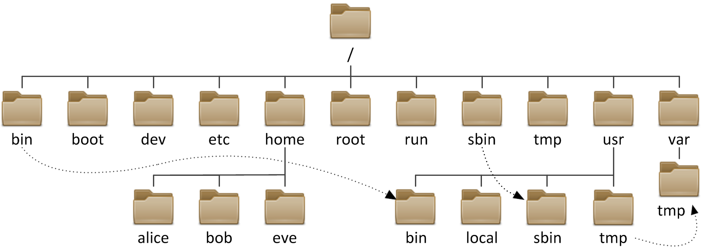
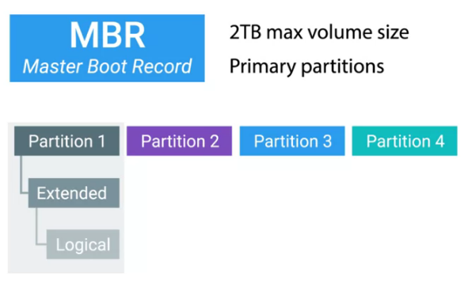

= 文件系统
:toc: manual

== 基本概念

=== 文件操作命令

[cols="2a,2"]
|===
|命令 |说明

|`cp file1 file2`
`cp file1 file2 file3 dir`
|拷贝文件

|`mv file1 file2`
`mv file1 file2 file3 dir`
|移动文件

|`rm file1`
`rm -f file1 file2 file3`
|删除文件

|`mkdir dir`
`mkdir -p par1/par2/dir`
|创建文件夹

|`cp -r dir1 dir2`
`cp -r dir1 dir2 dir3 dir4`
|拷贝文件夹

|`mv dir1 dir2`
`mv dir1 dir2 dir3 dir4`
|移动文件夹

|`rm -r dir1`
`rm -rf dir1 dir2 dir3`
|删除文件夹

|`rmdir dir`
|删除空文件夹

|`ln file linkfile`
|创建 hard link

|`ln -s file linkfile`
|创建 soft link
|===

=== 文件系统结构

=== 文件系统类型

|===
|类型 |说明

|NTFS
|Windows 默认文件系统， NTFS 格式 U 盘可以在 Windows 和 Linux 下通用

|ext4
|Linux 常见文件系统

|xfs
|Linux 常见文件系统类型，红帽企业 Linux 的安装程序 anaconda 中默认使用 xfs。

|FAT32
|支持 Windows, Linux, Mac, 单个文件最大 4 G，文件系统最大 32 G。link:https://support.microsoft.com/en-us/help/154997/description-of-the-fat32-file-system[fat32]

|===

=== 磁盘分区

磁盘分区可以将硬盘驱动器划分为多个逻辑存储单元，这些单元称为分区。通过将磁盘划分为多个分区，系统管理员可以使用不同的分区执行不同功能。以下是磁盘分区作为必要或有益步骤的一些情况示例：

* 限制应用或用户的可用空间。
* 允许从同一磁盘进行不同操作系统的多重启动。
* 将操作系统和程序文件与用户文件分隔开。
* 创建用于操作系统虚拟内存交换的单独区域。
* 限制磁盘空间使用情况，以提高诊断工具和备份映像的性能。

常见的磁盘分区方案有两种：

* *MBR 分区方案* - 自 1982 年以来，主启动记录 (MBR) 分区方案指定了在运行 BIOS 固件的系统上应如何对磁盘进行分区。此方案支持最多四个主分区。在 Linux 系统上，管理员可以使用扩展分区和逻辑分区来创建最多 15 个分区。由于分区大小数据以 32 位值存储，使用 MBR 方案分区时，最大磁盘和分区大小限制为 2 TiB。

* *GPT 分区方案* - 对于运行统一可扩展固件接口 (UEFI) 固件的系统，GPT 是在物理硬盘上布置分区表的标准。GPT 是 UEFI 标准的一部分，可以解决原有基于 MBR 的方案所带来的许多限制。根据 UEFI 规范，GPT 默认情况下支持最多 128 个分区。MBR 使用 32 位来存储逻辑块地址和大小信息；与此不同，GPT 为逻辑块地址分配 64 位。这就使得 GPT 可支持最多 8 泽字节 (ZiB)，即 80 亿太字节的分区和磁盘。GPT 的 8 ZiB 限制是基于 512 字节的块大小。随着硬盘驱动器供应商转为使用 4,096 字节块，此限制将增加至 64 ZiB。除解决 MBR 分区方案的限制以外，GPT 还可提供一些其他功能特性和优势。正如其名，GPT 使用 128 位 GUID 来唯一识别每个磁盘和分区。与 MBR 存在单一故障点不同，GPT 提供分区表信息的冗余。主 GPT 位于磁盘头部，而备份副本（次要 GPT）位于磁盘尾部。此外，GPT 采用 CRC 校验和来检测 GPT 头和分区表中的错误与损坏。

[source, test]
.*通过磁盘分区工具查看分区列表*
----
# parted -l
# fdisk -l
----

=== 磁盘分区工具

[cols="2,5a"]
|===
|名称 |说明

|parted
|支持 MBR 和 GPT，有两种模式：

* 交互式(interactive)
* 命令行(command line)

interactive 模式示例

[source, bash]
----
$ sudo parted /dev/sdb
GNU Parted 3.1
Using /dev/sdb
Welcome to GNU Parted! Type 'help' to view a list of commands.
(parted)                    
----

|fdisk
|支持 MBR 分区方案，交互式分区示例：

[source, bash]
----
$ sudo fdisk /dev/sdb
Welcome to fdisk (util-linux 2.23.2).

Changes will remain in memory only, until you decide to write them.
Be careful before using the write command.

Command (m for help): 
----

|gdisk
|支持 GPT 分区方案，交互式分区示例：

[source, bash]
----
$ sudo gdisk /dev/sdb
GPT fdisk (gdisk) version 0.8.6

Partition table scan:
  MBR: MBR only
  BSD: not present
  APM: not present
  GPT: not present

***************************************************************
Found invalid GPT and valid MBR; converting MBR to GPT format.
THIS OPERATION IS POTENTIALLY DESTRUCTIVE! Exit by typing 'q' if
you don't want to convert your MBR partitions to GPT format!
***************************************************************

Warning! Secondary partition table overlaps the last partition by
33 blocks!
You will need to delete this partition or resize it in another utility.

Command (? for help):
----

|===

=== 文件系统创建/格式化块设备

创建块设备后，下一步是为其创建文件系统格式。文件系统将向块设备生成一种结构，这样就可以存储数据并从其中检索数据。

`mkfs` 命令可用于为块设备创建文件系统，或格式化块设备。

NOTE: 如果设备已挂载文件系统，`mkfs` 创建文件系统之前，首先需要卸载文件系统。

[source, bash]
.*示例1：磁盘格式化*
----
$ sudo mkfs -t xfs -f /dev/sdb
meta-data=/dev/sdb               isize=512    agcount=4, agsize=15360 blks
         =                       sectsz=512   attr=2, projid32bit=1
         =                       crc=1        finobt=0, sparse=0
data     =                       bsize=4096   blocks=61440, imaxpct=25
         =                       sunit=0      swidth=0 blks
naming   =version 2              bsize=4096   ascii-ci=0 ftype=1
log      =internal log           bsize=4096   blocks=855, version=2
         =                       sectsz=512   sunit=0 blks, lazy-count=1
realtime =none                   extsz=4096   blocks=0, rtextents=0
----

[source, bash]
.*示例2：分区格式化*
----
$ sudo mkfs -t xfs -f /dev/sdb1
meta-data=/dev/sdb1              isize=512    agcount=4, agsize=6400 blks
         =                       sectsz=512   attr=2, projid32bit=1
         =                       crc=1        finobt=0, sparse=0
data     =                       bsize=4096   blocks=25600, imaxpct=25
         =                       sunit=0      swidth=0 blks
naming   =version 2              bsize=4096   ascii-ci=0 ftype=1
log      =internal log           bsize=4096   blocks=855, version=2
         =                       sectsz=512   sunit=0 blks, lazy-count=1
realtime =none                   extsz=4096   blocks=0, rtextents=0

$ sudo mkfs -t ext4  /dev/sdb2
mke2fs 1.42.9 (28-Dec-2013)
Filesystem label=
OS type: Linux
Block size=1024 (log=0)
Fragment size=1024 (log=0)
Stride=0 blocks, Stripe width=0 blocks
25688 inodes, 102400 blocks
5120 blocks (5.00%) reserved for the super user
First data block=1
Maximum filesystem blocks=33685504
13 block groups
8192 blocks per group, 8192 fragments per group
1976 inodes per group
Superblock backups stored on blocks: 
	8193, 24577, 40961, 57345, 73729

Allocating group tables: done                            
Writing inode tables: done                            
Creating journal (4096 blocks): done
Writing superblocks and filesystem accounting information: done
----

=== 文件系统挂载

应用文件系统格式后，添加新文件系统的最后一步是将该文件系统连接到目录结构中。文件系统连接到目录层次结构中后，用户空间实用程序可以访问设备上的文件或在设备上写入文件。

`mount` 命令将设备手动连接到目录位置或挂载点，具体为指定设备和挂载点，以及可能需要的任何选项，从而自定义设备的行为。

[source, bash]
----
$ sudo mount /dev/sdb1 /mnt/path1
$ sudo mount /dev/sdb2 /mnt/path2

$ fallocate -l 50M a-file && sudo cp a-file /mnt/path1/ && sudo mv a-file /mnt/path2/

$ df -hT | grep sdb
/dev/sdb1             xfs        97M   56M   42M  58% /mnt/path1
/dev/sdb2             ext4      131M   52M   70M  43% /mnt/path2
----

通过将设备的列表添加到 /etc/fstab 文件中，管理员可以将设备配置为在系统启动时挂载到挂载点。

*/etc/fstab* 是以空格分隔的文件，每行具有六个字段。

----
UUID=7a20315d-ed8b-4e75-a5b6-24ff9e1f9838  /  xfs  defaults  1 1
----

* 第一个字段指定要使用的设备。此外，也可使用设备文件（例如 /dev/vdb1）指定设备。UUID 存储在文件系统超级块中，并在文件系统创建时创建。
* 第二个字段是设备应连接到目录层次结构中的挂载点。挂载点应已存在；如果不存在，可以使用 mkdir 创建挂载点。
* 第三个字段包含已应用于块设备的文件系统类型。
* 第四个字段是挂载时应该应用于设备以便自定义行为的选项列表。此字段是必需的，且有一组称为 defaults 的常用选项。其他选项记录在 mount man page 中。
* 第五个字段是转储标志，转储标志与 dump 命令配合使用，用于生成设备内容的备份。
* 第六个字段是fsck 顺序标志，fsck 顺序字段确定在文件系统未完全卸载的情况下，是否应在启动时运行 fsck。fsck 顺序的值指示当有多个文件系统需要检查时，应对这些文件系统运行 fsck 的顺序。

https://en.wikipedia.org/wiki/Fstab[fstab]

=== Swap 空间

Swap 空间也称交换空间，它是可与 Linux 内核内存管理子系统配合使用的磁盘区域，用于通过保存不活动的内存页来补充系统 RAM。系统 RAM 与 Swap 空间组合在一起称为虚拟内存。

当系统上的内存使用量超过定义的限制时，内核将梳理 RAM，寻找已分配给进程但空闲的内存页。内核将空闲的内存页写入到交换区，并且重新分配 RAM 页面以供其他进程使用。如果某个程序需要访问已写入到磁盘的页面，则内核会找到另一个空闲的内存页，将其写入到磁盘，然后从交换区重新调用所需的页面。

由于交换区位于磁盘上，所以与 RAM 相比交换非常慢。尽管交换空间用于扩充系统 RAM，但应仅可能将交换空间的使用保持在最低限度。

=== inode

In Linux, metadata and files are organized into a structure called an inode. The inodes be stored in an inode table and help users to manage the files on file system. The inode itself doesn't actually store file date or the file name, but it does store everything else about a file.

=== Disk Usage

The du or disk usage command shows us the disk usage of a specific directory. If you don't specify a directory, it'll default to your current one. The -h flag gives you the data measurements in human readable form. You should use the du command if you want to know how much data space is being used by files in a directory.
 
[source, bash]
----
$ du -h
----

The df command, or disk free, which used if you want to know how much free space you have on your machine is the df command, or disk free. This shows you the free space available on your entire machine. The -h flag gives you the data measurements in human readable form.
 
[source, bash]
----
$df -h
----
 
=== 文件系统检测

`fsck` 命令可以用来检测未挂载的文件系统。

[source, bash]
----
$ sudo fsck /dev/sdb1
----

https://en.wikipedia.org/wiki/Fsck[详细关于 fsck]

== 文件的 hard link 和 soft link

* Softlinks allow us to link to another file using a file name.
* Hardlinks don't point to a file. In Linux, they link to an inode which is stored in an inode table on the file system.
 
image:img/files-slink-hlink.png[]

.*Hard Link 和 Soft Link 的区别*
|===
|编号 |描述

|1
|当原始文件删除后 hard link 文件保存了原始文件的内容，而 soft link 不会。

|2
|soft link 可以指向一个文件夹，而 hard link 不可以。
|===

=== ulimit 控制 hard link 和 soft link 最大打开数

`/etc/security/limits.conf` 文件控制 hard link，soft link 以及最大打开文件数。

[source, text]
.*ulimit 查看 soft/hard link*
----
# ulimit
# ulimit -a
----

=== 在文件上创建 link 示例

[source, text]
.*1 - 创建一个文件*
----
# echo "Hello World" > newfile.txt
# ls -l newfile.txt
-rw-r--r--. 1 root root 12 Nov 26 17:18 newfile.txt
----

[source, text]
.*2 - ln 创建一个 hard link*
----
# ln newfile.txt /tmp/newfile-hlink.txt
# ls -l newfile.txt /tmp/newfile-hlink.txt
-rw-r--r--. 2 root root 12 Nov 26 17:18 newfile.txt
-rw-r--r--. 2 root root 12 Nov 26 17:18 /tmp/newfile-hlink.txt
----

[source, text]
.*3 - ln -s 创建一个 soft link*
----
# ln -s newfile.txt /tmp/newfile-slink.txt

# ls -il newfile /tmp/newfile-hlink.txt /tmp/newfile-slink.txt
  4693201 -rw-r--r--. 2 root root 0 Jul  9 11:39 newfile
  4693201 -rw-r--r--. 2 root root 0 Jul  9 11:39 /tmp/newfile-hlink.txt
134686970 lrwxrwxrwx. 1 root root 7 Jul  9 11:41 /tmp/newfile-slink.txt -> newfile
----

NOTE: 文件和其对应的 hard link 文件的 inode 是相同的。inode 是在磁盘格式化时创建。

[source, text]
.*4 - 编辑文件*
----
# echo "modify from hard link" >> /tmp/newfile-hlink.txt
# echo "nodify from soft link" >> /tmp/newfile-slink.txt

# cat newfile.txt && cat /tmp/newfile-hlink.txt && cat /tmp/newfile-slink.txt

# rm newfile.txt
# ls -l /tmp/newfile-hlink.txt /tmp/newfile-slink.txt
-rw-r--r--. 1 root root 34 Jul  9 11:17 /tmp/newfile-hlink.txt
lrwxrwxrwx. 1 root root 11 Jul  9 11:09 /tmp/newfile-slink.txt -> newfile.txt

# cat /tmp/newfile-hlink.txt && cat /tmp/newfile-slink.txt
----

[source, text]
.*5 - ln -s 创建一个 soft link 指向文件夹*
----
# ln -s /tmp /root/tempdir
# ls -l /root/
lrwxrwxrwx.  1 root  root          4 Feb 15 16:38 tempdir -> /tmp
# cd /root/tempdir/
# ls
----

== 挂载和卸载文件系统

=== 挂载和卸载文件系统的一般步骤：

[source, text]
.*1 - 查看存在的分区及文件系统 UUID*
----
# blkid 
/dev/vda1: UUID="9bf6b9f7-92ad-441b-848e-0257cbb883d1" TYPE="xfs"
----

[source, text]
.*2 - mount*
----
# mkdir /mnt/mydata
# mount /dev/vda1 /mnt/mydata
# cd /mnt/mydata
----

NOTE: mount 也可以使用文件系统的 UUID，例如上述 mount 操作也可以通过命令`mount UUID="9bf6b9f7-92ad-441b-848e-0257cbb883d1" /mnt/mydata`

[source, text]
.*3 - 查看打开的文件*
----
# lsof /mnt/mydata
COMMAND  PID USER   FD   TYPE DEVICE SIZE/OFF NODE NAME
bash    4755 root  cwd    DIR  252,1     4096   64 /mnt/mydata
lsof    5097 root  cwd    DIR  252,1     4096   64 /mnt/mydata
lsof    5098 root  cwd    DIR  252,1     4096   64 /mnt/mydata
----

[source, text]
.*4 - umount*
----
# cd
# umount /mnt/mydata
----

=== 挂载和卸载文件系统示例

本部分练习在指定的挂载点识别和挂载新的文件系统，然后将它卸载。

[source, text]
.*1 - 执行如下命令创建一个分区*
----
echo "Checking device availability ..."
PDISK=$(df | grep '/$' | sed 's:/dev/\([a-z]*\).*:\1:')
SDISK=$(grep -v "${PDISK}" /proc/partitions | sed '1,2d; s/.* //' | grep "${PDISK:0:${#PDISK}-1}.$" | sort | head -n 1)
PDISKDEV=/dev/${PDISK}
SDISKDEV=/dev/${SDISK}

if [[ -z "${SDISKDEV}" ]]; then
  echo "No secondary disk device recognized."
  exit 15
fi
DEVICE=${SDISKDEV}
PART_DEV=${DEVICE}1

echo "Creating partition on $DEVICE ..."
parted -s ${DEVICE} mklabel msdos mkpart primary 2048s 1050623s &> /dev/null || srv_exit "parted failed: $?" 151
partprobe &> /dev/null || srv_exit "partprobe failed: $?" 151

echo "Creating XFS on PARTITION ..."
mkfs.xfs -f ${PART_DEV} &> /dev/null || srv_exit "mkfs failed: $?" 153

echo -e '\033[1;36mSUCCESS\033[0;39m'
----

[source, text]
.*2 - 使用 blkid 查看新增分区 vdb1 的 UUID*
----
# blkid
/dev/vda1: UUID="9bf6b9f7-92ad-441b-848e-0257cbb883d1" TYPE="xfs" 
/dev/vdb1: UUID="28fe8334-7808-4d53-a251-4e3605372dae" TYPE="xfs"
----

[source, text]
.*3 - 创建挂载点 /mnt/newspace*
----
# mkdir /mnt/newspace
----

[source, text]
.*4 - 根据 UUID 将文件系统挂载到 /mnt/newspace 目录*
----
# mount UUID="28fe8334-7808-4d53-a251-4e3605372dae" /mnt/newspace
----

[source, text]
.*5 - 在 /mnt/newspace 目录中，创建一个新目录 /mnt/newspace/newdir，以及一个空文件 /mnt/newspace/newdir/newfile*
----
# cd /mnt/newspace/ && mkdir newdir
# cd newdir/ &&  echo "test" >> newfile
----

[source, text]
.*6 - 卸载 /mnt/newspace 目录中挂载的文件系统*
----
# umount /mnt/newspace
----

== 访问移动存储设备

通常移动存储设备会自动 mount，通过 `df` 可以查看 mount 位置，通常路径为 `/run/media/<user>/<label>`。

[source, text]
.*查看移动存储设备 mount 点*
----
$ df -h
Filesystem             Size  Used Avail Use% Mounted on
/dev/sdb               240M  184M   56M  77% /run/media/kylin/DISK_IMG
/dev/sdc1               15G   16K   15G   1% /run/media/kylin/B453-8CAA
----

[source, text]
.*访问访问移动存储设备*
----
$ cd /run/media/kylin/B453-8CAA/
$ mkdir eap && cd eap
$ cp /run/media/kylin/DISK_IMG/jboss-eap-7.0.0.zip ./
----

== 添加分区、文件系统及持久化挂载

本部分目的是在一个新分配的磁盘上创建一个 MBR 分区，将该分区格式化为 ext4 文件系统，然后配置该文件系统以进行永久挂载。

[source, text]
.*1 - 查看所有磁盘*
----
# lsblk 
NAME   MAJ:MIN RM SIZE RO TYPE MOUNTPOINT
vda    253:0    0  10G  0 disk 
└─vda1 253:1    0  10G  0 part /
vdb    253:16   0  10G  0 disk
----

[source, text]
.*2 - 在第二块盘上创建一个 1 GB MBR 分区*
----
# fdisk /dev/vdb 
Welcome to fdisk (util-linux 2.23.2).

Changes will remain in memory only, until you decide to write them.
Be careful before using the write command.

Device does not contain a recognized partition table
Building a new DOS disklabel with disk identifier 0xcdad335a.

Command (m for help): p

Disk /dev/vdb: 10.7 GB, 10737418240 bytes, 20971520 sectors
Units = sectors of 1 * 512 = 512 bytes
Sector size (logical/physical): 512 bytes / 512 bytes
I/O size (minimum/optimal): 512 bytes / 512 bytes
Disk label type: dos
Disk identifier: 0xcdad335a

   Device Boot      Start         End      Blocks   Id  System

Command (m for help): n
Partition type:
   p   primary (0 primary, 0 extended, 4 free)
   e   extended
Select (default p): p
Partition number (1-4, default 1): 1
First sector (2048-20971519, default 2048): 
Using default value 2048
Last sector, +sectors or +size{K,M,G} (2048-20971519, default 20971519): +1G
Partition 1 of type Linux and of size 1 GiB is set

Command (m for help): w
The partition table has been altered!

Calling ioctl() to re-read partition table.
Syncing disks.
----

[source, text]
.*3 - 更新磁盘分区表*
----
# partprobe
----

[source, text]
.*4 - 查看所有磁盘及分区*
----
# lsblk 
NAME   MAJ:MIN RM SIZE RO TYPE MOUNTPOINT
vda    253:0    0  10G  0 disk 
└─vda1 253:1    0  10G  0 part /
vdb    253:16   0  10G  0 disk 
└─vdb1 253:17   0   1G  0 part 
----

[source, text]
.*5 - 格式化新创建的分区为 ext4 格式的文件系统*
----
# mkfs -t ext4 /dev/vdb1
mke2fs 1.42.9 (28-Dec-2013)
Filesystem label=
OS type: Linux
Block size=4096 (log=2)
Fragment size=4096 (log=2)
Stride=0 blocks, Stripe width=0 blocks
65536 inodes, 262144 blocks
13107 blocks (5.00%) reserved for the super user
First data block=0
Maximum filesystem blocks=268435456
8 block groups
32768 blocks per group, 32768 fragments per group
8192 inodes per group
Superblock backups stored on blocks: 
	32768, 98304, 163840, 229376

Allocating group tables: done                            
Writing inode tables: done                            
Creating journal (8192 blocks): done
Writing superblocks and filesystem accounting information: done
----

[source, text]
.*6 - 将新创建的文件系统配置为永久挂载于 /archive*
----
# mkdir /archive
# blkid 
/dev/vda1: UUID="9bf6b9f7-92ad-441b-848e-0257cbb883d1" TYPE="xfs" 
/dev/vdb1: UUID="410fd8ab-0458-4e75-a649-2001b3e3946b" TYPE="ext4" 

# cat /etc/fstab 

#
# /etc/fstab
# Created by anaconda on Wed May  7 01:22:57 2014
#
# Accessible filesystems, by reference, are maintained under '/dev/disk'
# See man pages fstab(5), findfs(8), mount(8) and/or blkid(8) for more info
#
UUID=9bf6b9f7-92ad-441b-848e-0257cbb883d1 /                       xfs     defaults        1 1
UUID=410fd8ab-0458-4e75-a649-2001b3e3946b /archive   ext4   defaults  0  2
----

[source, text]
.*7 - 挂载新文件系统*
----
# mount -a
# mount | grep -w /archive
/dev/vdb1 on /archive type ext4 (rw,relatime,seclabel,data=ordered)
----

[source, text]
.*8 - 再次查看磁盘、分区、挂载点*
----
# lsblk 
NAME   MAJ:MIN RM SIZE RO TYPE MOUNTPOINT
vda    253:0    0  10G  0 disk 
└─vda1 253:1    0  10G  0 part /
vdb    253:16   0  10G  0 disk 
└─vdb1 253:17   0   1G  0 part /archive
----

== 添加一个 Swap 空间

[source, text]
.*1 - 创建一个 500MB Linux swap 类型的分区*
----
# fdisk /dev/mapper/rhel-swap
Welcome to fdisk (util-linux 2.23.2).

Changes will remain in memory only, until you decide to write them.
Be careful before using the write command.

Device does not contain a recognized partition table
Building a new DOS disklabel with disk identifier 0xd7068ae9.

Command (m for help): p

Disk /dev/mapper/rhel-swap: 968 MB, 968884224 bytes, 1892352 sectors
Units = sectors of 1 * 512 = 512 bytes
Sector size (logical/physical): 512 bytes / 512 bytes
I/O size (minimum/optimal): 512 bytes / 512 bytes
Disk label type: dos
Disk identifier: 0xd7068ae9

                Device Boot      Start         End      Blocks   Id  System

Command (m for help): n
Partition type:
   p   primary (0 primary, 0 extended, 4 free)
   e   extended
Select (default p): 
Using default response p
Partition number (1-4, default 1): 
First sector (2048-1892351, default 2048): 
Using default value 2048
Last sector, +sectors or +size{K,M,G} (2048-1892351, default 1892351): +500M
Partition 1 of type Linux and of size 500 MiB is set

Command (m for help): t
Selected partition 1
Hex code (type L to list all codes): 82
Changed type of partition 'Linux' to 'Linux swap / Solaris'

Command (m for help): w
The partition table has been altered!

Calling ioctl() to re-read partition table.

WARNING: Re-reading the partition table failed with error 22: Invalid argument.
The kernel still uses the old table. The new table will be used at
the next reboot or after you run partprobe(8) or kpartx(8)
Syncing disks.
----

[source, text]
.*2 - 更新磁盘分区表*
----
# partprobe
----

[source, text]
.*3 - 初始化 swap 分区*
----
# mkswap /dev/vdb1 
Setting up swapspace version 1, size = 511996 KiB
no label, UUID=c4d1b1d3-18db-47c0-ae2e-339091d009d2
----

[source, text]
.*4 - 激活和删除 swap 分区*
----
# swapon /dev/vdb1 
# swapon -s
Filename				Type		Size	Used	Priority
/dev/vdb1                              	partition	511996	0	-1

# swapoff /dev/vdb1
----

[source, text]
.*5 - 持久化配置 swap*
----
# vim /etc/fstab
UUID=c4d1b1d3-18db-47c0-ae2e-339091d009d2  swap  swap  defaults        0 0
----

[source, text]
.*6 - 激活 swap*
----
# swapon -a
# swapon -s
Filename				Type		Size	Used	Priority
/dev/vdb1                              	partition	511996	0	-1
----

[source, text]
.7 - 重起系统后检查 Swap 配置生效*
----
# swapon -s
Filename				Type		Size	Used	Priority
/dev/vdb1                              	partition	511996	0	-1

# free 
             total       used       free     shared    buffers     cached
Mem:       1885296     506816    1378480      17092        692     210168
-/+ buffers/cache:     295956    1589340
Swap:       511996          0     511996
----

== Linux 服务器添加磁盘、分区、文件系统

本部分将完成将在一个新分配的磁盘上创建一个 GPT 分区，将该分区格式化为 XFS 文件系统，然后配置该文件系统以进行永久挂载，还将创建两个 512 MiB 的交换分区。然后将其中一个交换分区的优先级配置为 1。

[source, text]
.*1 - 在 /dev/vdb 上创建一个类型为 Linux 的 2 GiB GPT 分区*
----
# gdisk /dev/vdb 
GPT fdisk (gdisk) version 0.8.6

Partition table scan:
  MBR: not present
  BSD: not present
  APM: not present
  GPT: not present

Creating new GPT entries.

Command (? for help): n
Partition number (1-128, default 1): 
First sector (34-20971486, default = 2048) or {+-}size{KMGTP}: 
Last sector (2048-20971486, default = 20971486) or {+-}size{KMGTP}: +2G
Current type is 'Linux filesystem'
Hex code or GUID (L to show codes, Enter = 8300): 
Changed type of partition to 'Linux filesystem'
----

[source, text]
.*2 - 在 /dev/vdb 上创建两个类型为 Linux swap 的 512 MiB 分区*
----
Command (? for help): n
Partition number (2-128, default 2): 
First sector (34-20971486, default = 4196352) or {+-}size{KMGTP}: 
Last sector (4196352-20971486, default = 20971486) or {+-}size{KMGTP}: +512M
Current type is 'Linux filesystem'
Hex code or GUID (L to show codes, Enter = 8300): 8200
Changed type of partition to 'Linux swap'

Command (? for help): n
Partition number (3-128, default 3): 
First sector (34-20971486, default = 5244928) or {+-}size{KMGTP}: 
Last sector (6293504-20971486, default = 20971486) or {+-}size{KMGTP}: +512M
Current type is 'Linux filesystem'
Hex code or GUID (L to show codes, Enter = 8300): p
Hex code or GUID (L to show codes, Enter = 8300): 8200
Changed type of partition to 'Linux swap'

Command (? for help): p
Disk /dev/vdb: 20971520 sectors, 10.0 GiB
Logical sector size: 512 bytes
Disk identifier (GUID): 329AE943-B779-44E9-85C4-D402B436F67D
Partition table holds up to 128 entries
First usable sector is 34, last usable sector is 20971486
Partitions will be aligned on 2048-sector boundaries
Total free space is 14679997 sectors (7.0 GiB)

Number  Start (sector)    End (sector)  Size       Code  Name
   1            2048         4196351   2.0 GiB     8300  Linux filesystem
   2         4196352         5244927   512.0 MiB   8200  Linux swap
   3         6293504         7342079   512.0 MiB   8200  Linux swap

Command (? for help): w

Final checks complete. About to write GPT data. THIS WILL OVERWRITE EXISTING
PARTITIONS!!

Do you want to proceed? (Y/N): y
OK; writing new GUID partition table (GPT) to /dev/vdb.
The operation has completed successfully.
----

[source, text]
.*3 - 更新系统分区表*
----
# partprobe
----

[source, text]
.*4 - 格式化新创建的分区。将 2 GiB 的分区格式化为 XFS 文件系统。将两个 512 MiB 的分区初始化为交换空间*
----
# mkfs -t xfs /dev/vdb1
meta-data=/dev/vdb1              isize=256    agcount=4, agsize=131072 blks
         =                       sectsz=512   attr=2, projid32bit=1
         =                       crc=0
data     =                       bsize=4096   blocks=524288, imaxpct=25
         =                       sunit=0      swidth=0 blks
naming   =version 2              bsize=4096   ascii-ci=0 ftype=0
log      =internal log           bsize=4096   blocks=2560, version=2
         =                       sectsz=512   sunit=0 blks, lazy-count=1
realtime =none                   extsz=4096   blocks=0, rtextents=0

# mkswap /dev/vdb2 
Setting up swapspace version 1, size = 524284 KiB
no label, UUID=172c20f5-a3e2-400f-bdcd-89d9cd738df6

# mkswap /dev/vdb3
Setting up swapspace version 1, size = 524284 KiB
no label, UUID=19f2b8a4-329b-48d2-bd46-0c176a3ab67d
----

[source, text]
.*5 - 将新创建的 XFS 文件系统配置为永久挂载于 /backup*
----
# mkdir /backup

# blkid /dev/vdb1 
/dev/vdb1: UUID="45ce2a69-efda-4208-b686-92c68de592f3" TYPE="xfs" PARTLABEL="Linux filesystem" PARTUUID="f6aeaad2-fe8a-4fef-907d-f5a8c1614be2"

# vim /etc/fstab
UUID=45ce2a69-efda-4208-b686-92c68de592f3 /backup  xfs  defaults  0  2
----

[source, text]
.*6 - 将新创建的交换空间配置为在启动时启用。将其中一个交换空间设置为优先于另一个交换空间*
----
# blkid | grep "swap"
/dev/vdb2: UUID="172c20f5-a3e2-400f-bdcd-89d9cd738df6" TYPE="swap" PARTLABEL="Linux swap" PARTUUID="8b7060fc-0438-444c-9711-a5afbad0d028" 
/dev/vdb3: UUID="19f2b8a4-329b-48d2-bd46-0c176a3ab67d" TYPE="swap" PARTLABEL="Linux swap" PARTUUID="20fe79f3-1500-43ea-bee3-cfaa71dc3d04"

# vim /etc/fstab
UUID=172c20f5-a3e2-400f-bdcd-89d9cd738df6 swap  swap  defaults  0  0
UUID=19f2b8a4-329b-48d2-bd46-0c176a3ab67d swap  swap  pri=1  0  0
----

[source, text]
.*7 - 服务器重新启动后，登录并验证 /dev/vdb1 是否已挂载于 /backup。另请验证两个 512 MiB 的交换分区是否已启用，并且其中一个分区具有默认优先级，而另一个分区具有优先级 1*
----
# mount | grep ^/
/dev/vda1 on / type xfs (rw,relatime,seclabel,attr2,inode64,noquota)
/dev/vdb1 on /backup type xfs (rw,relatime,seclabel,attr2,inode64,noquota)

# free 
             total       used       free     shared    buffers     cached
Mem:       1885296     504016    1381280      17108        716     210188
-/+ buffers/cache:     293112    1592184
Swap:      1048568          0    1048568

# swapon -s
Filename				Type		Size	Used	Priority
/dev/vdb3                              	partition	524284	0	1
/dev/vdb2                              	partition	524284	0	-1

# lsblk 
NAME   MAJ:MIN RM  SIZE RO TYPE MOUNTPOINT
vda    253:0    0   10G  0 disk 
└─vda1 253:1    0   10G  0 part /
vdb    253:16   0   10G  0 disk 
├─vdb1 253:17   0    2G  0 part /backup
├─vdb2 253:18   0  512M  0 part [SWAP]
└─vdb3 253:19   0  512M  0 part [SWAP]
----

