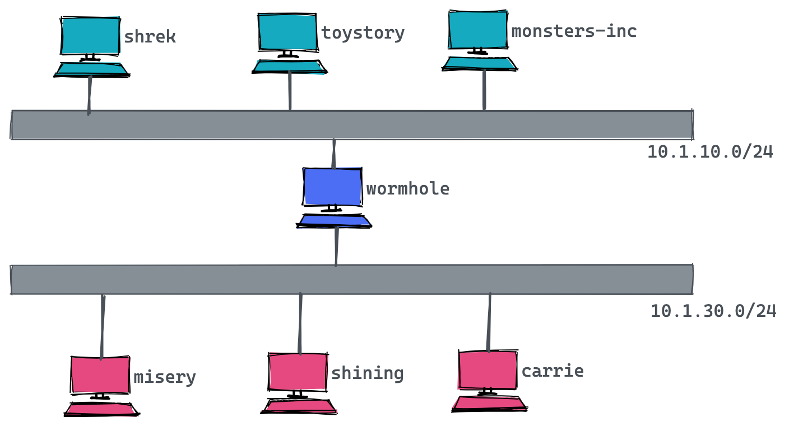

= Bind
:toc: manual

== 安装

=== CentOS 7 上安装

[source, bash]
.*安装*
----
yum install bind bind-utils -y
systemctl enable named && systemctl start named && systemctl status named
----

[source, bash]
.*查看安装的版本*
----
named -v
BIND 9.11.4-P2-RedHat-9.11.4-26.P2.el7_9.2 (Extended Support Version) <id:7107deb>
----

=== Ubuntu 20.04 上安装

[source, bash]
.*安装*
----
sudo apt install bind9 bind9utils bind9-doc
----

[source, bash]
.*查看安装的版本*
----
$ named -v
BIND 9.16.1-Ubuntu (Stable Release) <id:d497c32>
----

== 建立 Bind

=== 主机拓扑

[source, bash]
.*地址域名映射表*
----
# These are our main machines
10.1.10.2 shrek.movie.xyz shrek
10.1.10.3 toystory.movie.xyz toystory toys 
10.1.10.4 monsters-inc.movie.xyz monsters-inc mi

# These machines are in horror(ible) shape and will be replaced # soon.
10.1.30.2 misery.movie.xyz misery 
10.1.30.3 shining.movie.xyz shining 
10.1.30.4 carrie.movie.xyz carrie

# A wormhole is a fictitious phenomenon that instantly transports 
# space travelers over long distances and is not known to be
# stable. The only difference between wormholes and routers is
# that routers don't transport packets as instantly--especially
# ours.
10.1.10.1 wormhole.movie.xyz wormhole wh wh10 
10.1.30.1 wormhole.movie.xyz wormhole wh wh30
----

=== 区域数据文件（Zone Datafile）

* link:files/init/db.movie.xyz[db.movie.xyz]
* link:files/init/db.10.1.10[db.10.1.10]
* link:files/init/db.10.1.30[db.10.1.30]
* link:files/init/db.127.0.0[db.127.0.0]

[source, bash]
.*1. 名称到地址 db.movie.xyz*
----
$TTL  3h
movie.xyz. IN SOA ns1.movie.xyz. kylin.movie.xyz. (
                           1       ; Serial
                           3h      ; Refresh after 3 hours
                           1h      ; Retry after 1 hour
                           1w      ; Expire after 1 week
                           1h )    ; Negative caching TTL of 1 hour

movie.xyz. IN NS  ns1.movie.xyz.
movie.xyz. IN NS  ns2.movie.xyz.

;
;Host addresses
;

ns1.movie.xyz.              IN A   10.1.10.176
ns2.movie.xyz.              IN A   10.1.30.128

localhost.movie.xyz.        IN A   127.0.0.1

shrek.movie.xyz.            IN A   10.1.10.2
toystory.movie.xyz.         IN A   10.1.10.3
monsters-inc.movie.xyz.     IN A   10.1.10.4

misery.movie.xyz.           IN A   10.1.30.2
shining.movie.xyz.          IN A   10.1.30.3
carrie.movie.xyz.           IN A   10.1.30.4

;
;Multi-homed hosts
;
wormhole.movie.xyz.         IN A   10.1.10.1
wormhole.movie.xyz.         IN A   10.1.30.1

;
; Aliases
;
toys.movie.xyz.             IN CNAME   toystory.movie.xyz.
mi.movie.xyz.               IN CNAME   misery.movie.xyz.
wh.movie.xyz.               IN CNAME   wormhole.movie.xyz.

wh10.movie.xyz.             IN A       10.1.10.1
wh30.movie.xyz.             IN A       10.1.30.1
----

* `movie.xyz.` - 区域名称
* `IN` - 代表 Internet
* `ns1.movie.xyz` - 区域 movie.xyz 的 primary 名称服务的名称
* `kylin.movie.xyz` - 区域负责人的邮件，将第一个 . 换成 @，既邮件为 kylin@movie.xyz

[source, bash]
.*2. 地址到名称 db.10.1.10*
----
$TTL  3h
10.1.10.in-addr.arpa. IN SOA ns1.movie.xyz. kylin.movie.xyz. (
                           1       ; Serial
                           3h      ; Refresh after 3 hours
                           1h      ; Retry after 1 hour
                           1w      ; Expire after 1 week
                           1h )    ; Negative caching TTL of 1 hour

;
; Name servvers
;
10.1.10.in-addr.arpa. IN NS  ns1.movie.xyz.
30.1.10.in-addr.arpa. IN NS  ns2.movie.xyz.

;
; Addresses point to canonical name
;
1.10.1.10.in-addr.arpa.    IN PTR   wormhole.movie.xyz.
2.10.1.10.in-addr.arpa.    IN PTR   shrek.movie.xyz.
3.10.1.10.in-addr.arpa.    IN PTR   toystory.movie.xyz.
4.10.1.10.in-addr.arpa.    IN PTR   monsters-inc.movie.xyz.
176.10.1.10.in-addr.arpa.  IN PTR   ns1.movie.xyz.
----

[source, bash]
.*3. 地址到名称 db.10.1.30*
----
$TTL  3h
30.1.10.in-addr.arpa. IN SOA ns1.movie.xyz. kylin.movie.xyz. (
                           1       ; Serial
                           3h      ; Refresh after 3 hours
                           1h      ; Retry after 1 hour
                           1w      ; Expire after 1 week
                           1h )    ; Negative caching TTL of 1 hour

;
; Name servvers
;
10.1.10.in-addr.arpa. IN NS  ns1.movie.xyz.
30.1.10.in-addr.arpa. IN NS  ns2.movie.xyz.

;
; Addresses point to canonical name
;
1.30.1.10.in-addr.arpa.    IN PTR   wormhole.movie.xyz.
2.30.1.10.in-addr.arpa.    IN PTR   misery.movie.xyz.
3.30.1.10.in-addr.arpa.    IN PTR   shining.movie.xyz.
4.30.1.10.in-addr.arpa.    IN PTR   carrie.movie.xyz.
128.30.1.10.in-addr.arpa.  IN PTR   ns2.movie.xyz.
----

[source, bash]
.*4. 地址到名称 db.127.0.0*
----
$TTL  3h
0.0.127.in-addr.arpa. IN SOA ns1.movie.xyz. kylin.movie.xyz. (
                           1       ; Serial
                           3h      ; Refresh after 3 hours
                           1h      ; Retry after 1 hour
                           1w      ; Expire after 1 week
                           1h )    ; Negative caching TTL of 1 hour

;
; Name servvers
;
0.0.127.in-addr.arpa. IN NS  ns1.movie.xyz.
0.0.127.in-addr.arpa. IN NS  ns2.movie.xyz.

;
; Addresses point to canonical name
;
1.0.0.127.in-addr.arpa.    IN PTR   localhost.
----

NOTE: The mod of zone datafile should be `644`, the owner of zone datafile should be `bind:bind`.

=== BIND 配置

* link:files/init/named.conf[named.conf]

[source, bash]
.*1. /etc/bind/named.conf*
----
options {
        directory "/var/cache/bind";
};

zone "movie.xyz" in {
      type master;
      file "db.movie.xyz";
};

zone "10.1.10.in-addr.arpa" in {
      type master;
      file "db.10.1.10";
};

zone "30.1.10.in-addr.arpa" in {
      type master;
      file "db.10.1.30";
};

zone "0.0.127.in-addr.arpa" in {
      type master;
      file "db.127.0.0";
};
----

[source, bash]
.*2. 配置文件格式检查*
----
named-checkconf
named-checkzone movie.xyz /var/cache/bind/db.movie.xyz 
named-checkzone 10.1.10.in-addr.arpa /var/cache/bind/db.10.1.10 
named-checkzone 30.1.10.in-addr.arpa /var/cache/bind/db.10.1.30 
named-checkzone 0.0.127.in-addr.arpa /var/cache/bind/db.127.0.0 
----

[source, bash]
.*3. 重启服务*
----
sudo systemctl restart named.service 
----

=== 测试

[source, bash]
.*1. 查看 SOA*
----
$ nslookup -type=ns movie.xyz 10.1.10.176
Server:		10.1.10.176
Address:	10.1.10.176#53

movie.xyz	nameserver = ns2.movie.xyz.
movie.xyz	nameserver = ns1.movie.xyz.
----

[source, bash]
.*2. 查看 A*
----
$ nslookup carrie.movie.xyz 10.1.10.176
Server:		10.1.10.176
Address:	10.1.10.176#53

Name:	carrie.movie.xyz
Address: 10.1.30.4

$ nslookup wormhole.movie.xyz 10.1.10.176
Server:		10.1.10.176
Address:	10.1.10.176#53

Name:	wormhole.movie.xyz
Address: 10.1.10.1
Name:	wormhole.movie.xyz
Address: 10.1.30.1
----

[source, bash]
.*4. 查看 PTR*
----
$ nslookup 10.1.30.4 10.1.10.176
Server:		10.1.10.176
Address:	10.1.10.176#53

4.30.1.10.in-addr.arpa	name = carrie.movie.xyz.
----

=== TD

[source, bash]
.*2. db.movie.xyz*
----
$TTL 3h
@ IN SOA toystory.movie.xyz. kylin.movie.xyz. (
                           1       ; Serial
                           3h      ; Refresh after 3 hours
                           1h      ; Retry after 1 hour
                           1w      ; Expire after 1 week
                           1h )    ; Negative caching TTL of 1 hour
;
; Name servers
;
           IN NS toystory.movie.xyz.
           IN NS wormhole.movie.xyz.

;
; Addresses for the canonical names 
;
localhost        IN A   127.0.0.1
shrek            IN A   10.1.10.2
toystory         IN A   10.1.10.3
monsters-inc     IN A   10.1.10.4
misery           IN A   10.1.30.2
shining          IN A   10.1.30.3
carrie           IN A   10.1.30.4
wormhole         IN A   10.1.10.1
                 IN A   10.1.30.1

;
; Aliases
;
toys            IN CNAME  toystory
mi              IN CNAME  monsters-inc
wh              IN CNAME  wormhole

;
; Interface specific names
;
wh249    IN A 10.1.10.1
wh253    IN A 10.1.30.1
----

[source, bash]
.*3. db.10.1.10*
----
$TTL 3h
@ IN SOA toystory.movie.xyz. kylin.movie.xyz. (
                           1       ; Serial
                           3h      ; Refresh after 3 hours
                           1h      ; Retry after 1 hour
                           1w      ; Expire after 1 week
                           1h )    ; Negative caching TTL of 1 hour
;
; Name servers
;
              IN NS toystory.movie.xyz.
              IN NS wormhole.movie.xyz.

;
; Addresses point to canonical name 
;
1             IN PTR wormhole.movie.xyz.
2             IN PTR shrek.movie.xyz.
3             IN PTR toystory.movie.xyz.
4             IN PTR monsters-inc.movie.xyz.
----

[source, bash]
.*4. db.10.1.30*
----
$TTL 3h
@ IN SOA toystory.movie.xyz. kylin.movie.xyz. (
                           1       ; Serial
                           3h      ; Refresh after 3 hours
                           1h      ; Retry after 1 hour
                           1w      ; Expire after 1 week
                           1h )    ; Negative caching TTL of 1 hour
;
; Name servers
;
         IN NS toystory.movie.xyz.
         IN NS wormhole.movie.xyz.

;
; Addresses point to canonical name 
;
1        IN PTR wormhole.movie.xyz.
2        IN PTR misery.movie.xyz.
3        IN PTR shining.movie.xyz.
4        IN PTR carrie.movie.xyz.
----

[source, bash]
.*5. db.127.0.0*
----
$TTL 3h
@ IN SOA toystory.movie.xyz. kylin.movie.xyz. (
                           1       ; Serial
                           3h      ; Refresh after 3 hours
                           1h      ; Retry after 1 hour
                           1w      ; Expire after 1 week
                           1h )    ; Negative caching TTL of 1 hour
;
; Name servers
;
        IN NS toystory.movie.xyz.
        IN NS wormhole.movie.xyz.

1       IN PTR localhost.
----

=== TD

[source, bash]
.*6. 编辑 /etc/named.conf，添加*
----
zone "movie.xyz" in {
      type master;
      file "db.movie.xyz";
};

zone "249.249.192.in-addr.arpa" in {
      type master;
      file "db.10.1.10";
};

zone "253.253.192.in-addr.arpa" in {
      type master;
      file "db.10.1.30";
};

zone "0.0.127.in-addr.arpa" in {
      type master;
      file "db.127.0.0";
};
----

[source, bash]
.*7. 配置文件格式检查*
----
named-checkconf 
named-checkzone movie.xyz db.movie.xyz
named-checkzone 249.249.192.in-addr.arpa db.10.1.10 
named-checkzone 253.253.192.in-addr.arpa db.10.1.30
named-checkzone 0.0.127.in-addr.arpa db.127.0.0 
----

[source, bash]
.*8. 测试*
----
$ nslookup carrie.movie.xyz 10.1.10.3
Server:		10.1.10.3
Address:	10.1.10.3#53

Name:	carrie.movie.xyz
Address: 10.1.30.4

$ nslookup 10.1.30.4 10.1.10.3
Server:		10.1.10.3
Address:	10.1.10.3#53

4.253.253.192.in-addr.arpa	name = carrie.movie.xyz.

$ nslookup ksoong.org 10.1.10.3
Server:		10.1.10.3
Address:	10.1.10.3#53

Non-authoritative answer:
Name:	ksoong.org
Address: 192.30.252.153
Name:	ksoong.org
Address: 192.30.252.154
----

[source, bash]
.*9. 查看父域*
----
$ nslookup -type=ns com. 10.1.10.3
Server:		10.1.10.3
Address:	10.1.10.3#53

Non-authoritative answer:
com	nameserver = m.gtld-servers.net.
com	nameserver = k.gtld-servers.net.
com	nameserver = a.gtld-servers.net.
com	nameserver = g.gtld-servers.net.
com	nameserver = f.gtld-servers.net.
com	nameserver = c.gtld-servers.net.
com	nameserver = h.gtld-servers.net.
com	nameserver = e.gtld-servers.net.
com	nameserver = b.gtld-servers.net.
com	nameserver = d.gtld-servers.net.
com	nameserver = i.gtld-servers.net.
com	nameserver = j.gtld-servers.net.
com	nameserver = l.gtld-servers.net.

Authoritative answers can be found from:
b.gtld-servers.net	internet address = 192.33.14.30
e.gtld-servers.net	internet address = 192.12.94.30
l.gtld-servers.net	internet address = 192.41.162.30
f.gtld-servers.net	internet address = 192.35.51.30
i.gtld-servers.net	internet address = 192.43.172.30
c.gtld-servers.net	internet address = 192.26.92.30
j.gtld-servers.net	internet address = 192.48.79.30
g.gtld-servers.net	internet address = 192.42.93.30
a.gtld-servers.net	internet address = 192.5.6.30
d.gtld-servers.net	internet address = 192.31.80.30
k.gtld-servers.net	internet address = 192.52.178.30
h.gtld-servers.net	internet address = 192.54.112.30
m.gtld-servers.net	internet address = 192.55.83.30
b.gtld-servers.net	has AAAA address 2001:503:231d::2:30
e.gtld-servers.net	has AAAA address 2001:502:1ca1::30

$ nslookup -type=ns -norecurse cebbank.com. b.gtld-servers.net
Server:		b.gtld-servers.net
Address:	192.33.14.30#53

Non-authoritative answer:
*** Can't find cebbank.com.: No answer

Authoritative answers can be found from:
cebbank.com	nameserver = dns1.cebbank.com.
cebbank.com	nameserver = dns2.cebbank.com.
cebbank.com	nameserver = dns3.cebbank.com.
cebbank.com	nameserver = dns4.cebbank.com.
cebbank.com	nameserver = dns5.cebbank.com.
cebbank.com	nameserver = dns8.cebbank.com.
dns1.cebbank.com	internet address = 202.99.20.227
dns1.cebbank.com	has AAAA address 2408:8607:2500:0:2210::102
dns2.cebbank.com	internet address = 111.205.94.106
dns2.cebbank.com	has AAAA address 2408:8607:1d00:0:1210::102
dns3.cebbank.com	internet address = 219.143.234.227
dns3.cebbank.com	has AAAA address 240e:604:204:800:1110::102
dns4.cebbank.com	internet address = 106.37.164.154
dns4.cebbank.com	has AAAA address 240e:604:207:700:2110::102
dns5.cebbank.com	internet address = 223.72.163.107
dns5.cebbank.com	has AAAA address 2409:8700:1:d0:2310::102
dns8.cebbank.com	internet address = 111.205.215.182
----

[source, bash]
.*10. 配置 slave, 文件拷贝*
----
scp /etc/named.conf root@192.153.253.3:/etc
scp db.127.0.0  root@10.1.30.3:/var/named/
----

[source, bash]
.*11. 配置 slave，修改 named.conf*
----
zone "movie.xyz" in {
      type slave;
      file "bak.movie.xyz";
      masters { 10.1.10.3; };
};

zone "249.249.192.in-addr.arpa" in {
      type slave;
      file "bak.10.1.10";
      masters { 10.1.10.3; };
};

zone "253.253.192.in-addr.arpa" in {
      type slave;
      file "bak.10.1.30";
      masters { 10.1.10.3; };
};

zone "0.0.127.in-addr.arpa" in {
      type master;
      file "db.127.0.0";
};
----

[source, bash]
.*12. 启动 slave*
----
chown root:named named.conf
systemctl restart named
----

== TD

[source, bash]
.**
----

----

[source, bash]
.**
----

----

[source, bash]
.**
----

----

[source, bash]
.**
----

----
