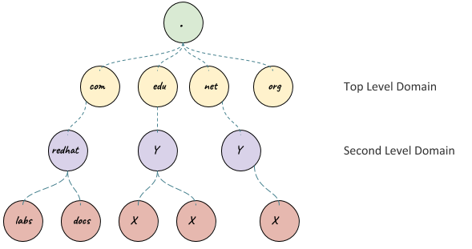

= DNS
:toc: manual

== 基本概念

=== 什么是 DNS

* DNS 是一个全球分布式的系统，用来将字母的地址转化为 IP 地址。https://www.icann.org/[ICANN] 在全球的视角负责 DNS。
* DNS 英文全称 *Domain Name System*，是一个树状分布式域名系统，为互联网或私有网络中的计算机、服务或其他任何资源提供解析。最突出的功能是将易于记忆的名称翻译成数字的IP地址用来定位需要访问的资源。
** WWW    www.hinet.net <-> 168.95.1.82
** MAIL    msa.hinet.net <-> 168.95.4.211
* DNS 是一个分层的命名系统，充当着网络系统主机和资源的目录，目录中的信息是将网络名称映射到逻辑条目/资源记录数据。

上图为一 DNS 分层命名系统示例，DNS 层次结构是以根域名 `.` 开始的，从根域名开始向下会有多个分支及子域名。DNS 层次结构的每个层次都是由 `.` 来分开的。`.` 是最顶层的根域名，com，net 及 org 等域名占据了分层域名中的第二级；example.com，redhat.com 等占据了第三级；上图中 apps.example.com 则是四级。

为了更好的解释 DNS 分层结构，需要对下表中定义的三个名词有所了解:

[cols="2,5a"]
|===
|名称 |描述

|域名(domain)
|一个域名是以公用名称结尾的一系列资源记录的集合，代表DNS 域名空间的整个子树，例如 `example.com`，`apps.example.com`。最大可能的域是根域名 `.`，其中代表整个 DNS 名称空间。

TLD(top-level domain，顶级域名)是只有一个组件的域名；gTLDs(gTLDs，通用顶级域名)是最初根据行业分类设计，包括 `.com`，`.net`，`.edu`等；ccTLDs(Country code TLDs，国家代码顶级域名)是根据国家代码设计，例如 `.cn`，`.us`，`.uk` 等。

|子域名(subdomain)
|一个子域名同样是一个域名，它是另一个域名的子树。子域名通常是在讨论两个域名之间的关系时使用的术语。例如，apps.example.com 是域名 example.com 的一个子域名。

|区(zone)
|一个区是特定名称服务器直接负责或认证的域名的一个部分。 这可能是一个完整的域名，也可能只是部分或全部域名的一部分子域名委托给其他域名服务器。
|===

NOTE: DNS can technically support up to 127 levels of domain in total for a single fully qualified domain name. Each individual section can only be 63 characters long and
 a complete FQDN is limited to a total of 255 characters 

=== DNS Zones

* The purpose of DNS zones is to allow for easier control over multiple levels of a domain.
* Zone files are simple configuration files that declare all resource records for a particular zone.

=== DNS 服务器种类

.*Five primary types of DNS servers*
[cols="2,5a"]
|===
|名称 |说明

|缓存名称服务器(Caching name servers)
|缓存名称服务器在本地缓存中存储 DNS 查询结果，并且在 TTL 到期后从缓存中删除资源记录。通常设置缓存名称服务器以为本地网络上的客户端执行查询。这降低了 Internet 上的 DNS 流量，从而极大提高了 DNS 名称解析的效率。随着缓存的增加，缓存名称服务器从其本地缓存中回答越来越多的客户端查询，从而提高 DNS 性能。

鉴于 UDP 的无状态性质，DNS 事务很容易被欺骗和篡改。缓存名称服务器过去一直是期望重定向或劫持网络流量的攻击者青睐的目标。这通常通过以下方式来实现：利用 DNS 服务器软件中的漏洞来欺骗 DNS 服务器接受恶意数据并将其填充到其缓存中，也就是通常称为缓存中毒的方法。一旦攻击者成功使 DNS 服务器的缓存中毒，便可利用 DNS 服务器上的缓存名称服务有效破坏众多客户端收到的 DNS 数据，并因此可以重定向或劫持客户端的网络流量。

缓存名称服务器可以极大提高本地网络上的 DNS 性能，同时它们还可以通过执行域名系统安全性扩展 (Domain Name System Security Extensions, DNSSEC) 验证来提高安全性。在缓存名称服务器上启用的 DNSSEC 验证可在将资源记录置于缓存中供客户端使用之前验证资源记录的真实性和完整性，从而防止客户端遭受缓存中毒。

|Recursive name servers
|Provided by an ISP or local network. Perform full DNS resolution requests.

|Root name servers
|13 total root name servers, what are responsible for directing queries toward the appropriate TLD name server.

|TLD name servers
|The TLD name servers will respond again with a redirect, this time informing the computer performing the name lookup with what authoritative name server to contact.

|Authoritative name servers
|Authoritative name servers are responsible for the last two parts of any domain name which is the resolution at which a single organization may be responsible for DNS lookups.
|===

.*Steps of Name Resolution*
image:img/5typesdnsserverlookup.png[]

=== 域名查询解析

当系统需要使用 DNS 服务器执行名称解析时，首先会按顺序向 /etc/resolv.conf 中列出的服务器发送查询，直到获得响应或所有列出的服务器耗尽。host 或 dig 命令可以用来手动查找 DNS 名称。

[source, bash]
.*An example of dig*
----
$ dig https://test.apps.example.com

; <<>> DiG 9.9.4-RedHat-9.9.4-51.el7_4.1 <<>> https://test.apps.example.com
;; global options: +cmd
;; Got answer:
;; ->>HEADER<<- opcode: QUERY, status: NOERROR, id: 44376
;; flags: qr aa rd ra; QUERY: 1, ANSWER: 1, AUTHORITY: 0, ADDITIONAL: 0

;; QUESTION SECTION:
;https://test.apps.example.com.	IN	A

;; ANSWER SECTION:
https://test.apps.example.com. 0 IN	A	192.168.122.105

;; Query time: 1 msec
;; SERVER: 192.168.122.106#53(192.168.122.106)
;; WHEN: Sat Jan 06 17:43:43 CST 2018
;; MSG SIZE  rcvd: 63
----

image:img/anatomy-of-dns-lookup.png[DNS 查询解析]

1. 从 `/etc/resolv.conf` 获取 DNS 服务器的地址
2. 发送 `https://example.com 的 IP 地址是多少` 请求到步骤1获取到的 DNS 服务器
3. 查询 `example.com` 是否在本地是有认证的
4. 如果是直接返回对应的 IP 地址，跳过以后的步骤，直接将 IP 地址返回给 Client。在这种情况下，则返回会有一个 aa 的标记，即表示是本地 authoritative answer 的。 
5. 如果 `example.com` 在本地没有认证，则查看 `example.com` 是否在缓存中有对应的记录
6. 如果缓存块有对应的记录，则返回 IP 地址.跳过以后的步骤，直接将 IP 地址返回给 Client。在这种情况下，返回没有 aa 标记。
7. 如果缓存中没有对应的记录，则一般发送类似 `.com 的域名服务器是什么` 的请求到 TLD 域名服务器
8. TLD 域名服务器会返回类似 `example.com 的域名服务器是 dns.example.com, IP 地址为 192.168.1.255` 信息
9. dnsA 域名服务器根据返回的地址信息，发送类似 `example.com 的 IP 地址是多少` 的请求到 dns.example.com
10. dns.example.com 服务iq会找到 example.com 对应的 IP 地址，例如 192.168.1.1，返回给 dnsA
11. dnsA 域名服务器将返回的信息在缓存中保存，并返回给Client

=== DNS and UDP

DNS 实现基于 UDP。

=== DNS RRs

DNS RRs(DNS resource records, DNS 资源记录) 是 DNS 区(zone) 中的记录，用来指定 DNS 区中特定名称或对象的详细属性，一条 DNS RRs 通常包括的属性有:

* `owner-name` - 资源记录的名称
* `type` - 资源记录的类型
* `TTL`，- 资源记录在缓存中保存的时间
* `class` - 该属性长见的值为 `IN`，代表互联网
* `data` - 数据属性，常见值 IPv4 地址， IPv6 地址

*常见资源记录类型对应描述列表*

[cols="2,5a"]
|===
|类型 |描述

|A
|主机名和 IPv4 地址的映射
[source, bash]
----
$ host -v -t A google.com
Trying "google.com"
;; ->>HEADER<<- opcode: QUERY, status: NOERROR, id: 58605
;; flags: qr rd ra; QUERY: 1, ANSWER: 6, AUTHORITY: 0, ADDITIONAL: 0

;; QUESTION SECTION:
;google.com.			IN	A

;; ANSWER SECTION:
google.com.		220	IN	A	74.125.24.138
google.com.		220	IN	A	74.125.24.100
google.com.		220	IN	A	74.125.24.101
google.com.		220	IN	A	74.125.24.102
google.com.		220	IN	A	74.125.24.139
google.com.		220	IN	A	74.125.24.113
----

|AAAA(Quad A)
|主机名和 IPv6 地址的映射
[source, bash]
----
$ host -v -t AAAA google.com
Trying "google.com"
;; ->>HEADER<<- opcode: QUERY, status: NOERROR, id: 44229
;; flags: qr rd ra; QUERY: 1, ANSWER: 1, AUTHORITY: 0, ADDITIONAL: 0

;; QUESTION SECTION:
;google.com.			IN	AAAA

;; ANSWER SECTION:
google.com.		145	IN	AAAA	2404:6800:4003:c03::71
----

|CNAME
|定义了一个别名，将一个域名重定向到另外一个域名
[source, bash]
.*DNS 区中 CNAME 示例*
----
NAME                    TYPE   VALUE
--------------------------------------------------
bar.example.com.        CNAME  foo.example.com.
foo.example.com.        A      192.0.2.23
----

注意事项:

* CNAME 链必须要以 A 或 AAAA 结束
* 在 CDN 网络使用 CNAME 链来加快传输的可靠性和速度
* NS 和 MX 类型的资源记录不能够指向 CNAME

|PTR
|IPv4 地址/IPv6 地址和主机名的映射，用来 DNS 反转解析

[source, bash]
.*PTR IPv4 将 IP 地址反转，以 in-addr.arpa 结束*
----
$ host -v -t PTR 8.8.8.8
Trying "8.8.8.8.in-addr.arpa"
;; ->>HEADER<<- opcode: QUERY, status: NOERROR, id: 64860
;; flags: qr rd ra; QUERY: 1, ANSWER: 1, AUTHORITY: 0, ADDITIONAL: 0

;; QUESTION SECTION:
;8.8.8.8.in-addr.arpa.		IN	PTR

;; ANSWER SECTION:
8.8.8.8.in-addr.arpa.	72850	IN	PTR	google-public-dns-a.google.com.
----

[source, bash]
.*PTR IPv6 反转且以十进制个位数字表示，以 ip6.arpa 结束*
----
$ host -v -t PTR 2001:4860:4860::8888
Trying "8.8.8.8.0.0.0.0.0.0.0.0.0.0.0.0.0.0.0.0.0.6.8.4.0.6.8.4.1.0.0.2.ip6.arpa"
;; ->>HEADER<<- opcode: QUERY, status: NOERROR, id: 20901
;; flags: qr rd ra; QUERY: 1, ANSWER: 1, AUTHORITY: 0, ADDITIONAL: 0

;; QUESTION SECTION:
;8.8.8.8.0.0.0.0.0.0.0.0.0.0.0.0.0.0.0.0.0.6.8.4.0.6.8.4.1.0.0.2.ip6.arpa. IN PTR

;; ANSWER SECTION:
8.8.8.8.0.0.0.0.0.0.0.0.0.0.0.0.0.0.0.0.0.6.8.4.0.6.8.4.1.0.0.2.ip6.arpa. 86400	IN PTR google-public-dns-a.google.com.
----

|NS
|域名和在 DNS zone 中有授权的 DNS 名称服务器的映射

[source, bash]
----
$ host -v -t NS google.com
Trying "google.com"
;; ->>HEADER<<- opcode: QUERY, status: NOERROR, id: 44701
;; flags: qr rd ra; QUERY: 1, ANSWER: 4, AUTHORITY: 0, ADDITIONAL: 0

;; QUESTION SECTION:
;google.com.			IN	NS

;; ANSWER SECTION:
google.com.		24431	IN	NS	ns2.google.com.
google.com.		24431	IN	NS	ns3.google.com.
google.com.		24431	IN	NS	ns1.google.com.
google.com.		24431	IN	NS	ns4.google.com.
---- 

|SOA
|提供了 DNS zone 工作原理等信息。任意一个 DNS zone 中都有一条 SOA 记录，提供的信息包括域名服务器的 Master 点，Salve 点，Slave 如何同步 Master 数据，及 DNS zone 的管理契约等。

[source, bash]
----
$ host -v -t SOA google.com
Trying "google.com"
;; ->>HEADER<<- opcode: QUERY, status: NOERROR, id: 541
;; flags: qr rd ra; QUERY: 1, ANSWER: 1, AUTHORITY: 0, ADDITIONAL: 0

;; QUESTION SECTION:
;google.com.			IN	SOA

;; ANSWER SECTION:
google.com.		60	IN	SOA	ns1.google.com. dns-admin.google.com. 181070036 900 900 1800 60
----

|MX
|域名和邮件交换服务器之间的映射

[source, bash]
----
$ host -v -t MX mail.google.com
Trying "mail.google.com"
;; ->>HEADER<<- opcode: QUERY, status: NOERROR, id: 17580
;; flags: qr rd ra; QUERY: 1, ANSWER: 1, AUTHORITY: 1, ADDITIONAL: 0

;; QUESTION SECTION:
;mail.google.com.		IN	MX

;; ANSWER SECTION:
mail.google.com.	455795	IN	CNAME	googlemail.l.google.com.

;; AUTHORITY SECTION:
l.google.com.		43	IN	SOA	ns1.google.com. dns-admin.google.com. 181060731 900 900 1800 60
----

|TXT
|名称和任意可读文本之间的映射，通常用于 Sender Policy Framework (SPF)，DomainKeys Identified Mail (DKIM)，Domain-based Message Authentication，Reporting and Conformance (DMARC)

[source, bash]
----
$ host -v -t TXT google.com
Trying "google.com"
;; ->>HEADER<<- opcode: QUERY, status: NOERROR, id: 55568
;; flags: qr rd ra; QUERY: 1, ANSWER: 1, AUTHORITY: 0, ADDITIONAL: 0

;; QUESTION SECTION:
;google.com.			IN	TXT

;; ANSWER SECTION:
google.com.		3600	IN	TXT	"v=spf1 include:_spf.google.com ~all"
----

|SRV
|用来定位在一个域中支持特定服务的主机。SRV 中提供了一系列提供特殊服务(例如 LDAP)的主机名，包括服务监听的端口号等。SRV 记录中包括 `priority`，`weight` 等属性。 
|===

通常一个主机(不分客户端和服务器)会有如下记录:

* 一条或多条 A/AAAA 类型的记录映射主机名和它的 IP 地址
* 一条 PTR 记录将主机的每个 IP 地址反转映射为主机名
* 可选择，一条或多条 CNAME 记录进行别名设定及映射 A/AAAA 类型记录

除了如上记录，一个 DNS zone 会有更多如下记录:

* 一条 SOA 记录说明 zone 是如何工作的
* 一条 NS 记录指向授权的服务器
* 一条或多条 MX 记录进行域名和邮件交互服务之间的映射
* 可选择的，一条或多条 TXT 记录提供一些特殊服务，例如 SPF
* 可选择的，一条或多条 SRV 记录域中本地服务 

相关 RFC 文档:

. http://tools.ietf.org/html/rfc1034[RFC 1034: Domain names - concepts and facilities]
. http://tools.ietf.org/html/rfc1035[RFC 1035: Domain names - implementation and specification]
. http://tools.ietf.org/html/rfc2181[RFC 2181: Clarifications to the DNS Specification]

=== 公共 DNS 服务器

* An ISP almost always gives you access to a recursive name server as part of the service it provides.
* Public DNS servers are name servers specifically set up so that anyone can use them for free.

* *Level 3 communication* - One of the largest ISPs in the world. The IP addresses for Level 3s public DNS servers are 4.2.2.1 through 4.2.2.6.
* *Google's public DNS* - Google operates public name servers on the IPs 8.8.8.8 and 8.8.4.4.

=== DNS Registration and Expiration

*Registrar* - An organization responsible for assigning individual domain names to other organizations or individuals.

https://godaddy.com

== DNS 工具

=== nslookup

Nslookup is way more powerful than just that. It includes an interactive mode that lets you set additional options and run lots of queries in a row. To start an interactive nslookup session, you just enter nslookup, without any hostname following it. You should see an angle bracket acting as your prompt. From interactive mode, you can make lots of requests in a row. You can also perform some extra configuration to help with more in-depth trouble shooting.

[source, bash]
----
$ nslookup google.com
Server:		10.72.17.5
Address:	10.72.17.5#53

Non-authoritative answer:
Name:	google.com
Address: 74.125.24.102
Name:	google.com
Address: 74.125.24.113
Name:	google.com
Address: 74.125.24.138
Name:	google.com
Address: 74.125.24.139
Name:	google.com
Address: 74.125.24.100
Name:	google.com
Address: 74.125.24.101
----

== 配置管理 unbound

将 unbound 作为缓存名称服务器进行配置和管理需要若干软件包（包括 bind、dnsmasq 和 unbound），及相关配置，具体步骤如下:

[cols="2,5a"]
|===
|步骤 |说明

|1. 安装 unbound
|以 root 用户安装 unbound 软件包：

[source, text]
----
# yum install -y unbound
----

|2. 启动并启用 unbound.service
|

[source, text]
----
# systemctl start unbound.service
# systemctl enable unbound.service
----

|3. 配置要侦听的网络接口
|默认情况下，unbound 仅侦听 localhost 网络接口。要使 unbound 能够作为缓存名称服务器供远程客户端使用，请使用 `/etc/unbound/unbound.conf` 的 server 子句中的 *interface* 选项来指定要侦听的网络接口。值 `0.0.0.0` 会将 unbound 配置为侦听所有网络接口：

[source, text]
----
interface: 0.0.0.0
----

|4. 配置客户端访问权限
|默认情况下，unbound 会拒绝来自所有客户端的递归查询。在 `/etc/unbound/unbound.conf` 的 server 子句中，使用 *access-control* 选项指定允许哪些客户端进行递归查询。

[source, text]
----
access-control: 172.25.0.0/24 allow
----

|5. 配置转发
|在 `/etc/unbound/unbound.conf` 中，创建 forward-zone 子句以指定要将查询转发到的 DNS 服务器。可以使用 *forward-host* 选项按主机名指定 DNS 服务器，或者使用 *forward-addr* 选项按 IP 地址指定。对于缓存名称服务器，通过将 *forward-zone* 指定为 "." 以转发所有查询。

[source, text]
----
forward-zone:
  name: "."
  forward-addr: 172.25.254.254
----

|6. 如果需要，可对特定的未签名区域绕过 DNSSEC 验证
|默认情况下，启用 unbound 以执行 DNSSEC 验证，以验证是否收到了所有 DNS 响应。`/etc/unbound/unbound.conf` 的 server 子句中的 *domain-insecure* 选项可用于指定应跳过 DNSSEC 验证的域。这在处理未签名的内部域时通常是需要的，否则会导致信任链验证失败。

[source, text]
----
domain-insecure: example.com
----

|7. 如果需要，请安装特定签名区域的信任定位符（不含完整信任链）
|由于并非所有 ccTLD 都实现了 DNSSEC，这些 ccTLD 的子域可以由 DNSSEC 签名，但是仍具有损坏的信任链。可以使用 `/etc/unbound/unbound.conf` 的 server 子句中的 trust-anchor 选项指定区域的信任定位符，从而解决此问题。使用 dig 来获取区域的密钥签名密钥 (KSK) 的 DNSKEY 记录，并输入该记录作为 trust-anchor 选项的值。

[source, text]
----
$ dig +dnssec DNSKEY example.com
----

|8. 保存
|将更改保存到 `/etc/unbound/unbound.conf`。

|9. 语法检查
|检查 `/etc/unbound/unbound.conf` 配置文件是否有语法错误。

[source, text]
----
# unbound-checkconf
----

|10. 重启
|重新启动 unbound.service。

[source, text]
----
# systemctl restart unbound.service
----

|11. 配置防火墙
|配置防火墙以允许 DNS 流量。

[source, text]
----
# firewall-cmd --permanent --add-service=dns
# firewall-cmd --reload
----

|===

=== unbound 基本管理操作

[cols="2,5a"]
|===
|步骤 |说明

|转储和加载 unbound 缓存
|对 DNS 问题进行故障排除时，缓存名称服务器的管理员需要转储缓存数据，如由于陈旧资源记录产生的缓存数据。通过 unbound DNS 服务器，可以通过联合 dump_cache 子命令运行 unbound-control 实用程序来转储缓存。

[source, text]
----
# unbound-control dump_cache
----

使用 dump_cache 命令执行 unbound-control 以便以文本格式将缓存转储到 stdout。可以将此输出定向到文件以进行存储，也可以在之后使用 unbound-control load_cache 命令重新加载到缓存中（如果需要）。unbound-control load_cache 从 stdin 中读取以填充缓存。

[source, text]
----
# unbound-control load_cache < dump.out
----

|清空 unbound 缓存
|缓存名称服务器的管理员还需要经常从缓存中清除过期的资源记录。在过期资源记录上的 TTL 到期之前，缓存中的错误和过期资源记录将阻止新的已更正的对应资源记录供客户端使用。管理员可以通过执行带有 flush 子命令的 unbound-control 来强制清除过期记录，而不必等待 TTL 过期。

[source, text]
----
# unbound-control flush www.example.com
----

如果需要从 unbound DNS 服务器的缓存中清除属于某个域的所有资源记录，则可以使用 flush_zone 子命令来执行 unbound-control。

[source, text]
----
# unbound-control flush_zone example.com
----

|使用 dnssec-trigger 更新本地缓存 unbound 配置
|除了为本地子网提供缓存名称服务，unbound 作为本地缓存名称服务器也很有用，可提供安全的 DNS 名称解析以供在个别系统上本地使用。对于本地缓存名称服务器设置，`/etc/resolv.conf` 中的 nameserver 条目将配置为指向 unbound 正在侦听的本地主机。unbound 配置将 DNS 请求转发到上游名称服务器并验证其响应。

对于运行本地缓存名称服务的 DHCP 系统，如果 DHCP 提供的 DNS 服务器发生更改，则 unbound 的配置中指定的上游名称服务器可能过期。可以利用相同名称的软件包提供的 dnssec-trigger 工具来自动更新 unbound 的配置文件中的转发器设置以指向新的 DNS 服务器。dnssec-trigger 工具与 unbound 组合使用对于漫游客户机上的安全 DNS 名称解析很有用。

|===

== DNS 常见问题

[source, text]
.*DNS 常见问题分析*
----
$ getent hosts example.com
$ grep ^hosts: /etc/nsswitch.conf
$ grep [[:space:]]example.com /etc/hosts
$ grep ^nameserver /etc/resolv.conf
nameserver 172.25.254.255
$ dig @172.25.254.255 A example.com
$ dig A example.com
----

