//= 计算机网络
:toc: manual

== 网络模型

各个组织或企业对网络模型定义有所不同，但目前最常见的定义有一下三种。

=== TCP/IP 五层模型

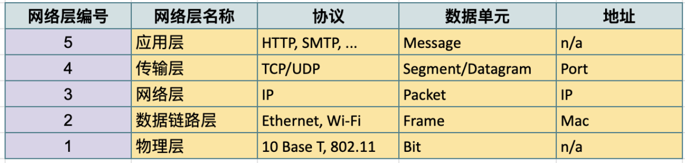

* *物理层* - 物理层表示与计算机互连的物理设备，其中还包括将物理设备连接在一起的网线、光缆、连接器的规范，以及描述如何通过这些连接发送信号的规范。
* *数据链路层* - 物理层仅仅涉及到的是光缆、连接器和信号发送，数据链路层负责定义解释这些信号的通用方法，以便网络设备可以进行通信。 该层中最常见的协议是以太网（Ethernet），它指定物理层属性，并定义负责同一网络或链路上的节点间传输数据的协议。
* *网络层* - 也称为 Internet 层，它允许不同的网络之间通过路由器设备相互通信。数据链路层只负责的是同一链路上的数据交互，网络层负责的是跨不同网络的数据交互。网络层最常见的两个协议是 IP 个 Internet。
* *传输层* - 网络层可以负责两个不同网络中的节点间的数据交互，传输层会理清应该由那个客户端和服务器程序获取这些数据。TCP 是最常见的四层协议，IP 负责将数据从一个节点传输到另一个节点; TCP 和 UDP 负责确保数据被节点上的特定应用获取。
* *应用层* -  这一层包括很多协议，常见的一些包括是用来允许您浏览网页或发送接收电子邮件等。

.*TCP/IP 5 层模型与包裹投递对应示例*
image:img/TCPIP-5-layer-models.png[]

1. 物理层相当于投递快递的卡车和路。
2. 数据链路层确保投递卡车从一个十字路口到下一个十字路口，并且重复多次。
3. 网络层确定了地址 A 和地址 B 之间的路。
4. 传输层确保某个地址上具体的门牌号，以及告诉快速已经送达。
5. 应用层指包裹的内容本身。

.*TCP/IP 5 层模型与硬件组建对应关系*
image:img/5layermoles-hardwareComponent.png[]

=== TCP/IP 四层模型

image:img/tcp-ip-model.png[TCP/IP]

* 应用层 - 常见的应用层协议有：SSH，HTTPS，NFS/CIFS，SMTP
* 传输层 - 传输层协议有 TCP 和 UDP，TCP 属于可靠连接传输协议，UDP 无连接数据包传输协议
* 网络互连层 - 负责将数据从源主机传输到目的主机，任意主机都有一个 IP 地址和子网掩码来确定网络地址，路由器用来连接网络。这一层的协议有 ICMP，`ping` 命令就是基于 ICMP 协议，`ping` 命令发送一个 ICMP ECHO_REQUEST 请
求包，成功则返回 ICMP ECHO_REPLY 确认。
* 网络接口层 - 提供连接到物理媒介，如常见的有线以太网（802.3）和无线WLAN（802.11），每一个物理网络设备都有一个物理地址（MAC）用来在网络中唯一标识目的地址。

=== OSI 七层模型

详细参照 https://en.wikipedia.org/wiki/OSI_model[wiki/OSI_model] 了解更多关于 OSI 七层模型。

=== 三种模型对比及对应网络协议

除了 TCP/IP 五层模型外，关于网络模型在业界还有其他表述，最有影响力的表扩：OSI 七层模型和 TCP/IP 四层模型，具体对照如下表：

image:img/network-model.png[]

* OSI 七层模型将 TCP/IP 模型中的应用层细分为三层：应层层、表示层、会话层
* 相比较 TCP/IP 五层模型，TCP/IP 四层模型将物理层和数据链路层合为一层
* 网络层也叫 Internet 层或网络互联层，数据链路层也称网络接口层

== 物理层

=== 网络设备

==== 电缆（Cables）

电缆（Cables）是将不同的设备连接在一起，允许他们相互交换数据。电缆可分为两类:

* 铜缆 - 就是最长见的网线，铜缆是网络电缆的最常见形式，它们由塑料绝缘体内的多对铜线组成。网络中最长见的铜线配对缠绕标准有 Cat5, Cat5e, 和 Cat6。这些类别具有不同的物理特性，例如一对铜线中的绞合数会导致不同的可用长度和传输速率。
* 光缆 - 光纤电缆包含单个的光纤是由玻璃制成的细管，大约与人的头发宽度相同。这些玻璃管可以传输光束。与使用电压的铜缆不同，光缆使用光脉冲来表示基础数据的 1 和0。

==== Hub

Hub 是物理层的设备，多台计算机设备可连接到它，允许同一时刻来自不同计算机的连接。

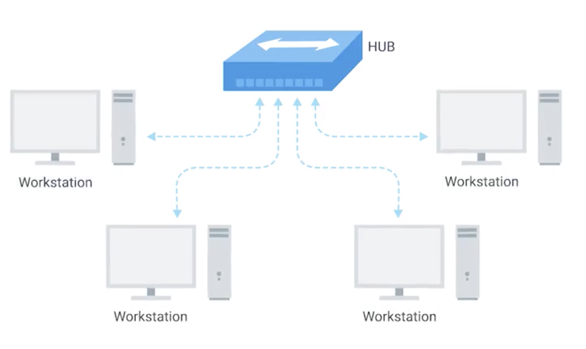

All the devices connected to a hub will end up talking to all other devices at the same time. It's up to each system connected to the hub to determine if the incoming data was meant for them, or to ignore it if it isn't. This causes a lot of noise on the network and creates what's called a collision domain. A collision domain is a network segment where only one device can communicate at a time. If multiple systems try sending data at the same time, the electrical pulses sent across the cable can interfere with each other. This causes these systems to have to wait for a quiet period before they try sending their data again. It really slows down network communications, and is the primary reason hubs are fairly rare.

==== 交换机（Switch）

交换机是二层（数据链路层）设备，是目前常见的网络设备，允许多台计算机连接到它，由于是二层的设备，交换机可以识别 Ethernet 协议中的属性来识别特点的计算机，确保数据准确的传输到特定的机器。这极大的减少了网络域冲突，提高了网络传输的吞吐量.

==== 路由器（Router）

Hub 是一层的网络设备，交换机是二层的网络设备，二路由器是三层的网络设备，路由器知道如何在不同的网络之间发送数据。和交换机检测 Ethernet 协议中的属性决定将包发送到什么位置类似，路由器检测 IP 协议中的属性决定将包发送到什么位置。路由器内部有个
路由表，包含着将数据路由到世界上不同网络的信息。

不同的路由器之间通过 BGP(Border Gateway Protocol) 协议共享数据，这使数据的发送基于最佳路径。当您打开Web浏览器并加载网页时，计算机和Web服务器之间的流量可能会经过数十个不同的路由器。 互联网异常庞大且复杂。 路由器是将流量吸引到正确位置的全球
指南。

=== 传输介质

==== 同轴电缆

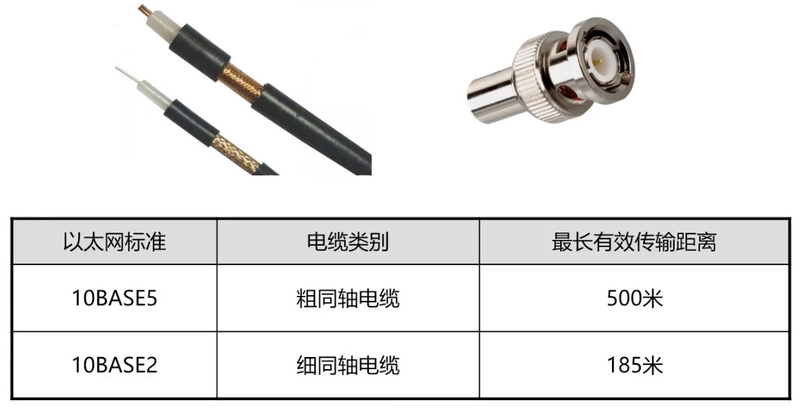

传输速率低，基本被淘汰。

==== 双绞线(Twisted Pair) 双向交流

* 一个标准的 Cat 6 电缆由 8 根铜线，4 对双绞线组成 
* 双向交流指电缆支持双向传输 信息。

image:img/cat5e-cat6.jpg[] 

https://en.wikipedia.org/wiki/Ethernet_over_twisted_pair[双绞线以太网]

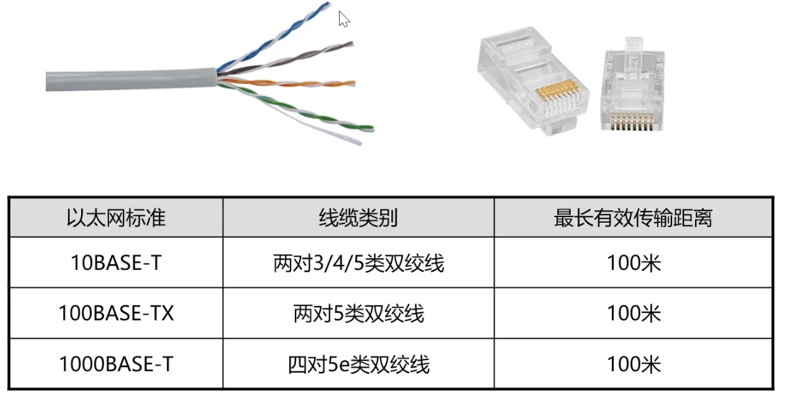

*网络接口和配线架*

* 一根网线通常通过一个 RJ-45 接头连接到一个 RJ-45 网络接口. 网络接口通常与组成计算机网络的设备直接连接，或是设备的一个部分，例如任何一台计算机都会至少有一个网络接口。
* 配线架是一种包含许多网络端口的设备，但没有其他作用，只是将不同网络线缆连接到一起。 
  
.*常见网络接口*
[cols="5a,5a,5a"]
|===
|RJ-45 插头 |RJ-45 网络接口 |配线架(Patch Panel)

|image:img/rj45.jpg[]

|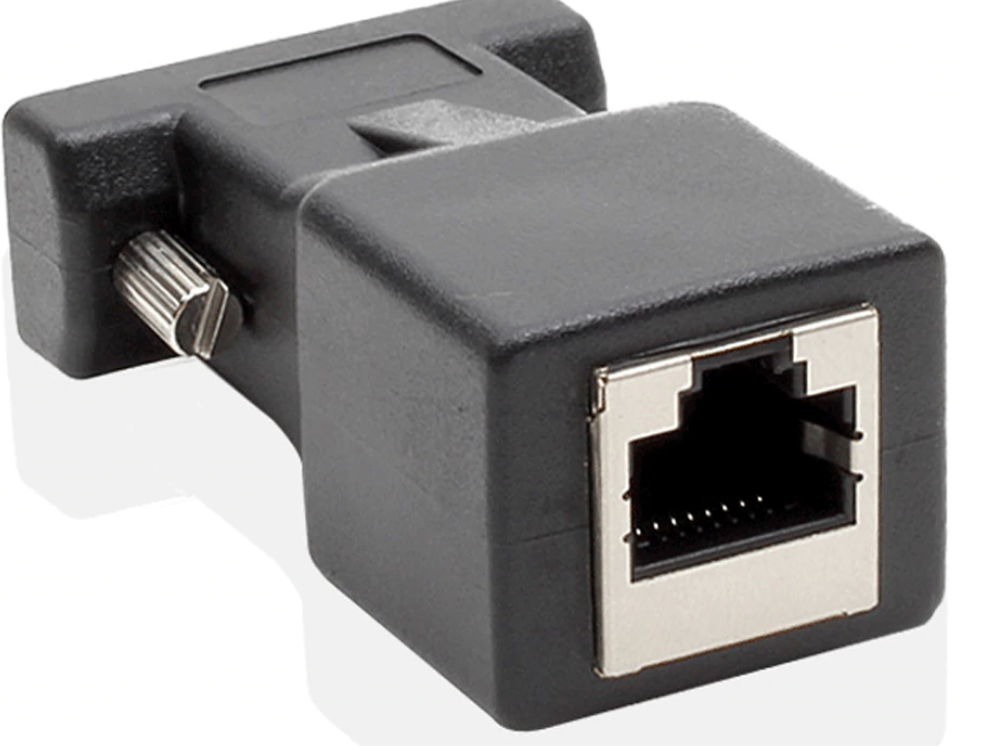

|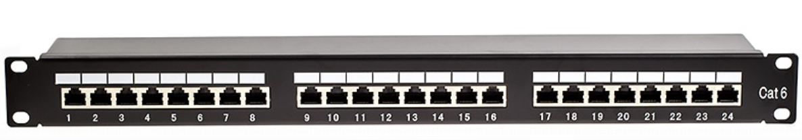
|===

==== 光纤

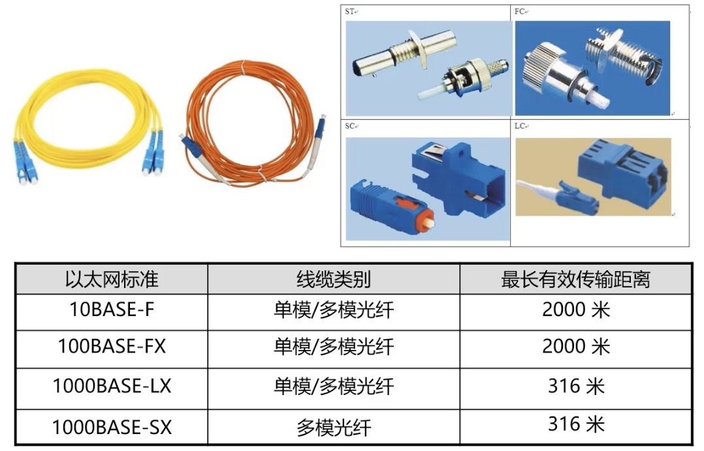

* 亮黄色 - 单模光纤
* 橙黄色 - 双模光纤

==== 串口电缆

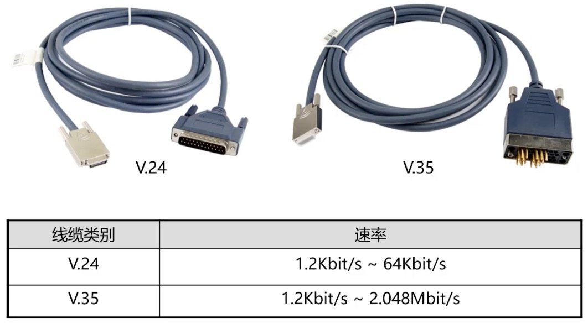

=== 链路上的字节移动

* 物理层负责将字节流（0 或 1 的字节码串）从链路的一端移动到另一端
* 物理层是由传输字节码的设备和装置组成
* 一个比特(bit)代表计算机可以明白的最小数据，它要么是 1，要么是 0。这些在网络链路上发送的 0 或 1 的字节码串是组成数据帧、数据包的最底层元素，这些帧或包是其他网络层的概念。
*  0 或 1 的字节码串在网络上发送是通过一个叫调节器(Modulation)的程序控制，调节器(Modulation)是一种改变电荷在电缆上移动的电压的方式。当用于计算机网络时，这种调制方式更具体地称为线路编码。它允许链路两端的设备了解某种状态下的电荷为 0，而另一
种状态下的电荷为 1。

image:img/line-coding.png[]

=== 拨号接入

* PSTN(Public Switched Telephone Network) is also referred to as the POTS(Plain Old Telephone Service).
* A dial-up connection uses POTS for data transfer, and gets its name because the connection is established by actually dialing a phone number.
* Modem stands for modulator/demodulator, and they take data that computers can understand and turn them into audible wavelengths that can be transmitted over POTS.
* A baud rate is a measurement of how many bits could be passed across a phone line in a second.

image:img/dial-up-moderms.png[]

=== 宽带接入

==== What is broadband?

In terms of internet connectivity, it's used to refer to any connectivity technology that isn't dial-up Internet. Broadband Internet is almost always much faster than even the fastest dial-up connections and refers to connections that are always on. This means that they're long lasting connections that don't need to be established with each use. They're essentially links that are always present.

==== T-Carrier Technologies

* T-Carrier Technologies were originally invented by AT&T in order to transmit multiple phone calls over a single link.
* T1 stands for Transmission System 1.
* A T1 communicates at speeds of 1.544 Kb/sec.
* A T3 is just 28 multiplexed T1 lines.

==== Digital Subscriber Lines

* DSL(digital subscriber line) was able to send much more data across the wire than traditional dial-up technologies.
* DSL technologies use DSLAMs or Digital Subscriber Line Access Multiplexers to establish data connections across phone lines.

两种常见的 DSL 类型：

1. *ADSL* - ADSL stands for Asymmetric Digital Subscriber Line. ADSL connections featured different speeds for outbound and incoming data. Generally, this means faster download speeds and slower upload speeds.
2. *SDSL* - SDSL stands for Symmetric Digital Subscriber Line. SDSL technology is basically the same as ADSL, except the upload and download speeds are the same.

==== Cable Broadband

Cable Internet connections are usually managed by what's known as a cable modem. This is a device that sits at the edge of a consumer's network and connects it to the cable modem termination system, or CMTS. The CMTS is what connects lots of different cable connections to an ISP's core network.

image:img/cable-broadband.png[]

==== Fiber Connections

* FTTN means fiber to the neighborhood that fiber technologies are used to deliver data to a single physical cabinet that serves a certain amount of the population.
* FTTB stands for fiber to the building, fiber to the business or even a fiber to the basement, since this is generally where cables to buildings physically enter.
* FTTH stands for fiber to the home, that is used in instances where fiber is actually run to each individual residents in a neighborhood or apartment building.
* FTTP fiber to the premises, FTTH and FTTB may both also be referred to as FTTP.

Instead of a modem, the demarcation point for fiber technologies is known as Optical Network Terminator, or ONT. An ONT converts data from protocols the fiber network can understand to those that are more traditional twisted pair copper networks can understand.

=== 无线网络(WIFI)

* The most common specifications for how wireless networking devices should communicate, are defined by the IEEE 802.11 standards. This set of specifications, also called the 802.11 family, make up the set of technologies we call WiFi.
* A frequency band is a certain section of the radio spectrum that's been agreed upon to be used for certain communications.
* WiFi networks operate on a few different frequency bands. Most commonly, the 2.4 gigahertz and 5 gigahertz bands. There are lots of 802.11 specifications including some that exist just experimentally or for testing. The most common specifications you might run into are 802.11b, 802.11a, 802.11g, 802.11n, and 802.11ac.

==== Wireless Channels

Channels are individual, smaller sections of the overall frequency band used by a wireless network.

==== Wireless Security

* WEP stands for Wired Equivalent Privacy, it's an encryption technology that provides a very low level of privacy.
* WPA stabds for Wi-Fi Protected Access, by default, uses a 128-bit key, making it a whole lot more difficult to crack than WEP.
* WPA2,  an update to the original WPA. WPA2 uses a 256-bit key make it even harder to crack.

==== Cellular Networking

Cellular networks are built around the concept of cells. Each cell is assigned a specific frequency band for use.

== 数据链路层

数据链路层实质上是对物理层的一个抽象，使其他层可以不用考虑物理层所使用的硬件或设备，而可以进行发送数据和接收数据的工作，这样确保了不管物理层硬件或设备如何变化，网络层、传输层、应用层都在用同样的方式工作。

数据链路层使用的信道主要有以下两种类型：

* *点对点信道* - 这种信道使用一对一的点对点通信方式。
* *广播信道* - 这种信道使用一对多的广播通信方式，因此过程比较复杂。广播信道上连接的主机很多，因此必须使用专用的共享信道协议来协调这些主机的数据发送。

=== 以太网协议(Ethernet)

* Ethernet 是目前链路层最被广泛使用的协议，用来在单个链路上发送数据，Ethernet 最早在 1980 年提出，1983 成为标准，后续只是基于带宽的增加相应进行过一些微调。
* Ethernet 是当今现有局域网（Local Area Network LAN）采用的最通用的通信协议标准，定义了局域网中采用的电缆类型的信号处理方法。
* Ethernet 是建立在CSMA/CD(Carrier Sense Multiple Access With Collision Detection, 载波侦听多路访问/冲突检测)机制上的广播型网络。 

==== 共享式以太网

早期以太网是共享式网络，共享式网络可能会出现信号冲突现象，如下图所示：

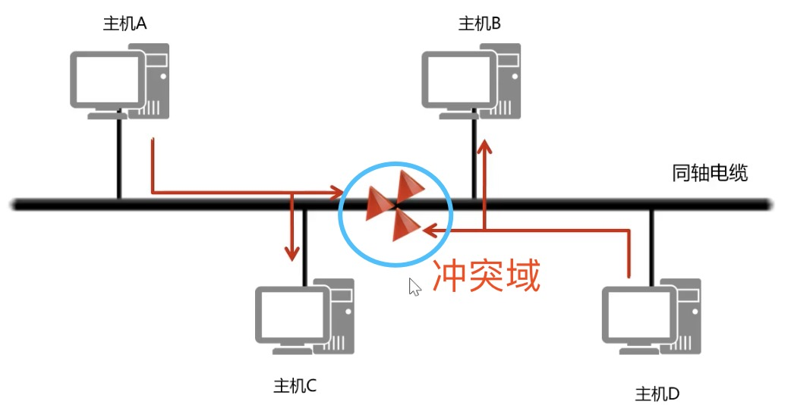

CSMA/CD(Carrier Sense Multiple Access With Collision Detection, 载波侦听多路访问/冲突检测) - CSMA/CD 用于确定通信通道何时畅通以及设备何时自由传输数据，这是为了避免冲突域。

CSMA/CD 的工作原理就是检测当前网段上是否有数据传输，如果没有，则发送数据；如果有，则等待一个随机的时间间隔，然后尝试再次发送数据，CSMA/CD 使用 MAC 地址来确认目的地节点。

1. 先听后发 
2. 边听边发
3. 冲突停发
4. 随机延迟后发

==== 交换式以太网

当前的以太网是交换式，交换机设备很好的解决了信号冲突现象，因为交换机收到数据后会有检查机制，隔离冲突。

一个交换机的接口就是一个*冲突域*；广播报文所能到达的整个访问范围称为二层广播域，简称*广播域*。

NOTE: 交换机中无法隔离广播域。

=== MAC 地址

* 以太网卡(Network Interface Card NIC)简称为以太网卡，每一个以太网卡会关联一个 MAC 地址。
* MAC(Media Access Control) 地址是附加到一个以太网卡上的全局唯一标识符。
* MAC 地址是一个 48 位的二进制数字，由六组二位的十六进制数字构成，例如：`8:00:27:c3:0f:80`。
* MAC 地址分为两部分, 前三组十六进制数是组织唯一标识，是由 IEEE 组织分配给各个硬件制造商；后三位可以按制造商希望的方式任意分配，分配的条件是确保每个可能的地址只分配一次。

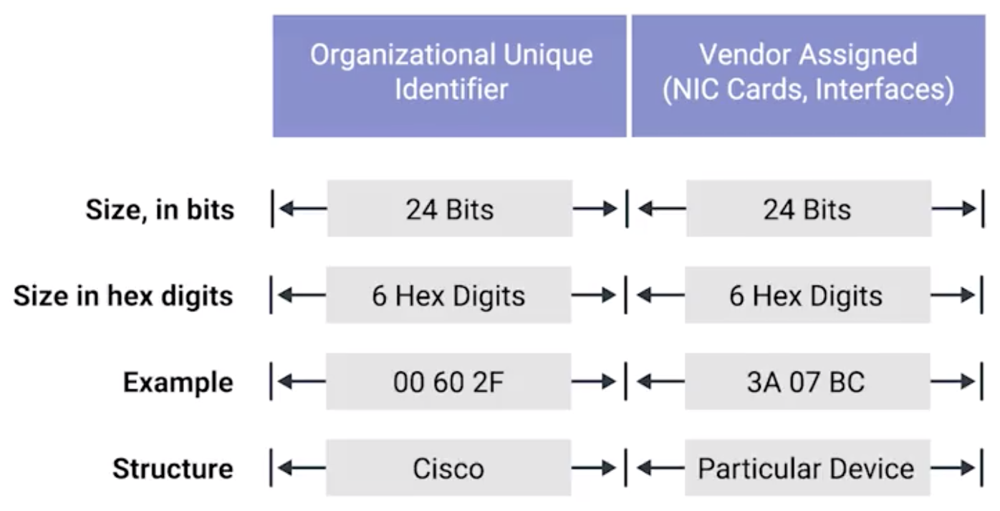

==== MAC 地址分类

计算机网络的区域，它由每个单台计算机或与网络连接设备组成，该区域可以通过向数据链路层的广播地址发送简单帧来直接访问。整个能够直接访问的区域称为广播域，广播域是网络上的一个逻辑部分，这部分网络中的任意设计不经过路由（网关）可直接向任意其他一个设备发送数据。一个广播域中的所有设备或节点位于同一个 LAN 或 VLAN。

一个 LAN 或 VLAN 中不同网络节点通信通常包括：

* 1 对 1：一个节点发送数据包只给另一个节点
* 1 对多：一个节点发送数据包给部分节点
* 1对所有：一个节点发送数据包给网络中所有节点

对应这三种方式， 为支持这种能力，MAC 地址分为三类，单播MAC地址、组播MAC地址和广播MAC地址。

.*单播, 组播, 广播*
|===
|类型 |模式 |说明

|Unicast（单播）
|一对一
|Unicast 传输始终意味着只有一个接收地址。MAC 地址中第一组数字的最后一个二进位为 0，则 Ethernet 帧发送到一个地址。

|Multicast（组播）
|一对多
|Multicast 传输发送到多个物理地址。MAC 地址中第一组数字的最后一个二进位为 1，则 Ethernet 帧发送到多个地址。

|Broadcast（广播）
|一对所有
|Ethernet 广播发送到 LAN 中的所有地址（广播域）, MAC 地址的所有位都为 f。
|===

[source, text]
.*示例 - Unicast MAC 地址*
----
16:91:99:24:68:c9
b6:fe:ee:92:78:42
fa:4e:1b:7f:27:7f
----

如上三个示例 MAC 地址第一组 16 进制转化为 2 进制对应如下：

* `16` - `00010110`
* `b6` - `10110110`
* `fa` - 11111010

[source, text]
.*示例 - Multicast MAC 地址*
----
6b:b7:22:a4:a4:cb
97:20:82:57:fa:e5
a7:50:c1:30:ca:c1
----

如上三个示例 MAC 地址第一组 16 进制转化为 2 进制对应如下

* `6b` - `01101011`
* `97` - `10010111`
* `a7` - `10100111`

[source, text]
.*示例 - Broadcast MAC 地址*
----
ff:ff:ff:ff:ff:ff
----

=== 以太网帧(Ethernet Frame)

以太网(Ethernet)帧(Frame)是按特定顺序显示的高度结构化的信息集合。这样，可以确保将物理层网络接口将传输的二进制串转化为有意义的数据，或将数据转化为二进制串。

image:img/EthernetPacket.png[]

1. The first part of an Ethernet frame is known as the preamble. A preamble is 8 bytes or 64 bits long and can itself be split into two sections. The first seven bytes are a series of alternating ones and zeros. These act partially as a buffer between frames and can also be used by the network interfaces to synchronize internal clocks they use, to regulate the speed at which they send data. This last byte in the preamble is known as the SFD or start frame delimiter. This signals to a receiving device that the preamble is over and that the actual frame contents will now follow.
2. *Destination MAC Address* - 目的地接收地址硬件的物理地址；
3. *Source MAC Address* - 以太网帧发送端的物理地址；
4. *Type Field* - 16 二进制长度，以太网类型标识字段，包括帧的内容；例如 tag 标记的 VLAN，该字段为 802.1Q。
5. *Payload* - Data payload of an Ethernet frame. A payload in networking terms is the actual data being transported, which is everything that isn't a header. The data payload of a traditional Ethernet frame can be anywhere from 46 to 1500 bytes long.
6. CRC(cyclical redundancy check) checksum, which is a 4-byte or 32-bit number that represents a checksum value for the entire frame.

=== VLAN

为了解决广播域带来的问题，人们引入了VLAN (Virtual Local Area Network)，即虚拟局域网技术。VLAN用来隔离广播域。

与VLAN相对的是LAN，如下图所示，

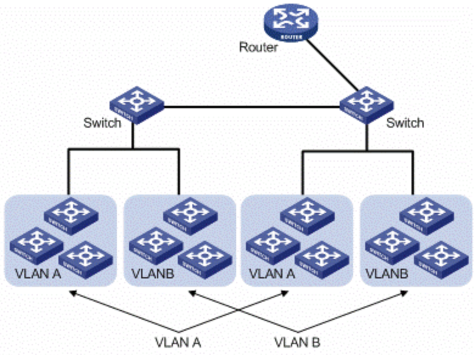

* 通常一个 2 层交换设备相当于一个 LAN， 而VLAN 是一个虚拟的广播域，通常是在一个二层交换设备中创建，当然现代多数 2 层交换设备之间可以相连和交换，不同交换机下的 VLAN 可以位于同一个 VLAN 中。
* VLAN 可以有效的降低广播负载，提高网络性能；传统上引入 VLAN 可以进行更好的安全、分组等控制，而且大多数 2 层交换机厂商的设备默认就有 VLAN 的划分；另外，新的 SDN（软件定义的网络）只有 VLAN 的概念。
* 不同 VLAN 内的报文在传输时相互隔离，即一个VLAN内的用户不能和其它VLAN内的用户直接通信。
* 不同 VLAN 之间的通信是通过路由设备

=== VLAN 划分

可以通过5种方式进行 VLAN 划分：

.*5 种 VLAN 划分方式*
[cols="5a,2,2"]
|===
|VLAN 划分方式 |VLAN 10 |VLAN 20

|*基于接口*

* 根据交换机的接口来划分VLAN
* Port VLAN ID，是接口上的缺省VLAN,取值:1~4094
|GE0/0/1，GE0/0/3
|GE0/0/2，GE0/0/4

|*基于 MAC 地址*

* 根据数据帧的源MAC地址来划分VLAN。
* 映射表记录了MAC地址和VLAN ID的关联情况。
|MAC 1，MAC 3
|MAC 2，MAC 4

|基于IP子网划分
|10.0.1.*
|10.0.2.*

|基于协议划分
|IPv4
|IPv6

|基于策略
|10.0.1.* + GE0/0/1+ MAC 1
|10.0.2.* + GE0/0/2 + MAC 2
|===

.*以太网二层接口类型*
|===
|接口类型 |描述

|Access接口
|接收和发送 Tagged/Untagged 帧，通常用于终端 PC 和交换机相连，只允许一个 VLAN 通过

|Trunk接口
|接收和发送 Tagged/Untagged 帧，Trunk接口有允许通过的 VLAN 列表，只有允许的 VLAN 才允许通过，通常用于交换机和交换机之间互联

|Hybrid接口
|接收和发送 Tagged/Untagged 帧，Access接口 + Trunk接口的结合
|===

VLAN 划分原则：

* 按业务规划
* 按部门规划
* 按应用规划

VLAN分配技巧：

* 为了提高VLAN ID的连续性，可以采用VLAN ID 和子网关联的方式进行分配。

=== STP/RSTP/MSTP

以太网交换网络中为了进行链路备份，提高网络可靠性，通常会使用冗余链路。但是使用冗余链路会在交换网络上产生环路，引发广播风暴以及MAC地址表不稳定等故障现象，从而导致用户通信质量差，甚至通信中断。为解决交换网络中的环路问题，生成树协议STP（Spanning Tree Protocol）应运而生。

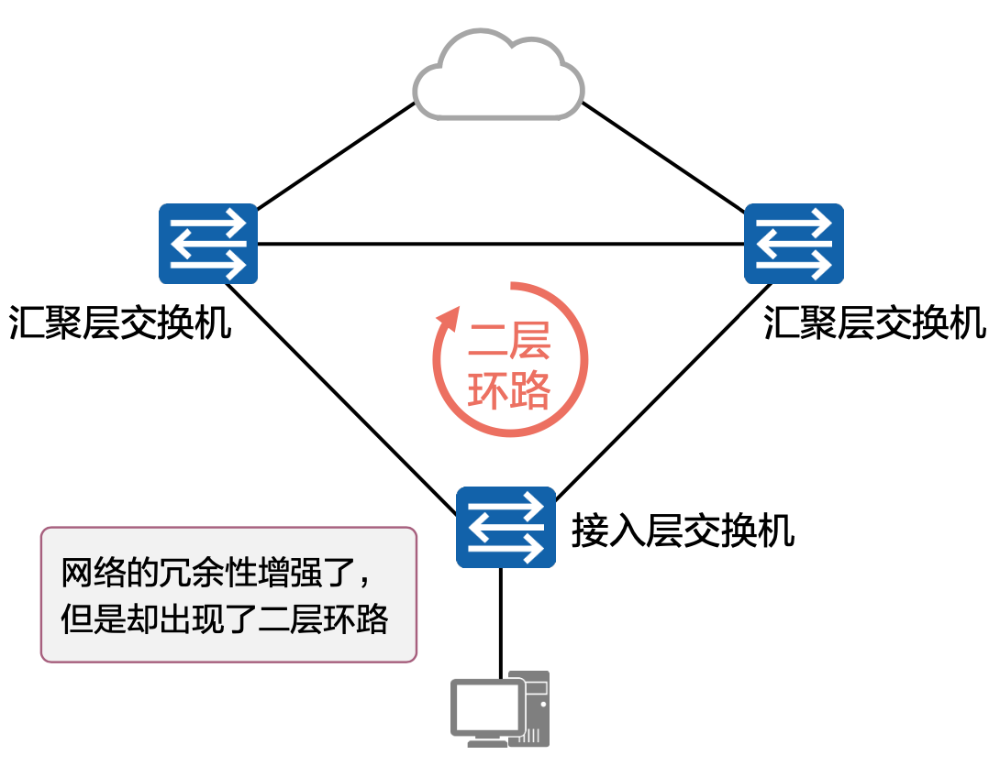

运行STP协议的设备通过彼此交互信息发现网络中的环路，并有选择地对某个接口进行阻塞，最终将环形网络结构修剪成无环路的树形网络结构，从而防止报文在环形网络中不断循环，避免设备由于重复接收相同的报文造成处理性能下降。

STP是一个用于局域网中消除环路的协议: 

* 功能一:防止环路。
* 功能二:提供冗余备份链路。

.*STP的基本概念*
[cols="2,5a"]
|===
|元素 |说明

|桥ID(Bridge ID，BID)
|
* IEEE 802.1D标准中规定BID由16位的桥优先级(Bridge Priority)与桥MAC地址构成。
* 每一台运行STP的交换机都拥有一个唯一的BID。
* BID桥优先级占据高16bit，其余的低48bit是桥MAC地址。
* 在STP网络中，BID最小的设备会被选举为根桥。

|根桥(Root Bridge)
|
* STP的主要作用之一是在整个交换网络中计算出一棵无环的“树”(STP树)。
* 根桥是一个STP交换网络中的“树根”。
* STP开始工作后，会在交换网络中选举一个根桥，作为无环 拓扑的“树根”。
* 在STP网络中，桥ID最小的设备会被选举为根桥。
** 首先比较桥优先级，优先级的值越小，则越优先;
** 如果优先级相等，那么再比较MAC地址，拥有最小MAC 地址的交换机会成为根桥。

|开销(Cost)
|
* 接口的Cost主要用于计算根路径开销，也就是到达根的开销
* 接口的缺省Cost除了与其速率、工作模式有关，还与交换机 使用的STP Cost计算方法有关
* 接口带宽越大，则Cost值越小
* 用户也可以根据需要通过命令调整接口的Cost

|根路径开销(Root Path Cost)
|
* 一台设备从某个接口到达根桥的RPC等于从根桥到该设备沿途所有入方向接口的Cost累加。

|接口ID(Port ID，PID)
|
* 接口ID由两部分构成的，高4 bit是接口优先级，低12 bit是接口编号
* 激活STP的接口会维护一个缺省的接口优先级，在华为交换 机上，该值为128

|BPDU(Bridge Protocol Data Unit，网桥协议数据单元)
|
* BPDU是STP的协议报文
* BPDU分为两种类型
** 配置BPDU(Configuration BPDU)
** TCN BPDU(Topology Change Notification BPDU)
* 配置BPDU是STP进行拓扑计算的关键
* TCN BPDU只在网络拓扑发生变更时才会被触发
|===

在网络中部署生成树后，交换机之间会进行生成树协议报文的交互并进行无环拓扑计算，最终将网络中的某个（或某些）接口进行阻塞（Block），从而打破环路。

.*STP的计算过程*
[cols="2,5a"]
|===
|步骤 |说明
|(1)
|*在交换网络中选举一个根桥*

. STP在交换网络中开始工作后，每个交换机都会向网络中发 送配置BPDU。配置BPDU中包含交换机自己的桥ID。
. 网络中拥有最小桥ID的交换机成为根桥。
. 在一个连续的STP交换网络中只会存在一个根桥。
. 根桥的角色是可抢占的。
. 为了确保交换网络的稳定，建议提前规划STP组网，并将规 划为根桥的交换机的桥优先级设置为最小值0。

|(2)
|*在每台非根桥上选举一个根接口*

. 每一台非根桥交换机都会在自己的接口中选举出一个接口。
. 非根桥交换机上有且只会有一个根接口。
. 当非根桥交换机有多个接口接入网络中时，根接口是其收到 最优配置BPDU的接口。
. 可以形象地理解为，根接口是每台非根桥上“朝向”根桥的接口。

|(3)
|*在每条链路上选举一个指定接口*

. 根接口选举出来后，非根桥会使用其在该接口上收到的最优 BPDU进行计算，然后将计算得到的配置BPDU与除了根接口 之外的其他所有接口所收到的配置BPDU进行比较:
.. 如果前者更优，则该接口为指定接口;
.. 如果后者更优，则该接口为非指定接口。
. 一般情况下，根桥的所有接口都是指定接口。

|(4)
|*非指定接口被阻塞*

. 一台交换机上，既不是根接口，又不是指定接口的接口被称 为非指定接口。
. STP操作的最后一步是阻塞网络中的非指定接口。这一步完 成后，网络中的二层环路就此消除。

|===

==== RSTP

* RSTP（Rapid Spanning Tree Protocol）协议基于STP协议，对原有的STP协议进行了更加细致地修改和补充，实现了网络拓扑快速收敛。
* STP 协议虽然能够解决环路问题，但也存在一些不足之处。RSTP 可以视为 STP 的改进版本，RSTP 在许多方面对 STP 进行了优化，它的收敛速度更快，而且能够兼容 STP。

==== MSTP

RSTP在STP基础上进行了改进，实现了网络拓扑快速收敛。但RSTP和STP还存在同一个缺陷：由于局域网内所有的VLAN共享一棵生成树，因此无法在VLAN间实现数据流量的负载均衡，链路被阻塞后将不承载任何流量，还有可能造成部分VLAN的报文无法转发。为了弥补STP和RSTP的缺陷，提出了MSTP。

* MSTP把一个交换网络划分成多个域，每个域内形成多棵生成树，生成树之间彼此独立。
* 每棵生成树叫做一个多生成树实例MSTI(Multiple Spanning Tree Instance)。
* 所谓生成树实例就是多个VLAN的集合所对应的生成树。
* 通过将多个VLAN捆绑到一个实例，可以节省通信开销和资源占用率。
* MSTP各个实例拓扑的计算相互独立，在这些实例上可以实现负载均衡。
* 可以把多个相同拓扑结构的VLAN映射到一个实例里，这些VLAN在接口上的转发状态取决于接口在对应实例的状态。

=== 链路聚合

链路聚合就是把多个链路聚合在一起，多个网络接口抽象出一个逻辑的网络接口，链路聚合的目的是增加链路的带宽，例如 4 条 100 MB 的链路聚合后带宽是 400 MB。除了增加带宽外，链路聚合还可以增加容错，例如当一条链路不可用不会影响整体聚合链路的可用性。聚合的链路总数通常是 2 的 N 次方（2，4，8）。

不同厂商链路聚合技术各异，F5 BIG-IP 采用 `trunk` 代表一组网络接口的抽象，基于 `trunk`，在 F5 BIG-IP 中最多可聚合 8 条链路。F5 BIG-IP `trunk` 会有一个独立的 MAC 地址，该地址用来和 pee 进行通信。

image:img/link-aggragation.png[]

LACP(Link Aggregation Control Protocol) 链路聚合控制协议是 IEEE 标准 802.3ad 定义，用来检测链路的错误，重传等机制，以确保聚合的链路可靠，容错。

不同网路厂商 LACP 行为不同，例如，Linux Bonding 就是一种软件 LACP 实现，可以灵活配置负载分发方式等。F5 BIG-IP 系统中 LACP 是一个可选配置，可以自定制 LACP 行为，如各个链路数据传输权重等，还可以配置一些控制策略。

链路聚合可以分为手工模式和LACP模式。

.*链路聚合两种模式*
[cols="5a,5a"]
|===
|手工模式 |LACP模式

|Eth-Trunk的建立、成员接口的加入均由手动配置，双方系统之间不使用LACP进行协商。

* 正常情况下所有链路都是活动链路，该模式下所有活动链路都参与数据的转发，平均分担流量，如果某条活动链路故障，链路聚合组自动在剩余的活动链路中平均分担流量。
* 当聚合的两端设备中存在一个不支持 LACP 协议时，可以使用手工模式。

手工模式缺陷:

* 为了使链路聚合接口正常工作，必须保证本端链路聚合接口中所有成员接口的对端接口:
** 属于同一设备
** 加入同一链路聚合接口
* 手工模式下，设备间没有报文交互，因此只能通过管理员人工确认。
* 手动模式下，设备只能通过物理层状态判断对端接口是否正常工作。
|
* 采用LACP协议的一种链路聚合模式。设备间通过链路聚合控制协议数据单元(Link Aggregation Control Protocol Data Unit，LACPDU)进行交互，通过协议协商确保对端是同一台设备、同一个聚合接口的成员接口。
* LACP模式下，两端设备所选择的活动接口数目必须保持一致，否则链路聚合组就无法建立。此 时可以使其中一端成为主动端，另一端(被动端)根据主动端选择活动接口。

|===

=== WLAN

以有线电缆或光纤作为传输介质的有线局域网应用广泛，但有线传输介质的铺设成本高，位置固定，移动性差。随着人们对网络的便携性和移动性的要求日益增强，传统的有线网络已经无法满足需求，WLAN (Wireless Local Area Network，无线局域网)技术应运而生。目前，WLAN已经成为一种经济、高效的网络接入方式。

=== 802.11 帧结构

image:img/802.11-frame.png[]

* *Frame Control* - Frame control field is 16 bits long, and contains a number of sub-fields that are used to describe how the frame itself should be processed.
* *Duration ID* - It specifies how long the total frame is. So, the receiver knows how long it should expect to have to listen to the transmission.
* *Address* - There are four address fields, because there needs to be room to indicate which wireless access point should be processing the frame. So, we'd have our normal source address field, which would represent the MAC address of the sending device.
* *Sequence Control* - Sequence control field is 16 bits long and mainly contains a sequence number used to keep track of ordering the frames.
* *Data payload* - Data payload section which has all of the data of the protocols further up the stack.
* *FCS* - Frame check sequence field which contains a checksum used for a cyclical redundancy check.

=== WAN

广域网是连接不同地区局域网的网络，通常所覆盖的范围从几十公里到几千公里。它能连接多个地区、城市和 国家，或横跨几个洲提供远距离通信，形成国际性的远程网络。

NOTE: WAN technologies usually require that you contract a link across the Internet with your ISP. This ISP handles sending your data from one side to the other. So, it could be like all of your computers are in the same physical location.

WAN 协议：

* https://en.wikipedia.org/wiki/Frame_Relay[Frame Relay]
* https://en.wikipedia.org/wiki/High-Level_Data_Link_Control[High-Level Data Link Control]
* https://en.wikipedia.org/wiki/Asynchronous_transfer_mode[Asynchronous transfer mode]

.*广域网技术发展阶段*
[cols="2,5a"]
|===
|阶段 |说明

|传统 IP 路由转发
|传统的 IP 转发采用的是逐跳转发。数据报文经过每一台路由器，都要被解封装查看报文网络层信息，然后根据路由最长匹配 原则查找路由表指导报文转发。各路由器重复进行解封装查找路由表和再封装的过程，所以转发性能低。

传统 IP 路由转发的特点:

* 所有路由器需要知道全网的路由。
* 传统 IP 转发是面向无连接的，无法提供较好的端到 端QoS保证。

|MPLS 标签转发
|

* MPLS 是一种 IP 骨干网技术。
* MPLS 是一种隧道技术，在 IP 路由和控制协议的基础上，向网络层提供面向连接的交换。能够提供较好的 QoS 保证。
* MPLS 标签指导报文转发的过程中，使用本地标签查找替代传统 IP 转发的路由查找，大大提高转发效率。
* MPLS 转发过程中使用的标签，既可以通过手工静态配置，又可以通过动态标签分发协议分配。

MPLS 的标签分发有静态和动态两种方式，均面临着不同的问题:

* 静态标签分发为手工配置。
* 动态标签分发的问题。

|Segment Routing 转发
|为解决传统IP转发和MPLS转发的问题，业界提出了SR (Segment Routing，分段路由)。SR的转发机制有很 大改进，主要体现在以下几个方面:

* *基于现有协议进行扩展:* 扩展后的IGP/BGP具有标签分发能力，因此网络中无需其他任何标签分发协议，实现协议简化。
* *引入源路由机制:* 基于源路由机制，支持通过控制器进行集中算路。
* *由业务来定义网络:* 业务驱动网络，由应用提出需求(时延、带宽、丢包率等)，控制器收集网络拓扑、带宽利用率、时延等信息，根据业务需求计算显式路径。

|===

=== PPP/PPPoE

==== PPP

* PPP是一种常见的广域网数据链路层协议，主要用于在全双工的链路上进行点到点的数据传输封装。
* PPP(Point-to-Point Protocol，点到点协议)是一种常见的广域网数据链路层协议，主要用于在全双工的链路上进行点到点 的数据传输封装。
* PPP提供了安全认证协议族PAP(Password Authentication Protocol，密码验证协议)和CHAP(Challenge Handshake Authentication Protocol，挑战握手认证协议)。
* PPP协议具有良好的扩展性，例如，当需要在以太网链路上承载PPP协议时，PPP可以扩展为PPPoE。
* PPP协议提供LCP(Link Control Protocol，链路控制协议)，用于各种链路层参数的协商，例如最大接收单元，认证模式等。
* PPP协议提供各种NCP(Network Control Protocol，网络控制协议)，如IPCP(IP Control Protocol ，IP控制协议)，用于 各网络层参数的协商，更好地支持了网络层协议。

==== PPPoE

* PPPoE是一种把PPP帧封装到以太网帧中的链路层协议。PPPoE可以使以太网网络中的多台主机连接到远端的宽带接入服务器。
* PPPoE(PPP over Ethernet，以太网承载PPP协议)是一种把PPP帧封装到以太网帧中的链路层协议。PPPoE可 以使以太网网络中的多台主机连接到远端的宽带接入服务器。
* PPPoE集中了PPP和Ethernet两个技术的优点。既有以太网的组网灵活优势，又可以利用PPP协议实现认证、计费等功能。
* PPPoE实现了在以太网上提供点到点的连接。PPPoE客户端与PPPoE服务器端之间建立PPP会话，封装PPP数据 报文，为以太网上的主机提供接入服务，实现用户控制和计费，在企业网络与运营商网络中应用广泛。
* PPPoE的常见应用场景有家庭用户拨号上网、企业用户拨号上网等。

== 网络层

=== IPv4 数据报文结构

IPv4 数据报文是由一系列高度结构化的字段严格定义，IP 数据两个主要部分是 header 和 payload。

image:img/ip-datagrams.png[]

* *Version* - 第一个字段长度为 4 个二进制位，代表着 IP 协议的版本。常见的 IP协议版本是 4，即 IPv4。
* *Header Length* - Header Length 字段长度为 4 个二进制位，代表着整个 header 的长度。如果是 IPv4，则 Header 的长度永远都是 20，事实上，20 个字节是 IP header 的最小长度，你不能在小于 20 自己的空间里合适的描述一个 IP Header。
* *Service Type* - Service Type 字段长度为 8 个二进制位，用来指定 QoS 技术的详细情况。QoS 的作用是允许路由器作出决策，在一系列 IP 数据报文中，选择出最为重要的一个数据报文。
* *Total Length* - Total Length 字段长度为 16 个二进制位，用来表示 IP 数据报文的整体长度。单个数据报文的最大长度为 16 个二进制位都为 1，即为 65,535。
* *Identification* - Identification 字段长度为 16 个二进制位，用来将消息分组在一起，当要发送的数据大于单个数据报文允许的最大值时，则 IP 层需要将原始的大的数据包分割成几个小的数据包，在这种情况下 Identification 字段用来被接收端标识分割后的
数据包属于同一个数据包。
* *Flag* - Flag 字段用来标识数据报文是否允许分段，或者标识数据报文已经分段。
* *Fragmentation* - 是将一个大的 IP 数据报文分割成多个小的数据报文的进程。
* *TTL* - TTL 字段的长度为 8 个二进制位，指定一个数据报文在经过多少个路由跳转后丢弃。
* *Protocol* - Protocol 字段的长度为 8 个二进制位，包含数据标识那个传输层的协议被使用，最常见的传输层协议是 TCP 或 UDP。
* *Header Checksum* - Header checksum 字段用来对整个 IP 数据报文 header进行校验，它和 Ethernet Checksum 字段类似，通常由于 TTL 字段经过任意一个路由器时都会被修改，Header Checksum 字段相应的也会被修改。
* *Source IP Address* - 长度为 32 个二进制位，代表着源 IP 地址。
* *Destination IP Address* - 长度为 32 个二进制位，代表着目的地 IP 地址。
* *Option* - 可选的字段，用来设定一些特定字符，通常用于测试目的。
* *Padding* - 相当于一个占位符字段，由于 Option 字段时可选的一个变量，长度不定，该字段只是一些 0 串，用来确保 Header 的整体长度。

=== IPv4 地址

image:img/ipv4address-netmask.png[ipv4address-netmask.png]

* IPv4 地址长度为 32 为二进制数，由 4 组十进制数组成，4 组十进制数之间通过圆点连接
* IPv4 地址有两部组成：网络部分(Network)和主机部分(Host)，同一子网的所有主机可以不经过路由而连通彼此，同一子网中主机部分唯一。
* 子网掩码用来区分网络部分和主机部分，如上图，10.66.192.36 子网掩码为 255.255.0.0，即前缀是 16，则为 10.66 网段。
* 广播地址：当主机部分所有为位置为1是就为广播地址，如上两个地址的广播地址分别为 192.168.1.255，10.66.255.255.
* IPv4 地址范围 0.0.0.0 - 255.255.255.255。

[source, text]
.*示例：IBM IP 地址，9 是网络地址，100.100.100 是主机地址*
----
9.100.100.100
----

==== 二进制和十进制转换

image:img/bits2decimal.png[]

==== IPv4 地址分类 

为了更好的管理互联网网络，IPv4 地址被分为五个类型：A、B、C、D、E，地址分类是从两个维度进行（或依赖两个原则）：

* 以第一个十进制数字的范围作为基准划分：
** 0 - 127 为 A 类地址
** 128 - 191 为 B 类地址
** 192 - 223 为 C 类地址
** 224 - 239 为 D 类地址
** 240 - 255 为 E 类地址
* 以网络部分和主机部分作为基准的划分：
** A 类地址只有第一组为网络地址，后面三组为主机地址
** B 类地址前两组为网络地址，后两组为主机地址
** C 类地址前三组为网络地址，后一组为主机地址 

对比 IPv4 地址的二进制表述和十进制表述可以帮助理解 IPv4 地址分类：

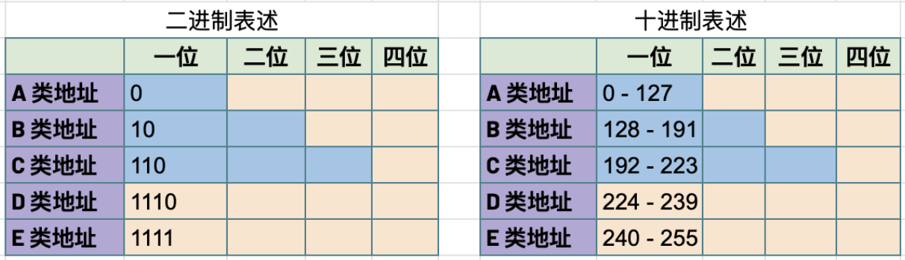

.*IPv4 地址分类*
|===
|类型 |描述 |范围 |最大主机数

|A
|第一位十进制数用来做网络地址，后面三位十进制数用来做主机地址；以二进制表述，第一位以 0 开头，即二进制范围为 00000000 - 01111111
|0.0.0.0 - 127.255.255.255
|16 M

|B
|前两位十进制数用来做网络地址，后面二位十进制数用来做主机地址；以二进制表述，第一位以 10 开头，即二进制范围为 10000000 - 10111111
|128.0.0.0 - 191.255.255.255
|64000

|C
|前三位十进制数用来做网络地址，后面一位十进制数用来做主机地址；以二进制表述，第一位以 110 开头，即二进制范围 11000000 -  11011111
|192.0.0.0 - 223.255.255.255
|254

|Class D
|以二进制表述，第一位以 1110 开头，用于多播通信，即一个 IP数据报文可以发送到 多个地址
|224.0.0.0 - 239.255.255.255
|

|Class E
|以二进制表述，第一位以 1111 开头，预保留分类，供以后使用
|240.0.0.0 - 255.255.255.255
|
|===

==== 不能分配给网络设备地址

不是所有的 IP 地址可以分配给网络设备，如下一些地址属预留地址，不能分配给网络设备：

* *0.0.0.0* : 代表所有网络
* *127.0.0.0 - 127.255.255.255* : loopback 本地测试地址
* *224.0.0.0 - 239.255.255.255* : 类型 D 多播通信预留地址
* *240.0.0.0 - 255.255.255.254* : 类型 E 预留地址段，未来使用
* *255.255.255.255* : 代表所有主机
* 网络地址和广播地址
** 一个网络中的第一个地址称为网络地址，用于标识一个网络，这个个地址是网络预留地址
** 一个网络中最后一个地址称为广播地址，是一个地址是广播地址，用于向该网络中所有主机发送数据的特殊地址
** 例如 10.1.10.0/24 网络，10.1.10.0 是网络预留地址，10.1.10.255 是多播地址。

参照 link:https://zh.wikipedia.org/wiki/分类网络[🔗]了解更多关于网络分类。

==== 不可路由的地址

不可路由的地址空间是一些 IP 范围，可以被任何人使用，但是不能路由。不是每台每台连接到 Internet 的计算机都需要能够与其他连接到 Internet 的计算机进行通信，不可路由的地址为这一需求而定，此类节点构成的网络他们可以相互通信，但没有网关路由器会尝
试将流量转发到此类网络。

对应 IPv4地址范围，不可路由的地址空间主要有三个范围：

.*不可路由的IPv4地址*
|===
|所属分类 |网络 |地址范围
|A
|10.0.0.0/8
|10.0.0.0 - 10.255.255.255.255
|B
|172.16.0.0/12
|172.16.0.0 - 172.31.255.255
|C
|192.168.0.0/16
|192.168.0.0 - 192.168.255.255
|===

NOTE: 详细参照 http://www.ietf.org/。

=== IPv4 子网划分

“有类编址”的地址划分过于死板，划分的颗粒度太大，会有大量的主机号不能被充分利用，从而造成了大量的IP地址资源浪费。因此可以利用子网划分来减少地址浪费，将一个大的有类网络，划分成若干个小的子网，使得IP地址的使用更为科学。那么我们来看一下如何完成子网划分。

如果一个 IPv4 地址 属于 A 类或 B类地址，则可能存在的最大主机较多，这就需要子网来进一步分组成较小的网络，这就叫做子网。

==== 子网掩码

子网掩码长度也为 32 位二进制数，通常由 4 组十进制数组成，4 组十进制数之间通过圆点连接，二进制表述，子网掩码由连续的 1 和 连续的 0 构成，通常子网掩码由十进制表述，例如下表为一些子网掩码二进制和十进制示例：

.*子网掩码*
|===
|二进制 |十进制

|11111111.11111111.11111111.00000000
|255.255.255.0

|11111111.11111111.00000000.00000000
|255.255.0.0

|11111111.00000000.00000000.00000000
|255.0.0.0

|11111111.11111111.11111110.00000000
|255.255.254.0

|11111111.11111111.11111100.00000000
|255.255.252.0

|11111111.11111111.11111000.00000000
|255.255.248.0

|11111111.11111111.11110000.00000000
|255.255.240
|===

*子网掩码示例*

image:img/ip-subnetmask.png[]

==== CIDR(classless inter-domain routing)

* CIDR 是描述 IP 地址的一种更加灵活的方法，以斜杠 + 数字来表示掩码长度，这样对子网的划分更加易读。
* CIDR(classless inter-domain routing，无类别域间路由)采用IP地址加掩码长度来标识网络和子网，而不 是按照传统A、B、C等类型对网络地址进行划分。
* CIDR容许任意长度的掩码长度，将IP地址看成连续的地址空间，可以使用任意长度的前缀分配，多个连续的 前缀可以聚合成一个网络，该特性可以有效减少路由表条目数量。

https://ipaddressguide.com/cidr

.*CIRD*
|===
|二进制 |十进制 | CIDR

|11111111.11111111.11111111.00000000
|255.255.255.0
|/24

|11111111.11111111.00000000.00000000
|255.255.0.0
|/16

|11111111.00000000.00000000.00000000
|255.0.0.0
|/8

|11111111.11111111.11111110.00000000
|255.255.254.0
|/23

|11111111.11111111.11111100.00000000
|255.255.252.0
|/22

|11111111.11111111.11111000.00000000
|255.255.248.0
|/21

|11111111.11111111.11110000.00000000
|255.255.240
/20
|===

.*CIRD /30 示例*
|===
|CIDR |Netmask |First IP |Last IP

|10.1.10.0/30
|255.255.255.252
|10.1.10.0
|10.1.10.3

|10.1.10.4/30
|255.255.255.252
|10.1.10.4
|10.1.10.7

|10.1.10.8/30
|255.255.255.252
|10.1.10.8
|10.1.10.11

|10.1.10.12/30
|255.255.255.252
|10.1.10.12
|10.1.10.15

|10.1.10.16/30
|255.255.255.252
|10.1.10.16
|10.1.10.19

|10.1.10.20/30
|255.255.255.252
|10.1.10.20
|10.1.10.23

|10.1.10.24/30
|255.255.255.252
|10.1.10.24
|10.1.10.27

|10.1.10.28/30
|255.255.255.252
|10.1.10.28
|10.1.10.31

|10.1.10.32/30
|255.255.255.252
|10.1.10.32
|10.1.10.35

|10.1.10.36/30
|255.255.255.252
|10.1.10.36
|10.1.10.39

|10.1.10.40/30
|255.255.255.252
|10.1.10.40
|10.1.10.43

|10.1.10.44/30
|255.255.255.252
|10.1.10.44
|10.1.10.47

|10.1.10.48/30
|255.255.255.252
|10.1.10.48
|10.1.10.51

|10.1.10.52/30
|255.255.255.252
|10.1.10.52
|10.1.10.55

|10.1.10.56/30
|255.255.255.252
|10.1.10.56
|10.1.10.59

|10.1.10.60/30
|255.255.255.252
|10.1.10.60
|10.1.10.63

|10.1.10.64/30
|255.255.255.252
|10.1.10.64
|10.1.10.67

|10.1.10.68/30
|255.255.255.252
|10.1.10.68
|10.1.10.71

|10.1.10.72/30
|255.255.255.252
|10.1.10.72
|10.1.10.75

|10.1.10.76/30
|255.255.255.252
|10.1.10.76
|10.1.10.79

|10.1.10.80/30
|255.255.255.252
|10.1.10.80
|10.1.10.83

|10.1.10.84/30
|255.255.255.252
|10.1.10.84
|10.1.10.87

|10.1.10.128/30
|255.255.255.252
|10.1.10.128
|10.1.10.131

|10.1.10.240/30
|255.255.255.252
|10.1.10.240
|10.1.10.243

|10.1.10.244/30
|255.255.255.252
|10.1.10.244
|10.1.10.247

|10.1.10.248/30
|255.255.255.252
|10.1.10.248
|10.1.10.251

|10.1.10.252/30
|255.255.255.252
|10.1.10.252
|10.1.10.255
|===

.*CIRD /27 示例*
|===
|CIDR |Netmask |First IP |Last IP

|10.1.10.0/27
|255.255.255.224
|10.1.10.0
|10.1.10.31

|10.1.10.32/27
|255.255.255.224
|10.1.10.32
|10.1.10.63

|10.1.10.64/27
|255.255.255.224
|10.1.10.64
|10.1.10.95

|10.1.10.96/27
|255.255.255.224
|10.1.10.96
|10.1.10.127

|10.1.10.128/27
|255.255.255.224
|10.1.10.128
|10.1.10.159

|10.1.10.160/27
|255.255.255.224
|10.1.10.160
|10.1.10.191

|10.1.10.192/27
|255.255.255.224
|10.1.10.192
|10.1.10.223

|10.1.10.224/27
|255.255.255.224
|10.1.10.224
|10.1.10.255
|===

=== ICMP

ICMP(Internet Control Message Protocol)是IP协议的辅助协协议，用来在网络设备间传递各种差错和控制信息，对于收集各种网络信息、诊断和排除各种网络故障等方面起着至关重要的作用。

.*ICMP packet Struct:*
image:img/icmp-struct.png[]

* *Type* - Type field is eight bits long which specifies what type of message is being delivered.
* *Code* - Code field indicates a more specific reason for the message than just the type.
* *Checksum* - Checksum is 16 bit length, that works like every other checksum field in other frame, like Ethernet frame, IP datagram and TCP segment.
* *Rest of header* - A 32 bit field with an uninspired name, this field is optionally used by some of the specific types and codes to send more data.
* *Data payload* - Data payload for an ICMP packet exists entirely so that the recipient of the message knows which of their transmissions caused the error being reported.

.*Type/Code 对照表*
|===
|Type |Code |描述
|0
|0
|Echo Reply

|3
|0
|网络不可达

|3
|1
|主机不可达

|3
|2
|协议不可达

|3
|3
|端口不可达

|5
|0
|重定向

|8
|0
|Echo Request
|===

=== ARP

* ARP(Address Resolution Protocol) 协议用来通过特定的 IP 地址发现该 IP 地址对应的硬件设备的 MAC 地址。
* 通常网络设备都有一个 ARP 表，ARP 表中包含着一系列 IP 地址与 MAC 地址对应的条目。ARP 表中条目通常 会在较短的时间后过期，以确保网络设备及时感知到网络的变更。

==== tcpdump 抓去 ARP 包

客户端和服务器端通信场景，本部分通常 `arp` 名称和 `tcpdump` 命令抓取 ARP 包，并查看 IP 和 MAC 映射列表。

* 客户端主机 client.example.com, IP 为 192.168.33.101
* 服务端主机 server.example.com, IP 为 192.168.33.201

[source, bash]
.*1. 客户端删除服务器端记录*
----
sudo arp -d server.example.com
----

[source, bash]
.*2. 客户端执行 ping 服务器端命令，会触发客户端 向服务器端发送 ARP 包*
----
ping 192.168.33.201 -c3
----

[source, bash]
.*3. 客户端查看 ARP 表*
----
$ arp -e -i eth1
Address                  HWtype  HWaddress           Flags Mask            Iface
192.168.33.1             ether   0a:00:27:00:00:05   C                     eth1
server.example.com       ether   08:00:27:c3:0f:80   C                     eth1
----

NOTE: 如上说明服务器端 MAC 地址为 `08:00:27:c3:0f:80`。

[source, bash]
.*4. 服务器端抓包*
----
$ sudo tcpdump -vvv -nn -w arp.cap -i eth1 arp
$ tcpdump -r arp.cap 
reading from file arp.cap, link-type EN10MB (Ethernet)
02:09:34.895590 ARP, Request who-has server.example.com tell 192.168.33.101, length 46
02:09:34.895609 ARP, Reply server.example.com is-at 08:00:27:c3:0f:80 (oui Unknown), length 28
----

NOTE: 抓包结果可以看到，ARP 请求包中内容比较直接，询问 `server.example.com` 的 MAC 地址，并要求告诉客户端 `192.168.33.101`；服务端的回复也比较直接，告诉了客户端，`server.example.com` 的 MAC 地址为 `08:00:27:c3:0f:80`

[source, bash]
.*5. 服务器端查看 MAC 地址，验证与上面第 3 步中客户端 ARP 表中以及第 4 步抓包中获取的 MAC 地址是否相同*
----
$ ip addr show eth1 | grep ether
    link/ether 08:00:27:c3:0f:80 brd ff:ff:ff:ff:ff:ff
----

*6. 详细分析 ARP 请求包*

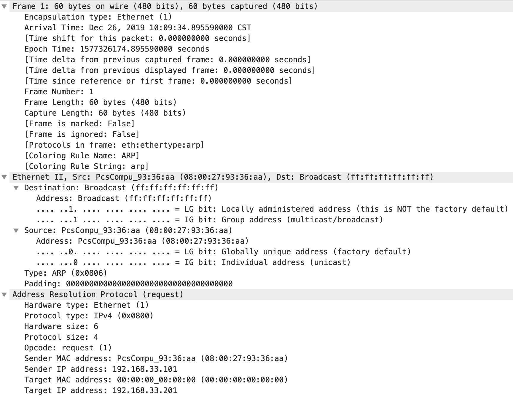

* Ethernet 帧的目的地址是一个广播地址 `ff:ff:ff:ff:ff:ff`
* Ethernet 帧的类型为 ARP，即 Ethernet 帧的数据 Payload 为 ARP 请求包
* ARP 请求硬件协议为 Ethernet，类型为 IPv4
* ARP 请求发送者的 IP `192.168.33.101`，目的者的 IP `192.168.33.201`

=== 路由

==== 什么是路由

* 路由是指导报文转发的路径信息，通过路由可以确认转发IP报文的路径。
* 路由设备是依据路由转发报文到目的网段的网络设备，最常见的路由设备:路由器。
* 路由设备维护着一张路由表，保存着路由信息。

==== 路由器

路由器是网络层设备（三层网络设备），它根据数据包的目的地址转发相应的数据包，将这一数据包的转发过程称为路由。一个路由器设备至少有两个网络接口，因为路由器工作机制至少需要连接连个网络。

==== 路由的基本过程

下图描述了位于不同网络的 PC 通过路由器进行通信。数据包经过路由器转发到目的 PC 的过程就是路由的基本过程，具体包括四个步骤：

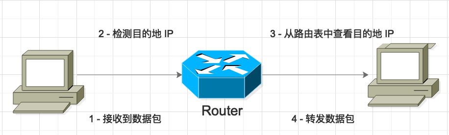
 
1. 路由器通过它的一个网络接口接收到一个数据包
2. 路由器检测数据包中目的地的 IP 地址（对源数据链路层以太网帧的头和尾去掉，只保留 IP 数据报文，从 IP 数据报文的头中获取目的地 IP 地址）
3. 路由器从路由表中查询目的地的 IP 地址
4. 路由器通过它的一个网络接口将数据包转发出去（修改 2 步骤中的 IP 数据报文，对 IP 数据报文头中的 TTL 字段减一，重新计算 Header Checksum 字段，然后封装一个新的太网帧，添加头和尾）

NOTE: 如果数据包传输跨多个网络，则查询路由表或找出最近的一个网络将数据包转发出去，同时每经过一次路由，IP 数据报文的 TTL 字段都会减小 1。

==== 路由表

路由表结构比较简单，通常有四个列：

1. Destination - 目的地网络，路由器上已知的所有网络都会存在一行，代表的是目的地的网络，包括网络地址和子网掩码。
2. Next Hop - 是去往目的网络最近的路由器的 IP 地址；如果去往目的网络不需要经过网络跳转，或者说目的地和路由器在同一个网络，则该字段是目的地的 IP 地址。
3. Total Hops - 这是了解路由以及路由表如何工作的关键部分，在任何复杂的网络（如Internet）上，从一个点到另一个点都有很多不同的路径。
4. Interface - 路由器的网络接口，该接口用于将数据包从路由器转发出去

[source, bash]
.*Linux 上 route 命令查看路由信息*
----
$ route -nv
Kernel IP routing table
Destination     Gateway         Genmask         Flags Metric Ref    Use Iface
0.0.0.0         10.1.10.2       0.0.0.0         UG    0      0        0 external
0.0.0.0         10.1.1.1        0.0.0.0         UG    9      0        0 mgmt
10.1.1.0        0.0.0.0         255.255.255.0   U     0      0        0 mgmt
10.1.10.0       0.0.0.0         255.255.255.0   U     0      0        0 external
10.1.20.0       0.0.0.0         255.255.255.0   U     0      0        0 internal
127.1.1.0       0.0.0.0         255.255.255.0   U     0      0        0 tmm
127.7.0.0       127.1.1.253     255.255.0.0     UG    0      0        0 tmm
127.20.0.0      0.0.0.0         255.255.0.0     U     0      0        0 tmm_bp
----

[source, bash]
.*Linux 上 ip route 查看路由信息*
----
$ ip route list
default via 10.1.10.2 dev external 
default via 10.1.1.1 dev mgmt  metric 9  mtu 1500
10.1.1.0/24 dev mgmt  proto kernel  scope link  src 10.1.1.245 
10.1.10.0/24 dev external  proto kernel  scope link  src 10.1.10.240 
10.1.20.0/24 dev internal  proto kernel  scope link  src 10.1.20.240 
127.1.1.0/24 dev tmm  proto kernel  scope link  src 127.1.1.254 
127.7.0.0/16 via 127.1.1.253 dev tmm 
127.20.0.0/16 dev tmm_bp  proto kernel  scope link  src 127.20.0.254 
----

路由表中路由条目获取有三种方式：

* *直连路由* - 由设备自动生成指向本地直连网络
* *静态路由* - 由网络管理员手工配置的路由条目
* *动态路由* - 路由器运行动态路由协议学习到的路由

==== 路由协议

路由协议主要目的有两个：

1. 网络发现
2. 路由表更新

路由协议可以分为两类：

1. IGP(Interior Gateway Protocol 内部网关协议) - IGP 通常是在一个自治系统（Autonomous system, AS，一个，有时是多个实体管辖下的所有 IP 网络和路由器的全体，例如一个企业/组织的内网）内路由器共享信息
2. EGP(Exterior Gateway Protocol 外部网关协议) - EGP 是自制系统之间路由器共享信息。

IGP 协议可以进一步分为两类：

1.  链路状态路由协议（Link State Routing Protocol）
2.  距离矢量路由协议（Distance-Vector Protocol）。

.*IGP 路由协议*
[cols="5a,5a"]
|===
|距离矢量路由协议 | 链路状态路由协议

|
image:img/routing-instance-vector-protocol.png[]
|
image:img/routing-link-state-protocol.png[]

|距离矢量路由协议是一个旧的标准。使用距离矢量路由协议的路由器获取其路由表，该路由表包括它已知的每个网络的列表，以及这些网络在跳数方面的距离。 然后路由器将此路由表发送给每个相邻路由器，即是直接与其相连的每个路由器。在计算机科学中，列表称为向量，这就是距离矢量协议的名字由来。 借助距离矢量路由协议，路由器实际上对自治系统的总体状态了解不多，他们只是了解一些与其直接相邻的路由器的信息。
|链路状态路由协议采用更加复杂的方式来确定网络的最佳路径。链接状态协议之所以得名，是因为每个路由器都会通告其每个接口的链接状态。这些接口可以连接到其他路由器，也可以直接连接到网络。 有关每个路由器的信息将传播到自治系统上的每个其他路由器。这意味着系统上的每个路由器都知道有关系统中其他每个路由器的每个细节。
|=== 

NOTE: IANA(Internet Assigned Numbers Authority) 是一个非盈利的组织，前面已经知道它负责 IP 地址的分配，除了负责 IP 地址的 分配，该组织还负责 ASN(Autonomous System Number,自治系统编号)的分配，ASN 是分配给各个自治系统的编号，就像 IP 地址，ASN 也是一个 32 位二进制数，但和 IP 地址不同的是 ASN 是一个十进制的数，而不是每八位分成一组。 

==== 动态路由协议

现代路由器设备通常通过动态路由器共享远程网络的状态和可达性，如下是一些常见的动态路由协议

* https://en.wikipedia.org/wiki/Routing_Information_Protocol[EIP(Routing Information Protocol)]
* https://en.wikipedia.org/wiki/Enhanced_Interior_Gateway_Routing_Protocol[EIGRP(Enhanced Interior Gateway Routing Protocol)]
* https://en.wikipedia.org/wiki/Open_Shortest_Path_First[OSPF(Open Shortest Path First)]
* https://en.wikipedia.org/wiki/Border_Gateway_Protocol[BGP(Border Gateway Protocol)]

动态路由协议的优点是：

* 动态更新路由表
* 不仅仅针对不同的网络可以选择出一个最佳路径，而且在初始最佳路径不可用（网络拓扑变化）后可以重新选择出一个最佳路径
* 不同路由器之间动态共享路由信息，而不需要网络管理员人为参与

=== OSPF

==== 概述

由于静态路由无法适应规模较大的网络且无法动态响应网络变化，就有了动态路由协议。静态路由协议有一下问题：

. 无法适应规模较大的网络
. 无法动态响应网络变化

动态路由分类：

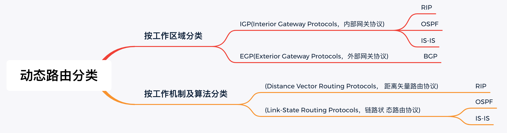

OSPF是典型的链路状态路由协议，是目前业内使用非常广泛的IGP协议之一:

* OSPF是典型的链路状态路由协议，是目前业内使用非常广泛的IGP协议之一。
* 目前针对IPv4协议使用的是OSPF Version 2(RFC2328);针对IPv6协议使用OSPF Version 3(RFC2740)。如无特 殊说明本章后续所指的OSPF均为OSPF Version 2。
* 运行OSPF路由器之间交互的是LS(Link State，链路状态)信息，而不是直接交互路由。LS信息是OSPF能够正常进行 拓扑及路由计算的关键信息。
* OSPF路由器将网络中的LS信息收集起来，存储在LSDB中。路由器都清楚区域内的网络拓扑结构，这有助于路由器计 算无环路径。
* 每台OSPF路由器都采用SPF算法计算达到目的地的最短路径。路由器依据这些路径形成路由加载到路由表中。
* OSPF支持VLSM(Variable Length Subnet Mask，可变长子网掩码)，支持手工路由汇总。
* 多区域的设计使得OSPF能够支持更大规模的网络。

.*OSPF 基础术语*
[cols="2,5a"]
|===
|术语 |解释

|区域
|

* OSPF Area用于标识一个OSPF的区域。
* 区域是从逻辑上将设备划分为不同的组，每个组用区域号(Area ID)来标识。

|Router-ID
|

* Router-ID(Router Identifier，路由器标识符)，用于在一个OSPF域中唯一地标识一台路由器。
* Router-ID的设定可以通过手工配置的方式，或使用系统自动配置的方式。

|度量值
|

* OSPF使用Cost(开销)作为路由的度量值。每一个激活了OSPF的接口都会维护一个接口Cost值，缺省时 `接口Cost值` = `100 Mbit/s`/`接口带宽` 。其中100 Mbit/s为OSPF指定的缺省参考值，该值是可配置的。

|===

.*OSPF 五类协议报文*
[cols="2,5a"]
|===
|报文名称 |报文功能

|Hello
|周期性发送，用来发现和维护OSPF邻居关系。

|Database Description
|描述本地LSDB的摘要信息，用于两台设备进行数据库同步。

|Link State Request
|用于向对方请求所需要的LSA。设备只有在OSPF邻居双方成功交换DD报文 后才会向对方发出LSR报文。

|Link State Update
|用于向对方发送其所需要的LSA。

|Link State ACK
|用来对收到的LSA进行确认。

|===

.*OSPF 三大表项* 
[cols="2,5a"]
|===
|表项 |说明

|邻居表
|

* OSPF在传递链路状态信息之前，需先建立OSPF邻居关系。
* OSPF的邻居关系通过交互Hello报文建立。
* OSPF邻居表显示了OSPF路由器之间的邻居状态

|LSDB 表
|

* LSDB会保存自己产生的及从邻居收到的LSA信息

|OSPF 路由表
|

* OSPF路由表和路由器路由表是两张不同的表项
* OSPF路由表包含Destination、Cost和NextHop等指导转发的信息
|===

.*OSPF 四种网络类型*
[cols="2,5a"]
|===
|类型 |说明

|P2P(Point-to-Point，点对点)
|

* P2P 指的是在一段链路上只能连接两台网络设备的环境。
* 典型的例子是PPP链路。当接口采用PPP封装时，OSPF 在该接口上采用的缺省网络类型为P2P 。

|BMA(Broadcast Multiple Access，广播式多路访问)
|

* BMA也被称为Broadcast，指的是一个允许多台设备接入 的、支持广播的环境。
* 典型的例子是Ethernet(以太网)。当接口采用Ethernet 封装时，OSPF在该接口上采用的缺省网络类型为BMA。

|NBMA(Non-Broadcast Multiple Access，非广播式多路访问)
|

* NBMA指的是一个允许多台网络设备接入且不支持广播 的环境。
* 典型的例子是帧中继(Frame-Relay)网络。

|P2MP(Point to Multi-Point，点到多点)
|

* P2MP相当于将多条P2P链路的一端进行捆绑得到 的网络。
* 没有一种链路层协议会被缺省的认为是P2MP网络 类型。该类型必须由其他网络类型手动更改。
|===

=== Fragmentation

如下图，应用层发送一个消息在网络模型中每一层封装过程，底层包的 payload 是临近上一层包，

image:img/ip-datagrams-encapsulation.png[]

1. 数据链路层 Ethernet 帧的 Payload 是其上一层网络层 IP 数据报文
2. 网络层 IP 数据报文的 Payload 是其上一层传输层 TCP 报文或 UDP 报文
3. 传输层 TCP/UDP 报文的 Payload 是其上一层应用层的 Message

如果 IP Datagram 的大小大于当前网络允许的 MTU(Maximum Transmission Unit) 时，则 IP Datagram 被首先分割成多个 Packet，然后在网络上传输，这个过程叫做 *Fragmentation*。*Fragmentation* 可以发生在初始的主机，或在路由过程中。

*Fragmentation* 可能会造成一个重传的出现，例如如果一个 Packet 的丢失，可能会导致多个 IP Datagrams 的重传。

NOTE: 以太网上允许的最大 MTU 默认值为 1500 bytes。

=== IPv6 地址

image:img/ipv6-addr.png[ipv6-addr.png]

* *IPv6 地址:* IPv6 地址是一个由 32 个十六进制（128 个二进制）的数字组成，且 32 个十六进制位分为 8 组，每组 4 位。为方便书写，定义了如下规则：
** 每 4 位小组中的前缀 0 可以省略，例如 `2001:0db8:0000:0010:0000:0000:0000:0001` 简写为 `2001:db8:0:10:0:0:0:1`
** 一组或多组连续 0 必须以一个 :: 块来合并，例如 `2001:db8:0:10:0:0:0:1` 需写为 `2001:db8:0:10::1`
** 所有可能出现字母的十六进制位必须使用小写字母 a 到 f
** 如果在 IPv6 地址后面包括 TCP 或 UDP 网络端口，则需将 IPv6 地址括在方括号中，例如 `[2001:db8:0:10::1]:80`
* *IPv6 地址有两部组成:* `网络前缀`和`接口 ID`。与 IPv4 不同的是，IPv6 具有一个标准的子网掩码*/64*，用于几乎所有的普通地址。在此情况下，地址的一半是`网络前缀`，另一半是`接口 ID`。这意味着单个子网可以>根据需要容纳任意数量的主机。
* *子网分配:* 通常，网络提供商将为组织分配一个较短的前缀，如*/48*。这会保留其余网络部分以用于通过这一分配的前缀来指定子网。处理已分配的48位，将保留16位以用于子网（最多 65536 个子网）。同一子网上的任何
两个子网接口都不能具有相同`接口 ID`，`接口 ID` 可标识子网上的特定接口。

.*IPv6 地址示例：*
image:img/ipv6-shortern-excercise.png[]

.*IPv6 通用地址表*
|===
|地址/网络 |用途 |描述

|::1/128
|localhost
|等效于 IPv4 中的 `127.0.0.1/8`, 在 lookback interface 上设置。

|::
|未指定的地址
|等效于 IPv4 中的 `0.0.0.0`，对于网络服务，这可能表示其正在侦听所有已配置的 IP 地址。

|::/0
|IPv6 网络默认路由
|路由表中的默认路由与此网络匹配；此网络的路由器是在没有更好路由的情况下发送所有流量的位置。

|2000::/3
|全局单播地址
|“普通”的 IPv6 地址目前由 IANA 从该空间进行分配。这等同于范围从 `2000::/16` 到 `3fff::/16` 的所有网络。

|fd00::/8
|唯一本地地址 (RFC 4193)
|IPv6 没有 RFC 1918 专用地址空间的直接等效对象，尽管这很接近。站点可以使用这些以在组织中自助分配可路由的专用 IP 地址空间，但是这些网络不能在全局 Internet 上使用。站点必须随机从该空间中选择一个 /48，但
是它可以正常将分配空间划分为 /64 网络

|fe80::/64
|本地链接地址
|每个 IPv6 接口自动配置一个本地链接地址，该地址仅在该网络中的本地链接中有效。Link-local unicast addresses allow for local network segment communications and are configured based upon a host's MAC address.

|ff00::/8
|多播
|等效于 IPv4 中的 `224.0.0.0/4`，多播用于同时传播到多个主机，并且在 IPv6 中特别重要，因为其没有广播地址。
|===

=== IPv6 数据报文结构

IPv6 数据报文同样是由一系列高度结构化的字段严格定义，IPv6 数据报文同样主要主要部分是 header 和 payload。

image:img/ipv6-headers.png[]

* *Version* - A 4-bit field that defines what version of IP is in use.
* *Traffic Class* - An 8-bit field that defines the type of traffic contained within the IP datagram and allows for different classes of traffic to receive different priorities.
* *Flow Labe* - A 20-bit field that's used in conjunction with the traffic class field for routers to make decisions about the quality of service level for a specific datagram.
* *Payload Length* - A 16-bit field that defines how long the data payload section of the datagram is.
* *Next header* - The next header field defines what kind of header is immediately after this current one.
* *Hop limit* - An 8-bit field that's identical in purpose to the TTL field in an IPv4 header.
* *Source address* - 128 bits length
* *Destination address* - 128 bits length

=== IPv6 and IPv4 Harmony

*IPv6 tunnels* - IPv6 tunnels are conceptually pretty simple. They consist of IPv6 tunnels servers on either end of a connection. These IPv6 tunnel servers take incoming IPv6 traffic and encapsulate it within traditional IPv4 datagrams.

*IPv6 tunnel broker* - Companies that provide IPv6 tunneling endpoints for you, so you don't have to introduce additional equipment to your network.

*Links:*

* https://en.wikipedia.org/wiki/6in4[6in4]
* https://en.wikipedia.org/wiki/Tunnel_Setup_Protocol[TSP(Tunnel Setup Protocol)]
* https://en.wikipedia.org/wiki/Anything_In_Anything[Anything In Anything]

== 传输层

计算机网络通信中有两个常见的名词，即端到端(End to End)通信和点到点(Point to Point)通信，下图为常见的网络通信场景，

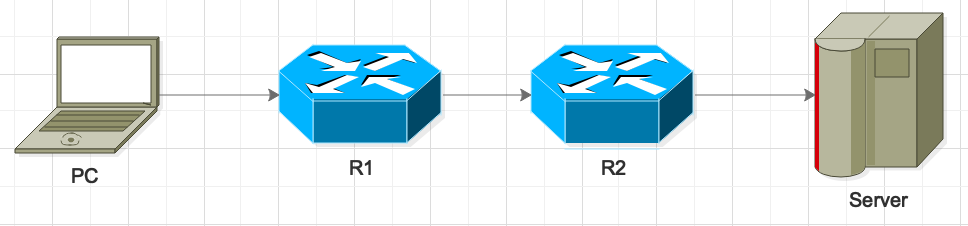

客户端 PC 发送请求到服务器端 Server，而PC 和 Server  位于不同的网络，PC 请求到达 Server 需要经过路由器 R1 和 路由器 R2，那么 在这个场景中发生的点对点通信包括：

* PC -> R1
* R1 -> R2
* R2 -> Server

端到端的通信只有一个，即 PC -> Server。

如前面的内容描述，数据链路层可确保点对点的网络传输可靠，网络层可让数据包在不同的网络之间转发，而网络模型中的传输层负责的是*端到端的可靠网络通信*。为了实现端到端的可靠网络通信，传输层提供了一些重要的方法和功能，具体包括：

* 多路复用发送(Multiplexing Traffic)
* 多路分解接收(Demultiplexing Traffic)
* 建立长运行连接
* 通过错误检查和数据验证来确保数据完整性

=== 多路复用发送 & 多路分解接收

.*多路复用发送 & 多路分解接收*
[cols="5a,5a"] 
|===
|多路复用发送(Multiplexing Traffic) |多路分解接收(Demultiplexing Traffic)

|
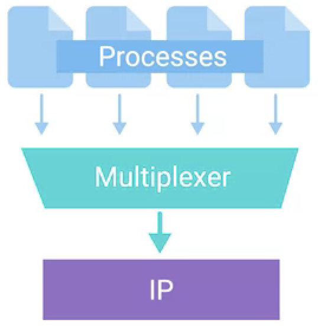
|
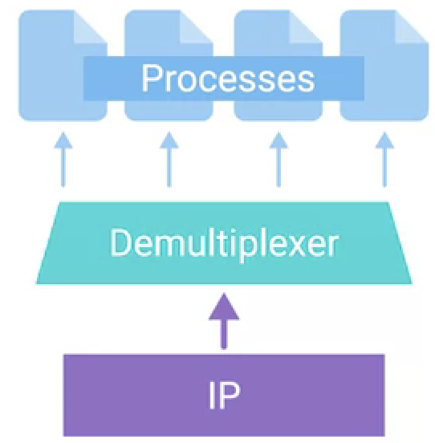

|消息发送端
|消息接收端

|发送端可能有多个进程需要发送数据，但是在任意一个时间只有一个传输协议，这种多对一的场景就需要多路复用发送，协议接受消息来自不同的进程，并且更加消息头上的端口号不同来区分，当完成消息头添加后，传输层可以将传输层包传递给网络层。
|与发送测正好相反，接收测在接收到网络层的数据包后，面对的是一个一对多的场景，这就需要多路分解接收。在经过错误验证和去除消息头后，传输层会通过端口号将消息发送到不同的进程服务 
|===

NOTE: 传输层多路复用发送和多路分解接收都是基于端口号来完成的，传输层的端口号是一个 16 位字节长度的数字，用来在在计算机网络中不同主机上 的 进程之间的通信。
 
=== TCP Segment 结构

一个 TCP Segment 是有 TCP 头和数据部分构成。

image:img/tcp-segment.png[]

* *Destination port* - 目的地端口，是目的服务所监听的端口，是最终接收TCP Segment 的服务的端口。
* *Source port* - 源端口，是一个较大的数字，发送 TCP Segment 的客户端从随机端口中随机选择
* *Sequence number* - 32 位字节长度，用来跟踪 TCP Segment 在传输序列中预期的位置。
* *Acknowledgment number* - 32 位字节长度，用来确定下一个期望的 TCP Segment。
* *Header Length* - 长度为 4 个字节，也叫数据偏移字段，它定义了在一个 TCP Segment 中 TCP 头的长度，这也使接收端的网络设备知道真正数据 负载开始的位置。
* *Control flags* - TCP Segment 控制标签。
* *TCP window* - 16 字节的数字，指定在需要确认前可能发送的序列号范围。
* *Checksum* - 长度为 16 个字节，和 IP、Ethernet 中的 Checksum 字段类似，当接收者接收到这个 TCP Segment 后，Checksum 会进行一次计算，计算整个 TCP Segment 的长度，并和改字段定义的长度进行比较，以确保传输的过程中没有数据的丢失或损坏。
* *Urgent* - 该字段通常与 TCP 控制标签中的某个标签联合使用，来说明某个 Segment 比其他 Segment 重要，或有特定含义。
* *Options* - 该字段通常比较少用，但有时会用于更复杂的流控制协议。
* *Padding* - 零序列，以确保数据有效负载部分从预期位置开始。

=== TCP 控制标签

.*6 种 TCP 控制标签*
|===
|名称 |描述

|URG(urgent)
|如果此标签值为 1，则表示当前 TCP Segment 特别重要，该标签通常 与 TCP 头中的 *Urgent* 字段一起使用， *Urgent* 字段有更多信息。

|ACK(acknowledge)
|如果此标签值为 1，则表示 *Acknowledgment number* 字段应该被检查。

|PSH(push)
|传输设备想 让接收端设备尽快将缓冲中的数据推送到应用。

|RST(reset)
|TCP 连接中的一方无法从一系列丢失或格式错误的段中正确恢复。

|SYN(synchronize)
|初次建立一个 TCP 连接时使用，让接收端知道需要检查 *Sequence number* 字段。 

|FIN(finish)
|提示传输计算机端没有更多数据，连接可以关闭。
|===

=== 三次握手

如下图所示，TCP 连接的建立至少需要交换三个 TCP Segment，三次握手是对 TCP 连接建立的一个抽象。

image:img/tcp-3-hands-handshake.png[]

[source, text]
----
// Step One
A 发送一个 TCP Segment 到 B，主要包括一个 SYN 标签，告诉 B 客户端 A 的初始序列号为 J。（让我们开始建立连接吧，我的序列号为 J，这样我们会知道我们交流开始的位置）
A sends a TCP segment to B with SYN flag set (`Let's establish a connection and look at my sequence number field, so we know where this conversation starts.`)

// Step Two
B 回复一个 TCP Segment 到 A，包括两个标签 SYN 和 ACK，告诉 A 服务器端（B）的初始序列号为 K，同时确认 A 服务器（B）确认客户端 A 的序列号（ACK 的值为 J + 1）
B then responds with a TCP segment, where both the SYN and ACK flags are set(`Sure, let's establish a connection and I acknowledge your sequence number.`)

// Step Three
A 回复一个 TCP Segment 到 B，主要包括一个 ACK 标签，告诉服务器端 B 客户端 A 确认服务端的序列号（ACK 的值为 K + 1）。 
A responds again with just the ACK flag set* (`I acknowledge your acknowledgement. Let's start sending data.`)
----

一次握手是两个设备确保他们所使用同一个协议，并且能够彼此相互理解。

TCP 连接是一个多路复用的模式，每一个 TCP Segment 的发送都会有一个 TCP Segment 的回复（ACK 标签），这样发送端就知道接收端接收到相应的片段。

=== 四次握手

TCP 建立一个连接需要三次 TCP Segment 交换，而终止一个连接需要四次 TCP Segment 交换，四次握手是对 TCP 连接终止的一个抽象。

TCP 连接可以从客户端和服务器端的任何一方发起，发起关闭连接的一次通常通过调运 close() 方法，我们将这一动作称为*主动关闭（Active Close）*，相应的另一端则称为*被动关闭（Passive Close）*，下图演示的是从服务器端 B 发起的主要关闭过程：

image:img/tcp-4wayshandshake.png[]

1. B 发送 FIN 标签到 A（FIN M）
2. A 确认 B 并回复一个 ACK 标签(ACK M + 1)
3. A 发送 FIN 标签到 B（FIN N）
4. B 确认 A 并回复一个 ACK 标签(ACK N + 1)

=== TCP 套接字状态

一个 TCP 套接字是一个潜在 TCP 连接一端的实例化，实例化。TCP 套接字有多个状态。

A socket is the instantiation of an endpoint in a potential TCP connection.

.*TCP 套接字状态*
|===
|名称 |描述

|LISTEN
|一个 TCP 套接字准备就绪，可以接收进入的连接，这个状态只会在服务器端。

|SYN_SENT
|客户端发送了一个 SYN 标签的请求到服务器端，且连接建立还没有完成，这个状态只会在客户端。

|SYN_RECEIVED
|前序处于 LISTEN 状态，接收到 SYN 标签的请求，并且给客户端回复了 SYN 和 ACK，但是连接还没有建立，等待客户端的 ACK 请求。这个状态只会在服务器端。

|ESTABLISHED
|TCP 连接建立后的状态，客户端和服务器可以自由相互发送数据，这个状态即可以是客户端，也可以是在服务器端。

|FIN_WAIT
|一个 FIN 标签的请求发送，同时没有接收到另一侧回复的 ACK。

|CLOSE_WAIT
|传输层 TCP 连接已经关闭, 但应用层还没有释放相应的套接字。

|CLOSED
|TCP 连接完全关闭，没有任何进一步通信的可能性。

|===

=== UDP(用户数据报协议)

* UDP 只在 IP 的数据报服务之上增加了很少一点的功能，即端口的功能和差错检测的功能。
* 虽然 UDP 用户数据报只能提供不可靠的交付，但 UDP 在某些方面有其特殊的优点。
* UDP 是无连接的，即发送数据之前不需要建立连接
* UDP 使用尽最大努力交付，即不保证可靠交付，同时也不使用拥塞控制。
* UDP 是面向报文的。UDP 没有拥塞控制，很适合多媒体通信的要求。 
* UDP 支持一对一、一对多、多对一和多对多的交互通信。
* UDP 的首部开销小，只有 8 个字节。 

==== 面向报文的 UDP

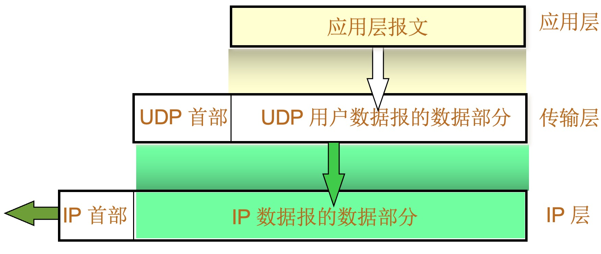

* 发送方 UDP 对应用程序交下来的报文，在添加首部后就向下交付 IP 层。UDP 对应用层交下来的报文，既不合并，也不拆分，而是保留这些报文的边界。
* 应用层交给 UDP 多长的报文，UDP 就照样发送，即一次发送一个报文。
* 接收方 UDP 对 IP 层交上来的 UDP 用户数据报，在去除首部后就原封不动地交付上层的应用进程，一次交付一个完整的报文。
* 应用程序必须选择合适大小的报文

=== 系统端口和临时端口

传输层是根据端口号来确保端到端的通信，传输层的协议不管是 TCP 还是 UDP，都与端口号关联，端口号是一个 16 个字节长度的数字（范围为 0 - 65535）。端口号又分为系统端口和临时端口。

.*IANA 定义的端口范围*
|===
|范围 |描述

|0
|端口 0 不会使用在网络连接中，但有时候如果同一个主机上又多个程序，那么使用 0 可以随机选择一个端口。

|1 - 1023
|系统端口范围，或被称为众所周知端口号，这些端口通常被一些大家熟知的服务所有，例如 80 为 HTTP 端口，21 是 FTP 等。这些端口受 IANA 控制。

|1024 - 49151
|已注册端口，这些端口不受 IANA 控制，不过由 IANA 登记，并提供他们使用情况清单，以方便整个群体。这些端口中一些通过可能被熟悉，3306 是 Mysql 的端口，8080 为 Tomcat/JBoss 端口。

|49152 - 65535
|这些端口被称为私有或临时端口，临时端口不能通过 INANA 注册，这些端口用在 TCP 连接的客户端随机选用（Source Port），一个客户端/服务器端通信的程序，服务器端通常监听与一个已注册的端口，客户端建立一个连接时会分配一个临时端口。
|===

=== 防火墙

一个防火墙是一个网络设备，用来阻塞满足特定条件的网络负载。防火墙通常可以在不同的网络层运行：

* 传输层 - 通常通过配置阻塞特定的端口上的网络负载，同时允许一些端口上的网络负载
* 应用层 - 检测应用层数据负载，例如特定范围 IP地址等。

=== 可靠传输的工作原理

==== 停止等待协议 

[cols="5a,5a"]
|=== 
|无差错情况 |超时重传

|
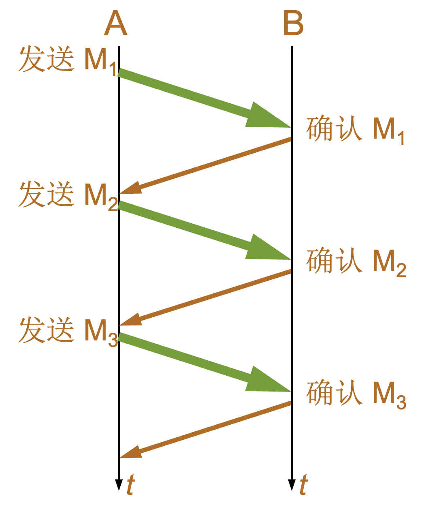

|
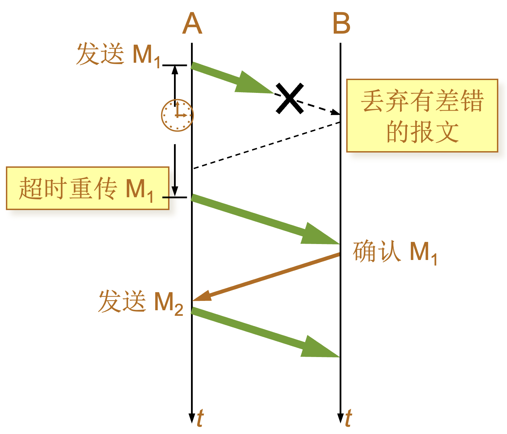

|===

* 在发送完一个分组后，必须暂时保留已发送的分组的副本。
* 分组和确认分组都必须进行编号。
* 超时计时器的重传时间应当比数据在分组传输的平均往返时间更长一些。 

[cols="5a,5a"] 
|=== 
|确认丢失 |确认迟到

|
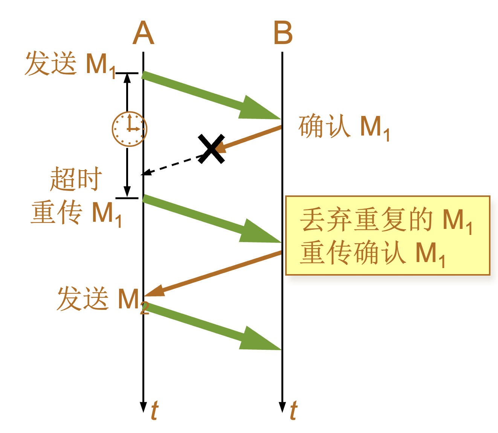

|
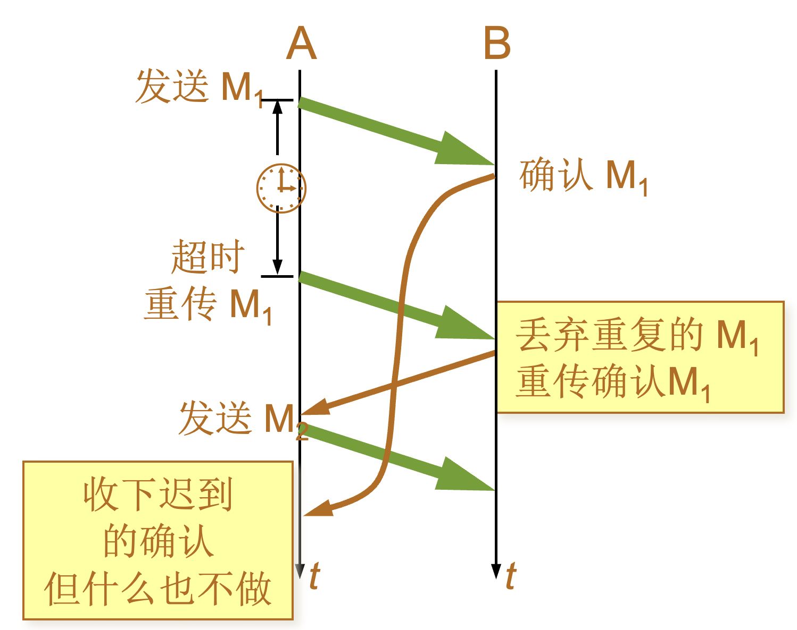

|===

* 使用上述的确认和重传机制，我们就可以在*不可靠的传输网络上实现可靠的通信*。
* 这种可靠传输协议常称为*自动重传请求ARQ (Automatic Repeat reQuest)*。
* ARQ 表明重传的请求是*自动*进行的。接收方不需要请求发送方重传某个出错的分组 。

NOTE: 停止等待协议的优点是简单，但缺点是信道利用率太低。 

==== 连续 ARQ 协议 

[cols="2,5a"] 
|=== 
|阶段 |描述

|1
|发送方维持发送窗口（发送窗口是 5
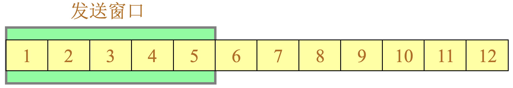

|2
|收到一个确认后发送窗口向前滑动
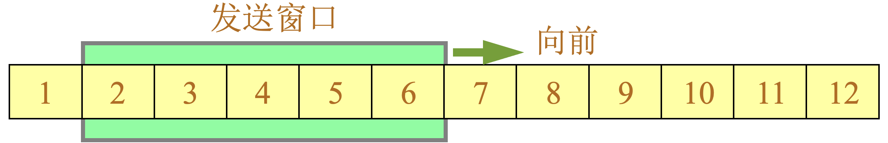

|3
|收到一个确认后发送窗口向前滑动
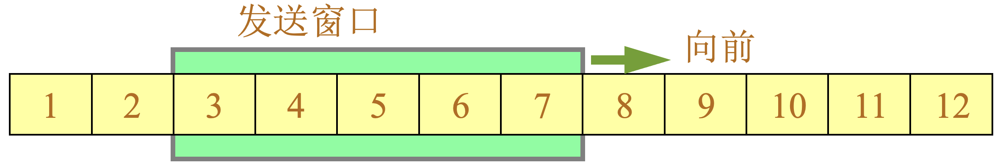
|===

[cols="2,5a"] 
|=== 
|措施 |描述

|累积确认 
|
* 接收方一般采用*累积确认*的方式。即不必对收到的分组逐个发送确认，而是对按序到达的最后一个分组发送确认，这样就表示：*到这个分组为止的所有分组都已正确收到了*。
* *累积确认的优点：* 容易实现，即使确认丢失也不必重传。
* *累积确认的缺点：* 不能向发送方反映出接收方已经正确收到的所有分组的信息。

|Go-back-N 
|
* 如果发送方发送了前 5 个分组，而中间的第 3 个分组丢失了。这时接收方只能对前两个分组发出确认。发送方无法知道后面三个分组的下落，而只好把后面的三个分组都再重传一次。
* 这就叫做 Go-back-N（回退 N），表示需要再退回来重传已发送过的 N 个分组。
* 可见当通信线路质量不好时，连续 ARQ 协议会带来负面的影响。 
|===

==== TCP 可靠通信的具体实现 

* TCP 连接的每一端都必须设有两个窗口——一个*发送窗口*和一个*接收窗口*。
* TCP 的可靠传输机制用*字节的序号*进行控制。TCP 所有的确认都是*基于序号*而不是基于报文段。
* TCP 两端的四个窗口经常处于*动态变化*之中。
* TCP连接的往返时间 RTT 也*不是固定不变的*。需要使用特定的算法估算较为合理的重传时间。  

=== TCP拥塞控制

==== 拥塞控制的一般原理 

* 在某段时间，若对网络中某资源的需求超过了该资源所能提供的可用部分，网络的性能就要变坏，即产生拥塞(congestion)。
* 若网络中有许多资源同时产生拥塞，网络的性能就要明显变坏，整个网络的吞吐量将随输入负荷的增大而下降。  

.*拥塞控制 VS 流量控制*
|===
|拥塞控制 |流量控制

|拥塞控制所要做的都有一个前提，就是网络能够承受现有的网络负荷。
|拥塞控制是一个全局性的过程，涉及到所有的主机、所有的路由器，以及与降低网络传输性能有关的所有因素。

|流量控制往往指在给定的发送端和接收端之间的点对点通信量的控制。
|流量控制所要做的就是抑制发送端发送数据的速率，以便使接收端来得及接收。 
|===

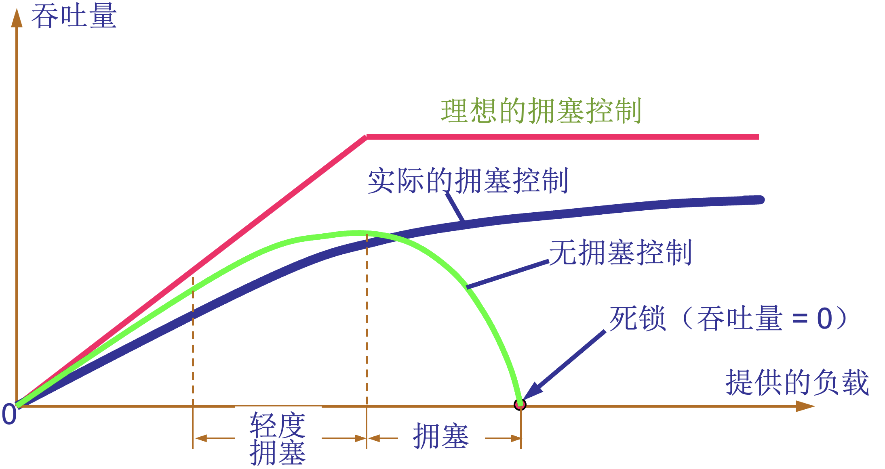

==== 慢开始和拥塞避免

* 发送方维持一个叫做*拥塞窗口cwnd (congestion window)*的状态变量。拥塞窗口的大小取决于网络的拥塞程度，并且动态地在变化。发送方让自己的发送窗口等于拥塞窗口。如再考虑到接收方的接收能力，则发送窗口还可能小于拥塞窗口。
* 发送方控制拥塞窗口的原则是：只要网络没有出现拥塞，拥塞窗口就再增大一些，以便把更多的分组发送出去。但只要网络出现拥塞，拥塞窗口就减小一些，以减少注入到网络中的分组数。

[cols="5a"]
|===
|慢开始算法的原理

|
1. 在主机刚刚开始发送报文段时可先设置拥塞窗口 cwnd = 1，即设置为一个最大报文段 MSS 的数值。
2. 在每收到一个对新的报文段的确认后，将拥塞窗口加 1，即增加一个 MSS 的数值。
3. 用这样的方法逐步增大发送端的拥塞窗口 cwnd，可以使分组注入到网络的速率更加合理。 
|===

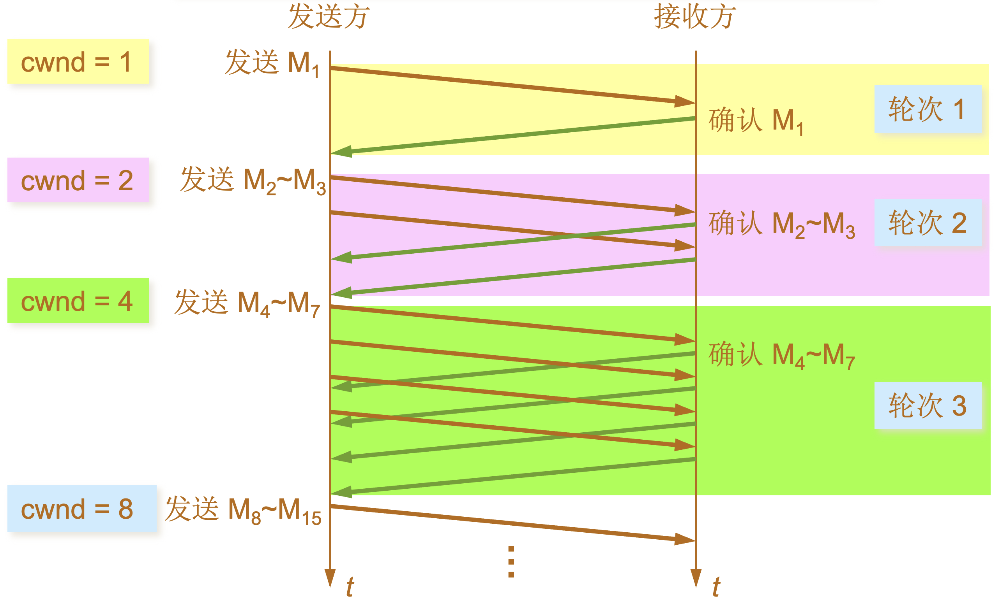

NOTE: 发送方每收到一个对新报文段的确认（重传的不算在内）就使 cwnd 加 1。 

[cols="5a"]
|===
|传输轮次(transmission round)

|
1. 使用慢开始算法后，每经过一个传输轮次，拥塞窗口 cwnd 就加倍。 
2. 一个传输轮次所经历的时间其实就是往返时间 RTT。
3. “传输轮次”更加强调：把拥塞窗口 cwnd 所允许发送的报文段都连续发送出去，并收到了对已发送的最后一个字节的确认。
4. 例如，拥塞窗口 cwnd = 4，这时的往返时间 RTT 就是发送方连续发送 4 个报文段，并收到这 4 个报文段的确认，总共经历的时间。
|===

[cols="5a"]
|===
|设置慢开始门限状态变量ssthresh

|
慢开始门限 ssthresh 的用法如下：

* 当 cwnd < ssthresh 时，使用慢开始算法。
* 当 cwnd > ssthresh 时，停止使用慢开始算法而改用拥塞避免算法。
* 当 cwnd = ssthresh 时，既可使用慢开始算法，也可使用拥塞避免算法。

拥塞避免算法的思路是让拥塞窗口 cwnd 缓慢地增大，即每经过一个往返时间 RTT 就把发送方的拥塞窗口 cwnd 加 1，而不是加倍，使拥塞窗口 cwnd 按线性规律缓慢增长。

当网络出现拥塞时:

1. 无论在慢开始阶段还是在拥塞避免阶段，只要发送方判断网络出现拥塞（其根据就是没有按时收到确认），就要把慢开始门限 ssthresh 设置为出现拥塞时的发送方窗口值的一半（但不能小于2）。
2. 然后把拥塞窗口 cwnd 重新设置为 1，执行慢开始算法。
3. 这样做的目的就是要迅速减少主机发送到网络中的分组数，使得发生拥塞的路由器有足够时间把队列中积压的分组处理完毕。 
|===

[cols="1,5a"]
.*慢开始和拥塞避免算法的实现举例*
|===
|阶段 |说明

|1
|
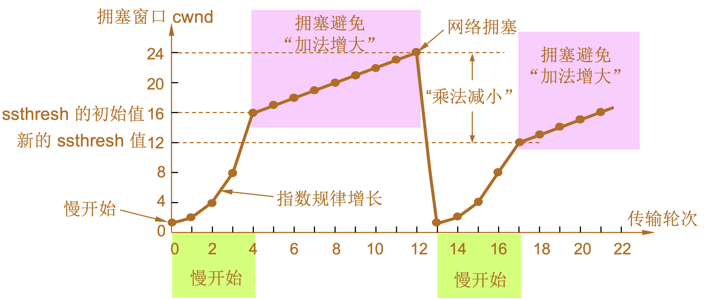

当 TCP 连接进行初始化时，将拥塞窗口置为 1。图中的窗口单位不使用字节而使用报文段。慢开始门限的初始值设置为 16 个报文段，即 ssthresh = 16。

|2
|
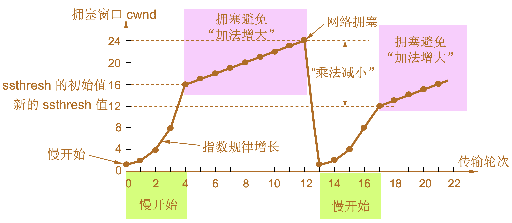

发送端的发送窗口不能超过拥塞窗口 cwnd 和接收端窗口 rwnd 中的最小值。我们假定接收端窗口足够大，因此现在发送窗口的数值等于拥塞窗口的数值。

|3
|
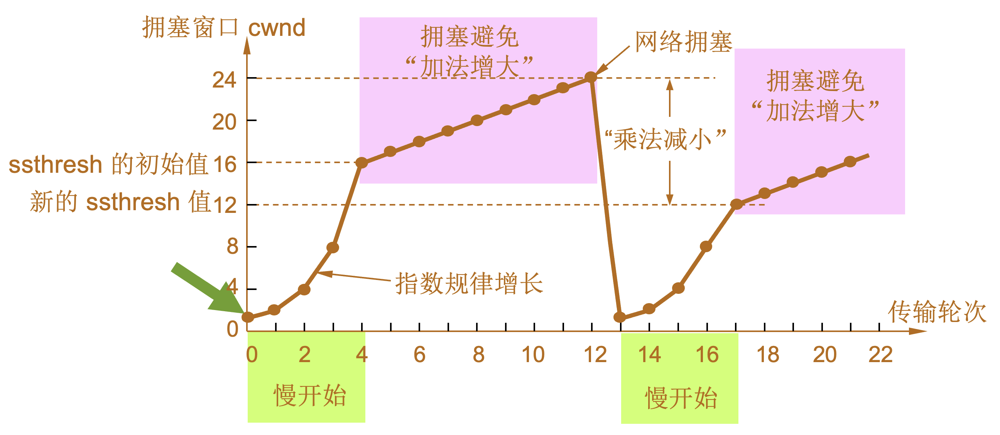

在执行慢开始算法时，拥塞窗口 cwnd 的初始值为 1，发送第一个报文段 M0

|4
|
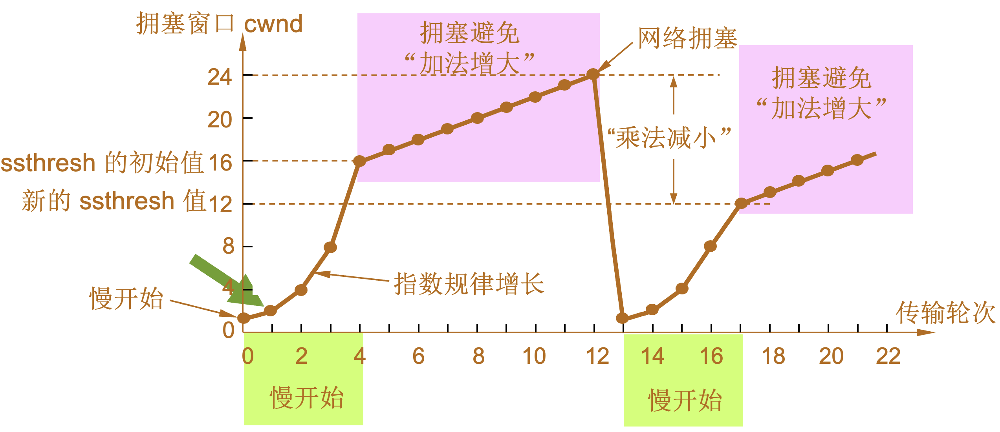

发送端每收到一个确认 ，就把 cwnd 加 1。于是发送端可以接着发送 M1 和 M2 两个报文段。 

|5
|
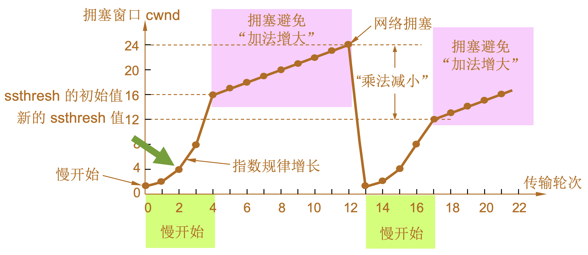

接收端共发回两个确认。发送端每收到一个对新报文段的确认，就把发送端的 cwnd 加 1。现在 cwnd 从 2 增大到 4，并可接着发送后面的 4 个报文段。 

|6
|
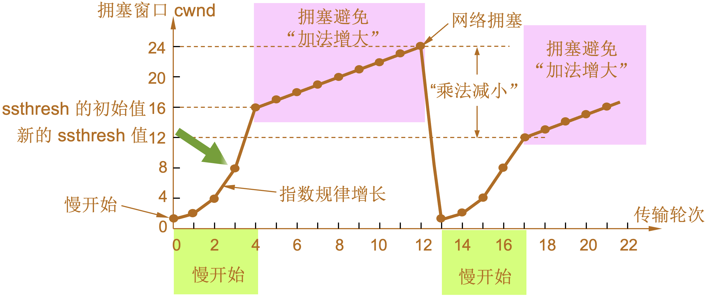

发送端每收到一个对新报文段的确认，就把发送端的拥塞窗口加 1，因此拥塞窗口 cwnd 随着传输轮次按指数规律增长。 

|7
|
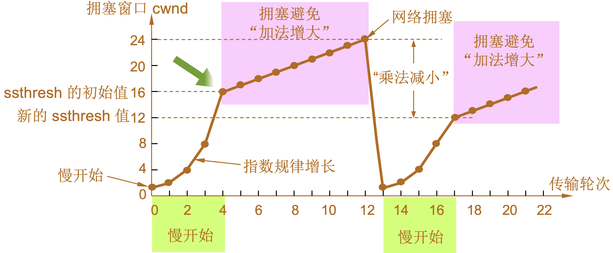

当拥塞窗口 cwnd 增长到慢开始门限值 ssthresh 时（即当 cwnd = 16 时），就改为执行拥塞避免算法，拥塞窗口按线性规律增长。

|8
|
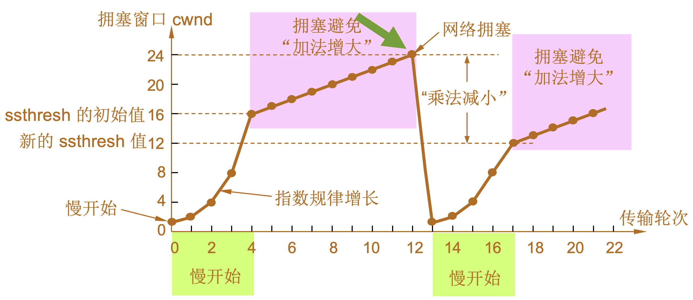

假定拥塞窗口的数值增长到 24 时，网络出现超时，表明网络拥塞了。

|9
|
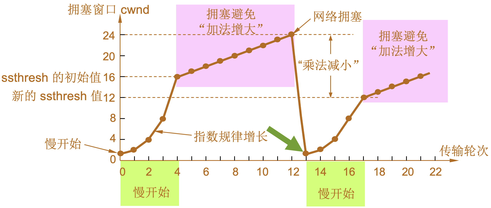

更新后的 ssthresh 值变为 12（即发送窗口数值 24 的一半），拥塞窗口再重新设置为 1，并执行慢开始算法。 

|10
|
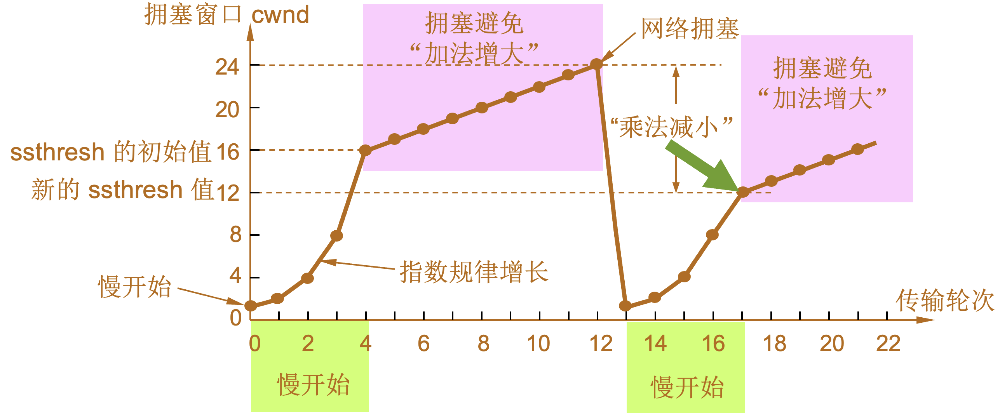

当 cwnd = 12 时改为执行拥塞避免算法，拥塞窗口按按线性规律增长，每经过一个往返时延就增加一个 MSS 的大小。 

|===

[cols="5a"]
|===
|乘法减小(multiplicative decrease) 

|
* “乘法减小“是指不论在慢开始阶段还是拥塞避免阶段，只要出现一次超时（即出现一次网络拥塞），就把慢开始门限值 ssthresh 设置为当前的拥塞窗口值乘以 0.5。
* 当网络频繁出现拥塞时，ssthresh 值就下降得很快，以大大减少注入到网络中的分组数。
|===

[cols="5a"]
|===
|加法增大(additive increase)

|
“加法增大”是指执行拥塞避免算法后，在收到对所有报文段的确认后（即经过一个往返时间），就把拥塞窗口 cwnd增加一个 MSS 大小，使拥塞窗口缓慢增大，以防止网络过早出现拥塞。 
|===

==== 快重传和快恢复

[cols="5a"]
|===
|快重传

|
* 快重传算法首先要求接收方每收到一个失序的报文段后就立即发出重复确认。这样做可以让发送方及早知道有报文段没有到达接收方。 
* 发送方只要一连收到三个重复确认就应当立即重传对方尚未收到的报文段。 
* 不难看出，快重传并非取消重传计时器，而是在某些情况下可更早地重传丢失的报文段。 

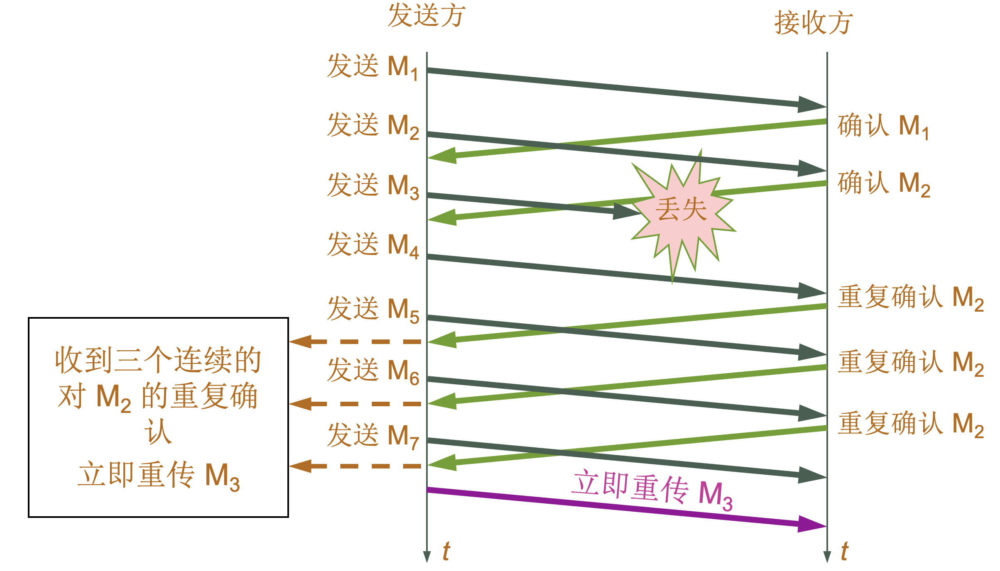
|===

[cols="5a"]
|===
|快恢复算法

|
1. 当发送端收到连续三个重复的确认时，就执行“乘法减小”算法，把慢开始门限 ssthresh 减半。但接下去不执行慢开始算法。 
2. 由于发送方现在认为网络很可能没有发生拥塞，因此现在不执行慢开始算法，即拥塞窗口 cwnd 现在不设置为 1，而是设置为慢开始门限 ssthresh 减半后的数值，然后开始执行拥塞避免算法（“加法增大”），使拥塞窗口缓慢地线性增大。

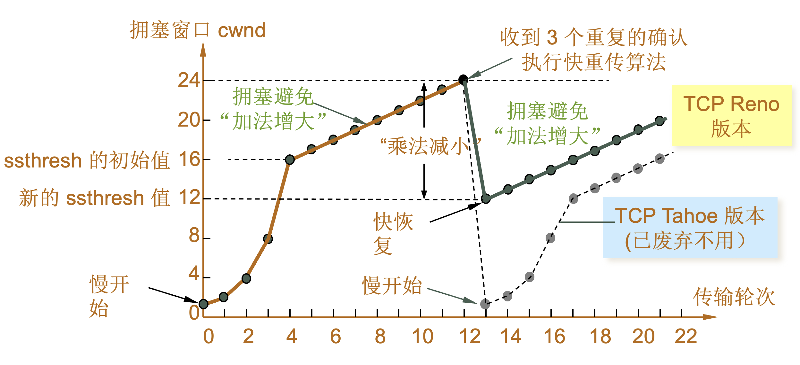
|=== 

==== 发送窗口的上限值

发送方的发送窗口的上限值应当取为接收方窗口 rwnd 和拥塞窗口 cwnd 这两个变量中较小的一个，即应按以下公式确定

[source, bash]
----
发送窗口的上限值 = Min [rwnd, cwnd]
----

1. 当 rwnd < cwnd 时，是接收方的接收能力限制发送窗口的最大值。
2. 当 cwnd < rwnd 时，则是网络的拥塞限制发送窗口的最大值。

== 应用层

=== 应用层协议

* HTTP - For web traffic
* FTP  - For ftp traffic

=== HTTP

在 TCP/IP 体系结构中，HTTP 属于应用层协议，位于 TCP/IP 协议的顶层。因此，它在设 计和使用中要以 TCP/IP 协议族中的其他协议为基础。例如，它要通过 DNS 进行域名和 IP 地 址的转换，要建立 TCP 连接才能进行文档传输。

显然，HTTP 也是客户/服务器结构。这里，客户是浏览器(Browser),服务器是 Web 服 务器。浏览 Web 时，浏览器通过 HTTP 协议于 Web 服务器交换信息。每当在 Web 上从一个 资源转到另一个资源时，浏览器用 HTTP 访问 Web 服务器，其中就包括想要获得的资源信息。

浏览器和服务器通过 HTTP 交换 Web 文档时，实际可以交换不同的文档类型。这些文档 类型的格式由多用途 Internet 邮件扩展 MIME(Mutipurpose Internet Mail Extensions)定义。MIME 是专门描述通过 Internet 传输多媒体数据的技术标准。

HTTP 支持客户(一般是浏览器)与服务器间的通信，相互传送数据。一个服务器可以 为分布在世界各地的许多客户服务。HTTP 定义的事务处理由以下四步组成:

* 客户与服务器建立连接
* 客户向服务器提出请求
* 如果请求被接受，则服务器送回响应，在响应中包含状态码和所需的文件
* 客户与服务器断开连接

HTTP 与必须持续连接的 FTP 等不同，它是无状态的。也就是说，浏览器和服务器每进 行一次 HTTP 操作，就建立一次连接，但随即又断开此次连接。访问 Web 站点时，浏览器与 服务其之间建立连接，以便将服务器上的 HTML 文件下载到浏览器上。在 HTTP 1.0 版本中， 浏览器收到文件后，即断开此次连接，如果浏览器发现还需要某些文件(例如下载图形)时， 必须重新建立连接。而在 HTTP 1.1 版本中，可以采用一些机制使客户端和浏览器不断开最 初建立的连接，而使用最初的连接请求后续的内容。

一次 HTTP 操作通常被称为一次事务(Transection)。HTTP 采用 TCP 连接，而且该连接 仅在此次事务中保持，浏览器和服务器都不会记忆上次的连接状态。

HTTP 之所以采用这种无状态机制，完全是为了提高服务器的工作效率。在 Web 中点击 一个超链接时，浏览器有可能从当前站点转到另一个站点。因此，无论何时单击超链接时， 服务器都假定用户要退出浏览，因而断开连接。如果要继续浏览，就再次建立连接。如果用户确实要退出，服务期就不需要执行任务，因为连接已经断开。

当然 HTTP 的无状态也有缺点。由于没有状态，协议对事务处理没有记忆能力。如果后 续事务处理需要前面处理的有关信息，那么这些信息必须在协议外面保存。缺少状态意味着 所需要的前面信息必须重现，势必导致每次连接要传送较多的信息。在实际的应用中，状态 的信息通常会采用客户端 Cookie 和服务器端的 Session ID 来配合保持用户的连接状态。

=== FTP

=== SMTP

=== DHCP

* DHCP stands for Dynamic Host Configuration Protocol, which is an application layer protocol that automates the configuration process of hosts on a network. With DHCP, a machine can query a DHCP server when the computer connects to the network and receive all the network configuration in one go.
* DHCP is an application layer protocol, which means it relies on the transport, network, data link and physical layers to operate.
* The process by which a client configured to use DHCP attempts to get network configuration information is known as DHCP discovery.

*DHCP discovery process - 4 steps:*

image:img/DHCP-process.jpg[]

1. *DHCP Discovery* - DHCP clients sends a `DHCP discover message(DHCPDISCOVER)` out onto the network, the DHCPDISCOVER message is encapsulated in a UDP datagram with a destination port of 67 and a source port of 68, this is then encapsulated inside of an IP datagram with a destination IP of 255.255.255.255, and a source IP of 0.0.0.0.
2. *DHCP Offer* - DHCP server examine its own configuration and make a decision on what, if any, IP address to offer to the client, the response would be sent as a DHCPOFFER message with a destination port of 68, a source port of 67, a destination broadcast IP of 255.255.255.255, and its actual IP as the source.
3. *DHCP Request* - DHCP client respond to the DHCPOFFER message with a DHCPREQUEST message, which essentially says, yes, I would like to have an IP that you offer to me. Since the IP hasn't been assigned yet, this is again sent from an IP of 0.0.0.0 and to the broadcast IP of 255.255.255.255.
4. *DHCP ACK* - DHCP server receives the DHCPREQUEST message and responds with a DHCPACK or DHCP acknowledgement message, which is again sent to a broadcast IP of 255.255.255.255, and with a source IP corresponding to the actual IP of the DHCP server.

=== NAT(Network Address Translation)

字面上理解，NAT(Network Address Translation) 就是将一个 IP 地址翻译/转换成另一个 IP 地址。

NAT is a technology that allows a gateway usually a router or a firewall to rewrite the source IP of an outgoing IP datagram, while retaining the original IP in order to rewrite it into the response.

image:img/ip-address-masquerading-nat.png[]

NOTE: IP masquerading is an important security concept. The most basic concept at play here, is that no one can establish a connection to your computer if they don't know what IP address it has. By using NAT in the way we've just described, we could actually have hundreds of computers on network A, all of their IPs being translated by the router to its own. To the outside world, the entire address space of network A is protected and invisible. This is known as one to many NAT, and you'll see it in use on lots of LANs today.

==== NAT and the Transport Layer

* Port preservation is a technique where the source port chosen by a client, is the same port used by the router.
* Port forwarding is a technique where a specific destination ports can be configured to always be delivered to specific nodes.

==== RIR(regional internet registries)

.*The IANA assigned address blocks to the five regional internet registries or RIRs*
|===
|名称 |描述

|AFRINIC
|serves the continent of Africa.

|ARIN
|serves the United States, Canada and parts of the Caribbean.

|APNIC
|responses ost of Asia, Australia and New Zealand and Pacific Island nations.

|LACNIC
|covers Central and South America and any parts of the Caribbean not covered by ARIN.

|RIPE
|serves Europe, Russia and the Middle East and portions of Central Asia.
|===

https://en.wikipedia.org/wiki/IPv4_address_exhaustion[IPv4 address exhaustion]

==== NAT and non-routable address space

* Non-routable address space was defined in RFC1918 and consists of several different IP ranges that anyone can use.
* And unlimited number of networks can use non-routable address space internally because internet routers won't forward traffic to it. This means there's never any global collision of IP addresses when people use those address spaces.
* Non-routable address space is largely usable today because of technologies like NAT.

=== VPN(Virtual Private Networks)

* Virtual Private Networks or VPNs, are a technology that allows for the extension of a private or local network, to a host that might not work on that same local network.
* VPNs are a tunneling protocol. Which means, they provision access to something not locally available.

.*VPN Tunnel Example:*
image:img/vpn-tunel-example.png[]

* VPNs, usually requires strict authentication procedures in order to ensure that they can only be connected to by computers and users authorized to do so. In fact, VPNs were one of the first technologies where two-factor authentication became common.
* Two-factor authentication is a technique where more than just a username and password are required to authenticate. Usually, a short-lived numerical token is generated by the user through a specialized piece of hardware or software.

==== VPN 构建点对点连接

VPNs can also be used to establish site-to-site connectivity. It's just that the router, or sometimes a specialized VPN device on one network, establishes the VPN tunnel to the router or VPN device on another network. This way, two physically separated offices might be able to act as one network and access network resources across the tunnel.

image:img/vpn-p2p-connectivity.png[]

=== Proxy Services

* A proxy service is a server that actson behalf of a client in order to access another service. Proxies sit between clients and other servers, providing some additional benefit, anonymity, security, content filtering, increased performance, a couple other things.
* Proxies doesn't refer to any specific implementation. Proxies exist at almost every layer of our networking model.

==== Reverse proxy

A reverse proxy is a service that might appear to be a single server to external clients, but actually represents many servers living behind it.

.*现代 Web 应用架构使用 Reverse proxy：*
image:img/proxy-reverse.png[]

NOTE: Reverse proxy can also used in encrypting and decrypting web data.

=== Application Layer and the OSI Model

* The session layer is that it's responsible for things like facilitating the communication between actual applications and the transport layer
* The presentation layer is responsible for making sure that the unencapsulated application layer data is actually able to be understood by the application in question.

image:img/osi-model-application.png[]

== TCP/IP 五层模型示例

=== 场景描述

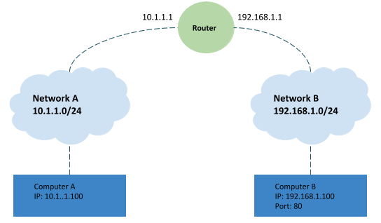

As depicted in above figure:

1. Network A contains address space 10.1.1.0/24, and computer A is part of Network A and has been assigned an IP address of 10.1.1.100
2. Network B contains address space 192.168.1.0/24, and computer B is part of Network B and has been assigned an *IP address* of 192.168.1.100, web server on computer B is running and listening on port 80
3. Router sits between network A and network B, with an interface configured with an IP of 10.1.1.1 on network A, and an interface at 192.168.1.1 on network B
4. An end user sitting at computer A opens up a web browser and enters 192.168.1.100 into the address bar to access the content in computer B's web server

=== 通信过程

1. The web browser communicates with the local networking stack(part of OS), and know that it's going to establish a TCP connection to 192.168.1.100, port 80 on another network.
2. Computer A looks at its ARP table to determine what MAC address of it's gateway 10.1.1.1 is, but it doesn't find any corresponding entry.
3. Router receives ARP message, check that currently it assigned the IP address of 10.1.1.1. So it responds to computer A to let it know about its own *MAC address* of 00:11:22:33:44:55.
4. Computer A receives this response and now knows the hardware address of its gateway, and ready to start constructing the outbound packet.
5. *Application layer*'s web browser trigger to open a socket, and get a ephemeral port 50000 from computer A OS
6. In the *Transport layer*, the networking stack starts to build a `TCP segment`, with appropriate fields in the header, including a source port of 50000, destination port of 80, sequence number field filled with a appropriate sequence number, the `SYN` flag is set, checksum for the segment is calculated and written to the checksum field.
7. The `TCP segment` passed along to the *Network layer* and start to encapsulate a `IP Datagram`, fill IP header with the source IP, the destination IP, a *TTL* of 64, fill the `TCP segment` as the data payload of the `IP datagram`, a checksum is calculated and put in checksum field.
8. The `IP datagram` passed alone to the *Data link layer* and start to construct a `Ethernet frame`, fill `00:11:22:33:44:55` as destination MAC addresses and computer A's MAC addresses as source MAC addresses, insert `IP datagram` as he data payload of the Ethernet frame, enter a calculated checksum to reference field.
9. The `Ethernet frame` is ready to be sent across the *physical layer*, the `network interface` connected to computer A sends this binary data as modulations of the voltage of an electrical current running across a `CAT6 cable` that's connected between it and a network switch.
10. This switch receives the frame and inspects the destination MAC address. The switch knows which of its interfaces this MAC address is attached to, and forwards the frame across only the cable connected to this interface.
11. Router receives the frame and recognizes its own hardware address as the destination. Router knows that this frame is intended for itself. So it now takes the entirety of the frame and performa *checksum check* against it. Router compares this checksum with the one in the Ethernet frame header and sees that they match.
12. Router strips away the `Ethernet frame`, leaving it with just the `IP datagram`. Again, it performs a checksum calculation against the entire datagram. And again, it finds that it matches. It then inspects the destination IP address and performs a lookup of this destination in its *routing table*, the look up results is that the router sees that the destination address 192.168.1.100 is on a locally connected network.
13. Continue in Router, the TTL be decrement, a new checksum be re-calculated, and creates a new `IP datagram`. Similar with Step 8, this new IP datagram is again encapsulated by a new `Ethernet frame`, which the source and destination MAC address of router and and computer B
14. The new Ethernet frame` is ready to be sent, and computer B receives the frame.
15. Computer B identifies its own MAC address as the destination, and knows that it's intended for itself. computer B then strips away the Ethernet frame, leaving it with the IP datagram. It performs a `checksum check` and recognizes that the data has been delivered intact. It then examines the destination IP address and recognizes that as its own.
16. Computer B strips away the IP datagram, leaving it with just the `TCP segment`. Again, the checksum for this layer is examined, and everything checks out.
17. Computer B examines the destination port, which is *TCP port* 80. The networking stack on computer B checks to ensure that there's an open socket on port 80, which there is. It's in the listen state, and held open by a running Apache web server.
18. Computer B then sees that this packet has the `SYN` flag and knows that this is a TCP connection request.
19. Repeat the steps from 6 - 16, and form a `TCP segment` with flag `SYN-ACK`, and other field be filled correctly.
20. Computer A receives frame and awared the `SYN-ACK` flag and knows that the Computer B are ready to establish connection.
21. Repeat the steps from 6 - 16, and form a `TCP segment` with flag `ACK`, and other field be filled correctly.
22. Computer B receives frame and awared the `ACK` flag from computer A, knows that the Computer A are acknowledged. And finally finish the socket instantiation, and set the state to `ESTABLISHED`.
 
