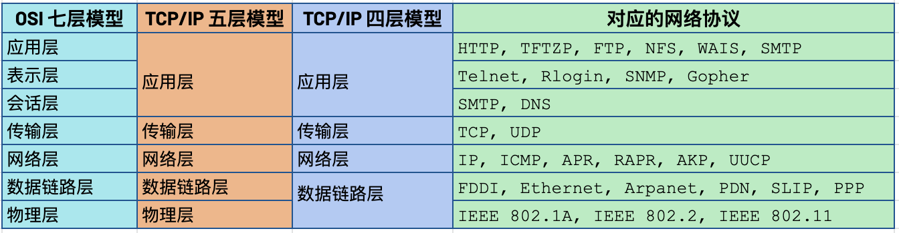

= 计算机网络
:toc: manual

== 网络模型

各个组织或企业对网络模型定义有所不同，但目前最常见的定义有一下三种。

=== TCP/IP 五层模型

image:img/layer_terminology.JPG[]

* *物理层* - 物理层表示与计算机互连的物理设备，其中还包括将物理设备连接在一起的网线、光缆、连接器的规范，以及描述如何通过这些连接发送信号的规范。
* *数据链路层* - 物理层仅仅涉及到的是光缆、连接器和信号发送，数据链路层负责定义解释这些信号的通用方法，以便网络设备可以进行通信。 该层中最常见的协议是以太网（Ethernet），它指定物理层属性，并定义负责同一网络或链路上的节点间传输数据的协议。
* *网络层* - 也称为 Internet 层，它允许不同的网络之间通过路由器设备相互通信。数据链路层只负责的是同一链路上的数据交互，网络层负责的是跨不同网络的数据交互。网络层最常见的两个协议是 IP 个 Internet。
* *传输层* - 网络层可以负责两个不同网络中的节点间的数据交互，传输层会理清应该由那个客户端和服务器程序获取这些数据。TCP 是最常见的四层协议，IP 负责将数据从一个节点传输到另一个节点; TCP 和 UDP 负责确保数据被节点上的特定应用获取。
* *应用层* -  这一层包括很多协议，常见的一些包括是用来允许您浏览网页或发送接收电子邮件等。

.*TCP/IP 5 层模型与包裹投递对应示例*
image:img/TCPIP-5-layer-models.png[]

1. 物理层相当于投递快递的卡车和路。
2. 数据链路层确保投递卡车从一个十字路口到下一个十字路口，并且重复多次。
3. 网络层确定了地址 A 和地址 B 之间的路。
4. 传输层确保某个地址上具体的门牌号，以及告诉快速已经送达。
5. 应用层指包裹的内容本身。

.*TCP/IP 5 层模型与硬件组建对应关系*
image:img/5layermoles-hardwareComponent.png[]

=== TCP/IP 四层模型

image:img/tcp-ip-model.png[TCP/IP]

* 应用层 - 常见的应用层协议有：SSH，HTTPS，NFS/CIFS，SMTP
* 传输层 - 传输层协议有 TCP 和 UDP，TCP 属于可靠连接传输协议，UDP 无连接数据包传输协议
* 网络互连层 - 负责将数据从源主机传输到目的主机，任意主机都有一个 IP 地址和子网掩码来确定网络地址，路由器用来连接网络。这一层的协议有 ICMP，`ping` 命令就是基于 ICMP 协议，`ping` 命令发送一个 ICMP ECHO_REQUEST 请
求包，成功则返回 ICMP ECHO_REPLY 确认。
* 网络接口层 - 提供连接到物理媒介，如常见的有线以太网（802.3）和无线WLAN（802.11），每一个物理网络设备都有一个物理地址（MAC）用来在网络中唯一标识目的地址。

=== OSI 七层模型

详细参照 https://en.wikipedia.org/wiki/OSI_model[wiki/OSI_model] 了解更多关于 OSI 七层模型。

=== 三种模型对比及对应网络协议

除了 TCP/IP 五层模型外，关于网络模型在业界还有其他表述，最有影响力的表扩：OSI 七层模型和 TCP/IP 四层模型，具体对照如下表：

* OSI 七层模型将 TCP/IP 模型中的应用层细分为三层：应层层、表示层、会话层
* 相比较 TCP/IP 五层模型，TCP/IP 四层模型将物理层和数据链路层合为一层
* 网络层也叫 Internet 层或网络互联层，数据链路层也称网络接口层

== 网络设备

=== 电缆（Cables）

电缆（Cables）是将不同的设备连接在一起，允许他们相互交换数据。电缆可分为两类:

* 铜缆 - 就是最长见的网线，铜缆是网络电缆的最常见形式，它们由塑料绝缘体内的多对铜线组成。网络中最长见的铜线配对缠绕标准有 Cat5, Cat5e, 和 Cat6。这些类别具有不同的物理特性，例如一对铜线中的绞合数会导致不同的可用长度和传输速率。
* 光缆 - 光纤电缆包含单个的光纤是由玻璃制成的细管，大约与人的头发宽度相同。这些玻璃管可以传输光束。与使用电压的铜缆不同，光缆使用光脉冲来表示基础数据的 1 和0。

=== Hub

Hub 是物理层的设备，多台计算机设备可连接到它，允许同一时刻来自不同计算机的连接。

image:img/network-hub.png[]

All the devices connected to a hub will end up talking to all other devices at the same time. It's up to each system connected to the hub to determine if the incoming data was meant for them, or to ignore it if it isn't. This causes a lot of noise on the network and creates what's called a collision domain. A collision domain is a network segment where only one device can communicate at a time. If multiple systems try sending data at the same time, the electrical pulses sent across the cable can interfere with each other. This causes these systems to have to wait for a quiet period before they try sending their data again. It really slows down network communications, and is the primary reason hubs are fairly rare. 

=== 交换机（Switch）

交换机是二层（数据链路层）设备，是目前常见的网络设备，允许多台计算机连接到它，由于是二层的设备，交换机可以识别 Ethernet 协议中的属性来识别特点的计算机，确保数据准确的传输到特定的机器。这极大的减少了网络域冲突，提高了网络传输的吞吐量.

=== 路由器（Router）

Hub 是一层的网络设备，交换机是二层的网络设备，二路由器是三层的网络设备，路由器知道如何在不同的网络之间发送数据。和交换机检测 Ethernet 协议中的属性决定将包发送到什么位置类似，路由器检测 IP 协议中的属性决定将包发送到什么位置。路由器内部有个路由表，包含着将数据路由到世界上不同网络的信息。

不同的路由器之间通过 BGP(Border Gateway Protocol) 协议共享数据，这使数据的发送基于最佳路径。当您打开Web浏览器并加载网页时，计算机和Web服务器之间的流量可能会经过数十个不同的路由器。 互联网异常庞大且复杂。 路由器是将流量吸引到正确位置的全球指南。

== 物理层

=== 链路上的字节移动

* 物理层负责将字节流（0 或 1 的字节码串）从链路的一端移动到另一端
* 物理层是由传输字节码的设备和装置组成
* 一个比特(bit)代表计算机可以明白的最小数据，它要么是 1，要么是 0。这些在网络链路上发送的 0 或 1 的字节码串是组成数据帧、数据包的最底层元素，这些帧或包是其他网络层的概念。
*  0 或 1 的字节码串在网络上发送是通过一个叫调节器(Modulation)的程序控制，调节器(Modulation)是一种改变电荷在电缆上移动的电压的方式。当用于计算机网络时，这种调制方式更具体地称为线路编码。它允许链路两端的设备了解某种状态下的电荷为 0，而另一种状态下的电荷为 1。 

image:img/line-coding.png[]

=== 双绞线(Twisted Pair) 双向交流

* 一个标准的 Cat 6 电缆由 8 根铜线，4 对双绞线组成 
* 双向交流指电缆支持双向传输 信息。

image:img/cat5e-cat6.jpg[] 

https://en.wikipedia.org/wiki/Ethernet_over_twisted_pair[双绞线以太网]

=== 网络接口和配线架

* 一根网线通常通过一个 RJ-45 接头连接到一个 RJ-45 网络接口. 网络接口通常与组成计算机网络的设备直接连接，或是设备的一个部分，例如任何一台计算机都会至少有一个网络接口。
* 配线架是一种包含许多网络端口的设备，但没有其他作用，只是将不同网络线缆连接到一起。 
  
[cols="2,5a"]
|===
|名称 |图示

|RJ-45 插头
|image:img/rj45.jpg[]

|RJ-45 网络接口
|image:img/rj45port.png[]

|配线架(Patch Panel)
|image:img/patch_panel.png[]
|===

== 数据链路层

=== Ethernet 和 MAC 地址

* Ethernet is most widely used protocol to send data across individual links.
* The data link layer is to essentially abstract away the need for any other layers to care about the physical layer and what hardware is in use. 

*CSMA/CD(carrier sense multiple access with collision detection)* - CSMA/CD is used to determine when the communications channels are clear and when the device is free to transmit data, this is for avoiding collision domain.

*MAC address* - A MAC address is a globally unique identifier attached to an individual network interface. It's a 48-bit number normally represented by six groupings of two hexadecimal numbers. 

=== Unicast, Multicast, Broadcast

|===
|TYPES |MODES |DESC

|Unicast
| One-to-One
|A unicast transmission is always meant for just one receiving address

|Multicast
|One-to-Many
|A multicast frame is similarly set to all devices on the local network signal. 	

|Broadcast
|One-to-All
|An Ethernet broadcast is sent to every single device on a LAN.
|===

[source, text]
.*示例 - Unicast MAC Address*
----
16:91:99:24:68:c9
b6:fe:ee:92:78:42
fa:4e:1b:7f:27:7f
----

[source, text]
.*示例 - Multicast MAC Address*
----
6b:b7:22:a4:a4:cb
97:20:82:57:fa:e5
a7:50:c1:30:ca:c1
----

[source, text]
.*示例 - Broadcast MAC Address*
----
ff:ff:ff:ff:ff:ff
----

=== Ethernet Frame

An Ethernet frame is a highly structured collection of information presented in a specific order. This way network interfaces at the physical layer can convert a string of bits, travelling across a link into meaningful data or vice versa.

image:img/EthernetPacket.png[]

1. The first part of an Ethernet frame is known as the preamble. A preamble is 8 bytes or 64 bits long and can itself be split into two sections. The first seven bytes are a series of alternating ones and zeros. These act partially as a buffer between frames and can also be used by the network interfaces to synchronize internal clocks they use, to regulate the speed at which they send data. This last byte in the preamble is known as the SFD or start frame delimiter. This signals to a receiving device that the preamble is over and that the actual frame contents will now follow. 
2. Destination MAC address, which is the hardware address of the intended recipient. 
3. Source MAC address, where the frame originated from.  
4. EtherType field, which is 16 bits long and used to describe the protocol of the contents of the frame. 
5. Data payload of an Ethernet frame. A payload in networking terms is the actual data being transported, which is everything that isn't a header. The data payload of a traditional Ethernet frame can be anywhere from 46 to 1500 bytes long. 
6. CRC(cyclical redundancy check) checksum, which is a 4-byte or 32-bit number that represents a checksum value for the entire frame.

== 网络层

=== IP 地址

IP addresses are 32-bit long numbers made up of 4 octets, and each octet is normally described in decimal numbers. 

image:img/ip-address.png[]

=== IP Datagrams and Encapsulation

IP datagram is a highly structured series of fields that are strictly defined. The two primary sections of an IP datagram are the header and the payload.

image:img/ip-datagrams.png[]

* *Version* - The very first field is four bits, and indicates what version of Internet protocol is being used. The most common version of IP is version four or IPv4.
* *Header Length* - Header Length field  is also a four bit field that declares how long the entire header is. This is almost always 20 bytes in length when dealing with IPv4. In fact, 20 bytes is the minimum length of an IP header. You couldn't fit all the data you need for a properly formatted IP header in any less space.
* *Service Type* - Service Type field is eight bits can be used to specify details about quality of service or QoS technologies. The important takeaway about QoS is that there are services that allow routers to make decisions about which IP datagram may be more important than others.
* *Total Length* - Total Length field is a 16 bits filed, It's used for exactly what it sounds like to indicate the total length of the IP datagram it's attached to. The maximum size of a single datagram is the largest number you can represent with 16 bits, which is 65,535.
* *Identification* - Identification field, is a 16-bit number that's used to group messages together.  If the total amount of data that needs to be sent is larger than what can fit in a single datagram, the IP layer needs to split this data up into many individual packets. When this happens, the identification field is used so that the receiving end understands that every packet with the same value in that field is part of the same transmission.
* *Flag* - The flag field is used to indicate if a datagram is allowed to be fragmented, or to indicate that the datagram has already been fragmented.
* *Fragmentation* - which is the process of taking a single IP datagram and splitting it up into several smaller datagrams.
* *TTL* - TTL field is an 8-bit field that indicates how many router hops a datagram can traverse before it's thrown away.
* *Protocol* - Protocol field is another 8-bit field that contains data about what transport layer protocol is being used. The most common transport layer protocols are TCP and UDP.
* *Header Checksum* - Header checksum field is a checksum of the contents of the entire IP datagram header. It functions very much like the Ethernet checksum field we discussed in the last module. Since the TTL field has to be recomputed at every router that a datagram touches, the checksum field necessarily changes, too. 
* *Source IP address* 
* *Destination IP address*
* *IP options* - IP options field  is an optional field and is used to set special characteristics for datagrams primarily used for testing purposes.
* *Padding* - The IP options field is usually followed by a padding field. Since the IP options field is both optional and variable in length, the padding field is just a series of zeros used to ensure the header is the correct total size.

*IP datagram is the data payload section in Ethernet frame.*

image:img/ip-datagrams-encapsulation.png[]

=== IP Address Classes

IP addresses can be split into two sections, the network ID, and the host ID.

[source, text]
.*示例：IBM IP 地址，9 是 network ID，100.100.100 是 host ID*
----
9.100.100.100
----

The address class system is a way of defining how the global IP address space is split up. There are three primary types of address classes：

|===
|Type |描述 |范围 |Max Hosts

|Class A
|the first octet is used for the network ID, and the last three are used for the host ID
|0 - 126
|16 M

|Class B
|the first two octets are used for the network ID, and the second two, are used for the host ID
|128 - 191
|64000

|Class C
|the first three octets are used for the network ID, and only the final octet is used for the host ID
|192 - 223
|254

|Class D
|always begin with the bits 1110, and are used for multicasting, which is how a single IP datagram can be sent to an entire network at once.
|224 - 239
|

|Class E
|
|240 - 255
|
|===

image:img/ip-address-classes.png[]

NOTE: If the very first bit of an IP address is a zero, it belongs to a class A network, if the first bits are one, zero, it belongs to a class B network. Finally, if the first bits are 110, it belongs to a class C network. 

=== ARP(Address Resolution Protocol)

* ARP is a protocol used to discover the hardware address of a node with a certain IP address.
* ARP table is just a list of IP addresses and the MAC addresses associated with them.  ARP table entries generally expire after a short amount of time to ensure changes in the network are accounted for.

=== Subnet Masks

Subnet masks are 32-bit numbers that are normally written now as four octets in decimal.

image:img/ip-subnetmask.png[]

=== Basic Binary Math

image:img/bits2decimal.png[]

image:img/ipaddressand.png[]

=== CIDR(classless inter-domain routing)

CIDR is an even more flexible approach to describing blocks of IP addresses. It expands on the concept of subnetting by using subnet masks to demarcate networks. To demarcate something means to set something off.

=== 路由

* A router is a network device that forwards traffic depending on the destination address of that traffic.
* A router is a device that has at least two network interfaces, since it has to be connected to two networks to do its job.

.*路由的基本过程：*
image:img/routing-procedures.png[]
 
1. A router receives a packet of data on one of its interfaces.
2. The router examines the destination IP of this packet.
3. The router then looks up the destination network of this IP in its routing table.
4. The router forwards that out though the interface that's closest to the remote network.

=== 路由表

The most basic routing table will have four columns：

1. Destination network - this column would contain a row for each network that the router knows about, this is just the definition of the remote network, a network ID, and the net mask.
2. Next hop - this is the IP address of the next router that should receive data intended for the destination networking question or this could just state the network is directly connected and that there aren't any additional hops needed.
3. Total hops - this is the crucial part to understand routing and how routing tables work, on any complex network like the Internet, there will be lots of different paths to get from point A to point B.
4. Interface - the router also has to know which of its interfaces it should for traffic matching the destination network out of. 

=== 路由协议

Routing protocols fall into two main categories: interior gateway protocols and exterior gateway protocols.

Interior gateway protocols are further split into two categories: Link state routing protocols and distance-vector protocols.

Interior gateway protocols are used by routers to share information within a single autonomous system. In networking terms, an autonomous system is a collection of networks that all fall under the control of a single network operator.
 
.*Link state routing protocols Vs distance-vector protocols* 

* Distance vector protocols are an older standard. A router using a distance vector protocol basically just takes its routing table which is a list of every network known to it and how far away these networks are in terms of hops. Then the router sends this list to every neighboring router, which is basically every router directly connected to it. In computer science, a list is known as a vector. This is why a protocol that just sends a list of distances to networks, is known as a distance vector protocol. With a distance vector protocol, routers don't really know that much about the total state of an autonomous system. They just have some information about their immediate neighbors.
* Link-state protocol, Routers using a link-state protocol take a more sophisticated approach to determining the best path to a network. Linked state protocols got their name because each router advertises the state of the link of each of its interfaces. These interfaces can be connected to other routers or they could be direct connections to networks. The information about each router is propagated to every other router on the autonomous system. This means that every router on the system knows every detail about every other router in the system. 

.*Distance-vector protocol*
image:img/routing-instance-vector-protocol.png[]

.*Link-state protocol*
image:img/routing-link-state-protocol.png[]

Exterior gateway protocols are used to communicate data between routers representing the edges of an autonomous system.

The IANA or the Internet Assigned Numbers Authority, is a non-profit organization that helps manage things like IP address allocation. Along with managing IP address allocation, the IANA is also responsible for ASN, or Autonomous System Number allocation. ASNs are numbers assigned to individual autonomous systems. Just like IP addresses, ASNs are 32-bit numbers. But, unlike IP addresses, they're normally referred to as just a single decimal number, instead of being split out into readable bits.
 
.*Wikipedia Links*

* https://en.wikipedia.org/wiki/Routing_Information_Protocol[EIP(Routing Information Protocol)]
* https://en.wikipedia.org/wiki/Enhanced_Interior_Gateway_Routing_Protocol[EIGRP(Enhanced Interior Gateway Routing Protocol)]
* https://en.wikipedia.org/wiki/Open_Shortest_Path_First[OSPF(Open Shortest Path First)]
* https://en.wikipedia.org/wiki/Border_Gateway_Protocol[BGP(Border Gateway Protocol)]

=== Non-Routable Address Space

Non-routable address space is basically exactly what it sounds like. They are ranges of IPs set aside for use by anyone that cannot be routed to. Not every computer connected to the internet needs to be able to communicate with every other computer connected to the internet. Non-routable address space allows for nodes on such a network to communicate with each other but no gateway router will attempt to forward traffic to this type of network.
  
The primary three ranges of non-routable address space are:

* 10.0.0.0/8
* 172.16.0.0/12
* 192.168.0.0/16

http://www.ietf.org/

== 传输层

The transport layer is responsible for lots of important functions of reliable computer networking. These including:

* Multiplexing traffic
* Demultiplexing traffic
* Etablishing long running connections
* Ensuring data integrity through error checking and data verification.

=== Multiplexing & Demultiplexing

* Multiplexing in the transport layer means that nodes on the network have the ability to direct traffic toward many different receiving services.
* Demultiplexing is the same concept, just at the receiving end, it's taking traffic that's all aimed at the same node and delivering it to the proper receiving service.
 
image:img/multiplexerDemultiplexer.png[]

NOTE: The transport layer handles multiplexing and demultiplexing through ports.

A *Port* is a 16-bit number that's used to direct traffic to specific services running on a networked computer.
 
=== Dissection of a TCP Segment

A TCP segment is made up of a TCP header and a data section.

image:img/tcp-segment.png[]

* *Destination port* - A destination port is the port of the service the traffic is intended for.
* *Source port* - A source port is a high numbered port chosen from a special section of ports known as ephemeral ports.
* *Sequence number* - Sequence number is a 32-bit number that's used to keep track of where in a sequence of TCP segments this one is expected to be.
* *Acknowledgment number* - The acknowledgment number is the number of the next expected segment.
* *Data offset field* - Data offset field is a four-bit number that communicates how long the TCP header for this segment is. This is so that the receiving network device understands where the actual data payload begins.
* *Control flags* - TCP control flags.
* *TCP window* - TCP window is a 16-bit number, which specifies the range of sequence numbers that might be sent before an acknowledgement is required.
* *Checksum* - A 16-bit filed, which operates just like the checksum fields at the IP and Ethernet level. Once all of this segment has been ingested by a recipient, the checksum is calculated across the entire segment and is compared with the checksum in the header to make sure that there was no data lost or corrupted along the way.
* *Urgent* - The Urgent pointer field is used in conjunction with one of the TCP control flags to point out particular segments that might be more important than others.
* *Options* - Options field is rarely used in the real world, but it's sometimes used for more complicated flow control protocols.
* *Padding* - Aequence of zeros to ensure that the data payload section begins at the expected location.

=== TCP Control Flags

.*6 TCP control flags*

|===
|名称 |描述

|URG(urgent)
|A value of one here indicates that the segment is considered urgent and that the urgent pointer field has more data about this.

|ACK(acknowledge)
|A value of one in this field means that the acknowledgment number field should be examined.

|PSH(push)
|the transmitting device wants the receiving device to push currently buffered data to the application on the receiving end as soon as possible. 

|RST(reset)
|One of the sides in a TCP connection hasn't been able to properly recover from a series of missing or malformed segments.

|SYN(synchronize)
|It's used when first establishing a TCP connection and make sure the receiving end knows to examine the sequence number field.

|FIN(finish)
|It's hints that the transmitting computer doesn't have any more data to send and the connection can be closed.
|===

=== Three-way Handshake

Three-way Handshake is a abstraction for establishing a TCP connection.

image:img/tcp-3-hands-handshake.png[]

1. *A sends a TCP segment to B with SYN flag set* (`Let's establish a connection and look at my sequence number field, so we know where this conversation starts.`)
2. *B then responds with a TCP segment, where both the SYN and ACK flags are set* (`Sure, let's establish a connection and I acknowledge your sequence number.`)
3. *A responds again with just the ACK flag set* (`I acknowledge your acknowledgement. Let's start sending data.`)

A handshake is a way for two devices to ensure that they're speaking the same protocol and will be able to understand each other.

TCP connection is operating in full duplex.  Each segment sent in either direction should be responded to by TCP segment with the ACK field set. This way, the other side always knows what has been received.

=== Four-way Handshake

Four-way Handshake is a abstraction for closing a TCP connection.

image:img/tcp-4wayshandshake.png[]

1. *B sends a FIN flag to A*
2. *A acknowledges with an ACK flag B*
3. *A sends a FIN flag to B* (`A is also ready to close the connection`)
4. *B respond ACK flag to A*

=== TCP Socket States

A socket is the instantiation of an endpoint in a potential TCP connection.

.*TCP sockets states*
|===
|名称 |描述

|LISTEN
|A TCP socket is ready and listening for incoming connections. (this on the server side only)

|SYN_SENT
|A synchronization request has been sent, but the connection hasn't been established yet. (this on the client side only)

|SYN_RECEIVED
|A  socket previously in a listener state, has received a synchronization request and sent a SYN_ACK back. But it hasn't received the final ACK from the client yet. (this on the server side only)

|ESTABLISHED
|The TCP connection is in working order, and both sides are free to send each other data. (this on both the client and server sides of the connection)

|FIN_WAIT
|A FIN has been sent, but the corresponding ACK from the other end hasn't been received yet.

|CLOSE_WAIT
|The connection has been closed at the TCP layer, but that the application that opened the socket hasn't released its hold on the socket yet.

|CLOSED
|The connection has been fully terminated, and that no further communication is possible.

|===

=== UDP(User Datagram Protocol)

Unlike TCP, UDP doesn't rely on connections and it doesn't even support the concept of an acknowledgement. With UDP, you just set a destination port and send the packet. 

=== System Ports Vs Ephemeral Ports

The ports are represented by a single 16-bit number, meaning that they can represent the numbers 0-65535.

.*IANA defined ports range*
|===
|Range |描述

|0
|Port 0 isn’t in use for network traffic, but it’s sometimes used in communications taking place between different programs on the same computer.

|1 - 1023
|Ports 1-1023 are referred to as system ports, or sometimes as "well-known ports." These ports represent the official ports for most well-known network services. eg, 80 is for HTTP, 21 is for FTP

|1024 - 49151
|Ports 1024-49151 are known as registered ports. These ports are used for lots of other network services that might not be quite as common as the ones that are on system ports. eg, 3306 is used for Mysql, 8080 is used by Tomcat/JBoss.

|49152 - 65535
|These are known as private or ephemeral ports. Ephemeral ports can’t be registered with the IANA and are generally used for establishing outbound connections. You should remember that all TCP traffic uses a destination port and a source port. When a client wants to communicate with a server, the client will be assigned an ephemeral port to be used for just that one connection, while the server listens on a static system or registered port.
|===

=== Firewalls

A firewall is just a device that blocks traffic that meets certain criteria.  

Firewalls can actually operate at lots of different layers of the network:

* Firewalls that can perform inspection of application layer traffic, and firewalls that primarily deal with blocking ranges of IP addresses. 
* Firewalls that operate at the transportation layer will generally have a configuration that enables them to block traffic to certain ports while allowing traffic to other ports.

== 应用层

=== 应用层协议

* HTTP - For web traffic
* FTP  - For ftp traffic

=== Application Layer and the OSI Model

* The session layer is that it's responsible for things like facilitating the communication between actual applications and the transport layer
* The presentation layer is responsible for making sure that the unencapsulated application layer data is actually able to be understood by the application in question.

image:img/osi-model-application.png[]

== The Five-Layer Network Model Scenario

=== Scenario Description

image:img/five-models-scenario.png[]

As depicted in above figure:

1. Network A contains address space 10.1.1.0/24, and computer A is part of Network A and has been assigned an IP address of 10.1.1.100
2. Network B contains address space 192.168.1.0/24, and computer B is part of Network B and has been assigned an *IP address* of 192.168.1.100, web server on computer B is running and listening on port 80
3. Router sits between network A and network B, with an interface configured with an IP of 10.1.1.1 on network A, and an interface at 192.168.1.1 on network B
4. An end user sitting at computer A opens up a web browser and enters 192.168.1.100 into the address bar to access the content in computer B's web server

=== Operation Steps

1. The web browser communicates with the local networking stack(part of OS), and know that it's going to establish a TCP connection to 192.168.1.100, port 80 on another network.
2. Computer A looks at its ARP table to determine what MAC address of it's gateway 10.1.1.1 is, but it doesn't find any corresponding entry.
3. Router receives ARP message, check that currently it assigned the IP address of 10.1.1.1. So it responds to computer A to let it know about its own *MAC address* of 00:11:22:33:44:55.
4. Computer A receives this response and now knows the hardware address of its gateway, and ready to start constructing the outbound packet.
5. *Application layer*'s web browser trigger to open a socket, and get a ephemeral port 50000 from computer A OS
6. In the *Transport layer*, the networking stack starts to build a `TCP segment`, with appropriate fields in the header, including a source port of 50000, destination port of 80, sequence number field filled with a appropriate sequence number, the `SYN` flag is set, checksum for the segment is calculated and written to the checksum field.
7. The `TCP segment` passed along to the *Network layer* and start to encapsulate a `IP Datagram`, fill IP header with the source IP, the destination IP, a *TTL* of 64, fill the `TCP segment` as the data payload of the `IP datagram`, a checksum is calculated and put in checksum field.
8. The `IP datagram` passed alone to the *Data link layer* and start to construct a `Ethernet frame`, fill `00:11:22:33:44:55` as destination MAC addresses and computer A's MAC addresses as source MAC addresses, insert `IP datagram` as he data payload of the Ethernet frame, enter a calculated checksum to reference field.
9. The `Ethernet frame` is ready to be sent across the *physical layer*, the `network interface` connected to computer A sends this binary data as modulations of the voltage of an electrical current running across a `CAT6 cable` that's connected between it and a network switch.
10. This switch receives the frame and inspects the destination MAC address. The switch knows which of its interfaces this MAC address is attached to, and forwards the frame across only the cable connected to this interface.
11. Router receives the frame and recognizes its own hardware address as the destination. Router knows that this frame is intended for itself. So it now takes the entirety of the frame and performa *checksum check* against it. Router compares this checksum with the one in the Ethernet frame header and sees that they match.
12. Router strips away the `Ethernet frame`, leaving it with just the `IP datagram`. Again, it performs a checksum calculation against the entire datagram. And again, it finds that it matches. It then inspects the destination IP address and performs a lookup of this destination in its *routing table*, the look up results is that the router sees that the destination address 192.168.1.100 is on a locally connected network.
13. Continue in Router, the TTL be decrement, a new checksum be re-calculated, and creates a new `IP datagram`. Similar with Step 8, this new IP datagram is again encapsulated by a new `Ethernet frame`, which the source and destination MAC address of router and and computer B
14. The new Ethernet frame` is ready to be sent, and computer B receives the frame.
15. Computer B identifies its own MAC address as the destination, and knows that it's intended for itself. computer B then strips away the Ethernet frame, leaving it with the IP datagram. It performs a `checksum check` and recognizes that the data has been delivered intact. It then examines the destination IP address and recognizes that as its own.
16. Computer B strips away the IP datagram, leaving it with just the `TCP segment`. Again, the checksum for this layer is examined, and everything checks out.
17. Computer B examines the destination port, which is *TCP port* 80. The networking stack on computer B checks to ensure that there's an open socket on port 80, which there is. It's in the listen state, and held open by a running Apache web server.
18. Computer B then sees that this packet has the `SYN` flag and knows that this is a TCP connection request.
19. Repeat the steps from 6 - 16, and form a `TCP segment` with flag `SYN-ACK`, and other field be filled correctly.
20. Computer A receives frame and awared the `SYN-ACK` flag and knows that the Computer B are ready to establish connection.
21. Repeat the steps from 6 - 16, and form a `TCP segment` with flag `ACK`, and other field be filled correctly.
22. Computer B receives frame and awared the `ACK` flag from computer A, knows that the Computer A are acknowledged. And finally finish the socket instantiation, and set the state to `ESTABLISHED`.

== 网络服务

=== DHCP

* DHCP stands for Dynamic Host Configuration Protocol, which is an application layer protocol that automates the configuration process of hosts on a network. With DHCP, a machine can query a DHCP server when the computer connects to the network and receive all the network configuration in one go. 
* DHCP is an application layer protocol, which means it relies on the transport, network, data link and physical layers to operate.
* The process by which a client configured to use DHCP attempts to get network configuration information is known as DHCP discovery. 

*DHCP discovery process - 4 steps:*

image:img/DHCP-process.jpg[]

1. *DHCP Discovery* - DHCP clients sends a `DHCP discover message(DHCPDISCOVER)` out onto the network, the DHCPDISCOVER message is encapsulated in a UDP datagram with a destination port of 67 and a source port of 68, this is then encapsulated inside of an IP datagram with a destination IP of 255.255.255.255, and a source IP of 0.0.0.0.
2. *DHCP Offer* - DHCP server examine its own configuration and make a decision on what, if any, IP address to offer to the client, the response would be sent as a DHCPOFFER message with a destination port of 68, a source port of 67, a destination broadcast IP of 255.255.255.255, and its actual IP as the source.
3. *DHCP Request* - DHCP client respond to the DHCPOFFER message with a DHCPREQUEST message, which essentially says, yes, I would like to have an IP that you offer to me. Since the IP hasn't been assigned yet, this is again sent from an IP of 0.0.0.0 and to the broadcast IP of 255.255.255.255. 
4. *DHCP ACK* - DHCP server receives the DHCPREQUEST message and responds with a DHCPACK or DHCP acknowledgement message, which is again sent to a broadcast IP of 255.255.255.255, and with a source IP corresponding to the actual IP of the DHCP server.

=== NAT(Network Address Translation)

字面上理解，NAT(Network Address Translation) 就是将一个 IP 地址翻译/转换成另一个 IP 地址。

NAT is a technology that allows a gateway usually a router or a firewall to rewrite the source IP of an outgoing IP datagram, while retaining the original IP in order to rewrite it into the response.

image:img/ip-address-masquerading-nat.png[]

NOTE: IP masquerading is an important security concept. The most basic concept at play here, is that no one can establish a connection to your computer if they don't know what IP address it has. By using NAT in the way we've just described, we could actually have hundreds of computers on network A, all of their IPs being translated by the router to its own. To the outside world, the entire address space of network A is protected and invisible. This is known as one to many NAT, and you'll see it in use on lots of LANs today.

==== NAT and the Transport Layer

* Port preservation is a technique where the source port chosen by a client, is the same port used by the router. 
* Port forwarding is a technique where a specific destination ports can be configured to always be delivered to specific nodes.

==== RIR(regional internet registries)

.*The IANA assigned address blocks to the five regional internet registries or RIRs*
|===
|名称 |描述

|AFRINIC
|serves the continent of Africa.

|ARIN
|serves the United States, Canada and parts of the Caribbean.

|APNIC
|responses ost of Asia, Australia and New Zealand and Pacific Island nations.

|LACNIC
|covers Central and South America and any parts of the Caribbean not covered by ARIN.

|RIPE
|serves Europe, Russia and the Middle East and portions of Central Asia.
|===

https://en.wikipedia.org/wiki/IPv4_address_exhaustion[IPv4 address exhaustion]

==== NAT and non-routable address space

* Non-routable address space was defined in RFC1918 and consists of several different IP ranges that anyone can use. 
* And unlimited number of networks can use non-routable address space internally because internet routers won't forward traffic to it. This means there's never any global collision of IP addresses when people use those address spaces. 
* Non-routable address space is largely usable today because of technologies like NAT. 

=== VPN(Virtual Private Networks)

* Virtual Private Networks or VPNs, are a technology that allows for the extension of a private or local network, to a host that might not work on that same local network.
* VPNs are a tunneling protocol. Which means, they provision access to something not locally available.

.*VPN Tunnel Example:*
image:img/vpn-tunel-example.png[]

* VPNs, usually requires strict authentication procedures in order to ensure that they can only be connected to by computers and users authorized to do so. In fact, VPNs were one of the first technologies where two-factor authentication became common. 
* Two-factor authentication is a technique where more than just a username and password are required to authenticate. Usually, a short-lived numerical token is generated by the user through a specialized piece of hardware or software.

==== VPN 构建点对点连接

VPNs can also be used to establish site-to-site connectivity. It's just that the router, or sometimes a specialized VPN device on one network, establishes the VPN tunnel to the router or VPN device on another network. This way, two physically separated offices might be able to act as one network and access network resources across the tunnel. 

image:img/vpn-p2p-connectivity.png[]

=== Proxy Services

* A proxy service is a server that actson behalf of a client in order to access another service. Proxies sit between clients and other servers, providing some additional benefit, anonymity, security, content filtering, increased performance, a couple other things. 
* Proxies doesn't refer to any specific implementation. Proxies exist at almost every layer of our networking model.

==== Reverse proxy

A reverse proxy is a service that might appear to be a single server to external clients, but actually represents many servers living behind it. 

.*现代 Web 应用架构使用 Reverse proxy：*
image:img/proxy-reverse.png[]

NOTE: Reverse proxy can also used in encrypting and decrypting web data.

== 网络接入

=== 拨号接入

* PSTN(Public Switched Telephone Network) is also referred to as the POTS(Plain Old Telephone Service).
* A dial-up connection uses POTS for data transfer, and gets its name because the connection is established by actually dialing a phone number.
* Modem stands for modulator/demodulator, and they take data that computers can understand and turn them into audible wavelengths that can be transmitted over POTS.
* A baud rate is a measurement of how many bits could be passed across a phone line in a second.

image:img/dial-up-moderms.png[]

=== 宽带接入

==== What is broadband?

In terms of internet connectivity, it's used to refer to any connectivity technology that isn't dial-up Internet. Broadband Internet is almost always much faster than even the fastest dial-up connections and refers to connections that are always on. This means that they're long lasting connections that don't need to be established with each use. They're essentially links that are always present. 

==== T-Carrier Technologies

* T-Carrier Technologies were originally invented by AT&T in order to transmit multiple phone calls over a single link. 
* T1 stands for Transmission System 1.
* A T1 communicates at speeds of 1.544 Kb/sec.
* A T3 is just 28 multiplexed T1 lines.

==== Digital Subscriber Lines

* DSL(digital subscriber line) was able to send much more data across the wire than traditional dial-up technologies.  
* DSL technologies use DSLAMs or Digital Subscriber Line Access Multiplexers to establish data connections across phone lines.

两种常见的 DSL 类型：

1. *ADSL* - ADSL stands for Asymmetric Digital Subscriber Line. ADSL connections featured different speeds for outbound and incoming data. Generally, this means faster download speeds and slower upload speeds.
2. *SDSL* - SDSL stands for Symmetric Digital Subscriber Line. SDSL technology is basically the same as ADSL, except the upload and download speeds are the same. 

==== Cable Broadband

Cable Internet connections are usually managed by what's known as a cable modem. This is a device that sits at the edge of a consumer's network and connects it to the cable modem termination system, or CMTS. The CMTS is what connects lots of different cable connections to an ISP's core network.

image:img/cable-broadband.png[]

==== Fiber Connections

* FTTN means fiber to the neighborhood that fiber technologies are used to deliver data to a single physical cabinet that serves a certain amount of the population.
* FTTB stands for fiber to the building, fiber to the business or even a fiber to the basement, since this is generally where cables to buildings physically enter.
* FTTH stands for fiber to the home, that is used in instances where fiber is actually run to each individual residents in a neighborhood or apartment building.
* FTTP fiber to the premises, FTTH and FTTB may both also be referred to as FTTP.

Instead of a modem, the demarcation point for fiber technologies is known as Optical Network Terminator, or ONT. An ONT converts data from protocols the fiber network can understand to those that are more traditional twisted pair copper networks can understand.

=== WANs(Wide Area Network)

WAN stands for wide area network. A wide area network acts like a single network but spans across multiple physical locations.

NOTE: WAN technologies usually require that you contract a link across the Internet with your ISP. This ISP handles sending your data from one side to the other. So, it could be like all of your computers are in the same physical location.

WAN 协议：

* https://en.wikipedia.org/wiki/Frame_Relay[Frame Relay]
* https://en.wikipedia.org/wiki/High-Level_Data_Link_Control[High-Level Data Link Control]
* https://en.wikipedia.org/wiki/Asynchronous_transfer_mode[Asynchronous transfer mode]

=== 无线网络(WIFI)

* The most common specifications for how wireless networking devices should communicate, are defined by the IEEE 802.11 standards. This set of specifications, also called the 802.11 family, make up the set of technologies we call WiFi.
* A frequency band is a certain section of the radio spectrum that's been agreed upon to be used for certain communications.
* WiFi networks operate on a few different frequency bands. Most commonly, the 2.4 gigahertz and 5 gigahertz bands. There are lots of 802.11 specifications including some that exist just experimentally or for testing. The most common specifications you might run into are 802.11b, 802.11a, 802.11g, 802.11n, and 802.11ac. 

*802.11 frame*

image:img/802.11-frame.png[]

* *Frame Control* - Frame control field is 16 bits long, and contains a number of sub-fields that are used to describe how the frame itself should be processed.
* *Duration ID* - It specifies how long the total frame is. So, the receiver knows how long it should expect to have to listen to the transmission.
* *Address* - There are four address fields, because there needs to be room to indicate which wireless access point should be processing the frame. So, we'd have our normal source address field, which would represent the MAC address of the sending device.
* *Sequence Control* - Sequence control field is 16 bits long and mainly contains a sequence number used to keep track of ordering the frames.
* *Data payload* - Data payload section which has all of the data of the protocols further up the stack.
* *FCS* - Frame check sequence field which contains a checksum used for a cyclical redundancy check.

==== Wireless Channels

Channels are individual, smaller sections of the overall frequency band used by a wireless network.

==== Wireless Security

* WEP stands for Wired Equivalent Privacy, it's an encryption technology that provides a very low level of privacy. 
* WPA stabds for Wi-Fi Protected Access, by default, uses a 128-bit key, making it a whole lot more difficult to crack than WEP. 
* WPA2,  an update to the original WPA. WPA2 uses a 256-bit key make it even harder to crack.

==== Cellular Networking

Cellular networks are built around the concept of cells. Each cell is assigned a specific frequency band for use.
 
== 常见问题解决

=== 连通性验证

ICMP(internet control message protocol) is mainly used by router or remote hosts to communicate while transmission has failed back to the origin of the transmission.

.*ICMP packet Struct:*
image:img/icmp-struct.png[]

* *Type* - Type field is eight bits long which specifies what type of message is being delivered.
* *Code* - Code field indicates a more specific reason for the message than just the type. 
* *Checksum* - Checksum is 16 bit length, that works like every other checksum field in other frame, like Ethernet frame, IP datagram and TCP segment.
* *Rest of header* - A 32 bit field with an uninspired name, this field is optionally used by some of the specific types and codes to send more data.
* *Data payload* - Data payload for an ICMP packet exists entirely so that the recipient of the message knows which of their transmissions caused the error being reported.

==== Ping

Ping is a super simple program and the basics are the same no matter which operating system you're using. 

[source, bash]
----
$ ping 10.4.204.55 -c3
PING 10.4.204.55 (10.4.204.55) 56(84) bytes of data.
64 bytes from 10.4.204.55: icmp_seq=1 ttl=249 time=239 ms
64 bytes from 10.4.204.55: icmp_seq=2 ttl=249 time=239 ms
64 bytes from 10.4.204.55: icmp_seq=3 ttl=249 time=240 ms

--- 10.4.204.55 ping statistics ---
3 packets transmitted, 3 received, 0% packet loss, time 2003ms
rtt min/avg/max/mdev = 239.552/239.787/240.212/0.500 ms
----

==== Traceroute

Traceroute is an awesome utility that lets you discover the paths between two nodes, and gives you information about each hop along the way.

[source, bash]
----
$ traceroute redhat.com
traceroute to redhat.com (10.4.204.55), 30 hops max, 60 byte packets
 1  10.66.193.253 (10.66.193.253)  1.009 ms  1.133 ms  1.524 ms
 2  10.66.254.13 (10.66.254.13)  0.464 ms  0.455 ms  0.438 ms
 3  10.4.57.254 (10.4.57.254)  239.447 ms  239.446 ms  239.425 ms
 4  10.4.56.12 (10.4.56.12)  250.716 ms  250.678 ms  261.759 ms
 5  unused (10.4.60.2)  253.584 ms  253.562 ms unused (10.4.60.6)  253.529 ms
 6  unused (10.4.253.2)  274.428 ms network (10.4.253.0)  247.439 ms unused (10.4.253.6)  274.089 ms
 7  10.4.255.154 (10.4.255.154)  241.891 ms 10.4.255.156 (10.4.255.156)  241.231 ms  240.579 ms
 8  10.4.192.5 (10.4.192.5)  239.829 ms  239.946 ms  240.473 ms
 9  redirect-redhat-com.vserver.prod.ext.phx2.redhat.com (10.4.204.55)  239.598 ms  240.883 ms  239.943 ms
----

==== nc

The Netcat tool can be run through the command nc, and has two mandatory arguments, a host and a port. 

[source, bash]
----
$ nc -z -v redhat.com 80
Ncat: Version 7.50 ( https://nmap.org/ncat )
Ncat: Connected to 10.4.204.55:80.
Ncat: 0 bytes sent, 0 bytes received in 0.25 seconds.
----

https://docs.microsoft.com/en-us/powershell/module/nettcpip/test-netconnection?view=win10-ps[Microsoft’s Documentation: Test-NetConnection]
