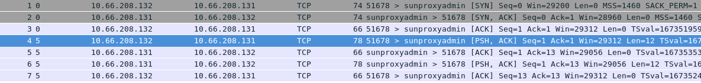

= 网络监控
:toc: manual

== tcpdump

=== 命令行语法

[source, bash]
.*基本命令*
----
tcpdump -nn
----

[cols="2,5a"]
|===
|参数 |描述

|Verbose
|定义日志输出级别:

* `-v`
* `-vv`
* `-vvv`

`v` 越多，输出的日志越详细。

[source, bash]
.*示例*
----
tcpdump -nn -v
----

|Snaplen
|

* `-s SIZE`

RHEL 6 之后的 tcpdump 抓取数据包时每个包的默认抓取长度为 65535 字节，而旧版本（RHEL5 之前）的 tcpdump 每个包默认抓取长度为 68 字节。但是抓取68字节的数据往往不能满足所有故障排除及诊断的需要，所以如果您不确定系统的默认值，请以 "snaplen" 为关键字查找相关信息参考 tcpdump 的 man 手册。如果您想抓到完整的数据包。snaplen 设置为 0 则采用默认的字节数。

注意对于 NFS v3, 把 snaplen 设为 256 就可以满足需求。但如果是针对 READDIR/READDIRPLUS 的故障排除，您可能需要设置 snaplen 为 0。对于 NFS v4, 您需要将 snaplen 设为0。

[source, bash]
.*示例*
----
tcpdump -nn -v -s 0
----

|Interface
|

* `-i INTERFACE`

INTERFACE 常用值是 "eth0" 或 "bond0"。您也可以将其设为 "any" 抓取所有网络接口的数据包，但这会导致同一数据包被抓取多次（例如，某系统配置了 bonding，如果用 "any" 的话既可以抓到 master 的包，也可以抓到 slave 的包）。这种情况下反而使得故障排除/诊断更为复杂，因为很多工具会将多余的包标记为重发的数据。如果您知道正在与之通信的远端 IP 地址，那么您就可以通过 `ip route get` 确定与远程通信的本地网卡。

[source, bash]
.*示例*
----
tcpdump -nn -v -s 0 -i eth0
----

|Output File Location
|指定日志输出文件的路径

* `-w PATH`

[source, bash]
.*示例*
----
tcpdump -nn -v -s 0 -i etho -w /tmp/$(hostname)-$(date +"%Y-%m-%d-%H-%M-%S").pcap
----

|Rolling
|指定单个日志文件的大小，日志文件的数量，日志文件压缩的算法。

* `-C SIZE -W SIZE -z gzip/bzip2`

[source, bash]
.*示例*
----
tcpdump -nn -v -s 0 -i etho -w /tmp/$(hostname)-$(date +"%Y-%m-%d-%H-%M-%S").pcap -C 10 -W 5 -z gzip
----

|Protocol
|指定过滤的协议，支持传输层协议包括：

* tcp
* udp
* icmp
* arp
* rarp

支持二层协议：

* ipv4
* ipv6

[source, bash]
.*示例 - TCP IPv4*
----
tcpdump -nn -v -s 0 -i etho -w /tmp/$(hostname)-$(date +"%Y-%m-%d-%H-%M-%S").pcap -C 10 -W 5 -z gzip ip and tcp
----

|Host
|指定过滤的主机名，可以是本地主机名或地址，也可以是远程主机名或地址。

[source, bash]
.*示例*
----
tcpdump -nn -v -s 0 -i etho -w /tmp/$(hostname)-$(date +"%Y-%m-%d-%H-%M-%S").pcap -C 10 -W 5 -z gzip ip and tcp and dst host example.com
----

|Port
|指定过滤的端口号，可以是本地端口号，也可以是远程端口号，多个端口号用分号分开

[source, bash]
.*示例*
----
tcpdump -nn -v -s 0 -i etho -w /tmp/$(hostname)-$(date +"%Y-%m-%d-%H-%M-%S").pcap -C 10 -W 5 -z gzip ip and tcp and dst host example.com and dst port 80 or 443 or 8080 or 8443
----

|===

=== 抓包步骤

本部分是抓取服务器端和客户端之间网络流量包的步骤。

* 确定客户端和服务器端都安装了 tcpdump RPM 包。

[source, bash]
----
yum install tcpdump
----

* 以 root 用户的身份在服务器端执行以下命令：

[source, bash]
----
tcpdump -n -vv -s 0 -i {interface} -w /tmp/server.cap host {hostname or IP address of client} 
----

在 `{interface}` 处填入与客户端通信的网络设备。如果您想列出所有可以用 tcpdump 抓包的设备，请执行以下命令：

[source, bash]
----
tcpdump -D 
----

* 如果服务器端有很多网络设备，请您确保抓取的是正确接口的流量包。
* 如果您使用了 bonding 或 vlan 接口，请确保抓取的是该设备的流量包。

* 请以 root 用户的身份在客户端执行以下命令：

[source, bash]
----
tcpdump -n -vv -s 0 -i {interface} -w /tmp/client.cap host {hostname or IP address of server} 
----

在 `{interface}` 处填入与服务器端通信的网络设备。

* 尽可能的重现几次需要故障排除的问题。当出现问题后，用 ctrl+c 终止 tcpdump 命令。然后，请您使用 tcpdump 命令的 -r 参数确认是否已经抓取了需要的流量包。如果准确地抓取了流量包，这条命令将会输出从客户端和服务器端发出的包。以下是针对 NFS getttr 的请求和响应抓包的实例：

[source, text]
----
# tcpdump -r /tmp/client.cap
 ...
09:39:06.272688 IP 192.168.155.74.3337237041 > 192.168.155.2.nfs: 216 getattr fh 0,0/22
09:39:06.273342 IP 192.168.155.2.nfs > 192.168.155.74.3337237041: reply ok 88 getattr NON 2 ids 0/9 sz 0
09:39:06.273365 IP 192.168.155.3354014257 > 192.168.155.2.nfs: 220 getattr fh 0,0/22
09:39:06.273840 IP 192.168.155.2.nfs > 192.168.155.74.3354014257: reply ok 108 getattr NON 2 ids 0/9 sz 0
----

* 如果需要追踪的文件很大（几百MB，甚至几GB), 请用 gzip 工具压缩。您也可以使用其他压缩方法，例如 bzip2 ，但是一些工具例如tshark 也许不能识别这些文件，所以建议您使用 gzip。

[source, text]
----
# gzip /tmp/client.cap
# gzip /tmp/server.cap
----

=== Wireshark 图形化展示

Wireshark 可以用来图形化展示，或分析抓取的包。Wireshark 的优点包括，不同的包定义了不同的颜色，可以设定不同的过滤条件等。

[source, bash]
.*安装 Wireshark*
----
yum -y install wireshark-gnome
----

*图形化展示包示例*

image:img/wireshark.png[]

== tcpdump 基本使用案例

=== 基本包抓取

[source, text]
.*执行如下命令*
----
# tcpdump -nn -v -i eth0
...
17:19:39.427523 IP (tos 0x10, ttl 64, id 25697, offset 0, flags [DF], proto TCP (6), length 384)
    10.66.208.132.22 > 10.72.12.23.45346: Flags [P.], cksum 0xf297 (incorrect -> 0x5fe8), seq 12470020:12470352, ack 8713, win 291, options [nop,nop,TS val 1568450528 ecr 43969034], length 332
17:19:39.427600 IP (tos 0x10, ttl 56, id 10362, offset 0, flags [DF], proto TCP (6), length 52)
    10.72.12.23.45346 > 10.66.208.132.22: Flags [.], cksum 0x5d77 (correct), ack 12444156, win 1338, options [nop,nop,TS val 43969034 ecr 1568450521], length 0
...
----

如上抓取的包中可以看到：

* 网络三层的协议，源和目的地址，端口
* TCP 详细信息，如 flags, sequence, ack, win, options

=== DNS 解析包的抓取

[source, text]
.*1. 执行如下命令，只抓取 DNS 解析相关的包*
----
# tcpdump -nnv -i eth0 host 10.66.208.106 and port 53
tcpdump: listening on eth0, link-type EN10MB (Ethernet), capture size 262144 bytes
----

[source, text]
.*2. 执行一次 DNS 解析*
----
# dig @10.66.208.106 A test.apps.example.com +short
10.66.208.102
----

[source, text]
.*3. 查看抓取包的信息*
----
22:57:58.748210 IP (tos 0x0, ttl 64, id 57251, offset 0, flags [none], proto UDP (17), length 78)
    10.66.208.132.38893 > 10.66.208.106.53: 31214+ [1au] A? test.apps.example.com. (50)
22:57:58.748391 IP (tos 0x0, ttl 64, id 64243, offset 0, flags [DF], proto UDP (17), length 83)
    10.66.208.106.53 > 10.66.208.132.38893: 31214*$ 1/0/0 test.apps.example.com. A 10.66.208.102 (55)
----

=== HTTP 包抓取及分析

[source, text]
.*1. 监控抓取 80 端口所有包，并将结果保存到文件*
----
# tcpdump -nnv -i eth0 port 80 -w http.pcap
tcpdump: listening on eth0, link-type EN10MB (Ethernet), capture size 262144 bytes
----

[source, text]
.*2. 执行 http 请求*
----
# curl example.com
This is the message from servera.example.com
----

[source, text]
.*3. 停止抓包监控*
----
# ls -l http.pcap 
-rw-r--r--. 1 tcpdump tcpdump 1266 Dec 29 23:11 http.pcap
----

NOTE: 如上 http.pcap 是一个二进制文件，具体内容无法查看。

[source, text]
.*4. 执行如下命令，分析 http 包*
----
# tcpdump -nnv -r http.pcap 
reading from file http.pcap, link-type EN10MB (Ethernet)
23:17:21.776068 IP (tos 0x0, ttl 64, id 47181, offset 0, flags [DF], proto TCP (6), length 60)
    10.66.208.132.58206 > 10.66.208.131.80: Flags [S], cksum 0xb5ba (incorrect -> 0x005f), seq 453287265, win 29200, options [mss 1460,sackOK,TS val 1589912876 ecr 0,nop,wscale 7], length 0
23:17:21.776339 IP (tos 0x0, ttl 64, id 0, offset 0, flags [DF], proto TCP (6), length 60)
    10.66.208.131.80 > 10.66.208.132.58206: Flags [S.], cksum 0x3972 (correct), seq 576059978, ack 453287266, win 28960, options [mss 1460,sackOK,TS val 1589922919 ecr 1589912876,nop,wscale 7], length 0
23:17:21.776364 IP (tos 0x0, ttl 64, id 47182, offset 0, flags [DF], proto TCP (6), length 52)
    10.66.208.132.58206 > 10.66.208.131.80: Flags [.], cksum 0xb5b2 (incorrect -> 0xd878), ack 1, win 229, options [nop,nop,TS val 1589912877 ecr 1589922919], length 0
23:17:21.776428 IP (tos 0x0, ttl 64, id 47183, offset 0, flags [DF], proto TCP (6), length 127)
    10.66.208.132.58206 > 10.66.208.131.80: Flags [P.], cksum 0xb5fd (incorrect -> 0xaed3), seq 1:76, ack 1, win 229, options [nop,nop,TS val 1589912877 ecr 1589922919], length 75: HTTP, length: 75
	GET / HTTP/1.1
	User-Agent: curl/7.29.0
	Host: example.com
	Accept: */*
	
23:17:21.776585 IP (tos 0x0, ttl 64, id 46627, offset 0, flags [DF], proto TCP (6), length 52)
    10.66.208.131.80 > 10.66.208.132.58206: Flags [.], cksum 0xd82e (correct), ack 76, win 227, options [nop,nop,TS val 1589922920 ecr 1589912877], length 0
23:17:21.777855 IP (tos 0x0, ttl 64, id 46628, offset 0, flags [DF], proto TCP (6), length 383)
    10.66.208.131.80 > 10.66.208.132.58206: Flags [P.], cksum 0xaf8d (correct), seq 1:332, ack 76, win 227, options [nop,nop,TS val 1589922921 ecr 1589912877], length 331: HTTP, length: 331
	HTTP/1.1 200 OK
	Date: Sat, 29 Dec 2018 23:21:12 GMT
	Server: Apache/2.4.6 (Red Hat Enterprise Linux) mod_wsgi/3.4 Python/2.7.5
	Last-Modified: Sat, 29 Dec 2018 16:05:26 GMT
	ETag: "2e-57e2b5913ab20"
	Accept-Ranges: bytes
	Content-Length: 46
	Content-Type: text/html; charset=UTF-8
	
	This is the message from servera.example.com 
23:17:21.777873 IP (tos 0x0, ttl 64, id 47184, offset 0, flags [DF], proto TCP (6), length 52)
    10.66.208.132.58206 > 10.66.208.131.80: Flags [.], cksum 0xb5b2 (incorrect -> 0xd6d7), ack 332, win 237, options [nop,nop,TS val 1589912878 ecr 1589922921], length 0
23:17:21.777985 IP (tos 0x0, ttl 64, id 47185, offset 0, flags [DF], proto TCP (6), length 52)
    10.66.208.132.58206 > 10.66.208.131.80: Flags [F.], cksum 0xb5b2 (incorrect -> 0xd6d6), seq 76, ack 332, win 237, options [nop,nop,TS val 1589912878 ecr 1589922921], length 0
23:17:21.778129 IP (tos 0x0, ttl 64, id 46629, offset 0, flags [DF], proto TCP (6), length 52)
    10.66.208.131.80 > 10.66.208.132.58206: Flags [F.], cksum 0xd6df (correct), seq 332, ack 77, win 227, options [nop,nop,TS val 1589922921 ecr 1589912878], length 0
23:17:21.778139 IP (tos 0x0, ttl 64, id 47186, offset 0, flags [DF], proto TCP (6), length 52)
    10.66.208.132.58206 > 10.66.208.131.80: Flags [.], cksum 0xb5b2 (incorrect -> 0xd6d5), ack 333, win 237, options [nop,nop,TS val 1589912878 ecr 1589922921], length 0
----

== TCP 连接建立与断开

本部分通过一个简单的 C 语言 getDatetime 应用，通过抓包分析 TCP 三次握手建立连接，及四次握手断开连接。

getDatetime 应用：

https://github.com/kylinsoong/C/blob/master/getDatetime/README.adoc

[source, text]
.*tcpdump 抓取包，并将结果保存到文件*
----
# tcpdump -nnv -i eth0 port 5000 -w tcp.pcap
----

[source, text]
.*运行客户端，请求服务器的时间的日期*
----
# ./client 10.66.208.131
Sun Dec 30 09:01:57 2018
----

[source, text]
.*tcpdump 分析 tcp.pcap*
----
# tcpdump -nnv -r tcp.pcap 
reading from file tcp.pcap, link-type EN10MB (Ethernet)
00:58:06.120860 IP (tos 0x0, ttl 64, id 62514, offset 0, flags [DF], proto TCP (6), length 60)
    10.66.208.132.53666 > 10.66.208.131.5000: Flags [S], cksum 0xb5ba (incorrect -> 0xe577), seq 3940789207, win 29200, options [mss 1460,sackOK,TS val 1595957221 ecr 0,nop,wscale 7], length 0
00:58:06.121218 IP (tos 0x0, ttl 64, id 0, offset 0, flags [DF], proto TCP (6), length 60)
    10.66.208.131.5000 > 10.66.208.132.53666: Flags [S.], cksum 0xd2ff (correct), seq 3416088914, ack 3940789208, win 28960, options [mss 1460,sackOK,TS val 1595967302 ecr 1595957221,nop,wscale 7], length 0
00:58:06.121233 IP (tos 0x0, ttl 64, id 62515, offset 0, flags [DF], proto TCP (6), length 52)
    10.66.208.132.53666 > 10.66.208.131.5000: Flags [.], cksum 0xb5b2 (incorrect -> 0x7206), ack 1, win 229, options [nop,nop,TS val 1595957222 ecr 1595967302], length 0
00:58:06.122107 IP (tos 0x0, ttl 64, id 58900, offset 0, flags [DF], proto TCP (6), length 78)
    10.66.208.131.5000 > 10.66.208.132.53666: Flags [P.], cksum 0x6a36 (correct), seq 1:27, ack 1, win 227, options [nop,nop,TS val 1595967303 ecr 1595957222], length 26
00:58:06.122114 IP (tos 0x0, ttl 64, id 58901, offset 0, flags [DF], proto TCP (6), length 52)
    10.66.208.131.5000 > 10.66.208.132.53666: Flags [F.], cksum 0x71ec (correct), seq 27, ack 1, win 227, options [nop,nop,TS val 1595967303 ecr 1595957222], length 0
00:58:06.122132 IP (tos 0x0, ttl 64, id 62516, offset 0, flags [DF], proto TCP (6), length 52)
    10.66.208.132.53666 > 10.66.208.131.5000: Flags [.], cksum 0xb5b2 (incorrect -> 0x71eb), ack 27, win 229, options [nop,nop,TS val 1595957222 ecr 1595967303], length 0
00:58:06.122250 IP (tos 0x0, ttl 64, id 62517, offset 0, flags [DF], proto TCP (6), length 52)
    10.66.208.132.53666 > 10.66.208.131.5000: Flags [F.], cksum 0xb5b2 (incorrect -> 0x71e8), seq 1, ack 28, win 229, options [nop,nop,TS val 1595957223 ecr 1595967303], length 0
00:58:06.122358 IP (tos 0x0, ttl 64, id 58902, offset 0, flags [DF], proto TCP (6), length 52)
    10.66.208.131.5000 > 10.66.208.132.53666: Flags [.], cksum 0x71e9 (correct), ack 2, win 227, options [nop,nop,TS val 1595967304 ecr 1595957223], length 0
----

可以看到，共抓取了 8 个包，其中：

* 前三个包与 TCP 连接建立相关
* 第四个包是从服务器端接收时间和日期
* 后四个包与 TCP 连接断开相关

*Wireshark 分析 tcp.pcap*

image:img/wireshare-tcp.png[]

== TCP Socket 传输

本部分通过 Java Socket API 实现一个 Echo 服务，即

* 服务器端监听在 0.0.0.0:8081 端口
* 客户端可连接到服务器
* 服务器等待客户端的 Echo 请求
* 客户端发送 Echo 请求(Echo 消息的内容从 console 口读取)
* 服务器端接收到 Echo 请求后，返回 Echo 消息到客户端
* 客户端读取消息并打印输出

*服务器端编译及运行*

link:files/Server.java[Server.java]

[source, java]
----
# javac Server.java 
# java Server
----

*客户端编译*

link:files/Client.java[Client.java]

[source, java]
----
# javac Client.java
----

[source, text]
.*运行tcpdump 开发抓取包*
----
# tcpdump -nnv -i eth0 port 8081
tcpdump: listening on eth0, link-type EN10MB (Ethernet), capture size 262144 bytes
----

[source, java]
.*运行客户端，发送消息*
----
# java Client 10.66.208.131
Connecting to host 10.66.208.131 on port 8081.
Hello World
server: Hello World
----

[source, text]
.*查看 tcpdump 抓取的包*
----
06:31:52.593989 IP (tos 0x0, ttl 64, id 13233, offset 0, flags [DF], proto TCP (6), length 60)
    10.66.208.132.51676 > 10.66.208.131.8081: Flags [S], cksum 0xf0d3 (correct), seq 781672479, win 29200, options [mss 1460,sackOK,TS val 1673352110 ecr 0,nop,wscale 7], length 0
06:31:52.594038 IP (tos 0x0, ttl 64, id 0, offset 0, flags [DF], proto TCP (6), length 60)
    10.66.208.131.8081 > 10.66.208.132.51676: Flags [S.], cksum 0xb5ba (incorrect -> 0x6af1), seq 2603158238, ack 781672480, win 28960, options [mss 1460,sackOK,TS val 1673362684 ecr 1673352110,nop,wscale 7], length 0
06:31:52.594199 IP (tos 0x0, ttl 64, id 13234, offset 0, flags [DF], proto TCP (6), length 52)
    10.66.208.132.51676 > 10.66.208.131.8081: Flags [.], cksum 0x09f9 (correct), ack 1, win 229, options [nop,nop,TS val 1673352110 ecr 1673362684], length 0
06:31:58.736603 IP (tos 0x0, ttl 64, id 13235, offset 0, flags [DF], proto TCP (6), length 64)
    10.66.208.132.51676 > 10.66.208.131.8081: Flags [P.], cksum 0xa00d (correct), seq 1:13, ack 1, win 229, options [nop,nop,TS val 1673358253 ecr 1673362684], length 12
06:31:58.736663 IP (tos 0x0, ttl 64, id 30243, offset 0, flags [DF], proto TCP (6), length 52)
    10.66.208.131.8081 > 10.66.208.132.51676: Flags [.], cksum 0xb5b2 (incorrect -> 0xd9f0), ack 13, win 227, options [nop,nop,TS val 1673368827 ecr 1673358253], length 0
06:31:58.736898 IP (tos 0x0, ttl 64, id 30244, offset 0, flags [DF], proto TCP (6), length 64)
    10.66.208.131.8081 > 10.66.208.132.51676: Flags [P.], cksum 0xb5be (incorrect -> 0x8804), seq 1:13, ack 13, win 227, options [nop,nop,TS val 1673368827 ecr 1673358253], length 12
06:31:58.737109 IP (tos 0x0, ttl 64, id 13236, offset 0, flags [DF], proto TCP (6), length 52)
    10.66.208.132.51676 > 10.66.208.131.8081: Flags [.], cksum 0xd9e2 (correct), ack 13, win 229, options [nop,nop,TS val 1673358253 ecr 1673368827], length 0
----

*tcpdump -w 参数可以将结果输出到文件，wireshark 查看包*

