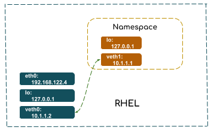

= Namespace
:toc: manual

== 什么是 Network Namespaces

* Network namespaces provide a lightweight container-based virtualization that allows virtual network stacks to be associated with a process group. It creates an isolated copy of the networking data structures such as the interface list, sockets, routing table, the /proc/net/ directory, port numbers, and so on. 
* Network namespaces are managed through the ip interface (sometimes also referred to as iproute2), namely by the ip netns command. 

=== 基本管理

[source, text]
.*ip netns add 创建 Namespace*
----
# ip netns add netns1
----

[source, text]
.*ip netns exec 在 Namespace 中运行网络管理命令*
----
# ip netns exec netns1 ip link list
1: lo: <LOOPBACK> mtu 65536 qdisc noop state DOWN mode DEFAULT qlen 1
    link/loopback 00:00:00:00:00:00 brd 00:00:00:00:00:00
----

[source, text]
.*ip netns delete 删除 Namespace*
----
# ip netns delete netns1
----

=== 配置

[source, text]
.*Active ::1 inside namespace*
----
# ip netns exec netns1 ip link set dev lo up
# ip netns exec netns1 ip link
1: lo: <LOOPBACK,UP,LOWER_UP> mtu 65536 qdisc noqueue state UNKNOWN mode DEFAULT qlen 1
    link/loopback 00:00:00:00:00:00 brd 00:00:00:00:00:00
[root@localhost ~]# ip netns exec netns1 ping 127.0.0.1 -c3
PING 127.0.0.1 (127.0.0.1) 56(84) bytes of data.
64 bytes from 127.0.0.1: icmp_seq=1 ttl=64 time=0.025 ms
64 bytes from 127.0.0.1: icmp_seq=2 ttl=64 time=0.027 ms
64 bytes from 127.0.0.1: icmp_seq=3 ttl=64 time=0.043 ms
----

[source, text]
.*创建虚拟以太网设备，并关联到 namespace*
----
# ip link add veth0 type veth peer name veth1
# ip link set veth1 netns netns1
----

== 本地创建 Network namespace

如上图所示，在 RHEL 上创建一个 namespace `netns1`（RHEL 本地的网络环境相当于 root namespace），在 `root` 上创建一个虚拟以太网设备 `vth0` 关联一个 peer 设备 `vteth1`，并邦定 `vteth1` 给 `netns1`。`vth0` 和 `vth1` 分别邦定 IP 地址位 10.1.1.2 和 10.1.1.1。最终目的是配置完成的两个网络环境可以互相 ping 通，即 `netns1` 和 `root` 之间可以互相 ping 通。

[source, text]
.*1. 创建 namespace netns1*
----
# ip netns add netns1
# ip netns list
netns1
----

[source, text]
.*2. 查看 netns1 网络设备*
----
# ip netns exec netns1 ip link show
1: lo: <LOOPBACK> mtu 65536 qdisc noop state DOWN mode DEFAULT qlen 1
    link/loopback 00:00:00:00:00:00 brd 00:00:00:00:00:00
----

NOTE: loopback `lo` 设备的状态位 *DOWN*

[source, text]
.*3. 在 netns1 中 ping loopback 地址*
----
# ip netns exec netns1 ping 127.0.0.1
connect: Network is unreachable
----

NOTE: `Network is unreachable` 的原因是 loopback `lo` 设备的状态位 *DOWN*。

[source, text]
.*4. Active loopback 设备并测试*
----
# ip netns exec netns1 ip link set dev lo up

# ip netns exec netns1 ping 127.0.0.1
PING 127.0.0.1 (127.0.0.1) 56(84) bytes of data.
64 bytes from 127.0.0.1: icmp_seq=1 ttl=64 time=0.023 ms
----

[source, text]
.*5. 创建虚拟以太网设备，并关联到 netns1*
----
# ip link add veth0 type veth peer name veth1
# ip link set veth1 netns netns1
----

[source, text]
.*6. 分别给 veth0 和 veth1 设定 IP 地址*
----
# ip netns exec netns1 ifconfig veth1 10.1.1.1/24 up
# ifconfig veth0 10.1.1.2/24 up
----

[source, text]
.*7. 互连通性测试*
----
# ping 10.1.1.1
PING 10.1.1.1 (10.1.1.1) 56(84) bytes of data.
64 bytes from 10.1.1.1: icmp_seq=1 ttl=64 time=0.048 ms
64 bytes from 10.1.1.1: icmp_seq=2 ttl=64 time=0.031 ms

# ping -I veth0 10.1.1.1
PING 10.1.1.1 (10.1.1.1) from 10.1.1.2 veth0: 56(84) bytes of data.
64 bytes from 10.1.1.1: icmp_seq=1 ttl=64 time=0.059 ms
64 bytes from 10.1.1.1: icmp_seq=2 ttl=64 time=0.033 ms

# ip netns exec netns1 ping 10.1.1.2
PING 10.1.1.2 (10.1.1.2) 56(84) bytes of data.
64 bytes from 10.1.1.2: icmp_seq=1 ttl=64 time=0.032 ms
64 bytes from 10.1.1.2: icmp_seq=2 ttl=64 time=0.035 ms
----

[source, text]
.*8. 查看 netns1 路由信息*
----
# ip netns exec netns1 route
Kernel IP routing table
Destination     Gateway         Genmask         Flags Metric Ref    Use Iface
10.1.1.0        0.0.0.0         255.255.255.0   U     0      0        0 veth1

# ip netns exec netns1 ping 192.168.122.4
connect: Network is unreachable
----

[source, text]
.*9. 在 netns1 上添加默认路由*
----
# ip netns exec netns1 ip route add default via 10.1.1.2

# ip netns exec netns1 ping 192.168.122.4
PING 192.168.122.4 (192.168.122.4) 56(84) bytes of data.
64 bytes from 192.168.122.4: icmp_seq=1 ttl=64 time=0.035 ms
64 bytes from 192.168.122.4: icmp_seq=2 ttl=64 time=0.038 ms
----

== 本地 Namespace hidden

image:img/netns-local-bridge.png[netns-local-bridge.png]

本部分创建如上图所示网络环境，在随后 link:teaming.adoc[teaming] 和 link:bridge.adoc[bridge] 部分使用此网络环境。

[source, text]
.*1. 创建 namespace hidden*
----
# ip netns add hidden
----

[source, text]
.*2. Active loopback 设备并测试*
----
# ip netns exec hidden ip link set dev lo up
# ip netns exec hidden ping 127.0.0.1
PING 127.0.0.1 (127.0.0.1) 56(84) bytes of data.
64 bytes from 127.0.0.1: icmp_seq=1 ttl=64 time=0.035 ms
64 bytes from 127.0.0.1: icmp_seq=2 ttl=64 time=0.037 ms
----

[source, text]
.*3. 在 namespace 中创建 bridge 并启动*
----
# ip netns exec hidden brctl addbr hiddenbr0
# ip netns exec hidden ip link set dev hiddenbr0 up
----

[source, text]
.*4. 创建虚拟以太网设备，关联到 namespace，并将虚拟 port 关联到 bridge*
----
# ip link add eno1 type veth peer name eno1-port
# ip link set eno1-port netns hidden up
# ip netns exec hidden brctl addif hiddenbr0 eno1-port

# ip link add eno2 type veth peer name eno2-port
# ip link set eno2-port netns hidden up
# ip netns exec hidden brctl addif hiddenbr0 eno2-port
----

[source, text]
.*5. 在 namespace 中创建虚拟以太网设备，并分配 IP 地址，并关联到 bridge*
----
ip netns exec hidden ip link add inside0 type veth peer name inside0-port
ip netns exec hidden brctl addif hiddenbr0 inside0-port
ip netns exec hidden ip link set inside0-port up
ip netns exec hidden ip link set inside0 up
ip netns exec hidden ip addr add 192.168.0.254/24 dev inside0
----

[source, text]
.*6. 启动虚拟设备 eno1 和 eno2*
----
# ip link set dev eno1 up
# ip link set dev eno2 up
----

== Reference

* https://lwn.net/Articles/580893/

