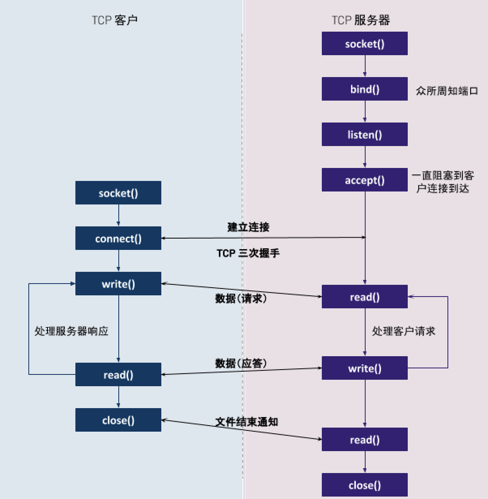

= 网络编程
:toc: manual

== 概述

网络程序指有客户端和服务器端，服务器端通常可以提供一些服务，客户端需要和服务器端建立连接后，消费服务器端所提供的服务，网络程序横跨所有 TCP/IP 5 层网络模型，本部分内部包括：

1. 网络编程基础说明
2. 网络程序示例
3. 网络概念原理实践

下图描述的是一对 TCP 客户与服务器通信的网络程序发生的一些典型事件的时间表：

服务器首先启动，稍后某个时刻客户启动，它试图连接到服务器。客户给服务器发送一个请求，服务器处理该请求，并给客户发回一个响应。这个过程一致持续，直到客户端关闭连接给服务器发送一个文件结束通知，服务器接着关闭服务器端连接。

本部分内容主要围绕着上图所描述的方法函数，相关示例代码参照 link:https://github.com/kylinsoong/network-tools[kylinsoong/network-tools]。

== 套接口地址结构

大多数link#___4[套接口函数]都需要一个指向套接口地址结构的指针作为参数，每个协议族（IPv4、IPv6）都定义了自己的套接口地址结构，这些结构均以 `sockaddr_in` 开头，并以每个协议族的唯一后缀结束。

=== IPv4 套接口地址结构 

IPv4 套接口地址结构在 `<netinet/in.h>` 中定义，如下所示：

[source, c]
.*struct sockaddr_in*
----
struct in_addr {
    in_addr_t      s_addr;
};

struct sockaddr_in {
    unit8_t        sin_len;
    sa_family_t    sin_family;
    in_port_t      sin_port;
    struct in_addr sin_addr;
    char           sin_zero[8];  
};
----

.*套接口地址结构数据类型*
|===
|数据类型 |说明 |头文件

|int8_t
|带符号的八位整数
|<sys/types.h>

|uint8_t
|无符号的八位整数
|<sys/types.h>

|int16_t
|带符号的十六位整数
|<sys/types.h>

|uint16_t
|无符号的十六位整数
|<sys/types.h>

|int32_t
|带符号的三十二位整数
|<sys/types.h>

|uint32_t
|无符号的三十二位整数
|<sys/types.h>

|sa_family_t
|套接口地址结构的地址族
|<sys/socket.h>

|socklen_t
|套接口地址结构的长度，一般为 uint32_t
|<sys/socket.h>

|in_addr_t
|IPv4 地址，一般为 uint32_t
|<netinet/in.h>

|in_port_t
|TCP 或 UDP 端口，一般为 uint16_t
|<netinet/in.h>
|===

IPv4 地址和 TCP 或 UDP 端口号在套接口地址结构中总是以网络字节序来存储。套接口地址结构仅在给定的主机上使用，虽然结构中的某些成员（如 IP 地址和 TCP 或 UDP 端口号）用在不同主机间的通信，但结构本身不参与通信。

[source, c]
.*示例：IPv4 套接口地址结构（functions/structipv4.c）*
----
#include <stdio.h>
#include <sys/socket.h>
#include <sys/types.h>
#include <netinet/in.h>
#include <string.h>

int main (int argc, char **argv)
{
    struct sockaddr_in servaddr;

    memset(&servaddr, 0, sizeof(servaddr));
    servaddr.sin_family = AF_INET;
    servaddr.sin_port = htons(8877);
    inet_aton("192.168.1.100", &servaddr.sin_addr.s_addr);

    char ipAddress[INET_ADDRSTRLEN];
    inet_ntop(AF_INET, &(servaddr.sin_addr), ipAddress, INET_ADDRSTRLEN);

    //char *ip = inet_ntoa(&servaddr.sin_addr.s_addr);
    int port = ntohs(servaddr.sin_port);
    printf("%d:%d\n", &servaddr.sin_addr.s_addr, &servaddr.sin_port);
    printf("%s:%d\n", ipAddress, port);
}
----

=== 通运套接口地址结构

当作为参数传递给任一个套接口函数时，套接口地址结构总是通过指针来传递，但通过指针来取得此参数的套接口函数必须处理来自所支持的任何协议族的套接口地址结构，这就需要声明一个通运套接口地址结构，在`<sys/socket.h>`头文件中定义了一个通运套接口地址结构，如下所示：

[source, c]
.*struct sockaddr*
----
struct sockaddr {
    unit8_t      sa_len;
    sa_family_t  sin_family;
    char         sa_data[14];
};
----

于是，套接口函数被定义采用指向通用套接口地址结构的指针，在方法调用的时候需要将特定协议的套接口地址结构的指针类型转化为通运套接口地址结构的指针，例如：`(struct sockaddr *) &cliaddr`。

=== IPv6 套接口地址结构 

IPv6 套接口地址结构在 `<netinet/in.h>` 中定义，如下所示：

[source, c]
.*struct sockaddr_in6*
----
struct in6_addr {
    unit8_t         s6_addr[16];
};

#define SIN6_LEN

struct sockaddr_in6 {
    unit8_t         sin6_len;
    unit8_t         sin6_family;
    sa_family_t     sin6_port;
    unit32_t        sin6_flowinfo;
    struct in6_addr sin6_addr;
    unit32_t        sin6_scope_id;
}
----

== 基础函数

[source, c]
----

----

== 套接口函数

=== socket

[source, c]
----
#include <sys/socket.h>

int socket(int domain, int type, int protocol);
----

创建一个网络通信的端点，为了执行网络 IO，一个进程必须做的第一件时期是调运 `socket` 函数，指定期望的通信协议(TCP, UDP 等)。

* *domain* - 指明协议族，也往往被称为协议域，可能的值是 `sys/socket.h` 中定义的一些常量，例如：AF_INET（IPv4 协议）、AF_INET6（IPv6 协议）、AF_KEY（密钥接口）；
* *type* - 指明套接口类型，可能的值是 `sys/socket.h` 中定义的一些常量，例如：SOCK_STREAM（字节流套接口）、SOCK_DGRAM（数据报套接口）、SOCK_SEQPACKET（有序分组套接口）、SOCK_RAW（原始套接口）
* *protocol* - 指明协议类型，可能的值是 `sys/socket.h` 中定义的一些常量，例如：IPPROTO_TCP（TCP 传输协议）、IPPROTO_UDP（UDP 传输协议）、IPPROTO_SCTP（SCTP 传输协议）。该参数也可以设定为 0，这样会选择 `domain` 和 `type` 组合的系统缺省值。

`socket` 函数执行成功返回一个非负整数，它与文件描述字类似，我们把它称为套接口描述字（socket descriptor），简称套接字（sockfd）。为了得到这个套接口描述字，我们只指定了协议族（IPv4、IPv6）、套接口类型（字节流、数据报和原始套接口）和协议类型，我们并没有指定本地协议地址或远程协议地址。

[source, c]
.*示例：获取一个套接字（functions/funcsocket.c）*
----
#include <stdio.h>
#include <sys/socket.h>
#include <stdlib.h>

int main (int argc, char **argv)
{
    int sockfd;

    if ( (sockfd = socket(AF_INET, SOCK_STREAM, 0)) < 0) {
        printf("socket error");
        exit(1);
    }

    printf("socket descriptor: %d\n", sockfd);
}
----

=== connect

[source, c]
----
#include <sys/socket.h>

int connect(int sockfd, const struct sockaddr *addr, socklen_t addrlen);
----

TCP 客户端用 `connect` 函数来和 TCP 服务器端建立一个连接。

* *sockfd* - 是由 link:#_socket[socket] 函数返回的套接口描述字；
* *addr* - 一个指向服务器套接口地址结构的指针，套接口地址结构必须含有服务器的 IP 地址和端口号；
* *addrlen* - 第二个参数服务器套接口地址结构的大小。

如果是 TCP 套接口，调运 `connect` 函数会触发 TCP 的三次握手过程，而且仅在连接建立成功或出错时才返回。连接成功返回 0，出错返回 -1。

[source, c]
.*示例：连接到 TCP 服务器（functions/funcconnect.c）*
----
#include <stdio.h>
#include <sys/socket.h>
#include <netinet/in.h>
#include <stdlib.h>
#include <string.h>

int main (int argc, char **argv)
{
    int                sockfd;
    struct sockaddr_in servaddr;

    if (argc != 2) {
        printf("usage: a.out <IPaddress>");
        exit(1);
    }

    if ( (sockfd = socket(AF_INET, SOCK_STREAM, 0)) < 0) {
        printf("socket error");
        exit(1);
    }

    memset(&servaddr, 0, sizeof(servaddr));
    servaddr.sin_family = AF_INET;
    servaddr.sin_port = htons(8877);
    if (inet_pton(AF_INET, argv[1], &servaddr.sin_addr) < 0)
        printf("inet_pton error for %s\n", argv[1]);

    if (connect(sockfd, (struct sockaddr*)&servaddr, sizeof(servaddr)) < 0)
        printf("connect error\n");

}
----

=== bind

[source, c]
----

----

=== listen

[source, c]
----

----

=== accept

[source, c]
----

----

=== close

[source, c]
----

----

=== getsockname/getpeername

[source, c]
----

----
