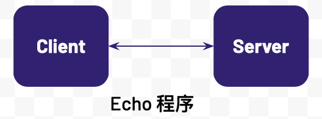
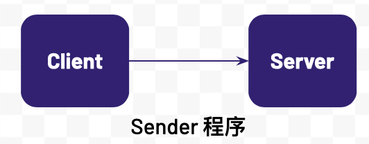
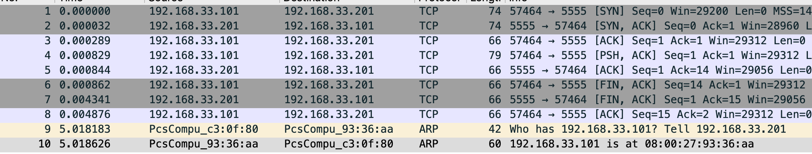
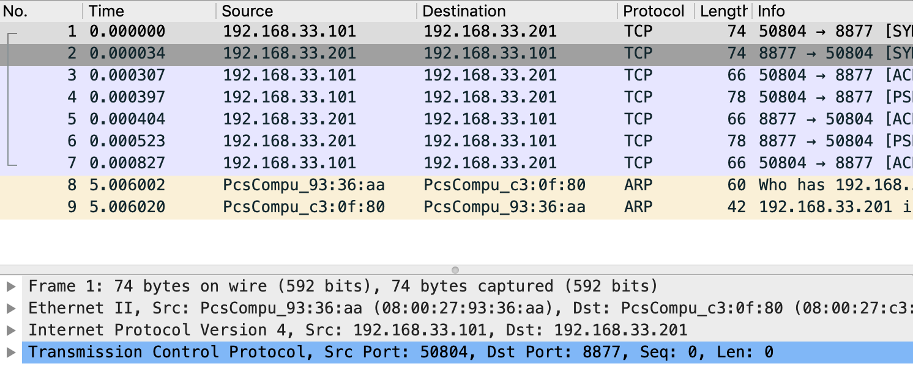

= TCP 调试
:toc: manual

== 说明

本部分通过客户端/服务器端 Echo 小程序和 TCP 抓包和分析工具进行 TCP Debug，目的是理解

* TCP 三次握手
* 二层 Ethernet 帧结构
* 三层 IP 报文结构
* 四层 TCP 段的结构

== 环境准备

=== 相关包安装

在客户端服务器和服务器端服务器上均安装一下包：

[source, bash]
----
sudo yum install net-tools
sudo yum install tcpdump
sudo yum install wireshark-gnome
sudo yum install java-1.8.0-openjdk-devel
----

=== Echo 程序

Echo 程序是 C 客户端和服务器端通信程序，连接建立后，客户端可发送文本到服务器端，服务器端接收到文本后打印输出并将接收到的文本反发回给客户端。客户端和服务器端程序逻辑如下

1. 服务器端监听到一个端口，等待客户端连接
2. 客户端建立一个和服务器端的连接
3. 客户端发送一个消息到服务器端
4. 服务器端接收到客户端发来的消息，打印输出，并将原消息返回给客户端
5. 客户端接收到服务器端返回的消息，打印输出
6. 客户端关闭和服务器端的连接
7. 服务器继续等待下一个客户端的连接

参照附件 link:#_client_c[client.c] 和 link:#_server_c[server.c] 获取相关程序代码。

[source, bash]
.*运行步骤*
----
// 编译运行服务器端（需要安装 gcc）
gcc server.c -o server
./server

//编译运行客户端（需要安装 gc，修改代码中 IP 地址为服务器 IP）
gcc client.c -o client
./client
----

=== Sender 程序

Sender 程序是 Java 客户端和服务器端通信程序，连接建立后，客户端可发送文本到服务器端，并且可以指定发送的文本的大小。客户端和服务器端程序逻辑如下：

1. 服务器端监听到一个端口，等待客户端连接
2. 客户端建立一个和服务器端的连接
3. 客户端发送一个消息到服务器端
4. 服务器端接收客户端发送的消息并输出
5. 客户端关闭和服务器端的连接
6. 服务器端关闭服务器端 Socket

参照附件 link:#_client_java[Client.java] 和 link:#_server_java[Server.java] 获取相关程序代码。

[source, bash]
.*运行步骤*
----
// 编译运行服务器端（java 开发环境需安装，修改代码中 IP 地址为服务器 IP）
javac Server.java
java Server

//编译运行客户端（java 开发环境需安装，修改代码中 IP 地址为服务器 IP）
javac Client.java
java Client 1024
----

== TCP 调试

=== Sender 程序运行抓包分析

[source, bash]
.*1. 服务器端运行 tcpdump*
----
sudo tcpdump -nn -vvv -s 0 -i eth1 -w tcpserver.cap host 192.168.33.101
----

[source, bash]
.*2. 客户端运行 tcpdump*
----
sudo tcpdump -nn -vvv -s 0 -i eth1 -w tcpclient.cap host 192.168.33.201
----

[source, bash]
.*3. 启动 server*
----
javac Server.java
java Server
----

[source, bash]
.*4. 启动 client*
----
javac Client.java
java Client
----

[source, bash]
.*5. 查看 tcpserver.cap*
----
$ tcpdump -r tcpserver.cap
reading from file tcpserver.cap, link-type EN10MB (Ethernet)
12:17:52.687814 IP 192.168.33.101.57464 > server.example.com.personal-agent: Flags [S], seq 3621100753, win 29200, options [mss 1460,sackOK,TS val 21057940 ecr 0,nop,wscale 7], length 0
12:17:52.687846 IP server.example.com.personal-agent > 192.168.33.101.57464: Flags [S.], seq 3295967793, ack 3621100754, win 28960, options [mss 1460,sackOK,TS val 11290008 ecr 21057940,nop,wscale 7], length 0
12:17:52.688103 IP 192.168.33.101.57464 > server.example.com.personal-agent: Flags [.], ack 1, win 229, options [nop,nop,TS val 21057940 ecr 11290008], length 0
12:17:52.688643 IP 192.168.33.101.57464 > server.example.com.personal-agent: Flags [P.], seq 1:14, ack 1, win 229, options [nop,nop,TS val 21057940 ecr 11290008], length 13
12:17:52.688658 IP server.example.com.personal-agent > 192.168.33.101.57464: Flags [.], ack 14, win 227, options [nop,nop,TS val 11290009 ecr 21057940], length 0
12:17:52.688676 IP 192.168.33.101.57464 > server.example.com.personal-agent: Flags [F.], seq 14, ack 1, win 229, options [nop,nop,TS val 21057941 ecr 11290008], length 0
12:17:52.692155 IP server.example.com.personal-agent > 192.168.33.101.57464: Flags [F.], seq 1, ack 15, win 227, options [nop,nop,TS val 11290012 ecr 21057941], length 0
12:17:52.692690 IP 192.168.33.101.57464 > server.example.com.personal-agent: Flags [.], ack 2, win 229, options [nop,nop,TS val 21057945 ecr 11290012], length 0
----

[source, bash]
.*6. 查看 tcpclient.cap*
----
$ tcpdump -r tcpclient.cap
reading from file tcpclient.cap, link-type EN10MB (Ethernet)
12:17:52.679155 IP client.example.com.57464 > server.example.com.personal-agent: Flags [S], seq 3621100753, win 29200, options [mss 1460,sackOK,TS val 21057940 ecr 0,nop,wscale 7], length 0
12:17:52.679512 IP server.example.com.personal-agent > client.example.com.57464: Flags [S.], seq 3295967793, ack 3621100754, win 28960, options [mss 1460,sackOK,TS val 11290008 ecr 21057940,nop,wscale 7], length 0
12:17:52.679530 IP client.example.com.57464 > server.example.com.personal-agent: Flags [.], ack 1, win 229, options [nop,nop,TS val 21057940 ecr 11290008], length 0
12:17:52.680008 IP client.example.com.57464 > server.example.com.personal-agent: Flags [P.], seq 1:14, ack 1, win 229, options [nop,nop,TS val 21057940 ecr 11290008], length 13
12:17:52.680170 IP client.example.com.57464 > server.example.com.personal-agent: Flags [F.], seq 14, ack 1, win 229, options [nop,nop,TS val 21057941 ecr 11290008], length 0
12:17:52.680310 IP server.example.com.personal-agent > client.example.com.57464: Flags [.], ack 14, win 227, options [nop,nop,TS val 11290009 ecr 21057940], length 0
12:17:52.683942 IP server.example.com.personal-agent > client.example.com.57464: Flags [F.], seq 1, ack 15, win 227, options [nop,nop,TS val 11290012 ecr 21057941], length 0
12:17:52.683984 IP client.example.com.57464 > server.example.com.personal-agent: Flags [.], ack 2, win 229, options [nop,nop,TS val 21057945 ecr 11290012], length 0
----

*7. wireshark 图形化分析*

wireshark 打开上面步骤收集到的 tcpdump 文件如下图

=== Echo 程序运行抓包分析

[source, bash]
.*1. 服务器端运行 tcpdump*
----
sudo tcpdump -nn -vvv -s 0 -i eth1 -w server.cap host 192.168.33.101
----

[source, bash]
.*2. 客户端运行 tcpdump*
----
sudo tcpdump -nn -vvv -s 0 -i eth1 -w client.cap host 192.168.33.201
----

[source, bash]
.*3. 启动 server*
----
./server
----

[source, bash]
.*4. 启动 client*
----
./client 
----

[source, bash]
.*5. 查看 server.cap*
----
$ tcpdump -r server.cap 
reading from file server.cap, link-type EN10MB (Ethernet)
09:41:00.217116 IP 192.168.33.101.50802 > server.example.com.8877: Flags [S], seq 769172041, win 29200, options [mss 1460,sackOK,TS val 6053534 ecr 0,nop,wscale 7], length 0
09:41:00.217163 IP server.example.com.8877 > 192.168.33.101.50802: Flags [S.], seq 1869852269, ack 769172042, win 28960, options [mss 1460,sackOK,TS val 4896078 ecr 6053534,nop,wscale 7], length 0
09:41:00.217543 IP 192.168.33.101.50802 > server.example.com.8877: Flags [.], ack 1, win 229, options [nop,nop,TS val 6053534 ecr 4896078], length 0
09:41:00.217822 IP 192.168.33.101.50802 > server.example.com.8877: Flags [P.], seq 1:13, ack 1, win 229, options [nop,nop,TS val 6053535 ecr 4896078], length 12
09:41:00.217903 IP server.example.com.8877 > 192.168.33.101.50802: Flags [.], ack 13, win 227, options [nop,nop,TS val 4896079 ecr 6053535], length 0
09:41:00.218018 IP server.example.com.8877 > 192.168.33.101.50802: Flags [P.], seq 1:13, ack 13, win 227, options [nop,nop,TS val 4896079 ecr 6053535], length 12
09:41:00.218369 IP 192.168.33.101.50802 > server.example.com.8877: Flags [.], ack 13, win 229, options [nop,nop,TS val 6053535 ecr 4896079], length 0
----

[source, bash]
.*6. 查看 client.cap*
----
$ tcpdump -r client.cap 
reading from file client.cap, link-type EN10MB (Ethernet)
09:41:00.177676 IP client.example.com.50802 > server.example.com.8877: Flags [S], seq 769172041, win 29200, options [mss 1460,sackOK,TS val 6053534 ecr 0,nop,wscale 7], length 0
09:41:00.178159 IP server.example.com.8877 > client.example.com.50802: Flags [S.], seq 1869852269, ack 769172042, win 28960, options [mss 1460,sackOK,TS val 4896078 ecr 6053534,nop,wscale 7], length 0
09:41:00.178182 IP client.example.com.50802 > server.example.com.8877: Flags [.], ack 1, win 229, options [nop,nop,TS val 6053534 ecr 4896078], length 0
09:41:00.178468 IP client.example.com.50802 > server.example.com.8877: Flags [P.], seq 1:13, ack 1, win 229, options [nop,nop,TS val 6053535 ecr 4896078], length 12
09:41:00.178842 IP server.example.com.8877 > client.example.com.50802: Flags [.], ack 13, win 227, options [nop,nop,TS val 4896079 ecr 6053535], length 0
09:41:00.178936 IP server.example.com.8877 > client.example.com.50802: Flags [P.], seq 1:13, ack 13, win 227, options [nop,nop,TS val 4896079 ecr 6053535], length 12
09:41:00.178981 IP client.example.com.50802 > server.example.com.8877: Flags [.], ack 13, win 229, options [nop,nop,TS val 6053535 ecr 4896079], length 0
----

*7. wireshark 图形化分析*

wireshark 打开上面步骤收集到的 tcpdump 文件如下图

接下来我们一次分析不同网络通信层的帧、包等详细结构。

=== TODO

== 附件

=== client.c

[source, c]
----
#include <arpa/inet.h>
#include <stdio.h>
#include <string.h>
#include <sys/socket.h>
#include <unistd.h>

int main() {

    printf("echo client\n");

    const char* server_name = "192.168.33.201";
    const int server_port = 8877;

    struct sockaddr_in server_address;
    memset(&server_address, 0, sizeof(server_address));
    server_address.sin_family = AF_INET;

    // creates binary representation of server name
    // and stores it as sin_addr
    // http://beej.us/guide/bgnet/output/html/multipage/inet_ntopman.html    
    inet_pton(AF_INET, server_name, &server_address.sin_addr);

    // htons: port in network order format
    server_address.sin_port = htons(server_port);

    // open a stream socket
    int sock;
    if ((sock = socket(PF_INET, SOCK_STREAM, 0)) < 0) {
        printf("could not create socket\n");
        return 1;
    }

    // TCP is connection oriented, a reliable connection
    // **must** be established before any data is exchanged
    if (connect(sock, (struct sockaddr*)&server_address, sizeof(server_address)) < 0) {
        printf("could not connect to server\n");
        return 1;
    }

    // send
    // data that will be sent to the server
    const char* data_to_send = "Hello World!";
    send(sock, data_to_send, strlen(data_to_send), 0);

    // receive
    int n = 0;
    int len = 0, maxlen = 100;
    char buffer[maxlen];
    char* pbuffer = buffer;

    // will remain open until the server terminates the connection
    while ((n = recv(sock, pbuffer, maxlen, 0)) > 0) {
        pbuffer += n;
        maxlen -= n;
        len += n;

        buffer[len] = '\0';
        printf("received: '%s'\n", buffer);
        break;
    }

    // close socket
    close(sock);
    return 0;
}
----

=== server.c

[source, c]
----
#include <arpa/inet.h>
#include <netinet/in.h>
#include <stdbool.h>
#include <stdio.h>
#include <string.h>
#include <unistd.h>

/**
 * TCP Uses 2 types of sockets, the connection socket and the listen socket.
 * The Goal is to separate the connection phase from the data exchange phase.
 **/

int main(int argc, char *argv[])  {

    printf("echo server\n");

    // port to start the server on
    int SERVER_PORT = 8877;

    // socket address used for the server
    struct sockaddr_in server_address;
    memset(&server_address, 0, sizeof(server_address));
    server_address.sin_family = AF_INET;

    // htons: host to network short: transforms a value in host byte
    // ordering format to a short value in network byte ordering format
    server_address.sin_port = htons(SERVER_PORT);

    // htonl: host to network long: same as htons but to long
    server_address.sin_addr.s_addr = htonl(INADDR_ANY);

    // create a TCP socket, creation returns -1 on failure
    int listen_sock;
    if ((listen_sock = socket(PF_INET, SOCK_STREAM, 0)) < 0) {
        printf("could not create listen socket\n");
        return 1;
    }

    // bind it to listen to the incoming connections on the created server
    // address, will return -1 on error
    if ((bind(listen_sock, (struct sockaddr *)&server_address, sizeof(server_address))) < 0) {
        printf("could not bind socket\n");
        return 1;
    }

    // maximum number of waiting clients, after which
    // dropping begins
    int wait_size = 16;
    if (listen(listen_sock, wait_size) < 0) {
        printf("could not open socket for listening\n");
        return 1;
    }

    // socket address used to store client address
    struct sockaddr_in client_address;
    int client_address_len = 0;

    // run indefinitely
    while (true) {
        // open a new socket to transmit data per connection
        int sock;
        if ((sock = accept(listen_sock, (struct sockaddr *)&client_address, &client_address_len)) < 0) {
            printf("could not open a socket to accept data\n");
            return 1;
        }

        int n = 0;
        int len = 0, maxlen = 100;
        char buffer[maxlen];
        char *pbuffer = buffer;

        printf("client connected with ip address: %s\n", inet_ntoa(client_address.sin_addr));

        //keep running as long as the client keeps the connection open
        while ((n = recv(sock, pbuffer, maxlen, 0)) > 0) {
            pbuffer += n;
            maxlen -= n;
            len += n;

            printf("received: '%s'\n", buffer);

            // echo received content back
            send(sock, buffer, len, 0);
        }

        close(sock);
    }

    close(listen_sock);
    return 0;
}
----

=== Server.java

[source, java]
.*Server.java*
----
import java.io.* ;
import java.net.*;

public class Server {

    public static void main(String[] args) throws IOException, InterruptedException {

        System.out.println("server");

        InetAddress addr = InetAddress.getByName("192.168.33.201");
        ServerSocket serversocket = new ServerSocket(5555, 50, addr);
        Socket socket = serversocket.accept();
        System.out.println("received client, " + socket.getInetAddress());

        DataInputStream dis = new DataInputStream(socket.getInputStream());
        String str = (String)dis.readUTF();
        System.out.println("message= " + str);

        serversocket.close();

    }
}
----

=== Client.java

[source, java]
.*Client.java*
----
import java.io.* ;
import java.net.*;
import java.util.UUID;

public class Client {

    public static void main(String[] args) throws UnknownHostException, IOException, InterruptedException {

        String msg = "Hello World";

        if(args.length > 0) {
            Integer len = Integer.parseInt(args[0]);
            System.out.println(len);
            msg = genrate(len);
        }

        System.out.println("client");
        Socket socketClient = new Socket("192.168.33.201",5555);

        DataOutputStream dout = new DataOutputStream(socketClient.getOutputStream());
        dout.writeUTF(msg);
        dout.flush();
        dout.close();
        System.out.println("send message to server");

        socketClient.close();
    }

        private static String genrate(int len) {
                char[] array = new char[len];
                int pos = 0;
                while (pos < len) {
                        array[pos] = UUID.randomUUID().toString().charAt(1);
                        pos++;
                }
                return new String(array);
        }
}
----
