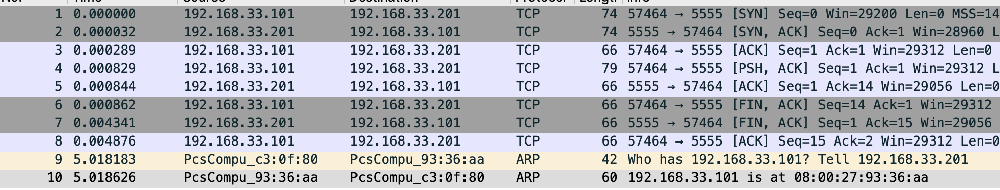

= TCP 连接建立与终止
:toc: manual

== 说明

本部分通过抓包分析 TCP 连接建立与关闭的过程。客户端和服务器端程序逻辑如下：

image:img/client_server.png[]

1. 服务器端监听到一个端口，等待客户端连接
2. 客户端建立一个和服务器端的连接
3. 客户端发送一个消息到服务器端
4. 服务器端接收客户端发送的消息并输出
5. 客户端关闭和服务器端的连接
6. 服务器端关闭服务器端 Socket

[source, java]
.*Server.java*
----
import java.io.* ;
import java.net.*;

public class Server {

    public static void main(String[] args) throws IOException, InterruptedException {

        System.out.println("server");

        InetAddress addr = InetAddress.getByName("192.168.33.201");
        ServerSocket serversocket = new ServerSocket(5555, 50, addr);
        Socket socket = serversocket.accept();
        System.out.println("received client, " + socket.getInetAddress());

        DataInputStream dis = new DataInputStream(socket.getInputStream());
        String str = (String)dis.readUTF();
        System.out.println("message= " + str);
        
        serversocket.close();

    }
}
----

[source, java]
.*Client.java*
----
import java.io.* ;
import java.net.*;

public class Client {

    public static void main(String[] args) throws UnknownHostException, IOException, InterruptedException {

        System.out.println("client");
        Socket socketClient = new Socket("192.168.33.201",5555);

        DataOutputStream dout = new DataOutputStream(socketClient.getOutputStream());
        dout.writeUTF("Hello World");
        dout.flush();
        dout.close();
        System.out.println("send message to server");

        socketClient.close();
    }
}
----

NOTE: `sudo yum install java-1.8.0-openjdk-devel` 可以安装 Java 开发环境。

== TCP 连接的建立与终止

[source, bash]
.*1. 服务器端运行 tcpdump*
----
sudo tcpdump -nn -vvv -s 0 -i eth1 -w tcpserver.cap host 192.168.33.101
----

[source, bash]
.*2. 客户端运行 tcpdump*
----
sudo tcpdump -nn -vvv -s 0 -i eth1 -w tcpclient.cap host 192.168.33.201
----

[source, bash]
.*3. 启动 server*
----
javac Server.java 
java Server
----

[source, bash]
.*4. 启动 client*
----
javac Client.java 
java Client
----

[source, bash]
.*5. 查看 tcpserver.cap*
----
$ tcpdump -r tcpserver.cap 
reading from file tcpserver.cap, link-type EN10MB (Ethernet)
12:17:52.687814 IP 192.168.33.101.57464 > server.example.com.personal-agent: Flags [S], seq 3621100753, win 29200, options [mss 1460,sackOK,TS val 21057940 ecr 0,nop,wscale 7], length 0
12:17:52.687846 IP server.example.com.personal-agent > 192.168.33.101.57464: Flags [S.], seq 3295967793, ack 3621100754, win 28960, options [mss 1460,sackOK,TS val 11290008 ecr 21057940,nop,wscale 7], length 0
12:17:52.688103 IP 192.168.33.101.57464 > server.example.com.personal-agent: Flags [.], ack 1, win 229, options [nop,nop,TS val 21057940 ecr 11290008], length 0
12:17:52.688643 IP 192.168.33.101.57464 > server.example.com.personal-agent: Flags [P.], seq 1:14, ack 1, win 229, options [nop,nop,TS val 21057940 ecr 11290008], length 13
12:17:52.688658 IP server.example.com.personal-agent > 192.168.33.101.57464: Flags [.], ack 14, win 227, options [nop,nop,TS val 11290009 ecr 21057940], length 0
12:17:52.688676 IP 192.168.33.101.57464 > server.example.com.personal-agent: Flags [F.], seq 14, ack 1, win 229, options [nop,nop,TS val 21057941 ecr 11290008], length 0
12:17:52.692155 IP server.example.com.personal-agent > 192.168.33.101.57464: Flags [F.], seq 1, ack 15, win 227, options [nop,nop,TS val 11290012 ecr 21057941], length 0
12:17:52.692690 IP 192.168.33.101.57464 > server.example.com.personal-agent: Flags [.], ack 2, win 229, options [nop,nop,TS val 21057945 ecr 11290012], length 0
----

[source, bash]
.*6. 查看 tcpclient.cap*
----
$ tcpdump -r tcpclient.cap 
reading from file tcpclient.cap, link-type EN10MB (Ethernet)
12:17:52.679155 IP client.example.com.57464 > server.example.com.personal-agent: Flags [S], seq 3621100753, win 29200, options [mss 1460,sackOK,TS val 21057940 ecr 0,nop,wscale 7], length 0
12:17:52.679512 IP server.example.com.personal-agent > client.example.com.57464: Flags [S.], seq 3295967793, ack 3621100754, win 28960, options [mss 1460,sackOK,TS val 11290008 ecr 21057940,nop,wscale 7], length 0
12:17:52.679530 IP client.example.com.57464 > server.example.com.personal-agent: Flags [.], ack 1, win 229, options [nop,nop,TS val 21057940 ecr 11290008], length 0
12:17:52.680008 IP client.example.com.57464 > server.example.com.personal-agent: Flags [P.], seq 1:14, ack 1, win 229, options [nop,nop,TS val 21057940 ecr 11290008], length 13
12:17:52.680170 IP client.example.com.57464 > server.example.com.personal-agent: Flags [F.], seq 14, ack 1, win 229, options [nop,nop,TS val 21057941 ecr 11290008], length 0
12:17:52.680310 IP server.example.com.personal-agent > client.example.com.57464: Flags [.], ack 14, win 227, options [nop,nop,TS val 11290009 ecr 21057940], length 0
12:17:52.683942 IP server.example.com.personal-agent > client.example.com.57464: Flags [F.], seq 1, ack 15, win 227, options [nop,nop,TS val 11290012 ecr 21057941], length 0
12:17:52.683984 IP client.example.com.57464 > server.example.com.personal-agent: Flags [.], ack 2, win 229, options [nop,nop,TS val 21057945 ecr 11290012], length 0
----

*7. wireshark 图形化分析*

wireshark 打开上面步骤收集到的 tcpdump 文件如下图

