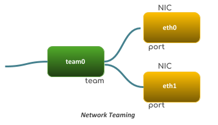

= Teaming
:toc: manual

== 什么是网络 teaming

Teaming 是一种以逻辑方式将 NIC 链接到一起，从而实现故障转移或更高吞吐量的方法。Teaming 是一种新的方式，不会影响 Linux 内核中更早的 Bonding 驱动程序；它提供一种备选方式，相比较之前 Linux 版本中的 Bonding，Teaming提供更好的性能，并且由于其模块化，现代化的设计，灵活性，可扩展性更强。

在 RHEL 7 中，Teaming 是通过一个小的内核驱动程序和一个用户空间守护进程 teamd 来实现的，内核高效地处理网络包，而 teamd 负责逻辑和接口处理。Teaming 使用的软件负载均衡策略如下表:

|===
|名称 |描述

|broadcast
|一个简单运行程序，传输来自所有端口的每个包。

|roundrobin
|一个简单运行程序，以轮循方式传输来自每个端口的包

|activebackup
|这是一个故障转移运行程序，监视链接更改并选择活动端口进行数据传输

|loadbalance
|此运行程序监控流量并使用哈希函数以尝试在为包传输选择端口时达到完美均衡

|lacp
|实施 802.3ad 链路聚合控制协议。可以使用与 loadbalance 运行程序相同的传输端口选择可能性
|===

网络交互都是通过 `team 接口` 和 `port 接口来完成的`，使用 NetworkManager 来管理网络 teaming 时需要遵循如下规则:

* 启动网络 team 接口不会自动启动 port 接口。
* 启动 port 接口始终会启动合作接口。
* 停止合作接口也会停止 port 接口。
* 不含 port 的合作接口可以启动静态 IP 连接。
* 在启动 DHCP 连接时，不含 port 的组将等待 port 。
* 当添加具有载波的 port 时，等待 port 且具有 DHCP 连接的组会完成。
* 当添加不具有载体的 port 时，等待 port 且具有 DHCP 连接的组会继续等待。

== 配置网络 Teaming

[source, text]
.*1. 查看网络接口状态，eno1 和 eno2 将是 team 接口的 ports*
----
# ip link | grep eno
6: eno1@if5: <BROADCAST,MULTICAST,UP,LOWER_UP> mtu 1500 qdisc noqueue state UP mode DEFAULT qlen 1000
8: eno2@if7: <BROADCAST,MULTICAST,UP,LOWER_UP> mtu 1500 qdisc noqueue state UP mode DEFAULT qlen 1000
----

[source, text]
.*2. 创建 active-backup teaming 接口 team0，并设定 IPv4 配置*
----
# nmcli connection add con-name team0 type team ifname team0 config '{"runner": {"name": "activebackup"}}'
Connection 'team0' (13a231ae-4303-40dc-822b-af186b9c940a) successfully added.

# nmcli connection modify team0 ipv4.addresses '192.168.0.100/24'
# nmcli connection modify team0 ipv4.method manual
----

[source, text]
.*3. 设定 eno1 和 eno2 为 team0 的 port*
----
# nmcli connection add con-name team0-port1 type team-slave ifname eno1 master team0
Connection 'team0-port1' (1950316e-5344-41b8-a49f-79c04f89d375) successfully added.

# nmcli connection add con-name team0-port2 type team-slave ifname eno2 master team0
Connection 'team0-port2' (5dd9d796-3936-40f1-b10f-ac34f6abedfb) successfully added.
----

[source, text]
.*4. Active 所有接口*
----
]# nmcli connection up team0
Connection successfully activated (master waiting for slaves) (D-Bus active path: /org/freedesktop/NetworkManager/ActiveConnection/5)

# nmcli connection up team0-port1
Connection successfully activated (D-Bus active path: /org/freedesktop/NetworkManager/ActiveConnection/6)

# nmcli connection up team0-port2
Connection successfully activated (D-Bus active path: /org/freedesktop/NetworkManager/ActiveConnection/7)
----

[source, text]
.*5. 查看 team 接口状态*
----
# teamdctl team0 state
setup:
  runner: activebackup
ports:
  eno1
    link watches:
      link summary: up
      instance[link_watch_0]:
        name: ethtool
        link: up
        down count: 0
  eno2
    link watches:
      link summary: up
      instance[link_watch_0]:
        name: ethtool
        link: up
        down count: 0
runner:
  active port: eno1
----

[source, text]
.*6. ping 网关，测试连通性*
----
# ping -I team0 192.168.0.254
PING 192.168.0.254 (192.168.0.254) from 192.168.0.100 team0: 56(84) bytes of data.
64 bytes from 192.168.0.254: icmp_seq=1 ttl=64 time=0.050 ms
64 bytes from 192.168.0.254: icmp_seq=2 ttl=64 time=0.047 ms
----

[source, text]
.*7. 关闭处于 active 状态的 port 对应的连接*
----
# nmcli device disconnect eno1 
Device 'eno1' successfully disconnected.

# teamdctl team0 state
setup:
  runner: activebackup
ports:
  eno2
    link watches:
      link summary: up
      instance[link_watch_0]:
        name: ethtool
        link: up
        down count: 0
runner:
  active port: eno2
----

[source, text]
.*8. 重起关闭了的连接，并关闭当前处于 active 状态的 port 对应的连接*
----
# nmcli connection up team0-port1
Connection successfully activated (D-Bus active path: /org/freedesktop/NetworkManager/ActiveConnection/8)

# nmcli device disconnect eno2
Device 'eno2' successfully disconnected.

# teamdctl team0 state
setup:
  runner: activebackup
ports:
  eno1
    link watches:
      link summary: up
      instance[link_watch_0]:
        name: ethtool
        link: up
        down count: 0
runner:
  active port: eno1
----

[source, text]
.*9. 重起关闭了的连接*
---- 
# nmcli connection up team0-port2
Connection successfully activated (D-Bus active path: /org/freedesktop/NetworkManager/ActiveConnection/9)

# teamdctl team0 state
setup:
  runner: activebackup
ports:
  eno1
    link watches:
      link summary: up
      instance[link_watch_0]:
        name: ethtool
        link: up
        down count: 0
  eno2
    link watches:
      link summary: up
      instance[link_watch_0]:
        name: ethtool
        link: up
        down count: 0
runner:
  active port: eno1
----

[source, text]
.*10. 查看网络配置文件*
----
# cat /etc/sysconfig/network-scripts/ifcfg-team0
DEVICE=team0
TEAM_CONFIG="{\"runner\": {\"name\": \"activebackup\"}}"
PROXY_METHOD=none
BROWSER_ONLY=no
BOOTPROTO=none
DEFROUTE=yes
IPV4_FAILURE_FATAL=no
IPV6INIT=yes
IPV6_AUTOCONF=yes
IPV6_DEFROUTE=yes
IPV6_FAILURE_FATAL=no
IPV6_ADDR_GEN_MODE=stable-privacy
NAME=team0
UUID=13a231ae-4303-40dc-822b-af186b9c940a
ONBOOT=yes
DEVICETYPE=Team
IPADDR=192.168.0.100
PREFIX=24

# cat /etc/sysconfig/network-scripts/ifcfg-team0-port1
NAME=team0-port1
UUID=1950316e-5344-41b8-a49f-79c04f89d375
DEVICE=eno1
ONBOOT=yes
TEAM_MASTER=team0
DEVICETYPE=TeamPort

# cat /etc/sysconfig/network-scripts/ifcfg-team0-port2
NAME=team0-port2
UUID=5dd9d796-3936-40f1-b10f-ac34f6abedfb
DEVICE=eno2
ONBOOT=yes
TEAM_MASTER=team0
DEVICETYPE=TeamPort
----

[source, text]
.*11. 配置负载均衡策略为 roundrobin*
---- 
# nmcli device disconnect team0 
Device 'team0' successfully disconnected.

# vim /etc/sysconfig/network-scripts/ifcfg-team0
# grep runner /etc/sysconfig/network-scripts/ifcfg-team0
TEAM_CONFIG="{\"runner\": {\"name\": \"roundrobin\"}}"

# nmcli connection load /etc/sysconfig/network-scripts/ifcfg-team0
----

[source, text]
.*12. 启动 team0*
----
# nmcli connection up team0
Connection successfully activated (master waiting for slaves) (D-Bus active path: /org/freedesktop/NetworkManager/ActiveConnection/10)

# teamdctl team0 state
setup:
  runner: roundrobin

# ping -I team0 192.168.0.254
PING 192.168.0.254 (192.168.0.254) from 192.168.0.100 team0: 56(84) bytes of
data.
From 192.168.0.100 icmp_seq=1 Destination Host Unreachable
From 192.168.0.100 icmp_seq=2 Destination Host Unreachable
----

[source, text]
.*13. 启动任意一个 port*
----  
# nmcli connection up team0-port1
Connection successfully activated (D-Bus active path: /org/freedesktop/NetworkManager/ActiveConnection/11)

# teamdctl team0 state
setup:
  runner: roundrobin
ports:
  eno1
    link watches:
      link summary: up
      instance[link_watch_0]:
        name: ethtool
        link: up
        down count: 0

# ping -I team0 192.168.0.254
PING 192.168.0.254 (192.168.0.254) from 192.168.0.100 team0: 56(84) bytes of data.
64 bytes from 192.168.0.254: icmp_seq=1 ttl=64 time=0.048 ms
64 bytes from 192.168.0.254: icmp_seq=2 ttl=64 time=0.038 ms
----

[source, text]
.*14. 启动另外一个 port*
----
# nmcli connection up team0-port2
Connection successfully activated (D-Bus active path: /org/freedesktop/NetworkManager/ActiveConnection/12)

# teamdctl team0 state
setup:
  runner: roundrobin
ports:
  eno1
    link watches:
      link summary: up
      instance[link_watch_0]:
        name: ethtool
        link: up
        down count: 0
  eno2
    link watches:
      link summary: up
      instance[link_watch_0]:
        name: ethtool
        link: up
        down count: 0
----

[source, text]
.*15. 查看 team0 的配置信息*
----  
# teamdctl team0 config dump
{
    "device": "team0",
    "hwaddr": "22:36:0D:3A:0A:A5",
    "ports": {
        "eno1": {
            "link_watch": {
                "name": "ethtool"
            }
        },
        "eno2": {
            "link_watch": {
                "name": "ethtool"
            }
        }
    },
    "runner": {
        "name": "roundrobin"
    }
}
----

[source, text]
.*16. 查看 team0 的配置项*
----
# teamnl team0 option
 queue_id (port:eno2) 0 
 priority (port:eno2) 0 
 user_linkup_enabled (port:eno2) false 
 user_linkup (port:eno2) true 
 enabled (port:eno2) true 
 queue_id (port:eno1) 0 
 priority (port:eno1) 0 
 user_linkup_enabled (port:eno1) false 
 user_linkup (port:eno1) true 
 enabled (port:eno1) true 
 mcast_rejoin_interval 0 
 mcast_rejoin_count 0 
 notify_peers_interval 0 
 notify_peers_count 0 
 mode roundrobin 
----

[source, text]
.*17. 修改负载均衡策略为 activebackup*
----  
# nmcli device disconnect team0 
Device 'team0' successfully disconnected.

# nmcli connection modify team0 team.config '{"runner": {"name": "activebackup"}}'
# grep runner /etc/sysconfig/network-scripts/ifcfg-team0
TEAM_CONFIG="{\"runner\": {\"name\": \"activebackup\"}}"
----

[source, text]
.*18. 启动 team0*
----
# nmcli connection up team0
Connection successfully activated (master waiting for slaves) (D-Bus active path: /org/freedesktop/NetworkManager/ActiveConnection/13)

# nmcli connection up team0-port1
Connection successfully activated (D-Bus active path: /org/freedesktop/NetworkManager/ActiveConnection/14)

# nmcli connection up team0-port2
Connection successfully activated (D-Bus active path: /org/freedesktop/NetworkManager/ActiveConnection/15)
----

[source, text]
.*19. 查看 team0 状态*
----  
# teamdctl team0 state
setup:
  runner: activebackup
ports:
  eno1
    link watches:
      link summary: up
      instance[link_watch_0]:
        name: ethtool
        link: up
        down count: 0
  eno2
    link watches:
      link summary: up
      instance[link_watch_0]:
        name: ethtool
        link: up
        down count: 0
runner:
  active port: eno1
----

[source, text]
.*20. 查看 team0 配置项*
----
# teamnl team0 option
 queue_id (port:eno2) 0 
 priority (port:eno2) 0 
 user_linkup_enabled (port:eno2) false 
 user_linkup (port:eno2) true 
 enabled (port:eno2) false 
 queue_id (port:eno1) 0 
 priority (port:eno1) 0 
 user_linkup_enabled (port:eno1) false 
 user_linkup (port:eno1) true 
 enabled (port:eno1) true 
 activeport 6 
 mcast_rejoin_interval 0 
 mcast_rejoin_count 1 
 notify_peers_interval 0 
 notify_peers_count 1 
 mode activebackup 
----
