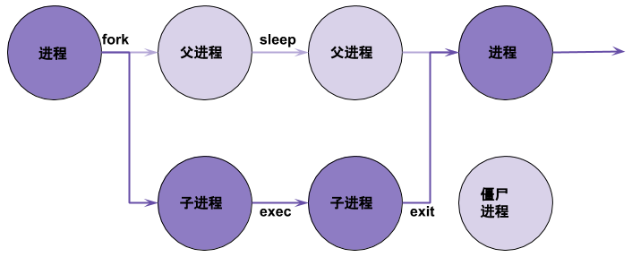
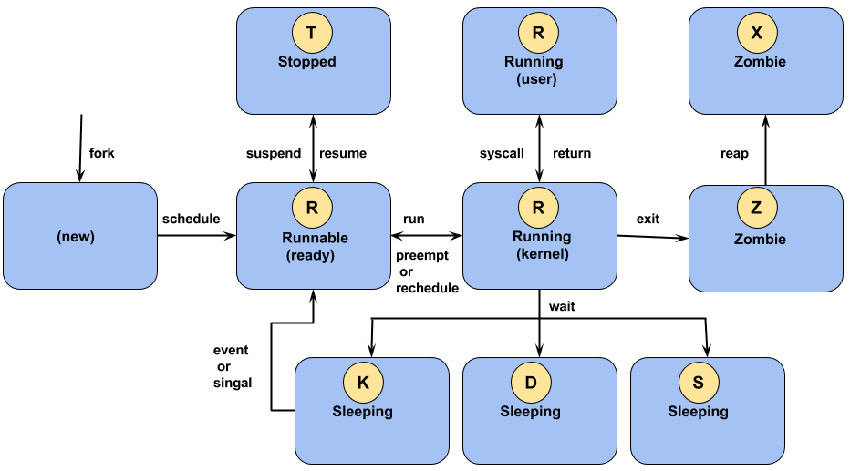

= Linux 进程
:toc: manual
:toc-placement: preamble

本部分介绍 Linux 进程相关的一些概念。

== 什么是进程

一个执行中的程序的实例叫做进程。一个进程包括:

* 一个分配了内存的地址空间
* 所有权认证、优先级等安全属性
* 一个或多个线程
* 进程的状态

进程的环境包括：

* 本地和全局变量
* 当前调度上下文
* 分配的系统资源，如文件描述符、网络端口等

=== PID & PPID

Linux 进程一般有一个 PID 和 PPID（父进程 PID），运行如下代码端输出 PID 和 PPID：

[source, c]
.*pid-ppid.c*
----
#include <stdio.h>
#include <unistd.h>

int main()
{
  printf("The process ID is %d\n", (int) getpid ());
  printf("The parent process ID is %d\n", (int) getppid ());
  return 0;
}
----

link:files/pid-ppid.c[下载 pid-ppid.c]

=== 父进程、子进程、僵尸进程

使用如下代码描述上图:

[source, c]
.*fork-exec.c*
----
#include <stdio.h>
#include <stdlib.h>
#include <sys/types.h>
#include <unistd.h>

int main ()
{
  pid_t child_pid;
  char* program = "pwd";
  char* arg_list[] = {"pwd", NULL};

  /* Create a child process. */
  child_pid = fork ();
  printf("The fork return is %5d, PID is %5d, PPID is %5d\n", child_pid, getpid(), getppid());

  if (child_pid > 0) {
    /* This is the parent process. Sleep for a minute. */
    sleep (60);
  } else {
    /* This is the child process. Exit immediately. */
    execvp (program, arg_list);
    exit (0);
  }

  return 0;
}
----

* `fork` 可以产生一个子进程，且子进程继承父进程一切
* `exit` 进程推出
* `sleep` 进程休眠
* Linux 上所有进程都可以创建一个子进程，RHEL 7 中的所有进程都是 systemd 的子进程
* 一般子进程退出，父进程会调运一个 `wait` 方法结束子进程，如果没有则，子进程变成僵尸进程

上述程序运行可能输出

----
# ./fork-exec 
The fork return is 17535, PID is 17534, PPID is 13888
The fork return is     0, PID is 17535, PPID is 17534
/root/work
----

查看进程状态

----
# ps -e -o pid,ppid,stat,cmd
...
7534 13888 S+   ./fork-exec
17535 17534 Z+   [pwd] <defunct>
----

可以看到父进程 17534 创建了子进程 17535，子进程 fork 返回为 0，状态为 Z，即为僵尸进程。

link:files/fork-exec.c[下载 fork-exec.c]

=== 进程状态

Linux 中任意一个时间点上一个 CPU 只能处理一个进程，当进程被安排执行，它立即需要获取 CPU 时间以及资源分配的更新。下图为进程状态变化:

.*Flag 及 kernel 中定义*
|===
|Flag | Kernel 定义的状态名称 |描述

|R
|TASK_RUNNING
|The process is either executing on a CPU or waiting to run. Process can be executing user routines or kernel routines (system calls), or be queued and ready when in the *Running* (or *Runnable*) state.

|S
|TASK_INTERRUPTIBLE
|The process is waiting for some condition: a hardware request, system resource access, or signal. When an event or signal satisfies the condition, the process returns to *Running*.

|D
|TASK_UNINTERRUPTIBLE
|This process is also *Sleeping*, but unlike `S` state, will not respond to delivered signals. Used only under specific conditions in which process interruption may cause an unpredictable device state.

|K
|TASK_KILLABLE
|Identical to the uninterruptible `D` state, but modified to allow the waiting task to respond to a signal to be killed (exited completely). Utilities frequently display Killable processes as `D` state.

|T
|TASK_STOPPED
|The process has been *Stopped* (suspended), usually by being signaled by a user or another process. The process can be continued (resumed) by another signal to return to *Running*.

|T
|TASK_TRACED
|A process that is being debugged is also temporarily Stopped and shares the same `T` state flag.

|Z
|EXIT_ZOMBIE
|A child process signals its parent as it exits. All resources except for the process identity (PID) are released.

|X
|EXIT_DEAD
|When the parent cleans up (reaps) the remaining child process structure, the process is now released completely. This state will never be observed in process-listing utilities.
|===

