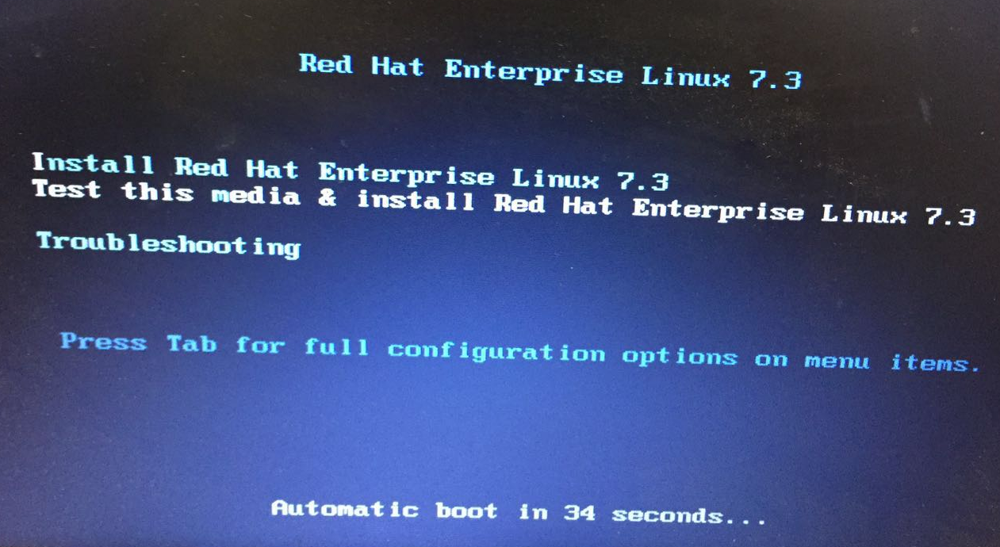
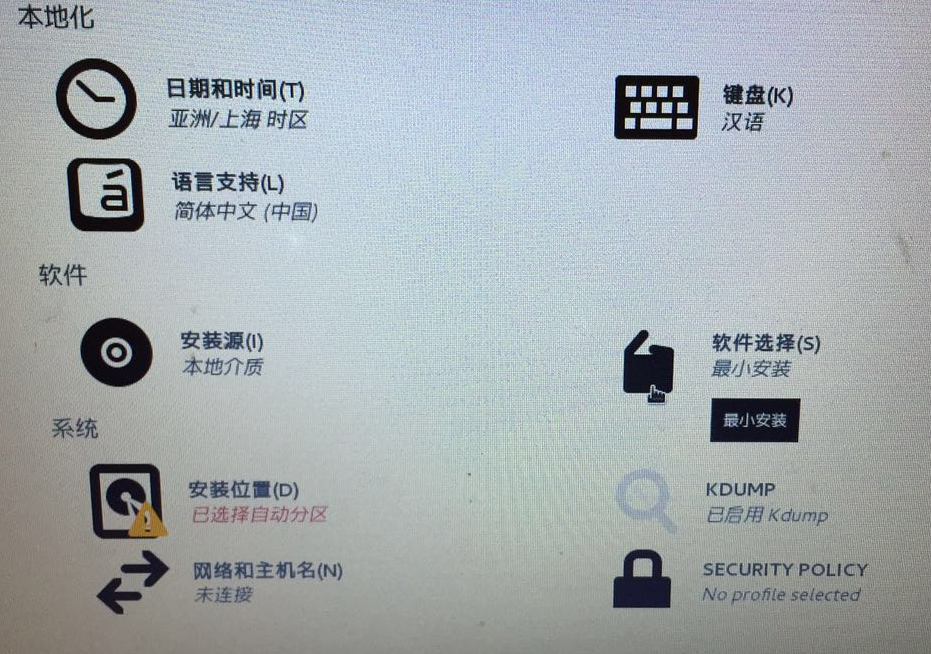

= RHEL 7.3 安装
:toc: manual
:toc-placement: preamble

本文展示通过安装 DVD 盘 安装 RHEL 7.3。

== 启动安装

成功引导系统后，会出现下面的界面

界面说明：

* Install Red Hat Enterprise Linux 7.3 - 安装RHEL 7.3
* Test this media & install Red Hat Enterprise Linux 7.3 -  测试安装文件并安装RHEL 7.3
* Troubleshooting - 修复故障

这里选择第二项，测试安装文件并安装RHEL 7.3，回车，等待数分钟后进入欢迎界面

image:img/rhel-install-2.png[rhel-install-2.png]

选择语言：中文-简体中文（中国）点击继续

点击  软件 -> 软件选择，选择安装模式，系统 -> 安装位置，进入磁盘分区界面，完成磁盘分区后点击继续开始安装。

参照 https://access.redhat.com/documentation/zh-CN/Red_Hat_Enterprise_Linux/7/html/Installation_Guide/sect-disk-partitioning-setup-x86.html#sect-custom-partitioning-x86 进行相关分区配置。
