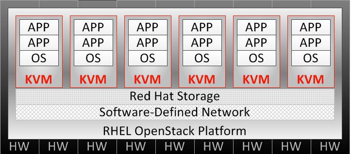
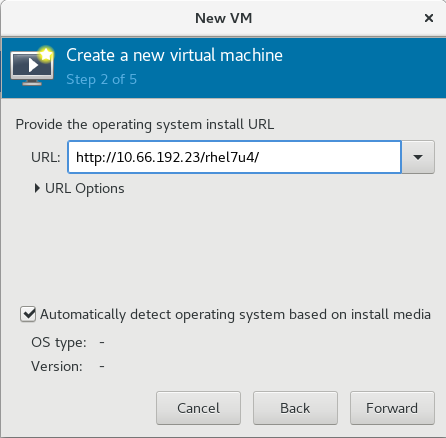
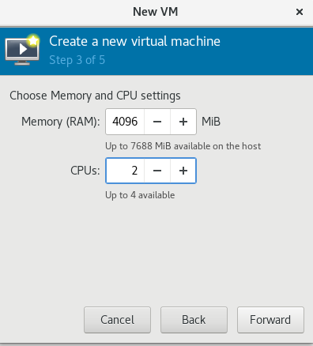

= KVM
:toc: manual

本部分通过 virt-manager 安装 RHEL 7.4。

== 什么是 KVM

KVM（基于内核的虚拟机）是标准 RHEL 内核中内置的完整虚拟化解决方案。它可以运行 Windows 和 Linux 虚拟客户机操作系统，且对其不做任何修改。RHEL 中的 KVM hypervisor 通过 libvirt API 和一些小工具进行，如 virt-manager 和 virsh 等对虚拟机进行管理。

KVM 为 OpenStack 云平台提供虚拟机，通常 KVM 使用拓扑如下：

*物理（传统）系统*

image:img/kvm-standalone.png[]

RHEL 安装在传统硬件上，提供 KVM 虚拟化，最高可达单一系统的物理极限，并且由 virt-manager 等 libvirt 实用工具进行管理。红帽企业 Linux 通常配置为胖主机，即在支持 VM 的同时，也提供其他本地和网络服务、应用和管理功能。

*红帽企业虚拟化 (RHEV)*

image:img/kvm-rhv.png[]

支持跨越多个红帽企业虚拟化系统管理程序 (RHEV-H) 系统的 KVM 实例，提供由 RHEV 管理器 (RHEV-M) 管理的 KVM 迁移、冗余和高可用性。红帽企业虚拟化系统管理程序是瘦主机，是专门精简和调优过的 RHEL 版本，专用于满足配置和支持虚拟客户机 VM 的唯一目的。

横跨所有红帽产品的虚拟机 (VM) 技术，不仅包含 Red Hat Enterprise Linux 的单机物理实例，更有 OpenStack 云平台：

*OpenStack 云平台*

在默认安装有 KVM 的 RHEL 基础上使用集成和优化的 OpenStack 的有云架构，通过红帽 OpenStack 仪表板（Horizon 组件）或红帽 CloudForms 进行管理。

== KVM 安装

[source, text]
.*install*
----
# yum install qemu-kvm libvirt virt-manager
----

NOTE：如上操作将安装的包包括：qemu-kvm, qemu-img, virt-manager, libvirt, libvirt-python, python-virtinst, libvirt-client。

* python-virtinst — 提供 virt-install 命令，供创建虚拟机使用。
* libvirt — 提供主机和服务器库，以便与系统管理程序和主机系统交互。
* libvirt-python — 包含允许 Python 应用使用 libvirt API 的模块。
* virt-manager — 为管理 VM 提供虚拟机管理器图形工具，将 libvirt-client 库用作管理 API。
* libvirt-client — 为访问 libvirt 服务器提供客户端 API 和库，以及用于管理和控制 VM 的 virsh 命令行工具。

[source, text]
.*enable*
----
# systemctl enable libvirtd
----

[source, text]
.*start*
----
# systemctl start libvirtd
----

[source, text]
.*status*
----
# systemctl status libvirtd
----

== 安装虚拟机

=== 准备

.*最小配置*
|===
|类型 |说明

|CPU
|单核处理器或多线程满足虚拟客户机中最大虚拟化 CPU 数量的 CPU

|RAM
|2GB RAM，以及供虚拟机使用的额外 RAM。

|DISK
|6GB 磁盘空间供主机使用，以及供每台虚拟机使用的必要磁盘空间。大多数虚拟客户机操作系统需要至少 6GB 磁盘空间，但实际存储空间要求取决于各个虚拟客户机映像的格式。

|处理器类型
|Intel VT-x，Intel 64 +86，AMD-V，AMD64
|===

=== Start UI

Run virt-manager to start UI

[source, text]
.*start UI*
----
# virt-manager
----

you will see the Virtual Machine Manager UI:

image:img/kvm-rhel-install-1.png[kvm-rhel-install-1]

=== Create new VM

Click to start create a new VM, a new wizard will be pop up.

==== 1. Choose the installation type

image:img/kvm-rhel-install-2.png[kvm-rhel-install-2]

Note that the Network install be selected.

==== 2. Paste the image URL

==== 3. Set Memory and CPU

==== 4. Create the Disk

image:img/kvm-rhel-install-5.png[kvm-rhel-install-5]

==== 5. Ready to Install

image:img/kvm-rhel-install-6.png[kvm-rhel-install-6]

== 设定 KVM 快照

[source, bash]
.*安装 qemu-img 包*
----
yum install qemu-img
----

[source, bash]
.*停止虚拟机，创建快照*
----
qemu-img snapshot -c [tag-of-snapshot] [path-to-vm-image]
----

[source, bash]
.*应用快照恢复虚拟机*
----
qemu-img snapshot -l [path-to-vm-image]
qemu-img snapshot -a [tag-of-snapshot] [path-to-vm-image]
----

[source, text]
.*创建快照示例*
----
# cd /var/lib/libvirt/images/
# qemu-img snapshot -c 2018-02-14 test1.qcow2
# qemu-img snapshot -c 2018-02-14 test2.qcow2
----

[source, text]
.*恢复快照示例*
----
# qemu-img snapshot -l /var/lib/libvirt/images/test1.qcow2 
Snapshot list:
ID        TAG                 VM SIZE                DATE       VM CLOCK
1         2018-02-14                0 2018-02-14 22:46:49   00:00:00.000
# qemu-img snapshot -a 2018-02-14 /var/lib/libvirt/images/test1.qcow2

# qemu-img snapshot -l /var/lib/libvirt/images/test2.qcow2 
Snapshot list:
ID        TAG                 VM SIZE                DATE       VM CLOCK
1         2018-02-14                0 2018-02-14 22:56:26   00:00:00.000
# qemu-img snapshot -a 2018-02-14 /var/lib/libvirt/images/test2.qcow2
----

== KVM 管理

libvirt 软件包是独立于系统管理程序的虚拟化 API，通过提供在单一主机上配置、创建、修改、监视、控制、迁移和停止虚拟机的功能，安全地管理虚拟机。libvirt 软件包中的 API 可用于枚举、监控和使用托管系统上提供的资源，如 CPU、内存、存储和联网。利用 libvirt 的管理工具可以通过安全协议远程访问主机系统。

使用 libvirt 的常见 KVM 管理工具：

* *virt-manager* - virt-manager 是一款图形化桌面工具，可以访问虚拟客户机控制台，用于执行虚拟机创建、迁移、配置和管理任务。可以通过单一界面管理本地和远程系统管理程序。
* *virsh* - virsh 命令行管理工具是图形版 virt-manager 应用的替代工具。无特权用户能以只读模式使用 virsh，或者通过 root 访问权限使用完整的管理功能。virsh 命令是编写虚拟化管理脚本的理想选择。
* *RHEV-M* -  红帽企业虚拟化管理器为物理和虚拟资源提供一个中央化管理平台，允许在主机之间启动、停止、构建和迁移虚拟机。RHEV-M 也可管理数据中心的存储和网络组件，提供安全的远程图形化虚拟客户机控制台访问方式。

[source, text]
.*virsh 命令示例*
----
# virsh start test1
# virsh start test2
# virsh list
# virsh destroy test1
# virsh destroy test2
# virsh list --all
----

virsh 具有可执行其他管理任务的子命令：

* connect — 使用 *qemu:///host* 语法连接本地或远程 KVM 主机。
* nodeinfo — 返回主机的基本信息，如 CPU 和内存等。
* autostart — 将 KVM 域配置为在主机系统启动时启动。
* console — 连接到虚拟客户机的虚拟串行控制台。
* create — 从 XML 配置文件创建域，并将它启动。
* define — 从 XML 配置文件创建域，但不启动它。
* undefine — 取消定义域。如果域为不活动，则域配置将被删除。
* edit — 编辑域的配置文件，这会在虚拟客户机下一次启动时产生作用。
* reboot — 重新启动域，就如从客户机内部运行 reboot 命令一样。
* shutdown — 正常地关闭域，就如从虚拟客户机内部运行 shutdown 命令一样。
* screenshot — 为当前域控制台抓取屏幕截图，并存储在文件中。

== Kickstart 安装 RHEL

系统管理员可以使用名为 Kickstart 的功能自动执行 RHEL 的安装。红帽安装程序 Anaconda 需要知道如何安装系统：磁盘如何分区、配置网络接口，选择要安装的软件包等。默认情况下，这是一个交互式过程。Kickstart 安装使用的一个文本文件中提供这些问题的所有答案，因此无需进行交互。

Kickstart 配置文件编写规则：

* # 字符开头的行是注释行，安装程序将会忽略
* % 字符打头的行，结尾是包含 %end 指令的行。
* %packages 部分指定要在目标系统上安装的软件。单个软件包可根据名称（不带版本）指定。软件包组可根据名称或 ID 指定，并以 @ 字符开头。环境组（软件包组的组）可使用 @^ 指定，后面紧跟环境组名或 ID。组具有必需、默认和可选组件。通常，Kickstart 将安装必需组件和默认组件。以 - 字符开头的软件包名或组名将被排除在安装以外，除非它们为必需，或因其他软件包的 RPM 依赖关系而安装。
* %pre、%post，它们在所有软件都已安装后对系统进行配置。%pre 脚本在进行任何磁盘分区之前执行，%pre、%post 和 %packages 可以在配置命令之后以任何顺序出现。

[source, text]
.*生成 Kickstart 安装描述文件*
----
# yum install system-config-kickstart
# system-config-kickstart
# ksvalidator anaconda-ks.cfg
----

== Setup RH299 VM

[source, bash]
.*1 - Edit RH299*
----
virsh edit RH299
----

[source, xml]
.*2 - Modify CPU part, make sure it looks*
----
  <cpu mode='host-model' check='full'>
    <model fallback='allow'/>
    <feature policy='require' name='vmx'/>
  </cpu>
----

NOTE: check='partial' also works.

[source, bash]
.*3 - execute modprob*
----
modprobe -r kvm_intel
modprobe kvm_intel nested=1
----

[source, text]
.*4 - Confirm nested virtualization is enabled*
----
# cat /sys/module/kvm_intel/parameters/nested 
Y
----
