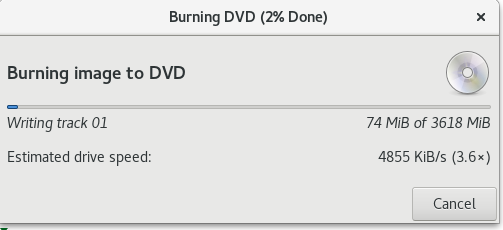

= 生成 RHEL 安装 DVD 
:toc: manual
:toc-placement: preamble

本文展示如何制作生成 RHEL 安装 DVD。

== 下载 iso 文件

[source, bash]
.*RHEL 7.3*
----
$ ls -l
-rw-rw-r--. 1 kylin kylin 3793747968 Jul 21 15:46 rhel-server-7.3-x86_64-dvd.iso
----

[source, bash]
.*RHEL 7.4*
----
$ ls -l rhel-server-7.4-x86_64-dvd.iso 
-rw-rw-r--. 1 kylin kylin 4059037696 Dec  5 09:50 rhel-server-7.4-x86_64-dvd.iso
----

== 安装 brasero

不同的操作系统使用镜像制作的软件不同，Fedora 25 可以使用 brasero 制作镜像，安装 brasero：

[source, bash]
----
# yum install brasero
----

== 制作镜像

**启动 brasero 并选择 Burn image**

image:img/rhel-pre-install-1.png[rhel-pre-install-1.png]

**选择 iso 文件**

image:img/rhel-pre-install-2.png[rhel-pre-install-2.png]

**选择 Burn 开始制作镜像**

image:img/rhel-pre-install-3.png[rhel-pre-install-3.png]

**等待数分钟直到镜像制作完成**

