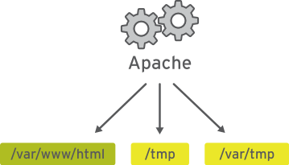

= Security Enhanced Linux (SELinux)
:toc: manual

== 基本概念

=== 什么是 SELinux

Security Enhanced Linux (SELinux) 是一个额外的系统安全层。SELinux 的主要目标是防止已遭泄露的系统服务访问用户数据。大多数 Linux 管理员都熟悉标准的用户/组/其他权限安全模型。这种基于用户和组的模型称为自由决定的访问控制。SELinux 提供另一层安全，它*基于对象并由更加复杂的规则控制*，称为*强制访问控制*。

===  Apache 服务有无 SELinux 保护对照

.*没有 SELinux 保护的 Apache 服务*

.*具有 SELinux 保护的 Apache 服务*
image:img/apache-selinux-enforcing.png[]

要允许远程匿名访问 Web 服务器，必须打开防火墙端口。然而，恶意人员却有机会通过安全漏洞侵入系统，而且如果他们破坏 Web 服务器进程，还会取得其权限，即 apache 用户和 apache 组的权限。该用户/组具有对文档根目录 (/var/www/html) 等项目的读取权限，以及对 /tmp、/var/tmp 和所有人均可编写的任何其他文件/目录的写入权限。

=== SELinux 上下文

SELinux 是用于确定哪个进程可以访问哪些文件、目录和端口的一组安全规则。每个文件、进程和端口都具有特别的安全标签，称为 SELinux 上下文。上下文是一个名称，SELinux 策略使用它来确定某个进程能否访问文件、目录或端口。除非显式规则授予访问权限，否则，在默认情况下，策略不允许任何交互。如果没有允许规则，则不允许访问。

SELinux 标签具有多种上下文：用户、角色、类型和敏感度。目标策略（即 Red Hat Enterprise Linux 中启用的默认策略）会根据第三个上下文（即类型上下文）来制定自己的规则。类型上下文名称通常以 _t 结尾。Web 服务器的类型上下文是 httpd_t。通常位于 /var/www/html 中的文件和目录的类型上下文是 httpd_sys_content_t。通常位于 /tmp 和 /var/tmp 中的文件和目录的类型上下文是 tmp_t。Web 服务器端口的类型上下文是 http_port_t。

存在某个策略规则，其允许 Apache（作为 httpd_t 运行的 Web 服务器进程）访问上下文通常位于 /var/www/html 及其他 Web 服务器目录 (httpd_sys_content_t) 中的文件和目录。对于通常位于 /tmp 和 /var/tmp 中的文件，策略中没有允许规则，因此不允许进行访问。有了 SELinux，恶意用户就无法访问 /tmp 目录。SELinux 还有适用于 NFS 和 CIFS 等远程文件系统的规则，尽管这些文件系统上的所有文件都使用相同的上下文标签。

=== -Z 设置 SELinux 上下文

许多处理文件的命令具有一个用于显示或设置 SELinux 上下文的选项（通常是-Z）。例如， ps、ls、cp 和 mkdir 全都使用 -Z 选项来显示或设置 SELinux 上下文。

[source, text]
----
# ps axZ
LABEL                             PID TTY      STAT   TIME COMMAND
system_u:system_r:init_t:s0         1 ?        Ss     0:09 /usr/lib/systemd/...
system_u:system_r:kernel_t:s0       2 ?        S      0:00 [kthreadd]
system_u:system_r:kernel_t:s0       3 ?        S      0:00 [ksoftirqd/0]
[... Output omitted ...]
# systemctl start httpd
# ps -ZC httpd
LABEL                             PID TTY          TIME CMD
system_u:system_r:httpd_t:s0     1608 ?        00:00:05 httpd
system_u:system_r:httpd_t:s0     1609 ?        00:00:00 httpd
[... Output omitted ...]
# ls -Z /home
drwx------. root    root    system_u:object_r:lost_found_t:s0 lost+found
drwx------. student student unconfined_u:object_r:user_home_dir_t:s0 student
drwx------. visitor visitor unconfined_u:object_r:user_home_dir_t:s0 visitor
# ls -Z /var/www
drwxr-xr-x. root root system_u:object_r:httpd_sys_script_exec_t:s0 cgi-bin
drwxr-xr-x. root root system_u:object_r:httpd_sys_content_t:s0 error
drwxr-xr-x. root root system_u:object_r:httpd_sys_content_t:s0 html
drwxr-xr-x. root root system_u:object_r:httpd_sys_content_t:s0 icons
----

=== SELinux 三种模式

[cols="2,5a,2"]
|===
|模式 |示例 |说明

|强制模式(Enforcing)
|image:img/apache-selinux-enforcing.png[]
|在强制模式中，SELinux 主动拒绝访问尝试读取类型上下文为 tmp_t 的文件的 Web 服务器。在强制模式中，SELinux 不仅记录而且提供保护。

|许可模式(Permissive)
|image:img/apache-selinux-permissive.png[]
|许可模式通常用于对问题进行故障排除。在许可模式中，即使没有显式规则，SELinux 也会允许所有交互，而且会记录它在强制模式中拒绝的那些交互。可使用此模式来暂时允许访问 SELinux 正在限制的内容。无需重新启动即可在强制模式和许可模式之间相互转换。

|禁用模式（Disabled）
|
|禁用模式会完全禁用 SELinux。需要重新启动系统才能彻底禁用 SELinux，或是从禁用模式转为强制模式或许可模式。若出于故障排除目的，可使用 SELinux 模式暂时禁用 SELinux 保护。
|===

NOTE: 最好使用许可模式，而不是彻底关闭 SELinux。原因之一在于即使在许可模式中，内核也将根据需要自动维护 SELinux 文件系统标签，从而避免为了启用 SELinux 而重启系统时，重新标记文件系统所带来的昂贵费用。

[source,text]
.*要显示当前使用的有效 SELinux 模式*
----
# getenforce
Enforcing
----

=== SELinux 布尔值

SELinux 布尔值是更改 SELinux 策略行为的开关。SELinux 布尔值是可以启用或禁用的规则。安全管理员可以使用 SELinux 布尔值来有选择地调整策略。

`getsebool` 命令用于显示 SELinux 布尔值及其当前值。-a 选项可使此命令列出所有布尔值。

[source, text]
----
# getsebool -a
abrt_anon_write --> off
abrt_handle_event --> off
abrt_upload_watch_anon_write --> on
antivirus_can_scan_system --> off
antivirus_use_jit --> off
auditadm_exec_content --> on
authlogin_nsswitch_use_ldap --> off
...
----

== 修改 SELinux 模式

=== 修改当前的 SELinux 模式

`setenforce` 命令修改当前的 SELinux 模式：

[source, text]
----
# getenforce
Enforcing
# setenforce
usage:  setenforce [ Enforcing | Permissive | 1 | 0 ]
# setenforce 0
# getenforce
Permissive
# setenforce Enforcing
# getenforce
Enforcing
----

暂时性设置 SELinux 模式的另一种做法是在启动时将参数传递给内核。传递内核参数 *enforcing=0* 会使系统在启动时进入许可模式。值 1 将指定强制模式。可在指定 *selinux=0* 参数时禁用 SELinux。值 1 将启用 SELinux。

=== 设置默认 SELinux 模式

确定在启动时使用哪种 SELinux 模式的配置文件是 `/etc/selinux/config`。请注意，该文件包含一些有用的注释：

[source, text]
----
# This file controls the state of SELinux on the system.
# SELINUX= can take one of these three values:
#     enforcing - SELinux security policy is enforced.
#     permissive - SELinux prints warnings instead of enforcing.
#     disabled - No SELinux policy is loaded.
SELINUX=enforcing
# SELINUXTYPE= can take one of these two values:
#     targeted - Targeted processes are protected,
#     minimum - Modification of targeted policy. Only selected processes
#               are protected. 
#     mls - Multi Level Security protection.
SELINUXTYPE=targeted
----

使用 `/etc/selinux/config` 更改启动时的默认 SELinux 模式。在上述示例中，它被设置为强制模式。

传递 *selinux=* 和/或 *enforcing=* 内核参数会覆盖在`/etc/selinux/config` 中指定的任何默认值。

[source,text]
.*To display SELinux Booleans and their current value*
----
# getsebool -a
# getsebool httpd_enable_homedirs
----

[source,text]
.*Changing the current SELinux mode*
----
# setenforce 0
# setenforce Enforcing
----

== SELinux Context

[source,text]
.*Changing the SELinux context*
----
# mkdir /virtual
# ls -Zd /virtual/
unconfined_u:object_r:default_t:s0 /virtual/
# chcon -t httpd_sys_content_t /virtual
# ls -Zd /virtual/
unconfined_u:object_r:httpd_sys_content_t:s0 /virtual/
# restorecon -v /virtual
restorecon reset /virtual context unconfined_u:object_r:httpd_sys_content_t:s0->unconfined_u:object_r:default_t:s0
# ls -Zd /virtual/
unconfined_u:object_r:default_t:s0 /virtual/
----

[source,text]
.*Defining SELinux default file context rules*
----
# touch /tmp/file1 /tmp/file2
# ls -Z /tmp/file*
unconfined_u:object_r:user_tmp_t:s0 /tmp/file1  unconfined_u:object_r:user_tmp_t:s0 /tmp/file2
# mv /tmp/file1 /var/www/html/
# mv /tmp/file2 /var/www/html/
# restorecon -Rv /var/www/
restorecon reset /var/www/html/file1 context unconfined_u:object_r:user_tmp_t:s0->unconfined_u:object_r:httpd_sys_content_t:s0
restorecon reset /var/www/html/file2 context unconfined_u:object_r:user_tmp_t:s0->unconfined_u:object_r:httpd_sys_content_t:s0
# ls -Z /var/www/html/file*
unconfined_u:object_r:httpd_sys_content_t:s0 /var/www/html/file1  unconfined_u:object_r:httpd_sys_content_t:s0 /var/www/html/file2

# touch /virtual/index.html
# ls -Zd /virtual/
unconfined_u:object_r:default_t:s0 /virtual/
# ls -Z /virtual/
unconfined_u:object_r:default_t:s0 index.html
# semanage fcontext -a -t httpd_sys_content_t '/virtual(/.*)?'
# restorecon -RFvv /virtual
restorecon reset /virtual context unconfined_u:object_r:default_t:s0->system_u:object_r:httpd_sys_content_t:s0
restorecon reset /virtual/index.html context unconfined_u:object_r:default_t:s0->system_u:object_r:httpd_sys_content_t:s0
# ls -Zd /virtual/
system_u:object_r:httpd_sys_content_t:s0 /virtual/
# ls -Z /virtual/
system_u:object_r:httpd_sys_content_t:s0 index.html
----

== SELinux Booleans

[source,shell]
.*Changing SELinux Booleans*
----
# getsebool httpd_enable_homedirs
httpd_enable_homedirs --> off
# setsebool httpd_enable_homedirs on
# semanage boolean -l | grep httpd_enable_homedirs
httpd_enable_homedirs          (on   ,  off)  Allow httpd to enable homedirs
# getsebool httpd_enable_homedirs 
httpd_enable_homedirs --> on
# setsebool -P httpd_enable_homedirs on
# semanage boolean -l | grep httpd_enable_homedirs
httpd_enable_homedirs          (on   ,   on)  Allow httpd to enable homedirs
----

== Troubleshooting SELinux

Basic Troubleshooting Steps:

1. Before thinking of making any adjustments, consider that SELinux may be doing its job correctly by prohibiting the attempted access. If a web server tries to access files in `/home`, this could signal a compromise of the service if web content isn't published by users. If access should have been granted, then additional steps need to be taken to solve the problem.
2. The most common SELinux issue is an incorrect file context. This can occur when a file is created in a location with one file context and moved into a place where a different context is expected. In most cases, running **restorecon** will correct the issue. Correcting issues in this way has a very narrow impact on the security of the rest of the system.
3. Another remedy for a too-restrictive access could be the adjustment of a Boolean. For example, the **ftpd_anon_write** Boolean controls whether anonymous FTP users can upload files. This Boolean would have to be turned on if it is desirable to allow anonymous FTP users to upload files to a server. Adjusting Booleans requires more care because they can have a broad impact on system security.
4. It is possible that the SELinux policy has a bug that prevents a legitimate access. Since SELinux has matured, this is a rare occurrence.

[source,shell]
.*Monitoring SELinux violations*
----
# touch /root/file3
# mv /root/file3 /var/www/html/
# systemctl restart httpd
# curl http://10.66.192.120/file3
<!DOCTYPE HTML PUBLIC "-//IETF//DTD HTML 2.0//EN">
<html><head>
<title>403 Forbidden</title>
</head><body>
<h1>Forbidden</h1>

You don't have permission to access /file3
on this server.

</body></html>
# ls -Z /var/www/html/
-rw-r--r--. root root unconfined_u:object_r:admin_home_t:s0 file3
-rw-r--r--. root root unconfined_u:object_r:httpd_sys_content_t:s0 index.html

# tail /var/log/audit/audit.log
...
type=AVC msg=audit(1497323187.810:1280): avc:  denied  { getattr } for  pid=3511 comm="httpd" path="/var/www/html/file3" dev="dm-0" ino=101765410 scontext=system_u:system_r:httpd_t:s0 tcontext=unconfined_u:object_r:admin_home_t:s0 tclass=file
...

# tail /var/log/messages
Jun 12 23:06:54 ksoong setroubleshoot: SELinux is preventing httpd from getattr access on the file /var/www/html/file3. For complete SELinux messages. run sealert -l 9841b5dd-cb32-4506-84b7-888a1564e1d9

# sealert -l 9841b5dd-cb32-4506-84b7-888a1564e1d9
SELinux is preventing httpd from getattr access on the file /var/www/html/file3.

*****  Plugin restorecon (99.5 confidence) suggests   ************************

If you want to fix the label. 
/var/www/html/file3 default label should be httpd_sys_content_t.
Then you can run restorecon.
Do
# /sbin/restorecon -v /var/www/html/file3

*****  Plugin catchall (1.49 confidence) suggests   **************************

If you believe that httpd should be allowed getattr access on the file3 file by default.
Then you should report this as a bug.
You can generate a local policy module to allow this access.
Do
allow this access for now by executing:
# ausearch -c 'httpd' --raw | audit2allow -M my-httpd
# semodule -i my-httpd.pp

Additional Information:
Source Context                system_u:system_r:httpd_t:s0
Target Context                unconfined_u:object_r:admin_home_t:s0
Target Objects                /var/www/html/file3 [ file ]
Source                        httpd
Source Path                   httpd
Port                          <Unknown>
Host                          ksoong.com
Source RPM Packages           
Target RPM Packages           
Policy RPM                    selinux-policy-3.13.1-102.el7_3.16.noarch
Selinux Enabled               True
Policy Type                   targeted
Enforcing Mode                Enforcing
Host Name                     ksoong.com
Platform                      Linux ksoong.com 3.10.0-514.16.1.el7.x86_64 #1 SMP
                              Fri Mar 10 13:12:32 EST 2017 x86_64 x86_64
Alert Count                   2
First Seen                    2017-06-12 23:06:27 EDT
Last Seen                     2017-06-12 23:06:53 EDT
Local ID                      9841b5dd-cb32-4506-84b7-888a1564e1d9

Raw Audit Messages
type=AVC msg=audit(1497323213.860:1282): avc:  denied  { getattr } for  pid=3512 comm="httpd" path="/var/www/html/file3" dev="dm-0" ino=101765410 scontext=system_u:system_r:httpd_t:s0 tcontext=unconfined_u:object_r:admin_home_t:s0 tclass=file

Hash: httpd,httpd_t,admin_home_t,file,getattr
----
