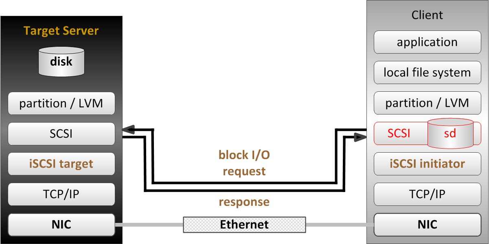

= 存储
:toc: manual

== 附件表

.*基本概念*
[cols="2,2,5a"]
|===
|名称 |定义 |示例

|文件系统
|一个以树状结构组织的，位于存储设备(如物理磁盘，分区)上的保存数据的文件或文件夹。树状结构的根部是 `/`，且树状结构的任何位置可以在任意时间扩展，添加新的由物理磁盘或分区构成的文件系统。
|查看某路径下磁盘使用情况

[source, text]
----
# du
# du -h
----

|mounting
|添加一个新的树状结构文件系统到已知文件系统的过程叫 mounting。
|

|mount point
|新文件系统添加的目录叫 mount point。
|查看 mount points 和磁盘使用率

[source, text]
----
# df
# df -h
----

|分区
|硬盘或存储设备通常被分成较小的块，这些小块叫做分区。一个分区是对一个磁盘的划分，磁盘的不同块可以通过分区组织成不同的文件系统。
|查看所有分区

[source, text]
----
# blkid
----

|块设备
|Linux 中存储设备被一个特定文件格式所表示，叫做块设备。块设备通常保存在 `/dev` 目录下。在红帽 Linux 上，第一个 SCSI，PATA/SATA，或 USB 驱动如果被发现命名为 `/dev/sda`，第二个则命名为 `/dev/sdb`。某一个块设备上主
分区命名为块设备的名字加1，例如`/dev/sda1`，第二个分区叫 `/dev/sda2`。另外，在虚拟机上，块设备及分区的命名是以 `vd` 开头，即 `/dev/vda`，`/dev/vda1`，`/dev/vda2`。
|查看物理机上块设备

[source, text]
----
# ls -l /dev/sd*
----

查看虚拟机上块设备

[source, text]
----
# ls -l /dev/vda*
----

输出所有块设备

[source, text]
----
# lsblk
----

|LVM
|LVM 指逻辑卷管理(logical volume management)，LVM 用来管理磁盘和分区。
|

|逻辑卷组
|一个或多个块设备可聚合在一个存储池叫做逻辑圈组，名字是在创建时命名。`/dev` 目录下的一个文件夹可以被认为是一个逻辑卷组，逻辑卷组文件夹下面的文件可以看作是一个逻辑卷，例如 `mylv` 逻辑卷位于 `myvg` 逻辑卷组下，则>路径为 `/dev/myvg/mylv`。
|

|逻辑卷
|一个逻辑卷相当于一个物理磁盘上的一个分区，物理磁盘可以分成多个逻辑卷，名字时在创建时命名。
|
|===

.*LVM 操作一览表*
[cols="2,5a,5a"]
|===
|操作名称 |详细步骤 |说明

|创建一个 LV
|创建一个 LV 需要 5 个步骤：

. Prepare the physical device
. Create a PV
. Create a VG
. Create a LV
. Add the file system
|
[source, text]
----
# fdisk /dev/vda
# pvcreate /dev/vda2 /dev/vdb1
# vgcreate vg-alpha /dev/vda2 /dev/vdb1
# lvcreate -n hercules -L 2G vg-alpha
# mkfs -t xfs /dev/vg-alpha/hercules
# mkdir /mnt/hercules
/dev/vg-alpha/hercules /mnt/hercules xfs defaults 1 2
# mount -a
----

|删除一个 LV
|删除一个 LV 需要 4 个步骤:

. Prepare the file system
. Remove the logical volume
. Remove the volume group
. Remove the physical volumes
|
[source, text]
----
# umount /mnt/hercules
# lvremove /dev/vg-alpha/hercules
# vgremove vg-alpha
# pvremove /dev/vda2 /dev/vdb1
----

|扩展一个 LV
|扩展一个 LV 需要 5 个步骤:

. Prepare the physical device
. Create the PV
. Extend the VG
. Extend the LV
. Extend the file system

|
[source, text]
----
# fdisk /dev/vdb
# pvcreate /dev/vdb2
# vgextend vg-alpha /dev/vdb2
# lvextend -L +300M /dev/vg-alpha/hercules
# xfs_growfs /mnt/hercules
----

|===

== LVM 组件层次图

image:img/logicalvolumes.png[LVM]

* *PV* - PHYSICAL VOLUME，物理卷。LVM 逻辑卷的底层物理存储单元是一个块设备,比如一个分区或整个磁盘。要在 LVM 逻辑卷中使用该设备，则必须将该设备初始化为物理卷(PV)。
* *VG* - VOLUME GROUP，卷组。多个物理卷合并成一个磁盘空间池称为卷组（VG），并可使用它分配逻辑卷。在卷组中,可用来分配的磁盘空间被分为固定大小的单元,我们称之为扩展。扩展是可进行分配的最小空间单元。在物理卷中,扩展指的是物理扩展。逻辑卷会被分配成与物理卷扩展相同大小的逻辑扩展。因此卷组中逻辑卷的扩展大小都是一样的。卷组将逻辑扩展与物理扩展匹配。
* *LV* - LOGICAL VOLUME，逻辑卷，LVM 中是将卷组分为逻辑卷。逻辑卷有不同类型：线性卷（Linear Volume）、条带逻辑卷（Striped Logical Volume）、RAID 逻辑卷（RAID Logical Volume）、精简配置逻辑卷（Thinly-Provisioned Logical Volume）、快照卷（Snapshot Volume）、精简配置快照卷（Thinly-Provisioned Snapshot Volume）、缓存卷（Cache Volume）

== iSCSI 图

=== SCSI and iSCSI block storage topologies

image:img/block_storage_scsi_topologies.png[block_storage_scsi_topologies.png]

=== Fibre Channel block storage topologies

image:img/block_storage_fc_topologies.png[block_storage_fc_topologies.png]

=== Block I/O network stack components

=== File I/O network stack components

image:img/file_server_stack.png[file_server_stack.png]
