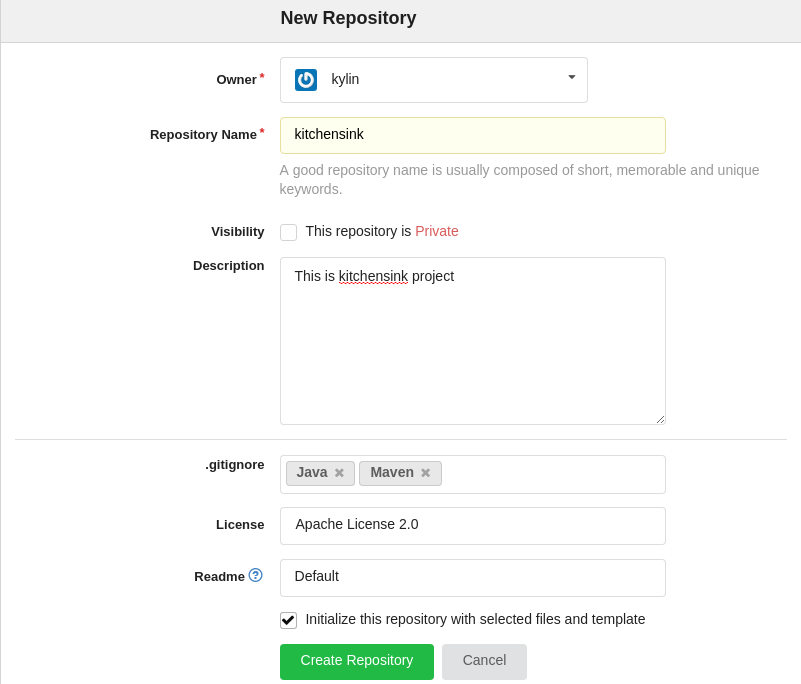
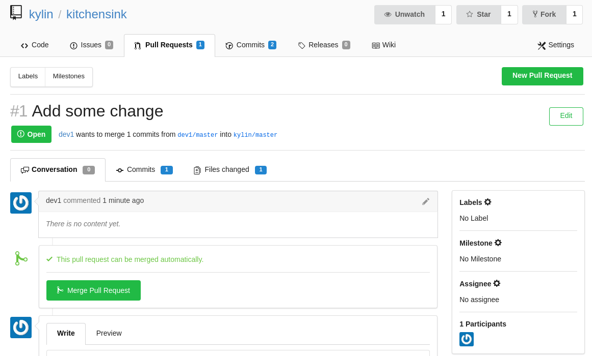

= Git 服务器配置
:toc: manual
:toc-placement: preamble

https://gogs.io/ 是一款稳定，轻量级的 Git 服务器，本文演示如何在 OpenShift 平台上配置并使用 gogs。

== 根据模板

根据相关模板（gogs-template 或 gogs-persistent-template）安装部署 gogs 到 OpenShift 平台。

[source, bash]
----
$ oc new-app -f https://raw.githubusercontent.com/jbosschina/gogs-openshift-docker/master/openshift/gogs-template.yaml --param=HOSTNAME=gogshub.example.com
--> Deploying template "gogs/gogs" for "https://raw.githubusercontent.com/jbosschina/gogs-openshift-docker/master/openshift/gogs-template.yaml" to project gogs

     gogs
     ---------
     The Gogs git server (https://gogs.io/)

     * With parameters:
        * APPLICATION_NAME=gogs
        * HOSTNAME=gogshub.example.com
        * Database Username=gogs
        * Database Password=gogs
        * Database Name=gogs
        * Database Admin Password=FLfeFtdU # generated
        * Maximum Database Connections=100
        * Shared Buffer Amount=12MB
        * Gogs Version=0.9.97
        * Installation lock=true
        * Skip TLS verification on webhooks=false

--> Creating resources ...
    serviceaccount "gogs" created
    service "gogs-postgresql" created
    deploymentconfig "gogs-postgresql" created
    service "gogs" created
    route "gogs" created
    deploymentconfig "gogs" created
    imagestream "gogs" created
    configmap "gogs-config" created
--> Success
    Run 'oc status' to view your app.
----

== 登录 gogs 并创建管理员用户

通过 http://gogshub.example.com/ 登录 gogs，右上角点击注册，第一注册的用户有管理员权限：

image:img/gogs-register.png[gogs-register]

点击绿色 *Create New Account* 创建管理员用户。 创建完成后使用管理员用户登录 GogsGit。

== 创建项目仓库，clone 及 commit 

完全与 GitHub 类似，点击右上角创建，选择 New Repository，开始创建项目仓库，在仓库名称栏填入项目名称，在其它栏选择添加相应的选项或描述文字：

点击绿色 *Create Repository* 创建项目仓库。

克隆已创建的项目到本地，做相应的修改并提交：

[source, java]
----
$ git clone http://gogshub.apps.na1.openshift.opentlc.com/kylin/kitchensink.git
$ cd kitchensink/

$ cp -r ~/src/kitchensink/src/ ./
$ cp -r ~/src/kitchensink/pom.xml ./

$ git add pom.xml src/
$ git commit -m "init commit"
$ git push origin master 
Username for 'http://gogshub.apps.na1.openshift.opentlc.com': kylin
Password for 'http://kylin@gogshub.apps.na1.openshift.opentlc.com': 
Counting objects: 61, done.
Delta compression using up to 4 threads.
Compressing objects: 100% (43/43), done.
Writing objects: 100% (61/61), 65.31 KiB | 0 bytes/s, done.
Total 61 (delta 12), reused 0 (delta 0)
To http://gogshub.apps.na1.openshift.opentlc.com/kylin/kitchensink.git
   1ffac40..dfefa96  master -> master
----

== 项目管理，Merge PR

Navigate to Project, 选择 Pull Request 如下图

点击绿色 *Merge Pull Request* 完成 merge PR。
