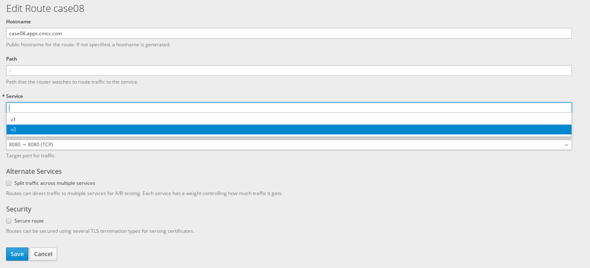

= 用例
:toc: manual

== 亲和性及反亲和性调度策略

[cols="2,5a"]
|===
|条目 |说明

|目的
|通过集群调度能力(亲和性及反亲和性调度策略)，验证可以根据策略把工作负载部署到目标服务器或者目标服务器中某些服务器上的能力。

|步骤
|
1. 以平台运营人员身份进行节点标签设置;并指定标签对于租户的可见范围
2. 以使用人员身份设置服务亲和性策略
3. 将测试镜像部署并扩展为3个以上副本
4. 查看容器的部署情况,是否符合亲和性策略
5. 以使用人员身份设置服务反亲和性策略
6. 将测试镜像部署并扩展为3个以上副本
7. 查看容器的部署情况,是否符合反亲和性策略

|预期结果
|
1. 节点标签设置正确
2. 服务亲和性策略可以设置
3. 测试镜像部署成功并成功扩展为3个以上副本
4. 容器部署结果符合亲和性策略(如成功部署在同一个节点或同一个区域)
5. 服务反亲和策略可以设置
6. 镜像部署成功并扩展为3个以上副本
7. 容器的部署结果符合反亲和性策略(如成功部署在不同节点或不同区域)
|===

[source, text]
.*1 - 准备*
----
$ oc login https://master.example.com:8443 -u kylin -p redhat
$ oc new-project case01
----

[source, text]
.*2 - 对节点打label*
----
# oc label node node1.example.com region=r1 --overwrite
# oc label node node2.example.com region=r2 --overwrite
# oc label node node3.example.com region=r3 --overwrite
----

[source, text]
.*3 - 亲和性操作(link:yaml/dc-affinity.yaml[dc-affinity.yaml])*
----
$ oc create -f dc-affinity.yaml
----

[source, text]
----
$ oc get pod -o wide
NAME            READY     STATUS    RESTARTS   AGE         IP            NODE
mysql-1-76p9c   1/1       Running   0          <invalid>   10.129.0.51   node1.example.com
mysql-1-czvv2   1/1       Running   0          <invalid>   10.129.0.49   node1.example.com
mysql-1-j72p8   1/1       Running   0          <invalid>   10.129.0.48   node1.example.com
mysql-1-zcmg7   1/1       Running   0          <invalid>   10.129.0.50   node1.example.com
----

[source, text]
.*4 - 重新对节点打label*
----
# oc label node node1.example.com region- --overwrite
# oc label node node2.example.com region- --overwrite
# oc label node node3.example.com region- --overwrite

# oc label node node1.example.com zone=z1 --overwrite
# oc label node node2.example.com zone=z1 --overwrite
# oc label node node3.example.com zone=z2 --overwrite
----

[source, text]
.*5. 反亲合性操作(link:yaml/dc-antiaffinity.yaml[dc-antiaffinity.yaml])*
----
$ oc create -f dc-antiaffinity.yaml
----

[source, text]
----
$ oc get nodes --show-labels | grep zone=z1
node1.example.com    Ready     compute   5d        v1.9.1+a0ce1bc657   beta.kubernetes.io/arch=amd64,beta.kubernetes.io/os=linux,kubernetes.io/hostname=node1.example.com,node-role.kubernetes.io/compute=true,zone=z1
node2.example.com    Ready     compute   5d        v1.9.1+a0ce1bc657   beta.kubernetes.io/arch=amd64,beta.kubernetes.io/os=linux,kubernetes.io/hostname=node2.example.com,node-role.kubernetes.io/compute=true,zone=z1

$ oc get nodes --show-labels | grep zone=z2
node3.example.com    Ready     compute   5d        v1.9.1+a0ce1bc657   beta.kubernetes.io/arch=amd64,beta.kubernetes.io/os=linux,kubernetes.io/hostname=node3.example.com,node-role.kubernetes.io/compute=true,zone=z2
----

[source, text]
----
$ oc get pods -o wide
NAME            READY     STATUS    RESTARTS   AGE         IP            NODE
mysql-1-g9plg   1/1       Running   0          <invalid>   10.129.0.58   node1.example.com
mysql-1-hcfsn   1/1       Running   0          <invalid>   10.130.0.70   node2.example.com
mysql-1-n4dbj   1/1       Running   0          <invalid>   10.131.0.18   node3.example.com
mysql-1-vcwnv   1/1       Running   0          <invalid>   10.129.0.59   node1.example.com
----

== 租户资源限额

[cols="2,5a"]
|===
|条目 |说明

|目的
|在多服务环境下，对不同租户进行相应的应用资源限额操作，验证通过调度平台限定服务所使用资源的数量或者比例的能力，包括 CPU 和内存

|步骤
|
1. 在平台租户管理中实现租户资源配额分配及调整,设置可以使用的最大内存/CPU数量
2. 在平台创建2个Tomcat实例,手工设定Tomcat使用的内存/CPU数量,未超出资源限制的范围,并启动实例
3. 创建2个Tomcat实例,超出步骤1中设定的最大内存/CPU数量,并启动实例。

|预期结果
|
1. 资源配额设置成功
2. 创建Tomcat实例完成,未超出资源限制范围的Tomcat实例启动成功
3. 创建Tomcat实例完成,超出资源限制范围的Tomcat实例启动失败
|===

[source, text]
.*1 - 准备*
----
$ oc login https://master.example.com:8443 -u kylin -p redhat
$ oc new-project case02
----

[source, text]
.*2 - 创建资源配额(link:yaml/quota.yaml[quota.yaml], link:yaml/limitrange.yaml[limitrange.yaml])*
----
$ oc create -f quota.yaml
$ oc create -f limitrange.yaml
$ oc get quota
$ oc get limitrange
----

[source, text]
.*3 - 部署*
----
$ oc new-app jboss-webserver31-tomcat8-openshift:1.2~https://github.com/OpenShiftDemos/os-sample-java-web.git --name case02
$ oc expose svc/case02 --name=case02 --hostname=case02.apps.example.com
----

image:img/case02.png[]

[source, text]
.*4 - 修改资源配额后执行部署*
----
$ oc edit quota compute-resources-time-bound

$ oc get events
LAST SEEN   FIRST SEEN   COUNT     NAME                        KIND                    SUBOBJECT   TYPE      REASON                        SOURCE                        MESSAGE
<invalid>   <invalid>    22        case02-1.155fed4440299240   ReplicationController               Warning   FailedCreate                  replication-controller        (combined from similar events): Error creating: pods "case02-1-dd4bv" is forbidden: exceeded quota: compute-resources-time-bound, requested: limits.cpu=300m,limits.memory=200Mi, used: limits.cpu=0,limits.memory=0, limited: limits.cpu=200m,limits.memory=100Mi
----

== 蓝绿部署，灰度发布

[cols="2,5a"]
|===
|条目 |说明

|目的
|验证灵活的发布策略(灰度、蓝绿一键发布)的能力。

|步骤
|
1. 发布测试镜像v1,并实现集群外可访问;
2. 发布测试镜像v2;
3. 持续访问业务链接;
4. 修改v1的访问路由,v1和v2各占50%流量,实现灰度发布;
5. 修改v1的访问路由,将流量切换到v2,实现蓝绿发布;

|预期结果
|
1. v1发布成功,服务可访问,集群外可访问;
2. v2发布成功,服务可访问;
3. 业务访问连续、不中断;
4. 提供web界面编辑v1的访问路由,进行流量切分,并可通过拖拽方式调整流量比例,然后通 过压力测试工具测试1000个请求,检查每个实例的访问量;
5. 流量切换到v2,业务不中断;
|===

[source, text]
.*1 - 准备*
----
$ oc login https://master.example.com:8443 -u kylin -p redhat
$ oc new-project case03
----

[source, text]
.*2 - 部署*
----
$ oc new-app php:7.0~https://github.com/redhat-china/php-helloworld.git --env VERSION=v1 --name=v1
$ oc new-app php:7.0~https://github.com/redhat-china/php-helloworld.git --env VERSION=v2 --name=v2
$ oc expose svc/v1 --name=case03 --hostname=case03.apps.example.com
----

*3 - A/B 部署*

image:img/case03.png[]

image:img/case03-2.png[]

[source, text]
----
# for i in `seq 1 6` ; do curl http://case03.apps.example.com ; done
Version is v2
Version is v1
Version is v2
Version is v1
Version is v2
Version is v1
----

*4 - 蓝绿部署*

[source, text]
----
# for i in `seq 1 6` ; do curl http://case03.apps.example.com ; done
Version is v2
Version is v2
Version is v2
Version is v2
Version is v2
Version is v2
----

== OVS 网络的多租户隔离

[cols="2,5a"]
|===
|条目 |说明

|目的
|利用open vswitch搭建多租户隔离以及网络策略能力

|步骤
|
1. 使用命令行查看当前的网络插件配置
2. 新建两个租户,分别为租户A和租户B;两个租户内,各部署2个测试镜像
3. 租户A设置网络策略为租户内互通,租户B的网络策略为接受特定标签的容器访问
4. 分别进入租户A的2个容器内,检查之间的网络通讯状态
5. 分别进入租户A的1个容器和租户B的1个容器内,检查从A到B的网络通讯状态和从B到A的网络通讯状态
6. 在A中部署并运行特定标签的容器,然后在容器中访问租户B

|预期结果
|
1. 网络插件名称必须包含ovs或者open vswitch关键字
2. 租户创建成功,镜像部署并运行成功,容器IP和计算节点的IP位于不同的网段
3. 租户A和B的网络策略设置成功
4. 通过curl命令,租户A内的2个容器之间的网络互联互通
5. 在租户B的容器内,无法访问租户A的容器
6. 租户B的容器,可以接受任意租户内特定标签的容器访问

|===

[source, text]
.*1 - 准备*
----
$ oc login https://master.example.com:8443 -u kylin -p redhat
$ oc new-project case04-a
$ oc new-project case04-b
----

[source, text]
.*2 - 部署测试应用*
----
$ oc new-app php:7.0~https://github.com/redhat-china/php-helloworld.git --env VERSION=case04-A-ONE --name=case04-a-one -n case04-a
$ oc new-app php:7.0~https://github.com/redhat-china/php-helloworld.git --env VERSION=case04-A-TWO --name=case04-a-two -n case04-a
$ oc new-app php:7.0~https://github.com/redhat-china/php-helloworld.git --env VERSION=case04-B --name=case04-b -n case04-b
----

[source, text]
.*3 - 查看网络插件配置*
----
$ oc get clusternetwork
NAME      CLUSTER NETWORKS   SERVICE NETWORK   PLUGIN NAME
default   10.128.0.0/14:9    172.30.0.0/16     redhat/openshift-ovs-networkpolicy
----

[source, text]
.*4 - 网络策略设置(link:yaml/allow-from-same.yaml[allow-from-same.yaml], link:yaml/labels-with-port.yaml[labels-with-port.yaml])*
----
$ oc create -f allow-from-same.yaml -n case04-a
$ oc create -f labels-with-port.yaml -n case04-b

$ oc get networkpolicy -n case04-a
$ oc get networkpolicy -n case04-b
----

[source, text]
.*5 - 租户 A 内的 2 个容器之间的网络互联互通*
----
$ oc get pods -o wide | grep Running
case04-a-one-1-dw6rl   1/1       Running     0          <invalid>   10.130.0.82   node2.example.com
case04-a-two-1-tlwxg   1/1       Running     0          <invalid>   10.129.0.73   node1.example.com

$ oc describe pod case04-a-one-1-dw6rl | egrep 'IP|Node:'
Node:           node2.example.com/10.66.208.204
IP:             10.130.0.82

$ oc describe pod case04-a-two-1-tlwxg | egrep 'IP|Node:'
Node:           node1.example.com/10.66.208.203
IP:             10.129.0.73
----

[source, text]
.*租户 A 内容器 1 访问容器 2*
----
$ oc rsh case04-a-one-1-dw6rl
sh-4.2$ curl http://10.129.0.73:8080
Version is case04-A-TWO
----

[source, text]
.*租户 A 内容器 2 访问容器 1*
----
$ oc rsh case04-a-two-1-tlwxg
sh-4.2$ curl http://10.130.0.82:8080
Version is case04-A-ONE
----

[source, text]
.*6 - 租户 B 内容器访问租户 A 内容器*
----
$ oc get pod -o wide | grep Running
case04-b-1-ctc58   1/1       Running     0          2h        10.130.0.73   node2.example.com

$ oc rsh case04-b-1-ctc58
sh-4.2$ curl http://10.130.0.82:8080
curl: (7) Failed connect to 10.130.0.82:8080; Connection timed out
sh-4.2$ curl http://10.129.0.73:8080
curl: (7) Failed connect to 10.129.0.73:8080; Connection timed out
----

[source, text]
.*7 - 特定标签的容器访问租户 B 内容器*
----
$ oc get pods -o wide --all-namespaces --show-all=false | grep case04
case04-a                            case04-a-one-1-dw6rl          1/1       Running   0          <invalid>   10.130.0.82     node2.example.com
case04-a                            case04-a-two-1-tlwxg          1/1       Running   0          <invalid>   10.129.0.73     node1.example.com
case04-b                            case04-b-1-ctc58              1/1       Running   0          <invalid>   10.130.0.73     node2.example.com

$ oc label pod case04-b-1-ctc58 role=testsvc --overwrite -n case04-b
$ oc label pod case04-a-one-1-dw6rl role=testfrontend --overwrite -n case04-a

$ oc rsh case04-a-one-1-dw6rl
sh-4.2$ curl http://10.130.0.73:8080
Version is case04-B

$ oc rsh case04-a-two-1-tlwxg
sh-4.2$ curl http://10.130.0.73:8080
curl: (7) Failed connect to 10.130.0.73:8080; Connection timed out
----
