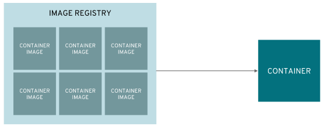
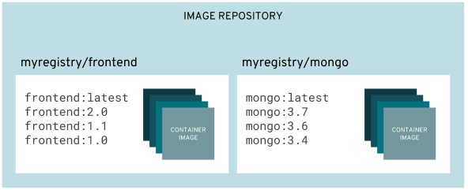
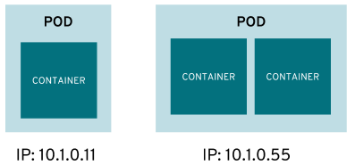
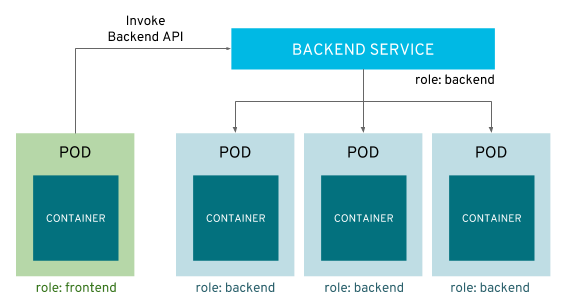
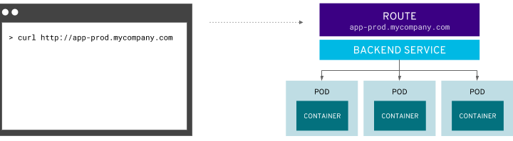
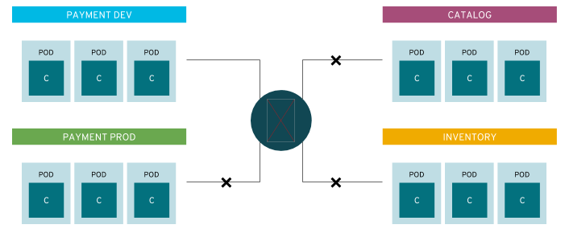

= OPENSHIFT 介绍 
:toc: manual

== 基本概念

=== Container

`Container` 是 OpenShift 的最小计算单元。

=== Container Image

`Container` 是从 `Container Image` 创建而来。

image:files/concepts-overview-container-image.png[Container Image]

=== Image Registry

`Image Registry` 用来保存不同版本的 `Container Image`。

NOTE: OPENSHIFT Image Registry 分为两种：内部(built-in)，外部(Upstream)。内部 Image Registry 用来保存 S2I *生成* 的镜像及从外部 *下载* 的镜像。外部 Image Registry 可以是 Docker Hub(https://hub.docker.com), Red Hat registry(https://registry.access.redhat.com/) 或本地私有镜像仓库中的 `Image Registry`，如果当镜像在内部中找不到时会从外部中去查找。

=== Image Repository

`Image Repository` 中保存着所有的 `Image Registry`。

=== Pod

一个或多个 `Container` 被包装成一个 `Pod`，`Pod` 通常是部署、管理等的最小单元。

=== Deployment

Pods 的配置定义在 `Deployment` 中。

image:files/concepts-overview-deployment.png[Deployment]

=== Service

`Service` 在多个 Pod 之上并提供内部负载均衡和服务发现。

image:files/concepts-overview-service.png[Service]

应用之间的通信是通过 `Service` 来实现的。

=== Route

`Route` 将服务添加到外部负载均衡器，使服务可以外部可见。

=== Project

`Project` 将应用在不同的部门、环境、团队中隔离。

== 架构概述

image:files/ocp-arch.png[架构]

=== 支持的基础架构

* 任何支持红帽企业 Linux 的环境都支持 OpenShift：
** 在裸机物理计算机或虚拟化基础架构中，以及私有云或认证公有云中
*** 包括所有支持的虚拟化平台：红帽虚拟化、vSphere 和 Hyper-V
** 红帽 OpenStack 平台，以及 Amazon、Google 和 Azure 等认证公有云提供商
* 混合方式支持在所有这些基础架构中部署 OpenShift 实例
** 仅支持 x86 平台

=== 计算节点主机

* OpenShift 可在 RHEL 或 Red Hat Enterprise Atomic Host 上运行
* OpenShift 具有两种类型的主机：计算节点和主控节点
* 计算节点是安装有 OpenShift 的 RHEL 7 或 Red Hat Atomic Host 的实例
** 计算节点上运行最终用户应用
** 计算节点由主控节点进行调度
* 计算节点守护进程和其他软件在计算节点上运行

=== 主控节点主机

* 也是红帽企业 Linux 或 Red Hat Atomic Host 的实例
* 主要功能：
** 调度计算节点上的所有活动
** 了解和维护 OpenShift 环境内的状态
* 利用多个主控节点实现高可用性

=== ReplicationController

Replication Controller 确保任意时刻始终运行指定数目的 Pod 的副本，确保了 Pod 可用。 

如果一个 Pod 退出或被删除，则 Replication Controller 将执行实例化操作，确保 Pod 的副本数量为指定的数量。同样，如果运行中的 pod 超过所需的数目，replication controller 会根据需要删除相应的数量。

https://kubernetes.io/docs/concepts/workloads/controllers/replicationcontroller/[kubernetes.io/docs/concepts/workloads/controllers/replicationcontroller/]

一个 Replication Controller 的配置包括：

1. 需要运行 Pod 的副本数，并且运行时可随时调整
2. 用于创建复制一个 pod 的定义声明
3. 用于识别管理 Pod 的一个 selector

==== 创建 ReplicationController 示例

本示例 ReplicationController 配置运行一个 mysql Pod。

[source, yaml]
.*1 - ReplicationController 配置文件 link:files/replication.yaml[replication.yaml]*
----
apiVersion: v1
kind: ReplicationController
metadata:
  name: mysql
spec:
  replicas: 1
  selector:
    app: mysql
  template:
    metadata:
      name: mysql
      labels:
        app: mysql
    spec:
      containers:
      - name: mysql
        image: registry.example.com/rhscl/mysql-57-rhel7:latest
        env:
          - name: MYSQL_ROOT_PASSWORD
            value: redhat
          - name: MYSQL_USER
            value: wp_user
          - name: MYSQL_PASSWORD
            value: wp_pass
          - name: MYSQL_DATABASE
            value: wp_db
        ports:
          - containerPort: 3306
            name: mysql
----

[source, bash]
.*2 - oc 命令创建 ReplicationController*
---- 
$ oc create -f ./replication.yaml 
replicationcontroller "mysql" created
----

[source, bash]
.*3 - oc 命令查看 ReplicationController*
---- 
$ oc describe rc/mysql | grep "Pods Status"
Pods Status:  1 Running / 0 Waiting / 0 Succeeded / 0 Failed
----

[source, bash]
.*4 - oc 命令查看 Pod*
---- 
$ oc get pods --selector=app=mysql --output=jsonpath={.items..metadata.name}
mysql-tg8cq
----

=== DeploymentConfig

Openshift 的 DeploymentConfig 是对 kubernetes Deployment 概念的扩展，同样 DeploymentConfig 构建于 ReplicationController 之上，但扩展支持软件开发和部署生命周期的概念，增加了更多的支持。 

在最简单的情况下，一个 DeploymentConfig 只是创建一个新的 ReplicationController，ReplicationController 根据定义启动 pods。 但是，实际生产中部署还需要提供从现有部署镜像转换生成新的镜像的能力，并且还可能需要了定义 hook 的能力，在 ReplicationController 创建之前或之后执行 hook 定义。

OpenShift DeploymentConfig 定义部署的描述如下:

1. ReplicationController 的定义
2. 能够自动创建一个新部署的触发器
3. 部署之间转换的策略
4. hook 的生命周期

==== 创建 DeploymentConfig 示例

[source, yaml]
.*1 - DeploymentConfig 配置文件 link:files/deployment.yaml[deployment.yaml]*
----
apiVersion: v1
kind: DeploymentConfig
metadata:
  name: mysql
spec:
  replicas: 1
  selector:
    app: mysql
  template:
    metadata:
      name: mysql
      labels:
        app: mysql
    spec:
      containers:
      - name: mysql
        image: registry.example.com/rhscl/mysql-57-rhel7:latest
        env:
          - name: MYSQL_ROOT_PASSWORD
            value: redhat
          - name: MYSQL_USER
            value: wp_user
          - name: MYSQL_PASSWORD
            value: wp_pass
          - name: MYSQL_DATABASE
            value: wp_db
        ports:
          - containerPort: 3306
            name: mysql
strategy:
  type: Rolling
----

[source, bash]
.*2 - oc 命令创建 DeploymentConfig*
----
$ oc create -f ./deployment.yaml
deploymentconfig "mysql" created
----

[source, yaml]
.*3 - 查看 Deployment Pod*
----
$ oc describe po/mysql-1-deploy | tail -n 8
Events:
  Type    Reason                 Age   From                         Message
  ----    ------                 ----  ----                         -------
  Normal  Scheduled              4s    default-scheduler            Successfully assigned mysql-1-deploy to master.example.com
  Normal  SuccessfulMountVolume  4s    kubelet, master.example.com  MountVolume.SetUp succeeded for volume "deployer-token-fxs2m"
  Normal  Pulled                 2s    kubelet, master.example.com  Container image "registry.example.com/openshift3/ose-deployer:v3.9.30" already present on machine
  Normal  Created                2s    kubelet, master.example.com  Created container
  Normal  Started                2s    kubelet, master.example.com  Started container
----

[source, bash]
.*4 - 查看 DeploymentConfig 创建的 ReplicationController*
----
$ oc describe rc mysql-1 | grep "Pods Status"
Pods Status:  1 Running / 0 Waiting / 0 Succeeded / 0 Failed
----

[source, bash]
.*5 - oc 命令查看 Pod*
----
$ oc get pods --selector=app=mysql --output=jsonpath={.items..metadata.name}
mysql-1-8wwr5
----

== 安全

=== 两类安全角色

OpenShift 将用户可以执行的操作定义为两大组别，即项目相关(也称为`本地策略`)和管理相关(也称为`集群策略`)操作。由于两种策略都有许多不同的操作，一些操作被分组在一起，定义为角色。

.*集群相关安全角色*
|===
|角色 |描述

|cluster-admin
|此角色中的所有用户都可管理 OpenShift 集群。

|cluster-status
|此角色中的所有用户具有集群相关信息的只读访问权限。

|===

[source, text]
.*集群角色创建删除示例*
----
$ oc adm policy add-cluster-role-to-user cluster-admin <USER>
$ oc adm policy remove-cluster-role-from-user cluster-admin <USER>
----

.*项目相关安全角色*
|===
|角色 |描述

|edit
|此角色中的用户可以创建、更改和删除项目中的通用应用资源，如服务和部署配置，但无法操作管理资源，如限值范围和配额，也不能管理项目的访问权限。

|basic-user
|此角色中的用户具有项目的读取访问权限。

|self-provisioner
|此角色中的用户可以创建新项目。这是集群角色，而非项目角色。

|admin
|此角色中的用户可以管理项目中的所有资源，例如向其他用户授予项目访问权限。
|===

[source, text]
.*项目角色创建示例*
----
$ oc adm policy add-role-to-user basic-user <USER> -n <PROJECT>
----

=== 三种用户类型

OpenShift 中有三种不同类型的用户

|===
|类型 |描述

|Regular users
|常规用户类型，例如 `user1`, `user2`, `admin`

|System users
|系统类型，通常都是在系统资源创建时自动生成，例如 `system:admin`, `system:openshift-registry`, `system:node:node1.example.com`

|Service accounts
|特殊服务用户类型，例如 `system:serviceaccount:default:deployer`, `system:serviceaccount:foo:builde`
|===

=== 安全上下文

OpenShift 提供了名为安全性上下文约束 (SCC) 的安全机制,它可以限制对 OpenShift 中的资源的访问，但不会影响基本操作。

[source, text]
.*获取安全上下文*
----
# oc get scc
NAME               PRIV      CAPS      SELINUX     RUNASUSER          FSGROUP     SUPGROUP    PRIORITY   READONLYROOTFS   VOLUMES
anyuid             false     []        MustRunAs   RunAsAny           RunAsAny    RunAsAny    10         false            [configMap downwardAPI emptyDir persistentVolumeClaim projected secret]
hostaccess         false     []        MustRunAs   MustRunAsRange     MustRunAs   RunAsAny    <none>     false            [configMap downwardAPI emptyDir hostPath persistentVolumeClaim projected secret]
hostmount-anyuid   false     []        MustRunAs   RunAsAny           RunAsAny    RunAsAny    <none>     false            [configMap downwardAPI emptyDir hostPath nfs persistentVolumeClaim projected secret]
hostnetwork        false     []        MustRunAs   MustRunAsRange     MustRunAs   MustRunAs   <none>     false            [configMap downwardAPI emptyDir persistentVolumeClaim projected secret]
node-exporter      false     []        RunAsAny    RunAsAny           RunAsAny    RunAsAny    <none>     false            [*]
nonroot            false     []        MustRunAs   MustRunAsNonRoot   RunAsAny    RunAsAny    <none>     false            [configMap downwardAPI emptyDir persistentVolumeClaim projected secret]
privileged         true      [*]       RunAsAny    RunAsAny           RunAsAny    RunAsAny    <none>     false            [*]
restricted         false     []        MustRunAs   MustRunAsRange     MustRunAs   RunAsAny    <none>     false            [configMap downwardAPI emptyDir persistentVolumeClaim projected secret]
----

