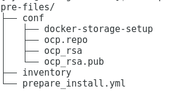

= 安装准备
:toc: manual

== 操作控制节点安装 Ansible

[source, text]
.*1 - 安装*
----
# yum install ansible
----

[source, bash]
.*2 - 验证是否已安装了 ansible 软件包*
----
$ rpm -qa | grep ansible
ansible-2.3.2.0-2.el7.noarch

$ ansible --version
ansible 2.3.2.0
  config file = /etc/ansible/ansible.cfg
  configured module search path = Default w/o overrides
  python version = 2.7.5 (default, May  3 2017, 07:55:04) [GCC 4.8.5 20150623 (Red Hat 4.8.5-14)]
----

== 操作控制节点配置到各节点免密登录

[source, bash]
.*1 - 配置操作控制节点到各节点静态域名解析*
----
echo "192.168.122.101 master.example.com master" >> /etc/hosts
echo "192.168.122.105 node1.example.com node1" >> /etc/hosts
echo "192.168.122.106 node2.example.com node2" >> /etc/hosts
----

[source, text]
.*2 - 配置操作控制节点生成 SSH 所需之秘钥。命令如下，应答输入请直接输入回车*
----
# ssh-keygen
Generating public/private rsa key pair.
Enter file in which to save the key (/root/.ssh/id_rsa): 
Created directory '/root/.ssh'.
Enter passphrase (empty for no passphrase): 
Enter same passphrase again: 
Your identification has been saved in /root/.ssh/id_rsa.
Your public key has been saved in /root/.ssh/id_rsa.pub.
The key fingerprint is:
SHA256:MGlaj6K0jRmB+/3kbvMNkRCmlzTCROGack8nsoq9tw8 root@ksoong.redhat.com
The key's randomart image is:
+---[RSA 2048]----+
|   +=.=          |
| . ..= =         |
|. . o X          |
| . + = * .       |
|o B = o S        |
| = & +   .       |
|  B E . .        |
|.o  .=o  o       |
|o oo.==o. .      |
+----[SHA256]-----+
----

[source, bash]
.*3 - 配置到各节点免密登录*
----
for i in master node1 node2; do ssh-copy-id $i; done;
----

== 前续安装

本部分是在操作控制节点上进行。

=== 准备 Playbook 脚本

* link:pre-files/prepare_install.yml[pre-files/prepare_install.yml] - Ansible Playbook 脚本
* link:pre-files/inventory[pre-files/inventory] - 脚本组定义
* link:pre-files/conf/ocp.repo[pre-files/conf/ocp.repo] - 本地 yum 仓库地址
* link:pre-files/conf/ocp_rsa[pre-files/conf/ocp_rsa] - SSH 免密私钥
* link:pre-files/conf/ocp_rsa.pub[pre-files/conf/ocp_rsa.pub] - SSH 免密公钥
* link:pre-files/conf/docker-storage-setup[pre-files/conf/docker-storage-setup] - docker 存储配置文件
* link:pre-files/conf/openshift-cluster.conf[pre-files/conf/openshift-cluster.conf] - dnsmasq 配置文件
* link:pre-files/conf/example.com.crt[pre-files/conf/example.com.crt] 

如上文件目录结构为:

=== 执行 Playbook 脚本

[source, bash]
----
ansible-playbook -i inventory prepare_install.yml
----

== 前续安装认证

本部分在 master 上执行。

[source, bash]
.*Mater 到各节点互信*
----
for i in master node1 node2 nfs registry ; do ssh-copy-id $i.example.com ; done
----

[source, bash]
.*执行 prerequisites 验证*
----
ansible-playbook /usr/share/ansible/openshift-ansible/playbooks/prerequisites.yml
----

