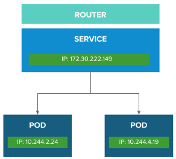

= 软件定义网络(SDN)
:toc: manual

== 目的

将一个应用，部署多个应用拷贝，组成一个集群，并

* 集群内通过 POD IP 地址直接访问服务
* 集群内通过 SVC IP 地址访问服务
* 集群外通过路由访问服务

== 环境

* `openshift v3.11.16`/`kubernetes v1.11.0`

== 步骤

=== 创建工程

[source, text]
.*1. CLI 登录到 OCP*
----
$ oc login https://master.example.com:8443 -u admin -p admin
----

[source, text]
.*2. 创建工程*
----
$ oc new-project lab01
----

=== 部署应用

[source, text]
.*1. S2I 部署 php 应用*
----
$ oc new-app --name=lab01 -i php:7.0 https://github.com/redhat-china/scaling.git
----

[source, text]
.*2. 查看运行的 Pod*
----
$ oc get pods | grep Running
lab01-1-fndbj   1/1       Running     0          6s
----

[source, text]
.*3. `oc scale` 将运行容器的数量扩展到两个*
----
$ oc scale --replicas=2 dc lab01
----

[source, text]
.*4. 查看 Pod 数量，及对应 IP*
----
$ oc get pods -o wide | grep Running
lab01-1-fndbj   1/1       Running     0          44s       10.244.2.24   node1.example.com
lab01-1-rq4xn   1/1       Running     0          6s        10.244.4.19   node2.example.com
----

=== 访问容器提供的服务

[source, text]
.*根据上面步骤中输出的容器 IP 访问服务*
----
$ curl http://10.244.2.24:8080
curl: (7) Failed connect to 10.244.2.24:8080; Connection timed out

$ curl http://10.244.4.19:8080
curl: (7) Failed connect to 10.244.4.19:8080; Connection timed out
----

=== 集群内通过 POD IP 地址访问服务

[source, text]
.*1. node1 节点访问 node1 上的容器*
----
# ssh node1.example.com
# curl http://10.244.2.24:8080
Server ID: 10.244.2.24
----

[source, text]
.*2. node2 节点访问 node2 上的容器*
----
# ssh node2.example.com
# curl http://10.244.4.19:8080
Server ID: 10.244.4.19
----

=== 集群内通过 SVC IP 地址访问服务

[source, text]
.*1. 获取服务的 IP 地址*
----
$ oc get svc lab01
NAME      TYPE        CLUSTER-IP       EXTERNAL-IP   PORT(S)             AGE
lab01     ClusterIP   172.30.222.149   <none>        8080/TCP,8443/TCP   11m
----

[source, text]
.*2. 集群外通过 SVC IP 访问容器*
----
$ curl http://172.30.222.149:8080
curl: (7) Failed connect to 172.30.222.149:8080; Connection timed out
----

[source, text]
.*3. 集群内通过 SVC IP 访问容器*
----
# for i in `seq 1 5` ; do curl http://172.30.222.149:8080 ; done
Server ID: 10.244.4.19
Server ID: 10.244.2.24
Server ID: 10.244.4.19
Server ID: 10.244.2.24
Server ID: 10.244.2.24
----

=== 集群外访问服务

[source, text]
.*1. 创建路由*
----
$ oc expose service lab01 --hostname lab01.apps.example.com
----

[source, text]
.*2. 集群外访问服务*
----
$ for i in `seq 1 5` ; do curl http://lab01.apps.example.com  ; done
Server ID: 10.244.4.19
Server ID: 10.244.2.24
Server ID: 10.244.4.19
Server ID: 10.244.2.24
Server ID: 10.244.4.19
----

