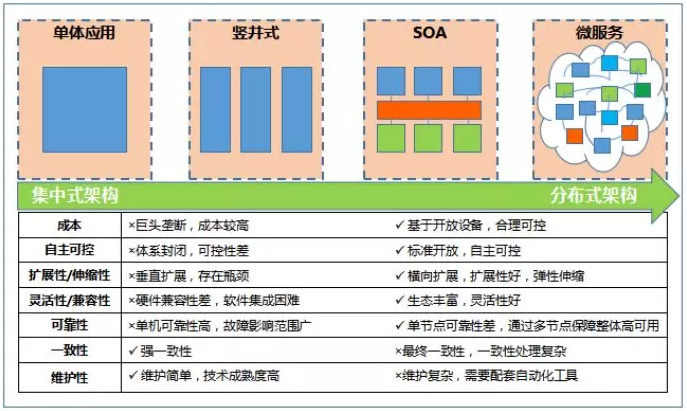

= 核心银行系统分布式架构转型
:toc: manual
:toc-placement: preamble

本文主体参考/转自『技术创新年终盘点|赵韵东：核心银行系统分布式架构转型』，版权归原作者所有。

== 集中式架构的挑战

核心银行系统是银行信息化建设的核心，是银行为客户提供金融服务、创造银行经营价值、履行社会责任的基石。过去我国大型银行的核心银行系统大多*基于主机技术*，采用*集中式架构*建设。主机强大的*计算能力*与*高稳定性*，支撑了*本世纪初*各家大型银行信息系统由*省域集中*到*全国集中*的升级，促进了银行业务的创新和发展。

近年来随着 IT 技术爆发式的发展，尤其是移动互联网、大数据、人工智能、区块链和云计算等技术的逐步成熟，银行业务在渠道、产品、营销、运营和风控等方面都在发生着深刻的变革，*产品迭代的速度*越来越快。基于大型主机技术构建的集中式架构的核心银行系统日益面临挑战，主要表现在以下几个方面：

*1. 技术创新* - 从技术发展的角度来看，分布式技术近十年有长足的进步，在处理海量业务的能力方面已经得到了充分的验证。其开放的生态体系，蓬勃的*开源社区*，更是使得大量优秀的基础框架、平台、工具得以沉淀。

『大智移云区』这些以分布式技术为基础的金融科技的发展，对银行业务模式带来的深刻改变正在逐步显现。移动互联改变了银行的*触达客户*的方式，推动了*开放生态*与*网点转型*。大数据与人工智能的运用极大提高了银行处理数据、分析数据的能力，智能营销、智能风控、智能信贷的发展将交易成本和信息不对称逐渐降低，使得原来不可能的交易成为可能，推动普惠金融发展，为更多人提供金融服务。区块链技术作为价值网络，在跨境清算、供应链金融等领域应用前景广阔。而主机封闭的技术体系，难以分享开源的红利，与金融科技的集成也困难重重，制约了技术的创新运用。另外，自主可控也是主机体系难以解决的问题。

*2. 快速交付* - 随着利率市场化的推进，市场参与主体的多元化与客户认知的改变，导致市场竞争加剧。因此业务上对快速推出金融产品，灵活进行产品运营的需求越来越强烈，这就要求尽可能的缩短产品研发的交付周期。集中式架构模块间耦合性高，灵活升级难度大，庞大的单体应用，影响软件版本发布和交付效率，使得产品交付周期较长。

*3. 成本控制* - 银行业集中式核心银行系统基本都采用 IBM 大型主机作为基础构建，IBM 形成事实上的垄断，银行议价能力较低。主机运营、扩容、升级换代的成本投入相比开放平台十分昂贵（每年运营费用就要投入几亿元，扩容与升级换代每个计算单元要数千美金，一般大型银行都有上万个计算单元的规模）。随着基于开放平台的分布式架构逐渐成熟，采用大规模的开放平台服务器取代主机，在高可用性方面已经不再受到局限，而在资源的有效调配与成本节约方面更具优势。因此，降低主机运行成本已经成为银行面临的一大挑战，各家银行核心系统普遍向更低成本的架构转型。

*4. 资源弹性* - 银行运营手段日益多样，各促销秒杀类活动成为常态，大量业务请求经常集中在短时间内爆发。另外银行作为基础设施，更是在背后承担了『618』、『双11』这样电商狂欢的海量资金处理业务。面对这些秒杀类业务，潮汐式访问时，基于主机的集中式架构难以弹性伸缩、灵活调配资源，造成昂贵主机资源在非高峰期的大量闲置，系统的服务保障与资源的充分利用之间存在难以调和的矛盾。

*5. 运行风险* - 移动金融的发展使金融服务深入生活场景，银行服务渠道呈现多渠道、移动化和全天候的特征，银行核心业务系统要做到365天×24小时的不间断运行。同时，由于银行经营服务在社会经济运行中的特殊性质，监管部门对银行核心业务系统的稳定运行提出了极其严格的要求。在集中式架构下，高度集中的核心银行系统带来风险点的集中。虽然主机采用了并行架构，高可用能力很强，但一旦发生故障，影响范围巨大，这对银行核心系统的可用性带来巨大的挑战。

== 分布式架构转型

为了应对上述挑战，核心银行系统面临集中式的单体架构转型的问题。从当前技术的成熟度与发展趋势看，分布式架构能够较好地解决上述问题，契合银行核心业务系统的发展要求，因此分布式的服务化架构成为各家银行不约而同的选择。

对于什么是分布式架构，业界并没有一个标准的定义，一般认为基于分布式架构的系统『是一组计算机，通过网络相互连接传递消息与通信后并协调它们的行为统一对外服务的系统。』其关键点是业务处理分散在多个节点上，通过相互协同，共同提供服务，物理上分散，逻辑上统一。分布式架构的核心理念是对系统进行拆分并合理地抽取公共服务，实现高内聚低耦合的同时，具备并行处理能力，通过集群化的方式、基于相对廉价的基础设施实现系统的高可用、可扩展。分布式架构具有以下优点：

*1. 体系开放* - 在硬件上，分布式架构一般基于X86服务器部署，采用开放标准，多家厂商生产，设备通用性好，可相互替换。在软件上，分布式架构中的大量主流技术发源于开源社区，各大厂商、科技公司、行业用户广泛参与，功能完善较快，很多技术在大规模的生产环境得到了检验。同时，这些软硬件由于体系开放，具有较好的自主可控性。

*2. 成本低* - 分布式架构由于大量使用了X86服务器和开源技术，服务供应商可选择范围大，可以大幅度地降低基础设施成本的投入。同时，由于相关技术都是当前业界的主流技术，更有利于人力资源的调配与优化。

*3. 松耦合* - 核心银行系统由集中式向分布式转型的过程中，必然要对原有系统进行服务化拆分。拆分时以领域模型进行驱动，对系统按照业务域进行拆分。拆分时应遵循『服务自治』原则，即一个拆分出来的服务应对其范畴内的业务逻辑、数据与存储完全负责，服务与服务之间通过接口进行交互。这样高内聚、低耦合的架构便于快速响应业务需求，对某个服务进行迭代。

*4. 扩展性强* - 分布式架构中，横向上应用服务器通过集群与负载均衡技术进行大规模扩展，数据库采用读写分离、分库分表、多副本等技术进行扩展。纵向上，根据业务功能进行拆分，便于根据运行需要，对某个服务的部署资源进行弹性伸缩。多种扩展方式，充分满足了处理性能的需要。另外应用的集群化、数据库的拆分与多副本的运用，这些方法通过冗余来弥补单个节点的可靠性不高的问题，也使得系统整体的高可用得到保障。

软件研发没有银弹，核心银行系统转型分布式架构，可以带来很多好处，解决不少问题。但是，也带来很多挑战。是否能够解决这些问题，是分布式转型能否成功的关键。

*1. 架构复杂度提升* - 分布式架构将一个单体系统拆分为多个服务，数据库进行多个维度的拆分。既要做到划分合理，充分解耦，又要尽量避免复杂的数据一致性问题。同时大量系统间复杂的调度依赖关系，如果缺少有效的服务治理手段将导致依赖地狱，谁也搞不清系统间的关联关系，一旦某个点出问题，极易导致整个系统的雪崩。

*2. 运维难度大* - 分布式架构由于单机处理能力有限，一般都会带来庞大的系统部署规模，导致日常维护工作量增大。加上复杂的系统间关系，一旦出现问题，故障定位和应急处置上都变得更加复杂，单纯靠人工已经难以应对。

*3. 事务一致性* - 分布式架构最难解决的就是事务一致性问题，由于CAP理论的存在，一致性、可用性、分区容忍性三者只能取其二。由于分布式系统必须接受分区容忍性，只能在可用性与一致性里做选择。一般保障可用性而采用最终一致性。那么对于一致性要求很高的业务，就要充分考虑采取应用两阶段、事务补偿等技术手段保障业务数据的一致。

为了扬长避短，充分发挥分布式架构的优势，回避其劣势。一是要做好架构规划，不断在实践中总结架构原则，形成方法论，以更好地指导分布式核心系统的建设。二是要积累沉淀基础技术平台与组件，形成平台能力，将资源分配、调度与编排、服务治理、数据拆分与访问、系统运行监控与报警、事务一致性处理、自动化运维等问题的解决方案平台化、云化，提升研发与运维的效率，降低复杂程度。三是要在研发、测试、交付各个环节不断提升改进，使组织与架构相匹配，打通各个环节，形成快速交付的全套工具链，不断提升研发能效。

image:img/distribute-arch-2.png[]

== 农业银行的实践

农业银行2015年完成了新一代核心银行系统BoEing的全部投产，在核心系统内部构建了客户、产品、合约统一模型，形成产品灵活构建的能力，搭建了基础运营与账务基础服务，为核心业务发展提供了有力的保障。

image:img/distributed-arch-3.png[]

在进行核心银行系统分布式改造的同时，一方面通过分布式服务化技术的运用解决集中式单体架构面临的困境，另一方面对这些过去只服务于核心业务的优秀能力进行优化并输出到开放平台，服务于更广阔的业务领域。农业银行分布式核心系统的建设目标：

*1. 支持新业态* - 更为开放、灵活的核心银行系统，将产品工厂、合约、账务服务能力输出到开放平台，构建统一的用户中心、运营体系，为线上线下一体化的『新业态』创新提供基础。

*2. 支持智慧银行* - 核心业务流程更好地与大数据、人工智能、实时计算等技术紧密集成，为客户提供智能化、个性化的金融服务。

*3. 快速交付* - 采用松耦合、服务化的分布式系统架构，配合敏捷的开发方法，在现有服务的基础上，快速组合、扩展，实现业务功能的快速交付。

*4. 降低成本* - 合理规划应用架构与数据架构，主机平台、开放平台与云计算技术有机结合，形成灵活的资源调配能力，进一步压降IT成本投入。

*5. 自主可控* - 逐步减少对大机的依赖，引入更为开放的技术体系，不断完善一系列企业级技术平台，提升核心系统技术的自主可控性。

农业银行包括核心银行在内由数百个IT系统相互协同合作，共同为客户提供金融产品与服务，因此在分布式架构的使用上已有一定的积累。但核心银行系统承载的都是最重要最敏感的业务，不容有失，而分布式核心系统的建设是一个相当复杂的系统性工程，因此我们秉持『大胆设想，小心求证』的原则，遵从『核心业务运行平稳，外围系统平滑切换』的思路，采用分三步走的方式逐步实施核心银行系统的架构转型。

*第一阶段：积极探索* - 探索阶段主要是进行查询功能的拆分，将原核心系统的数据通过数据同步技术，准实时的同步到开放平台。在开放平台对这些数据进行分库存储，并提供查询功能。由于查询功能占整个核心系统访问量的80%以上，通过查询拆分可以部分缓解主机平台的业务压力。目前农行已经实现主要查询功能下移，做到了在交易高峰业务量同比快速增长的情况下，CPU使用率不升反降，有效地降低了主机资源使用率。

*第二阶段：夯实基础* - *搭建应用平台：* 将核心业务运行所必须依赖的基础模块，如运营、客户、产品、账务等，逐步拆分到开放平台，形成分布式核心的基础服务。在此过程中，打破原来主机封闭的限制，打造全行统一客户视图、一体化运营体系、开放的产品合约和更优的账务能力为后续产品的下移打好基础。

*打造技术平台：* - 为了有效应对分布式系统的复杂度，要不断对技术架构进行迭代优化，使计算、存储、网络等基础设施云化，分布式服务调度、数据访问、数据同步、缓存等中间件平台化，构建、测试、交付自动化，监控、运维工具化，项目组织敏捷化，以降低系统开发、运维的难度，提高系统弹性扩展能力，最终提升产品研发效率。

*第三阶段：推进转型* - 逐步将主机上的业务产品拆分到开放平台的分布式核心系统，拆分按照天然的业务维度逐步推进。从业务特性来分析，类似信用卡与理财这样的业务一般都是资金的单向流动，且多为客户不同账户间的体内循环，资金风险较小，适合先行启动分布式改造。而对公、对私的账户资金往来频繁，对数据一致性要求高，可以暂时保留在主机平台，这也有利于对已有资产的充分利用。后期随着技术经验的积累逐步推动全面转型。

核心银行系统的分布式架构转型是顺应金融科技发展趋势，提升银行核心竞争力的重大举措。分布式架构与云计算技术相结合，既能大幅提升核心系统的处理性能、安全性以及业务功能交付速度，又能有效降低成本。万丈高楼平地起，对于分布式核心银行系统的建设，既要看到分布式架构和云计算技术的巨大潜力，也要积极应对新模式所带来的交易一致性和运维复杂性等挑战。未来，应深入参与开源分布式技术，提升自主掌控能力；同时，积极打造分布式系统上下游生态环境，充分发挥分布式架构的优势，持续推进银行架构转型建设。

